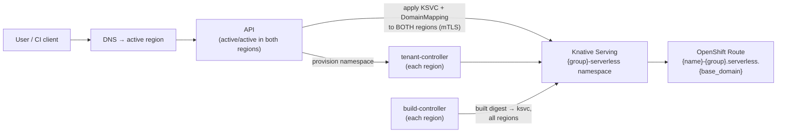
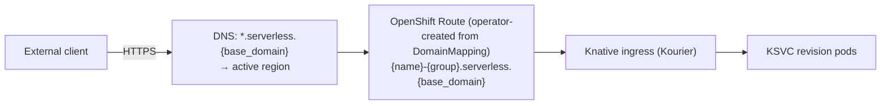

# Architecture & Design

The platform overview: what the system is for, the three services that run it,
how one create request travels end to end, and the platform-wide rules for
networking, secrets, airgap and repository layout. Per-component detail lives
in its own document - API.md (the REST surface, auth, and the multi-region
fan-out), STREAMING.md (the live log and stats endpoints), TENANT-CONTROLLER.md
(the per-group namespaces), BUILD-CONTROLLER.md and BUILDING.md (turning source
into an image). Per-offering detail is in FUNCTIONS.md and CONTAINERS.md.

## Contents

- [Design Decisions (locked in)](#design-decisions-locked-in)
- [Overview & Goals](#overview--goals)
- [Component Map](#component-map)
- [How a create request flows](#how-a-create-request-flows)
- [Shared capabilities (FaaS and CaaS)](#shared-capabilities-faas-and-caas)
- [Networking & Exposure](#networking--exposure)
- [Secrets Management](#secrets-management)
- [Airgapped Considerations](#airgapped-considerations)
- [Repository Layout](#repository-layout)
- [Open Questions / Future Work](#open-questions--future-work)

## Design Decisions (locked in)

| Topic | Decision |
|-------|----------|
| Deliverable | FastAPI app + Helm chart + CI/CD in this repo (GitOps `ApplicationSet` lives elsewhere) |
| FaaS build | **kpack** (Kubernetes-native Cloud Native Buildpacks), mirrored stack/store images for airgap - see BUILDING.md: Design Decisions (locked in) |
| Cluster auth | **cert-manager `Certificate` CR** (shipped in Helm chart) → client TLS cert; **CN is a DNS name** `serverless-api.clients.{base_domain}` (ACME-issued); that name is the Kubernetes user, bound via RBAC |
| Topology | **Two separate OpenShift clusters** ("regions") that **trust the same CA**. The **API runs active/active in both clusters**; a DNS record fronts the active API. **Workloads run on the same two clusters**, in one namespace per group. |
| Region selection | **Deploy to both regions on every deploy**, and a client cannot narrow that - no request body carries a region list, so a create and a `PUT` reach the same set. Each workload's **Route host is identical in both clusters**; a DNS record forwards to the active serverless region (active/passive at the traffic layer, active/active at the deploy layer). |
| Tenancy | **A namespace per group** (`{group}{suffix}`, default suffix `-serverless`), provisioned at runtime by the tenant controller; every resource is **also label-scoped** by SSO group, enforced by the API, as defense in depth |
| API authn | **SSO (Red Hat Build of Keycloak) OIDC** in front of the API |
| API authz | Based on **SSO group membership** |
| Secrets | **External Secrets Operator** - this repo ships **`ExternalSecret` only**, referencing a **pre-existing `ClusterSecretStore`** that points at **HashiCorp Vault** (API stores no secrets) |
| Route domain | Single platform wildcard **`*.serverless.{base_domain}`**; host `{name}-{group}.serverless.{base_domain}` (offering tracked as a label, not in the host) |
| CI/CD | **Helm** (this repo) + **ArgoCD** `ApplicationSet` (lives in a **separate GitOps repo**) |
| Environment | **Airgapped** - all images/deps mirrored to an internal registry; ACME via an internal ACME endpoint |

---

## Overview & Goals

### Problem statement

Customers need to run workloads without operating Kubernetes/OpenShift themselves.
They consume the platform in one of two ways:

- **FaaS** - "give us your source, we build and run it." The client supplies a Git
  repository URL, a branch and an access token. Supported runtimes are configurable;
  the chart ships **Python, Go, Node** (FUNCTIONS.md: Overview) and the live list is on
  `GET /api/serverless/v1/functions/info`.
- **CaaS** - "give us your image, we run it." The client supplies an image reference
  plus registry credentials (username + token).

Both run on **Knative Serving** (scale-to-zero, request-driven autoscaling) on
**OpenShift**, are exposed through an **OpenShift Route**, and are governed by
enterprise SSO. Everything runs airgapped across **two OpenShift clusters**. The API
runs active/active on those same two clusters; so do the workloads, each SSO group in
its own namespace.

### Goals

- One FastAPI REST API that hides Knative and OpenShift from the customer.
- One API call deploys to **both clusters**; the API is itself HA across both.
- One stable, cluster-independent Route host per workload, with DNS forwarding to the
  active region.
- SSO OIDC authentication and group-based authorization.
- No secrets persisted by the API; platform secrets come from Vault via ESO.
- GitOps-managed (Helm + ArgoCD), reproducible, airgap-compatible.

### Non-goals (this phase)

- **Traffic steering.** A DNS record forwards to the active region; the Route host is
  identical in both clusters. The API is not a GSLB.
- **Billing, metering, quota enforcement and a full observability stack** - see
  Open Questions / Future Work.

### Glossary

| Term | Meaning |
|------|---------|
| **Knative Serving** | Knative component that runs request-driven, autoscaling (incl. scale-to-zero) workloads. |
| **KSVC** | A Knative `Service` custom resource (`serving.knative.dev/v1`). The top-level unit we create per workload. |
| **Revision** | An immutable snapshot of a KSVC; created on each spec change. |
| **Route (OpenShift)** | OpenShift `route.openshift.io/v1` object that exposes a service externally over HTTP(S). |
| **Region** | A region the platform deploys to (e.g. `central`, `south`); each runs one OpenShift **cluster** (e.g. `central-0`). |
| **SSO** | Red Hat Build of Keycloak - the OIDC identity provider. |
| **ESO** | External Secrets Operator - syncs secrets from Vault into Kubernetes Secrets. |
| **Tenant / group** | An SSO (Keycloak) group; the unit of ownership and isolation. |
| **kpack** | The Kubernetes-native Cloud Native Buildpacks controller that builds a function's source into an OCI image (BUILDING.md). |
| **`Image` (kpack)** | The kpack CR declaring one function's build. Not to be confused with a container image. |
| **`ClusterBuilder` (kpack)** | A cluster-scoped kpack CR composing a stack and a set of buildpacks into a builder image. One per runtime, referenced by the `Image`s in every group's namespace. |

---

## Component Map

Three services run, each with its own Deployment and its own image, and each
deployed to **both** clusters.

| Service | Execution model | Owns | Detail |
|---------|-----------------|------|--------|
| **API** (`api/`) | request/response | The REST surface, authentication and authorization, validation, the pre-flight checks, and the fan-out that applies every workload manifest to both regions. It also serves the live log and stats streams. | API.md, STREAMING.md |
| **Build controller** (`build_controller/`) | control loop | Watches kpack `Image.status.latestImage` in its **local** cluster. When a build produces a new digest it applies that digest onto the KSVC in **every** region. It also garbage-collects registry tags. | BUILD-CONTROLLER.md, BUILDING.md |
| **Tenant controller** (`tenant_controller/`) | control loop + one internal endpoint | Creates and converges the per-group namespaces and everything the chart puts in them: CA bundle, default-deny NetworkPolicies, the API's RoleBinding, the build prerequisites, and the Trident Protect Application and Schedules that back the namespace up. Serves `PUT /groups/{group}/namespace`, which the API calls before every accepted deploy. | TENANT-CONTROLLER.md |

The split is privilege separation, not packaging. Creating namespaces and writing RBAC is
cluster-scoped power the internet-facing API must not hold: the API cannot create a
namespace, and the tenant controller cannot touch a workload. The build controller holds a
client certificate and writes Knative Services, so its image carries no web framework and
no crypto stack at all (BUILD-CONTROLLER.md: Two images).



**Both loops share one pacing implementation** (`common.loop.run_loop`; the contract is
`LoopSettings`, which both controllers' settings subclass), so a hardening fix lands once.
`MIN_PASS_SECONDS` bounds the whole **pass**, not the sleep, so a pass that ends instantly
cannot degenerate into back-to-back LISTs at full speed. Backoff is exponential, capped at
60s, reset by a clean pass.

**Every loop converges its own cluster only**, so the two sites never fight while ArgoCD
has one synced ahead of the other. The single cross-cluster write is the tenant
controller's provision call, because a create must not land in a region whose namespace
does not exist yet (TENANT-CONTROLLER.md: The loop is local-only; provisioning reaches
both clusters).

---

## How a create request flows

`POST /api/serverless/v1/groups/{group}/functions` with a Git repo, branch, token and
runtime. A container create is the same flow with the build steps removed.

| # | Component | Step |
|---|-----------|------|
| 1 | DNS | `serverless-api.{base_domain}` resolves to the API instance in the active region. Both are live; either can serve the request. |
| 2 | API | Validates the bearer token against SSO's cached JWKS, or matches the static admin key. Builds a `Principal` from the claims (API.md: Authentication & Authorization). |
| 3 | API | Asserts the caller is a member of `{group}`, the group named in the path. Otherwise `403` (API.md: Group-based authorization (tenancy)). |
| 4 | API | Validates the body against the request model - names, runtime, scaling, sizes, files, env (API.md: Validation at the edge). The named runtime is checked against the kpack `ClusterBuilder` it maps to, so a configuration gap is an immediate `400` rather than a failed build minutes later. |
| 5 | API | Resolves the namespace: `{group}{suffix}`, identical in both clusters, from the one resolution point both ends read. |
| 6 | Tenant controller | The API calls `PUT /groups/{group}/namespace`, which converges that namespace in **every** region before anything is written. It fails closed: an unreachable controller or an unconverged region refuses the deploy with `503` (TENANT-CONTROLLER.md: The provision call). |
| 7 | API | Pre-flight, one fan-out per region: is the host free, is the name unused (API.md: Pre-flight: what is checked before a write). A host clash is `409`, and is reported ahead of a name clash. |
| 8 | API | Returns **`202 Accepted`** with `status: "Pending"` and a `statusUrl`. Everything below runs in the background; the outcome is observed by polling, never read off this status code (API.md: Partial-failure semantics). |
| 9 | API | Composes the manifests: the KSVC, the `DomainMapping` for the workload host, the `{workload}-env` Secret, the `{workload}-files` ConfigMap/Secret, the pull or git Secret, and - for a function - the kpack `Image` and its build `ServiceAccount` (BUILDING.md: Ownership: API vs Build Service). Every derived object carries the KSVC's `ownerReference` and the group and workload labels. |
| 10 | API | Applies them to **both** regions concurrently, using each region's client TLS cert, with server-side apply so a retry heals a partial state. Admission for every target is reserved before any region starts. Per-region status comes from the apply response, so a fresh workload correctly reads `Deploying`. |
| 11 | kpack | In each region, kpack builds the source into that region's own registry. Every region builds what it runs; the two regions run the same *commit*, not the same digest (BUILDING.md: Active/Active Behaviour). `GET` reads `Building` meanwhile. |
| 12 | Build controller | Watches the local `Image`. When `status.latestImage` changes it applies the new **digest** onto the KSVC in every region - the only writer of the ksvc image after the create (BUILD-CONTROLLER.md: Digest propagation). |
| 13 | Knative + OpenShift | Knative reconciles the revision. The Serverless Operator's ingress controller creates the OpenShift `Route` for the `DomainMapping`'s host, identically in both clusters. |
| 14 | Client | Polls `GET {statusUrl}` (or the lighter `/stats`) until `status` is `Ready` or `Failed`, then reaches the workload at `{name}-{group}.serverless.{base_domain}`, which DNS forwards to the active region. Live logs and stats are on the streaming endpoints (STREAMING.md). |

A partial failure leaves the succeeded region running: HA prefers availability, and DNS
keeps serving from the healthy region. Re-applying heals it (API.md: Partial-failure
semantics).

---

## Shared capabilities (FaaS and CaaS)

Both offerings take the same spec, modeled on the KSVC pod spec, and the API applies it
identically to either:

| Capability | What it gives the caller |
|---|---|
| Environment variables | Plain values set inline; `secret: true` moves the value into the workload's own Secret and reads it through a `secretKeyRef`. CA-trust variables are injected automatically and hidden from the read-back. |
| Config and secret files | Inline content mounted read-only at a path, aggregated into one ConfigMap and one Secret per workload. |
| Scaling | Knative autoscaling: metric, target, min and max scale, and a scale-down delay. `cpu`/`memory` metrics cannot scale to zero. |
| Resource size | `small`, `medium` or `large`, so a caller picks capacity without Kubernetes units. Memory request equals limit. |
| External host | One host per workload on the platform's wildcard domain, or a caller-supplied one (Networking & Exposure). |

Neither offering can reference a pre-existing cluster Secret or ConfigMap: everything a
workload mounts is created by the API and owned by its KSVC.

The field-by-field rules - what each accepts, its defaults, and what `/info` publishes -
are in API.md: Shared sub-schemas.

## Networking & Exposure

- This runs on **OpenShift Serverless** (the Operator-installed Knative). Its ingress
  controller **creates the OpenShift `Route`** for each Knative ingress, so "every workload
  is exposed via an OpenShift Route" is satisfied by the operator, not by the API.
- A bare KSVC would only get a Route under the per-cluster default domain
  (`apps.<cluster>`), which differs between regions. For one stable, cluster-independent
  host the API creates a **`DomainMapping`** for `{name}-{group}.serverless.{base_domain}`
  in **each** cluster, and the operator provisions the Route for that host. A
  `*.serverless.{base_domain}` DNS record forwards to the active region.
- **TLS:** a wildcard cert for `*.serverless.{base_domain}` covers the custom host, given
  to the DomainMapping / ingress; the operator-created Route is `edge`-terminated.

#### Route host convention (recommendation)

Use a single platform wildcard domain and put the tenant in the subdomain. Do **not**
split FaaS and CaaS into separate domains:

```
{name}-{group}.serverless.{base_domain}
e.g. orders-api-team.serverless.example.com
```

Why: the host must be identical in both clusters, so it has to be a custom platform
domain anyway; FaaS-vs-CaaS is a build-time detail the consumer should not see in a URL;
and one wildcard domain means one wildcard cert and one DNS zone. The offering
(`function`/`container`) is tracked as a **label**, not in the host. `{group}` keeps hosts
unique platform-wide - DNS is global even though namespaces are not - and makes ownership
obvious. `{name}-{group}` must fit one DNS label (63 characters) **for the default host
only**; a caller-supplied `hostname` lifts the limit (published on `/info` as `naming`).

**Object naming.** The OpenShift name of the KSVC and all its derived resources
(`{workload}-env` Secret, `{workload}-files` ConfigMap/Secret, pull secret) is plain
`{name}`; the group's namespace scopes it. The platform's primary key is **(namespace,
name)**, so the same name can exist in two groups. Only the **host** carries the pair,
because the route domain is shared by every group. `{group}` in the namespace and in the
host is the **normalized** group (API.md: Group-based authorization (tenancy)): a group
written `My_Team` in SSO appears as `my-team` in both.

**Custom hostname.** A client may override the host with a `hostname` field. The
`DomainMapping` name *is* the host, so the API checks across both regions that the
hostname is not already assigned to another workload; a clash is **409 Conflict**. The
chosen host is recorded on the KSVC in the `serverless.platform/host` annotation so reads
can report the URL.



#### Workload network isolation (NetworkPolicies)

Every tenant namespace gets **default-deny** NetworkPolicies. The chart renders them into
the tenant controller's template set, which applies them to every group namespace, then
reopens only the paths Knative and OpenShift need. A workload pod cannot talk to another
workload pod, not even in its own namespace, and cannot reach other namespaces. There is
no lateral movement within a group or across groups.

- **Ingress** - only from the configured system namespaces: Knative activator, Kourier
  ingress, the OpenShift router, monitoring. Same-namespace pods are not selected, so
  pod-to-pod ingress stays denied.
- **Egress** - DNS (`openshift-dns`), the platform API namespace and the Knative control
  plane, and **off-cluster** destinations with the cluster-internal CIDRs excluded, so
  pods reach platform services through a Route or LB rather than directly.

All namespaces and CIDRs are values (`networkPolicy.*`), verified per cluster.

#### API Route

The Route exposing the **API itself** is values-driven: `route.host` (default
`serverless-api.{base_domain}`), plus optional `route.labels` and `route.annotations` for
router timeouts or rate limits. This is separate from the per-workload host convention
above. The API need not sit at the root of that host: `basePath` is the path the whole of
it is served under, so it can share a host with other platform APIs (API.md: REST API
Specification).

---

## Secrets Management

**The API never persists its own platform secrets, and ESO is used only for those
platform secrets** - never for customer workload data. Three categories:

| Category | Owner / mechanism | ESO? |
|----------|-------------------|------|
| **API's own platform secrets** (admin API key, registry credentials) | Vault → ESO `ExternalSecret` → K8s Secret | **Yes** |
| **Customer credentials** (git/registry tokens) | Supplied per-request, stored as scoped, labeled workload Secrets; never returned on read | No |
| **Customer config & secret mounts** (what the user wants inside their workload) | Created and managed by the API directly; readable back via the API | **No** |

### The API's own platform secrets - Vault → ESO → Kubernetes Secret

Three, all in Vault and projected by ESO: the static **admin API key**
(`SERVERLESS_ADMIN_API_KEY`, API.md: Static API keys), the **Quay OAuth token** used to
delete a deleted function's repositories (`SERVERLESS_REGISTRY__API_TOKEN`), and the
shared **registry dockerconfigjson** that kpack pushes with and every function's KSVC
pulls with - one copy per tenant namespace, from the tenant template set (BUILDING.md:
Registry & Git Credentials).

> There is **no SSO client secret**. The API is a resource server: it validates tokens
> offline against cached JWKS and never calls the token endpoint, and the Swagger UI
> login is a public client using Authorization Code + PKCE. The client cert is not here
> either - it comes from cert-manager, not Vault.

The chain: **Vault → `ClusterSecretStore` → `ExternalSecret` → Kubernetes Secret →
mounted/`envFrom` into the API pod.**

- The `ClusterSecretStore` **already exists** in the clusters, pointing at Vault via
  Kubernetes auth or AppRole. **This repo does not deploy a SecretStore or
  ClusterSecretStore.**
- This repo ships only `ExternalSecret` resources that reference that store and declare
  which Vault paths map to which Kubernetes Secret keys.
- ESO keeps the Kubernetes Secret in sync. **No secret values live in Git or in the API's
  code or config.**

### Customer-provided credentials (git/registry tokens)

`gitToken` (FaaS) and `registryToken` (CaaS) arrive in the request body over TLS. Each is
stored as a scoped, labeled Kubernetes Secret in the group's namespace in both regions and
garbage-collected with the workload through the KSVC `ownerReference`.

- `gitToken` → a `kubernetes.io/basic-auth` **`{workload}-git`** Secret, annotated
  `kpack.io/git` so kpack clones with it. The API reads it back so a later edit can rebuild
  on a `gitRepo`/`branch`/`runtime` change without the client re-supplying it. Sending
  `gitToken` again rotates it. One Secret serves both readers (BUILDING.md: Registry & Git
  Credentials).
- `registryToken` → the labeled **`{workload}-pull`** `imagePullSecret` referenced by the
  KSVC. Registry credentials mirror a secret env var - the username is the identifier, the
  token the value:

  | Sent | Result |
  |------|--------|
  | username + token | Sets or rotates the credential. |
  | username only, matching the stored one | Keeps the stored credential. |
  | a **different** username, no token | `400` - there is no token to rotate with. |
  | neither | Removes the pull secret; the image is treated as public. |

  A pull secret is keyed to a specific registry host, so a keep re-materializes it against
  the **current image's** registry, reading the stored token internally. Kept credentials
  follow an image moved to a different registry.

**These tokens are never returned on read.** A GET redacts them: the pull secret's
`registryUsername` is shown, its token is not, and the git token is omitted. So a client
can edit a workload without re-entering a secret it cannot see, `PUT` treats a redacted or
absent secret field as "keep the stored value", and the redacted GET body can be sent
straight back. The API writes these to no datastore, no log and no Git.

### Customer config & secret mounts (API-managed, **not ESO**)

Config files and secret values the user wants **inside** their workload are created and
managed by the API from the deploy request. There are no separate secret or config
endpoints; they are derived inline from the spec:

- **`env` with `secret: true`** → one **`{workload}-env`** Secret, read per key through a
  `secretKeyRef`.
- **`files`** → non-secret files into one **`{workload}-files`** ConfigMap, secret files
  into one **`{workload}-files`** Secret, mounted per file via `subPath`.

Both are described under Shared capabilities (FaaS and CaaS). They are created in the
workload namespace of **both** clusters, stamped with the ownership labels, kept
consistent by the API and cleaned up with the workload. **They never touch Vault or ESO.**

---

## Airgapped Considerations

Nothing may reach the public internet. Everything is mirrored to internal infrastructure.

| Concern | Approach |
|---------|----------|
| **Platform & app images** | Mirror to the internal registry; use `ImageDigestMirrorSet` / `ImageContentSourcePolicy` so image pulls resolve internally. |
| **Buildpack stack & store images** | Mirror the Cloud Native Buildpacks **build**/**run** stack images and the Paketo buildpackages into the internal registry; the kpack release's `ClusterStack`/`ClusterStore` reference them, and the `ClusterBuilder`s here compose them. **The runtime tarballs themselves are a separate class of artefact** - files on the artifact server, not registry content - and missing them is the most common airgap failure (RUNTIMES.md: Airgapped Mirror Inventory). |
| **Python dependencies (the API)** | Build the API container against an internal PyPI mirror (Nexus/Artifactory) or vendored wheels; pin all versions. |
| **Function dependencies (per runtime)** | Buildpacks must resolve language deps from internal mirrors (internal PyPI, Go module proxy/`GOPROXY`, npm registry mirror). A prerequisite for each runtime. |
| **Base images** | Both images build on a mirrored **`python:3.14-slim`** base. The version lives in exactly two places - the Dockerfiles and `pyproject` `requires-python` - and a CI `version` job fails the build if they drift, deriving the value the other jobs use. Mirror the workload/builder bases likewise. |
| **CA trust** | A ConfigMap labelled `config.openshift.io/inject-trusted-cabundle: "true"` is created in **both** namespaces; OpenShift auto-populates it with the cluster's trusted CAs. It is mounted into the API and every FaaS/CaaS workload and exported via the injected CA-trust env vars, so all internal TLS (Git, registry, Vault, SSO, the cluster API) is trusted across languages. Same bundle for every cluster. |
| **cert-manager** | Issue client certs via **ACME against an internal ACME endpoint** (step-ca or an internal CA exposing ACME), not a public CA. Both clusters trust this CA, and the cert CN/SAN is the DNS name `serverless-api.clients.{base_domain}`. |
| **Helm charts** | Hosted in an internal chart repo or Git; no public chart pulls. |

---

## Repository Layout

The top level, one line per concern. Per-file detail lives in the module docstrings,
which do not go stale:

```text
Serverless/
├── docs/                 # this document, API, STREAMING, TENANT-CONTROLLER,
│                         # BUILD-CONTROLLER, BUILDING, RUNTIMES, FUNCTIONS,
│                         # CONTAINERS, DEPLOYING
├── api/                  # the control-plane API service (python -m api.main)
│   ├── routers/          # HTTP surface: functions, containers, info, streams
│   ├── models/           # Pydantic schemas
│   └── services/         # orchestration: manifests/ (pure builders), regions/
│                         # (cluster I/O + fan-out), state/ (interpretation), streams/ (SSE)
├── common/               # shared library: config, cluster client, build backend, errors
├── build_controller/     # watches kpack Images, rolls digests onto KSVCs
├── tenant_controller/    # provisions and converges the per-group namespaces
├── charts/serverless-api # the Helm chart (API + both controllers + kpack objects)
├── tests/                # flat pytest modules
├── Dockerfile            # the API image
├── Dockerfile.build-controller # the build controller image
└── Dockerfile.tenant-controller # the tenant controller image
```

The repo is services plus a shared library, so a builder microservice could be added as a
second package without restructuring: the API talks to the build system through
`common.build.BuildBackend` - today the in-process `KpackBackend`, later a remote client.

### Application wiring

- **The version comes from package metadata.** `pyproject.toml` is the single source of
  truth; installed package metadata is where it is readable at runtime.
- **The API version segment is applied once.** `V1` (`api/core/paths.py`) is applied where
  the routers are included, so a v2 is a second `include_router` call rather than an edit to
  every router. `api_base` takes `settings` as an argument rather than reading the cached
  settings, so a caller is never answered from a different configuration than the one it
  was built with.
- **`optional_auth` is a dependency of its own.** FastAPI resolves dependencies by
  identity, so keeping the header half of stream authentication separate
  (`api/auth/deps.py`) lets a test override it the way it overrides `require_auth`.
- **The runtime registry is loaded at startup and may kill the pod.** It is local
  configuration, not a remote dependency: retrying cannot fix it, and an API without it
  would accept functions it can never build. A missing or unusable file surfaces as a
  failed pod, not a `500` on the first function request.
- **Streams shut down before the cluster clients.** A follower reading through a
  just-closed client logs a traceback for an orderly shutdown, so the lifespan shuts the
  stream pool down first.

---

## Open Questions / Future Work

- **DNS failover automation** - how the `*.serverless.{base_domain}` and
  `serverless-api.{base_domain}` records are flipped on a region outage (health checks,
  automation, TTLs) is owned by the networking team and out of scope here.
- **Peer-cluster reachability** - a down region fails fast on timeouts and reads `Failed`,
  but blocked worker threads still tie up a slot for up to the timeout. A circuit breaker
  (skip a known-down region for a cooldown) is the next hardening step.
- **Quotas & rate limiting** - per-group resource quotas (CPU/memory, max workloads) and
  API rate limiting are not specified yet. The tenant template set is the delivery vehicle:
  a `ResourceQuota`/`LimitRange` added to it reaches every tenant namespace on the next
  converge. One rule from the sizing work: quota `requests.cpu`, `requests.memory` and
  `limits.memory`, never `limits.cpu` - workloads deliberately carry no CPU limit and would
  be rejected at admission.
- **Durable observability** - streaming exists (STREAMING.md), but `usage` is no fresher
  than the metrics-server scrape and nothing survives the pod that produced it. Centralized
  logging, metrics and tracing, plus a cross-region log store (Loki/EFK), are the only way
  to get history and a cross-region view. Until then logs are local-region only and bounded
  by the node's rotation.
- **Audit logging** - who deployed, changed or deleted what; likely required for compliance.
- **Git webhook** - not implemented. A per-function webhook would pin the pushed commit SHA
  to the build (`BuildRequest.revision` already carries the field), making a push-triggered
  rebuild idempotent by data. Until then a build follows the branch head and
  `POST .../functions/{name}/build` is the on-demand trigger.
- **Build pipeline hardening** - signed function images (cosign in airgap) and per-function
  build resource tuning.
- **Rollback / versioning** - Knative revisions enable traffic splitting and rollback;
  expose them via the API later.
- **Secret rotation** - cert-manager renewal, ESO refresh cadence, and zero-downtime reload
  of the API clients.
