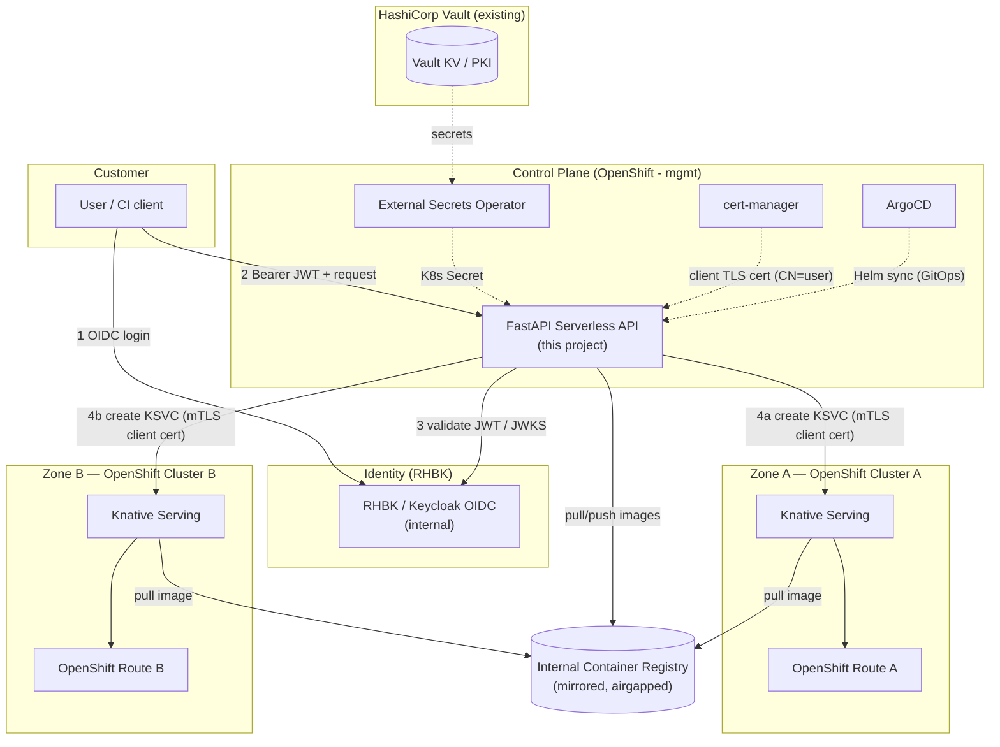
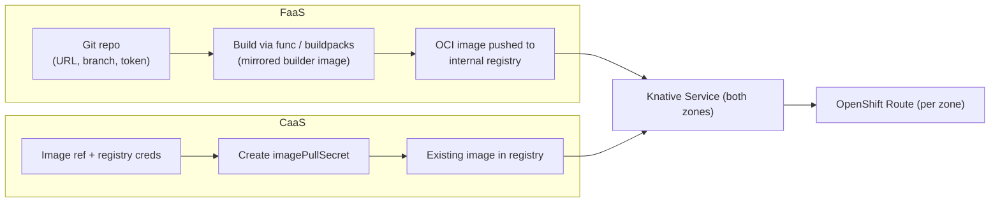
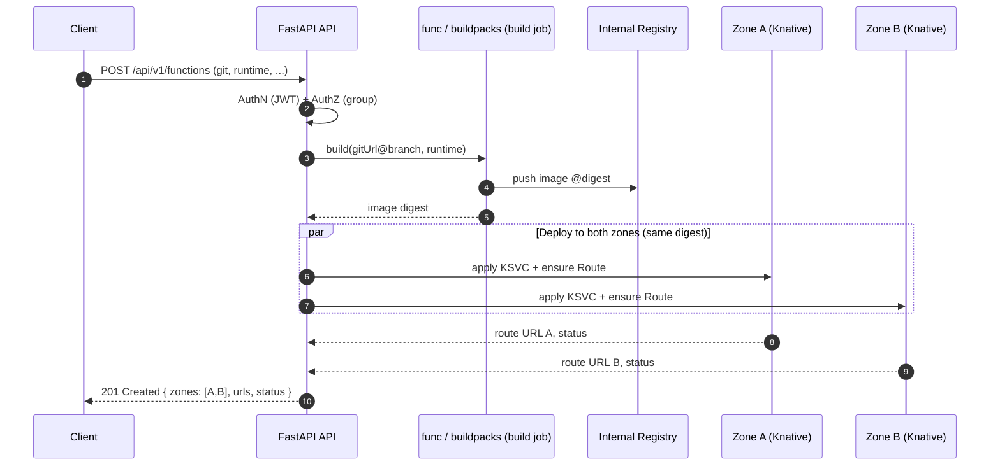
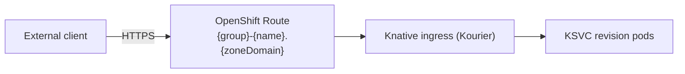
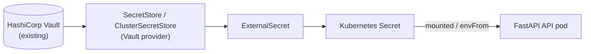
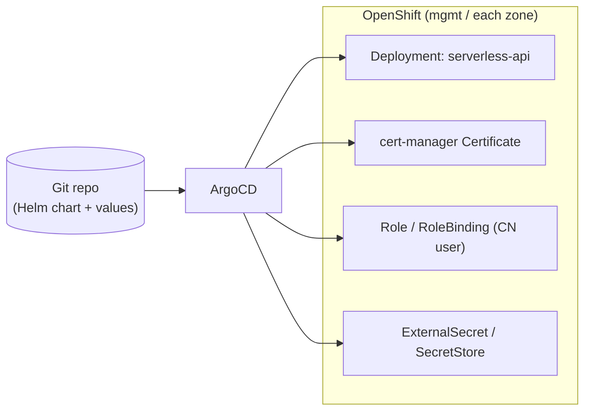

# Serverless Platform — Architecture & Design

A self-service **FaaS (Function as a Service)** and **CaaS (Container as a Service)**
platform that wraps the open-source **Knative** project on **OpenShift**, exposed through a
**Python / FastAPI** REST API.

> **Status:** Design document (no implementation yet). This document is the source of truth
> for the architecture and is intended to be detailed enough for engineers to implement the
> FastAPI application, the Helm chart, and the GitOps manifests against an **airgapped**
> OpenShift environment.

---

## Table of Contents

1. [Overview & Goals](#1-overview--goals)
2. [High-Level Architecture](#2-high-level-architecture)
3. [Core Service Offerings](#3-core-service-offerings)
4. [Multi-Zone (Active/Active HA) Design](#4-multi-zone-activeactive-ha-design)
5. [Networking & Exposure](#5-networking--exposure)
6. [Authentication & Authorization](#6-authentication--authorization)
7. [Secrets Management](#7-secrets-management)
8. [Deployment & GitOps](#8-deployment--gitops)
9. [Airgapped Considerations](#9-airgapped-considerations)
10. [REST API Specification](#10-rest-api-specification)
11. [Proposed Repository Layout](#11-proposed-repository-layout)
12. [Sample Manifests](#12-sample-manifests)
13. [Open Questions / Future Work](#13-open-questions--future-work)

---

## Design Decisions (locked in)

| Topic | Decision |
|-------|----------|
| Deliverable | Architecture/design doc only (this document) |
| FaaS build | **Knative Functions** (`func` + Cloud Native Buildpacks), mirrored builder images for airgap |
| Cluster auth | **cert-manager `Certificate` CR** (shipped in Helm chart) → client TLS cert; cert **CN = Kubernetes user**, bound via RBAC |
| Topology | **Two separate OpenShift clusters** ("zones"), each with its own API endpoint + client cert |
| Zone selection | **Deploy to both zones simultaneously** (active/active HA) on every deploy |
| Tenancy | **Shared namespace(s), label-scoped**; SSO group → resource labels enforced by the API |
| API authn | **RHBK (Red Hat Build of Keycloak) OIDC** in front of the API |
| API authz | Based on **SSO group membership** |
| Secrets | **External Secrets Operator** fetching from existing **HashiCorp Vault** (API stores no secrets) |
| CI/CD | **Helm + ArgoCD** (GitOps) |
| Environment | **Airgapped** — all images/deps mirrored to an internal registry |

---

## 1. Overview & Goals

### Problem statement

Customers need to deploy workloads without managing Kubernetes/OpenShift directly. They
want two consumption models:

- **FaaS** — "give us your source code, we build and run it." The client provides a Git
  repository URL, branch, an access token, and the source lives in that repo. Supported
  runtimes: **Python, Go, JavaScript**.
- **CaaS** — "give us your image, we run it." The client provides a container image
  reference plus registry credentials (username + token).

Both models must run on **Knative Serving** (scale-to-zero, request-driven autoscaling) on
**OpenShift**, be reachable from outside the cluster via an **OpenShift Route**, and be
governed by enterprise SSO. Everything runs in an **airgapped** datacenter across **two
OpenShift clusters** for high availability.

### Goals

- A single FastAPI REST API that abstracts Knative/OpenShift away from the customer.
- One API call deploys the workload to **both zones** (active/active).
- Strong authn (RHBK OIDC) and group-based authz.
- No secrets stored by the API; all secrets sourced from Vault via ESO.
- GitOps-managed (Helm + ArgoCD), reproducible, airgap-compatible.

### Non-goals (this phase)

- Implementation code (delivered later).
- Global DNS / GSLB across zones (the API returns both per-zone Routes; cross-zone traffic
  steering is the consumer's / platform networking team's responsibility — see §4 and §13).
- Billing/metering, quota enforcement, and a full observability stack (see §13).

### Glossary

| Term | Meaning |
|------|---------|
| **Knative Serving** | Knative component that runs request-driven, autoscaling (incl. scale-to-zero) workloads. |
| **KSVC** | A Knative `Service` custom resource (`serving.knative.dev/v1`). The top-level unit we create per workload. |
| **Revision** | An immutable snapshot of a KSVC; created on each spec change. |
| **Route (OpenShift)** | OpenShift `route.openshift.io/v1` object that exposes a service externally over HTTP(S). |
| **Zone** | One of the two independent OpenShift clusters the platform deploys to. |
| **RHBK** | Red Hat Build of Keycloak — the OIDC identity provider. |
| **ESO** | External Secrets Operator — syncs secrets from Vault into Kubernetes Secrets. |
| **Tenant / group** | An SSO (Keycloak) group; the unit of ownership and isolation. |
| **`func`** | Knative Functions CLI / library used to build source into an OCI image via buildpacks. |

---

## 2. High-Level Architecture



**Reading the diagram:**

- The user authenticates against **RHBK** and calls the **FastAPI API** with a bearer JWT.
- The API validates the token (JWKS from RHBK), authorizes based on the user's **groups**,
  then **fans out** the deployment to **both zone clusters** using a **per-zone client TLS
  certificate** for cluster authentication.
- Images are pulled/pushed from the **internal mirrored registry** (airgap).
- The API's own secrets come from **Vault via ESO**; its cluster client certs come from
  **cert-manager**; the API itself is deployed by **Helm + ArgoCD**.

---

## 3. Core Service Offerings

Both offerings converge on the same primitive: **create/update a Knative `Service` (KSVC)
in both zones**, then ensure an OpenShift Route exists. They differ only in how the runnable
**image** is produced.



### 3.1 FaaS — Function as a Service

**Inputs (request body):**

| Field | Required | Notes |
|-------|----------|-------|
| `gitUrl` | yes | HTTPS Git repository URL (internal Git, airgapped). |
| `branch` | yes | Branch / ref to build. |
| `gitToken` | yes | Repo access token; used only to clone, **never persisted** (see §7). |
| `runtime` | yes | One of `python`, `go`, `javascript`. |
| `name` | yes | Logical workload name (DNS-1123). |
| `env`, `secrets`/`configMounts`, `scaling` | no | Shared capabilities, see §3.3. |

**Build flow (Knative Functions / buildpacks):**

1. The API launches a **build** (in-cluster) using **Knative Functions** (`func`) with
   **Cloud Native Buildpacks**. The builder/run images are the **mirrored** versions hosted
   in the internal registry (see §9) — buildpack autodetection picks the right
   Python/Go/JS buildpack.
2. Source is cloned from `gitUrl@branch` using `gitToken`.
3. The resulting OCI image is pushed to the **internal container registry** under a
   deterministic tag, e.g. `registry.internal/<group>/<name>:<gitsha>`.
4. The API then creates/updates the **KSVC** referencing that image (§3.3), in **both
   zones**.

> The build runs once and the **same image digest** is deployed to both zones to guarantee
> bit-for-bit parity across the active/active pair.



### 3.2 CaaS — Container as a Service

**Inputs (request body):**

| Field | Required | Notes |
|-------|----------|-------|
| `image` | yes | Fully-qualified image reference in the internal registry (airgap). |
| `registryUsername` | yes | Registry username. |
| `registryToken` | yes | Registry access token; used to create an `imagePullSecret`, **not persisted** by the API. |
| `name` | yes | Logical workload name (DNS-1123). |
| `env`, `secrets`/`configMounts`, `scaling` | no | Shared capabilities, see §3.3. |

**Flow:**

1. The API creates a Kubernetes `kubernetes.io/dockerconfigjson` **imagePullSecret** from
   the supplied credentials in each zone, **labeled** with the owning group (§6) and linked
   to the KSVC's service account.
2. The API creates/updates the **KSVC** referencing `image` in **both zones**.

### 3.3 Shared capabilities (FaaS and CaaS)

Applied identically to both offerings; modeled on the KSVC pod spec.

| Capability | How it maps to Knative |
|------------|------------------------|
| **Environment variables** | `spec.template.spec.containers[0].env` (literal values) and `envFrom` (for whole ConfigMaps/Secrets). |
| **Mount secrets / config files** | API materializes referenced `Secret`/`ConfigMap` (Secrets sourced via ESO where appropriate) and mounts them as `volumeMounts` at a requested path, or projects them as files. |
| **Scaling options** | Knative autoscaling annotations: `autoscaling.knative.dev/min-scale`, `max-scale`, `target` (concurrency), and `containerConcurrency`. Scale-to-zero is the default when `min-scale=0`. |

A canonical scaling sub-object in the API:

```json
{
  "scaling": {
    "minScale": 0,
    "maxScale": 10,
    "targetConcurrency": 100,
    "containerConcurrency": 0
  }
}
```

---

## 4. Multi-Zone (Active/Active HA) Design

The platform deploys **every** workload to **both** OpenShift clusters (Zone A and Zone B)
on each create/update. The API owns a **per-zone connection profile**:

```yaml
zones:
  - name: zone-a
    apiServer: https://api.zone-a.internal:6443
    caBundleSecretRef: zone-a-ca         # from ESO/Vault or mounted CA
    clientCertSecretRef: zone-a-client    # cert-manager Certificate (CN=serverless-api)
    namespace: serverless-workloads
    routeDomain: apps.zone-a.internal
  - name: zone-b
    apiServer: https://api.zone-b.internal:6443
    caBundleSecretRef: zone-b-ca
    clientCertSecretRef: zone-b-client
    namespace: serverless-workloads
    routeDomain: apps.zone-b.internal
```

### Fan-out & status aggregation

- The API holds **one Kubernetes client per zone** (built from that zone's client cert + CA).
- On deploy, it applies the KSVC + Route to both zones **concurrently** (async / thread
  pool), then **aggregates** per-zone results into a single response:

```json
{
  "name": "orders-api",
  "type": "container",
  "zones": [
    { "zone": "zone-a", "status": "Ready", "url": "https://group-orders-api.apps.zone-a.internal" },
    { "zone": "zone-b", "status": "Ready", "url": "https://group-orders-api.apps.zone-b.internal" }
  ],
  "overallStatus": "Ready"
}
```

### Partial-failure semantics

| Scenario | Behavior |
|----------|----------|
| Both zones succeed | `overallStatus = Ready`, `201`/`200`. |
| One zone fails | `overallStatus = Degraded`, `207 Multi-Status`; the per-zone object carries the error. The succeeded zone is **left running** (HA prefers availability). |
| Both zones fail | `overallStatus = Failed`, `502`; the API attempts best-effort cleanup of any partially-created resources. |

- Operations are **idempotent** (apply/patch by name+group label), so a client can safely
  retry to heal a degraded deployment.
- **Build once, deploy the same digest to both zones** (see §3.1) so the two zones are
  identical.

> **Out of scope:** cross-zone traffic distribution (GSLB/global DNS). The API returns both
> Route URLs; steering between them is left to the platform networking layer (see §13).

---

## 5. Networking & Exposure

- Knative Serving already creates an internal `KService` URL via its ingress
  (Kourier/OpenShift ingress). On top of that, **every workload is explicitly exposed with
  an OpenShift `Route`** so exposure is uniform, predictable, and independent of Knative
  ingress specifics.
- The API ensures a Route per zone targeting the Knative ingress for the KSVC.
- **TLS:** Routes use `edge` termination by default (or `reencrypt` when the workload serves
  TLS), with the cluster's wildcard/serving cert.
- **Naming convention:** `{group}-{name}.{zone.routeDomain}`
  e.g. `team-orders-api.apps.zone-a.internal`. The `{group}` prefix keeps tenants from
  colliding in the shared namespace and makes ownership obvious.



---

## 6. Authentication & Authorization

Two distinct identities are involved:

1. **End-user → API:** OIDC bearer token from **RHBK**.
2. **API → each cluster:** **client TLS certificate** issued by **cert-manager**, whose
   **CN is a Kubernetes user** bound by RBAC.

### 6.1 End-user authentication (RHBK OIDC)


- The API is a **resource server**: it validates JWTs offline using **JWKS** fetched from
  the internal RHBK realm (cached, no per-request round trip).
- Validated: signature, `iss`, `aud`, `exp`/`nbf`. Implemented as FastAPI dependencies
  (e.g. a `require_auth` / `require_groups` dependency).

### 6.2 Group-based authorization (tenancy)

- Tenancy is **shared-namespace, label-scoped**. Every resource the API creates is labeled:

  ```yaml
  metadata:
    labels:
      serverless.platform/group: "<keycloak-group>"
      serverless.platform/managed-by: "serverless-api"
      serverless.platform/owner: "<sub or preferred_username>"
  ```

- The API derives the caller's group(s) from the **`groups` claim**. Authorization rules:
  - **Create/Update:** the workload is stamped with the caller's group label.
  - **Read/List:** results are filtered with a **label selector**
    `serverless.platform/group in (<caller groups>)`.
  - **Update/Delete by name:** the API first verifies the target resource's group label is
    in the caller's groups; otherwise `403`/`404`.
- A configurable mapping allows **admin groups** (full access) vs **tenant groups** (own
  resources only).

> Isolation is enforced **in the API layer** plus label selectors. Because all tenants share
> a namespace, the cluster RBAC for the API's service identity is namespace-wide (see §6.3);
> per-tenant isolation is therefore the API's responsibility. (A future hardening option is
> namespace-per-group — see §13.)

### 6.3 Cluster-side identity (cert-manager client cert + RBAC)

- The Helm chart ships a cert-manager **`Certificate`** per zone whose **CN** (e.g.
  `serverless-api`) and optional `O` (group/organization) define the **Kubernetes user**.
  OpenShift authenticates the client by the cert's CN.
- Each zone has a **`Role` + `RoleBinding`** (in the shared workload namespace) granting the
  CN user least-privilege CRUD on exactly the resources the API manages: Knative `services`,
  OpenShift `routes`, `secrets`, `configmaps`, `serviceaccounts`, and read on `pods`/`events`
  for status.
- The certificate's key/cert are mounted into the API pod and used to build the per-zone
  Kubernetes client (mutual TLS to the API server).

---

## 7. Secrets Management

**Principle: the API never persists secrets.** Two categories:

### 7.1 The API's own secrets — Vault → ESO → Kubernetes Secret

The API needs, e.g., the RHBK client secret and per-zone cluster CA bundles. These are
stored in **Vault** and projected into the cluster by **ESO**.



- A `ClusterSecretStore` points at the existing Vault server (Kubernetes auth / AppRole).
- `ExternalSecret` resources declare which Vault paths map to which Kubernetes Secret keys.
- ESO reconciles and keeps the Kubernetes Secret in sync; the API consumes it via `envFrom`
  or volume mounts. **No secret values live in Git or in the API's code/config.**

### 7.2 Customer-provided credentials (git/registry tokens)

- `gitToken` (FaaS) and `registryToken` (CaaS) arrive in the request body **over TLS**.
- They are used **transiently**:
  - `gitToken` is injected into the build job only for the clone and discarded.
  - `registryToken` becomes a labeled `imagePullSecret` attached to the workload's service
    account in each zone.
- The API does **not** write these to its own datastore, logs, or Git. Where a credential
  must persist for the workload to run (the pull secret), it lives as a **scoped, labeled
  Kubernetes Secret** owned by the tenant group and is deleted when the workload is deleted.

---

## 8. Deployment & GitOps

The FastAPI control-plane app is delivered via **Helm** and reconciled by **ArgoCD**.



- **Helm chart** templates: `Deployment`, `Service`, `Route` (for the API itself),
  `ServiceAccount`, `Role`/`RoleBinding`, cert-manager `Certificate` (per zone),
  ESO `SecretStore`/`ExternalSecret`, and `values.yaml` describing the zone profiles.
- **ArgoCD**: an `Application` (or an `ApplicationSet` generating one Application per zone)
  watches the chart and syncs. Sync waves order CRDs/Secrets before the Deployment;
  health checks gate rollout.
- All referenced images are the **internal mirrored** images (airgap, §9).

---

## 9. Airgapped Considerations

Nothing may reach the public internet. Everything is mirrored to internal infrastructure.

| Concern | Approach |
|---------|----------|
| **Platform & app images** | Mirror to the internal registry; use `ImageDigestMirrorSet` / `ImageContentSourcePolicy` so image pulls resolve internally. |
| **Buildpack builder/run images** | Mirror the Cloud Native Buildpacks **builder** and **run** images used by Knative Functions for Python/Go/JS into the internal registry; configure `func` to use them. This is the key airgap dependency for FaaS. |
| **Python dependencies (the API)** | Build the API container against an **internal PyPI mirror** (e.g. Nexus/Artifactory) or vendored wheels; pin all versions. |
| **Function dependencies (per runtime)** | Buildpacks must resolve language deps from internal mirrors (internal PyPI, Go module proxy/`GOPROXY`, npm registry mirror). Documented as a prerequisite for each runtime. |
| **Base images** | Use mirrored UBI base images. |
| **CA trust** | Internal Git, registry, Vault, RHBK all use the internal CA; the API and build images must trust the internal CA bundle (mounted / baked in). |
| **cert-manager** | Issue client certs from an **internal issuer** (internal CA or Vault PKI), not a public ACME CA. |
| **Helm charts** | Hosted in an internal chart repo / Git; no public chart pulls. |

---

## 10. REST API Specification

Base path: `/api/v1`. All endpoints require a valid RHBK bearer token (§6). All responses
are JSON. Times are RFC 3339 UTC.

### Endpoints

| Method | Path | Purpose |
|--------|------|---------|
| `POST` | `/api/v1/functions` | Create a FaaS workload (build from Git, deploy to both zones). |
| `GET` | `/api/v1/functions` | List caller's functions (label-scoped). |
| `GET` | `/api/v1/functions/{name}` | Get one function (spec + per-zone status). |
| `PATCH` | `/api/v1/functions/{name}` | Update env/scaling/mounts (and optionally rebuild). |
| `DELETE` | `/api/v1/functions/{name}` | Delete the function in both zones. |
| `POST` | `/api/v1/containers` | Create a CaaS workload (deploy image to both zones). |
| `GET` | `/api/v1/containers` | List caller's containers (label-scoped). |
| `GET` | `/api/v1/containers/{name}` | Get one container (spec + per-zone status). |
| `PATCH` | `/api/v1/containers/{name}` | Update env/scaling/mounts/image. |
| `DELETE` | `/api/v1/containers/{name}` | Delete the container in both zones. |
| `GET` | `/api/v1/{type}/{name}/status` | Per-zone readiness, URLs, revision info. |
| `GET` | `/api/v1/{type}/{name}/logs` | (Optional) recent logs per zone. |
| `GET` | `/healthz`, `/readyz` | Liveness/readiness (no auth). |

### Shared sub-schemas

```jsonc
// Workload shared fields (used by both functions and containers)
{
  "name": "orders-api",                 // DNS-1123, required
  "env": [                              // optional
    { "name": "LOG_LEVEL", "value": "info" },
    { "name": "DB_PASSWORD", "valueFrom": { "secret": "orders-db", "key": "password" } }
  ],
  "configMounts": [                     // optional: mount Secret/ConfigMap as files
    { "source": "orders-config", "type": "configmap", "mountPath": "/etc/app" },
    { "source": "orders-tls",    "type": "secret",    "mountPath": "/etc/tls" }
  ],
  "scaling": {                          // optional, see 3.3
    "minScale": 0, "maxScale": 10,
    "targetConcurrency": 100, "containerConcurrency": 0
  },
  "zones": ["zone-a", "zone-b"]         // optional; default = all zones (HA)
}
```

### FaaS — `POST /api/v1/functions`

Request:

```json
{
  "name": "image-resizer",
  "gitUrl": "https://git.internal/team/image-resizer.git",
  "branch": "main",
  "gitToken": "<repo-access-token>",
  "runtime": "python",
  "env": [ { "name": "MAX_PX", "value": "2048" } ],
  "scaling": { "minScale": 0, "maxScale": 20 }
}
```

Response `201 Created`:

```json
{
  "name": "image-resizer",
  "type": "function",
  "runtime": "python",
  "imageDigest": "registry.internal/team/image-resizer@sha256:abcd...",
  "overallStatus": "Ready",
  "zones": [
    { "zone": "zone-a", "status": "Ready", "url": "https://team-image-resizer.apps.zone-a.internal", "revision": "image-resizer-00001" },
    { "zone": "zone-b", "status": "Ready", "url": "https://team-image-resizer.apps.zone-b.internal", "revision": "image-resizer-00001" }
  ],
  "createdAt": "2026-06-16T07:30:00Z"
}
```

### CaaS — `POST /api/v1/containers`

Request:

```json
{
  "name": "orders-api",
  "image": "registry.internal/team/orders-api:1.4.2",
  "registryUsername": "svc-team",
  "registryToken": "<registry-token>",
  "env": [ { "name": "LOG_LEVEL", "value": "info" } ],
  "configMounts": [ { "source": "orders-config", "type": "configmap", "mountPath": "/etc/app" } ],
  "scaling": { "minScale": 1, "maxScale": 8, "targetConcurrency": 50 }
}
```

Response `201 Created`: same envelope shape as the FaaS response (`type: "container"`,
no `runtime`/`imageDigest` build fields; `image` echoed back).

### Error model

Standard envelope for all non-2xx responses:

```json
{
  "error": {
    "code": "ZONE_PARTIAL_FAILURE",
    "message": "Deployment succeeded in zone-a but failed in zone-b.",
    "details": [
      { "zone": "zone-b", "reason": "ImagePullBackOff", "message": "registry auth failed" }
    ],
    "requestId": "b1c2..."
  }
}
```

| HTTP | Code | When |
|------|------|------|
| `400` | `VALIDATION_ERROR` | Bad/missing fields, unsupported runtime. |
| `401` | `UNAUTHENTICATED` | Missing/invalid JWT. |
| `403` | `FORBIDDEN` | Caller not in a required/owning group. |
| `404` | `NOT_FOUND` | Workload not found in caller's group scope. |
| `409` | `CONFLICT` | Name already exists for the group. |
| `207` | `ZONE_PARTIAL_FAILURE` | One zone failed (Degraded). |
| `502` | `ZONE_TOTAL_FAILURE` | Both zones failed. |
| `500` | `INTERNAL` | Unexpected error. |

---

## 11. Proposed Repository Layout

```text
Serverless/
├── README.md
├── docs/
│   └── ARCHITECTURE.md              # this document
├── app/                             # FastAPI application
│   ├── main.py                      # app factory, router registration, middleware
│   ├── core/
│   │   ├── config.py                # settings (zone profiles, RHBK, registry) via env/Secret
│   │   ├── security.py              # OIDC/JWT validation, require_groups dependency
│   │   └── logging.py
│   ├── routers/
│   │   ├── functions.py             # FaaS endpoints
│   │   ├── containers.py            # CaaS endpoints
│   │   └── health.py
│   ├── models/                      # Pydantic request/response schemas
│   │   ├── common.py                # env, scaling, configMounts, zone status
│   │   ├── function.py
│   │   └── container.py
│   ├── services/                    # business logic
│   │   ├── deployer.py              # multi-zone fan-out + status aggregation
│   │   ├── builder.py               # FaaS build via func/buildpacks
│   │   ├── ksvc.py                  # KSVC manifest construction
│   │   ├── route.py                 # OpenShift Route construction
│   │   └── secrets.py               # imagePullSecret / mount handling (transient)
│   └── clients/
│       ├── zone_client.py           # per-zone Kubernetes/OpenShift client (mTLS cert)
│       └── registry.py
├── helm/
│   └── serverless-api/
│       ├── Chart.yaml
│       ├── values.yaml              # zone profiles, image refs, RHBK, registry
│       └── templates/
│           ├── deployment.yaml
│           ├── service.yaml
│           ├── route.yaml
│           ├── serviceaccount.yaml
│           ├── rbac.yaml            # Role/RoleBinding for the CN user (per zone)
│           ├── certificate.yaml     # cert-manager Certificate (per zone)
│           ├── secretstore.yaml     # ESO SecretStore/ClusterSecretStore
│           └── externalsecret.yaml  # ESO ExternalSecret(s)
├── argocd/
│   └── application.yaml             # ArgoCD Application / ApplicationSet (per zone)
├── manifests/                       # standalone reference manifests / examples
│   └── examples/
├── tests/
│   ├── unit/
│   └── integration/
├── Containerfile                    # build the API image (airgap-friendly base)
├── pyproject.toml                   # pinned deps (internal PyPI mirror)
└── .helmignore / .dockerignore
```

---

## 12. Sample Manifests

> Illustrative only — final values are templated by Helm and parameterized per zone.

### 12.1 Knative Service (KSVC)

```yaml
apiVersion: serving.knative.dev/v1
kind: Service
metadata:
  name: orders-api
  namespace: serverless-workloads
  labels:
    serverless.platform/group: team
    serverless.platform/managed-by: serverless-api
spec:
  template:
    metadata:
      annotations:
        autoscaling.knative.dev/min-scale: "1"
        autoscaling.knative.dev/max-scale: "8"
        autoscaling.knative.dev/target: "50"
    spec:
      containerConcurrency: 0
      imagePullSecrets:
        - name: orders-api-pull
      containers:
        - image: registry.internal/team/orders-api:1.4.2
          env:
            - name: LOG_LEVEL
              value: info
          volumeMounts:
            - name: app-config
              mountPath: /etc/app
      volumes:
        - name: app-config
          configMap:
            name: orders-config
```

### 12.2 OpenShift Route

```yaml
apiVersion: route.openshift.io/v1
kind: Route
metadata:
  name: team-orders-api
  namespace: serverless-workloads
  labels:
    serverless.platform/group: team
spec:
  host: team-orders-api.apps.zone-a.internal
  to:
    kind: Service
    name: kourier            # Knative ingress service
  port:
    targetPort: http2
  tls:
    termination: edge
    insecureEdgeTerminationPolicy: Redirect
```

### 12.3 cert-manager Certificate (cluster client cert, CN = K8s user)

```yaml
apiVersion: cert-manager.io/v1
kind: Certificate
metadata:
  name: serverless-api-zone-a-client
  namespace: serverless-system
spec:
  secretName: zone-a-client            # mounted into the API pod
  commonName: serverless-api           # => Kubernetes username
  subject:
    organizations:
      - serverless-platform            # => group, optional
  usages:
    - client auth
  issuerRef:
    name: internal-ca-issuer           # internal CA / Vault PKI (airgap)
    kind: ClusterIssuer
```

### 12.4 RBAC for the CN user (per zone, shared workload namespace)

```yaml
apiVersion: rbac.authorization.k8s.io/v1
kind: Role
metadata:
  name: serverless-api-workloads
  namespace: serverless-workloads
rules:
  - apiGroups: ["serving.knative.dev"]
    resources: ["services"]
    verbs: ["get", "list", "watch", "create", "update", "patch", "delete"]
  - apiGroups: ["route.openshift.io"]
    resources: ["routes"]
    verbs: ["get", "list", "watch", "create", "update", "patch", "delete"]
  - apiGroups: [""]
    resources: ["secrets", "configmaps", "serviceaccounts"]
    verbs: ["get", "list", "create", "update", "patch", "delete"]
  - apiGroups: [""]
    resources: ["pods", "events"]
    verbs: ["get", "list", "watch"]
---
apiVersion: rbac.authorization.k8s.io/v1
kind: RoleBinding
metadata:
  name: serverless-api-workloads
  namespace: serverless-workloads
subjects:
  - kind: User
    name: serverless-api               # matches the Certificate CN
    apiGroup: rbac.authorization.k8s.io
roleRef:
  kind: Role
  name: serverless-api-workloads
  apiGroup: rbac.authorization.k8s.io
```

### 12.5 ESO — SecretStore + ExternalSecret (Vault)

```yaml
apiVersion: external-secrets.io/v1beta1
kind: ClusterSecretStore
metadata:
  name: vault-backend
spec:
  provider:
    vault:
      server: https://vault.internal:8200
      path: kv
      version: v2
      auth:
        kubernetes:
          mountPath: kubernetes
          role: serverless-api
          serviceAccountRef:
            name: serverless-api
            namespace: serverless-system
---
apiVersion: external-secrets.io/v1beta1
kind: ExternalSecret
metadata:
  name: serverless-api-secrets
  namespace: serverless-system
spec:
  refreshInterval: 1h
  secretStoreRef:
    name: vault-backend
    kind: ClusterSecretStore
  target:
    name: serverless-api-secrets       # consumed by the API via envFrom
  data:
    - secretKey: rhbk-client-secret
      remoteRef:
        key: serverless/api
        property: rhbk_client_secret
    - secretKey: zone-a-ca
      remoteRef:
        key: serverless/zone-a
        property: ca_bundle
```

### 12.6 ArgoCD Application (per zone via ApplicationSet)

```yaml
apiVersion: argoproj.io/v1alpha1
kind: ApplicationSet
metadata:
  name: serverless-api
  namespace: argocd
spec:
  generators:
    - list:
        elements:
          - zone: zone-a
            valuesFile: values-zone-a.yaml
          - zone: zone-b
            valuesFile: values-zone-b.yaml
  template:
    metadata:
      name: "serverless-api-{{zone}}"
    spec:
      project: serverless
      source:
        repoURL: https://git.internal/team/serverless.git
        targetRevision: main
        path: helm/serverless-api
        helm:
          valueFiles:
            - "{{valuesFile}}"
      destination:
        server: https://kubernetes.default.svc
        namespace: serverless-system
      syncPolicy:
        automated: { prune: true, selfHeal: true }
        syncOptions: [ "CreateNamespace=true" ]
```

---

## 13. Open Questions / Future Work

| Item | Notes |
|------|-------|
| **Global load balancing / DNS** | Active/active returns two Route URLs; a GSLB/global DNS to present a single hostname with health-based steering is out of scope here and needs the networking team. |
| **Quotas & rate limiting** | Per-group resource quotas (CPU/mem, max workloads) and API rate limiting are not yet specified. |
| **Observability** | Centralized logging/metrics/tracing for tenant workloads (and the `/logs` endpoint backing store) to be designed. |
| **Audit logging** | Who deployed/changed/deleted what — likely required for enterprise/compliance. |
| **Stronger isolation** | Optional move from shared-namespace to **namespace-per-group** for hard multi-tenancy. |
| **Build pipeline hardening** | Where `func` builds run (Tekton task vs. in-API job), build caching, and signed images (cosign in airgap). |
| **Rollback / versioning** | Knative revisions enable traffic splitting/rollback; expose this via the API later. |
| **Secret rotation** | cert-manager cert renewal + ESO refresh cadence and zero-downtime reload of the API clients. |
