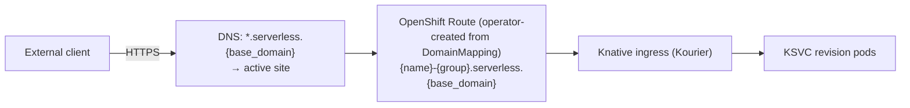
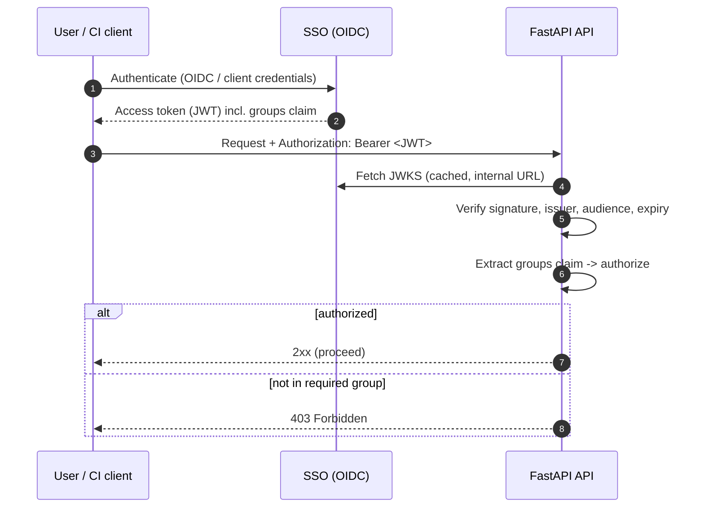
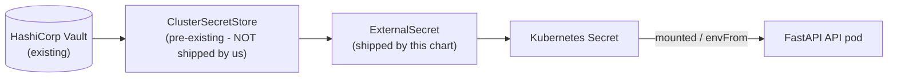

# Architecture & Design

How the platform fits together: goals, the multi-site model, networking,
authentication, secrets, and the REST conventions both offerings share.
Per-offering detail is in CONTAINERS.md and FUNCTIONS.md.

## Contents

- [Design Decisions (locked in)](#design-decisions-locked-in)
- [Overview & Goals](#overview--goals)
- [High-Level Architecture](#high-level-architecture)
- [Multi-Site (Active/Active HA) Design](#multi-site-activeactive-ha-design)
- [Networking & Exposure](#networking--exposure)
- [Authentication & Authorization](#authentication--authorization)
- [Secrets Management](#secrets-management)
- [Airgapped Considerations](#airgapped-considerations)
- [REST API Specification](#rest-api-specification)
- [Proposed Repository Layout](#proposed-repository-layout)
- [Open Questions / Future Work](#open-questions--future-work)

## Design Decisions (locked in)

| Topic | Decision |
|-------|----------|
| Deliverable | FastAPI app + Helm chart + CI/CD in this repo (GitOps `ApplicationSet` lives elsewhere) |
| FaaS build | **Knative Functions** (`func` + Cloud Native Buildpacks), mirrored builder images for airgap |
| Cluster auth | **cert-manager `Certificate` CR** (shipped in Helm chart) → client TLS cert; **CN is a DNS name** `serverless-api.clients.{base_domain}` (ACME-issued); that name is the Kubernetes user, bound via RBAC |
| Topology | **Two separate OpenShift clusters** ("sites") that **trust the same CA**. The **API runs active/active in both clusters**; a DNS record fronts the active API. **Workloads run on the same two clusters** in a **separate namespace** from the API. |
| Site selection | **Deploy to both sites on every deploy.** Each workload's **Route host is identical in both clusters**; a DNS record forwards to the active serverless site (active/passive at the traffic layer, active/active at the deploy layer). |
| Tenancy | **Shared namespace, label-scoped**; SSO group → resource labels enforced by the API |
| API authn | **SSO (Red Hat Build of Keycloak) OIDC** in front of the API |
| API authz | Based on **SSO group membership** |
| Secrets | **External Secrets Operator** - this repo ships **`ExternalSecret` only**, referencing a **pre-existing `ClusterSecretStore`** that points at **HashiCorp Vault** (API stores no secrets) |
| Route domain | Single platform wildcard **`*.serverless.{base_domain}`**; host `{name}-{group}.serverless.{base_domain}` (offering tracked as a label, not in the host) |
| CI/CD | **Helm** (this repo) + **ArgoCD** `ApplicationSet` (lives in a **separate GitOps repo**) |
| Environment | **Airgapped** - all images/deps mirrored to an internal registry; ACME via an internal ACME endpoint |

---

## Overview & Goals

### Problem statement

Customers need to deploy workloads without managing Kubernetes/OpenShift directly. They
want two consumption models:

- **FaaS** - "give us your source code, we build and run it." The client provides a Git
  repository URL, branch, an access token, and the source lives in that repo. Supported
  runtimes are **configurable** (default **Python, Go, JavaScript**; see FUNCTIONS.md: FaaS - Function as a Service) and listed on
  `GET /api/v1/functions/info`.
- **CaaS** - "give us your image, we run it." The client provides a container image
  reference plus registry credentials (username + token).

Both models must run on **Knative Serving** (scale-to-zero, request-driven autoscaling) on
**OpenShift**, be reachable from outside the cluster via an **OpenShift Route**, and be
governed by enterprise SSO. Everything runs in an **airgapped** datacenter across **two
OpenShift clusters** for high availability. The **API itself also runs active/active on
those same two clusters** (fronted by a DNS record pointing at the active site), and the
**customer workloads run on the same two clusters** in a **separate namespace** from the API.

### Goals

- A single FastAPI REST API that abstracts Knative/OpenShift away from the customer.
- One API call deploys the workload to **both clusters**; the API is itself HA across both.
- Each workload exposed at a **single, cluster-independent Route host**, with DNS forwarding
  to the active site.
- Strong authn (SSO OIDC) and group-based authz.
- No secrets stored by the API; all secrets sourced from Vault via ESO.
- GitOps-managed (Helm + ArgoCD), reproducible, airgap-compatible.

### Non-goals (this phase)

- Implementation code (delivered later).
- Cross-site traffic steering is handled **outside** the API by a **DNS record that forwards
  to the active serverless site** (the Route host is identical in both clusters). The API is
  not a GSLB.
- Billing/metering, quota enforcement, and a full observability stack (see ARCHITECTURE.md: Open Questions / Future Work).

### Glossary

| Term | Meaning |
|------|---------|
| **Knative Serving** | Knative component that runs request-driven, autoscaling (incl. scale-to-zero) workloads. |
| **KSVC** | A Knative `Service` custom resource (`serving.knative.dev/v1`). The top-level unit we create per workload. |
| **Revision** | An immutable snapshot of a KSVC; created on each spec change. |
| **Route (OpenShift)** | OpenShift `route.openshift.io/v1` object that exposes a service externally over HTTP(S). |
| **Site** | A region the platform deploys to (e.g. `central`, `south`); each runs one OpenShift **cluster** (e.g. `central-0`). |
| **SSO** | Red Hat Build of Keycloak - the OIDC identity provider. |
| **ESO** | External Secrets Operator - syncs secrets from Vault into Kubernetes Secrets. |
| **Tenant / group** | An SSO (Keycloak) group; the unit of ownership and isolation. |
| **`func`** | Knative Functions CLI / library used to build source into an OCI image via buildpacks. |

---

## High-Level Architecture


**Reading the diagram:**

- The user authenticates against **SSO** and calls the API via the **`serverless-api`
  DNS record**, which points at the **active API instance** (the API runs active/active on
  both clusters).
- The serving API validates the token (JWKS from SSO), authorizes on the user's **groups**,
  then **applies the KSVC + Route to both clusters** using each cluster's **client TLS cert**
  (CN `serverless-api.clients.{base_domain}`) for authentication.
- Each workload gets the **same Route host in both clusters**; the
  **`*.serverless.{base_domain}`** DNS record forwards end-user traffic to the active site.
- Images come from the **internal mirrored registry** (airgap). The API's own secrets come
  from **Vault via an ESO `ExternalSecret`** (using a pre-existing `ClusterSecretStore`); its
  client certs come from **cert-manager (ACME)**; the API is deployed by **Helm**, synced by
  an **ArgoCD `ApplicationSet` that lives in a separate GitOps repo**.

---

### Shared capabilities (FaaS and CaaS)

Applied identically to both offerings; modeled on the KSVC pod spec.

| Capability | How it maps to Knative |
|------------|------------------------|
| **Environment variables** | Each `env` entry is `name` + `value`. A plain entry is set inline on the container; an entry with **`secret: true`** has its value moved into an API-created Kubernetes **Secret** (`{workload}-env`) and the container reads it via a `secretKeyRef` (the value is never inline). The API does **not** expose `valueFrom` - users cannot reference arbitrary existing cluster Secrets/ConfigMaps. **CA-trust defaults** (`SSL_CERT_FILE`, `REQUESTS_CA_BUNDLE`, `CURL_CA_BUNDLE`, `NODE_EXTRA_CA_CERTS`, `GIT_SSL_CAINFO`) are injected automatically, pointed at the mounted trusted-CA bundle, so cross-language tooling trusts internal TLS with no user action. They are **transparent**: a var the user sets themselves is left as-is (their value wins), and the injected defaults are recorded in a `serverless.platform/injected-env` annotation so they're hidden from the workload's GET. |
| **Files (config & secret mounts)** | Via the `files` field, a user **uploads inline file content** (`content`/`contentBase64`), its `mountPath`, and an optional `readOnly` flag (default true). The API aggregates all non-secret files into **one `{workload}-files` ConfigMap** and all secret files (`secret: true`) into **one `{workload}-files` Secret** - one ConfigMap and one Secret per workload, a key per file - and mounts each at its path via `subPath`. (No referencing of pre-existing cluster objects.) |
| **Scaling options** | Knative autoscaling annotations: `autoscaling.knative.dev/min-scale`, `max-scale`, `metric`, `target`, and `scale-down-delay`. `metric` selects the scaling signal - `concurrency` or `rps` (default **KPA** autoscaler, scale-to-zero capable) or `cpu`/`memory` (**HPA** class, no scale-to-zero); `target` is the target value for the chosen metric. When `target` is **omitted** the default is **metric-aware**: `100` for `concurrency`/`rps`, but `70` for `cpu`/`memory` (these are a utilization **percentage**, so we scale before saturation; values >100 are rejected). Scale-to-zero is the default when `min-scale=0` (KPA metrics only). `scaleDownDelay` is an optional Go duration (`30s`/`5m`/`1h`, capped by Knative at 1h) that holds a revision up before scaling it down, smoothing bursty traffic. **These rules are surfaced verbatim on the per-offering `GET /api/v1/{containers,functions}/info`** (per-metric `minScaleFloor`, target default/min/max/unit) - derived from the same model that validates a create, so a client UI can render the form without drift. |
| **Resource size** | `size: small\|medium\|large` (default `small`) - a t-shirt size, so clients pick capacity without Kubernetes units. Maps to container resources: **memory** is set `request==limit` (a hard, predictable OOM boundary - exceeding it restarts that replica), **CPU** is **request-only** (no limit, so workloads are never CPU-throttled). `small`=100m/256Mi, `medium`=250m/512Mi, `large`=500m/1Gi. The CPU/memory request is also what lets the `cpu`/`memory` autoscaling metrics compute utilization. |

A canonical scaling sub-object in the API:

```json
{
  "scaling": {
    "minScale": 0,
    "maxScale": 3,
    "metric": "concurrency",
    "target": 100,
    "scaleDownDelay": "0s"
  }
}
```

---

## Multi-Site (Active/Active HA) Design

The platform deploys **every** workload to **both** OpenShift clusters (Site A and Site B)
on each create/update, and the **API itself runs active/active on both clusters**. Because
both clusters **trust the same CA** and the workload **Route host is identical in both**,
each site is a full, independent replica; a DNS record forwards end-user traffic to the
active site.

The **client certificate, CA bundle, and workloads namespace are global** (the same in every
cluster), so a site profile is just its name, cluster, and endpoint. The `routeDomain`,
`workloadsNamespace`, client cert directory, and CA bundle are shared config:

```yaml
routeDomain: serverless.{base_domain}     # shared; same host in both clusters
workloadsNamespace: serverless-workloads  # where the API creates workloads (global)
clientCertDir: /etc/serverless/client     # tls.crt/tls.key (cert-manager), global
caBundle:                                 # OpenShift-injected, global
  configMap: ca-bundle
  key: ca-bundle.crt
  mountPath: /etc/ssl/certs
sites:
  - name: central                          # site/region
    cluster: central-0                     # cluster instance
    apiServer: https://api.central-0.example.com:6443
  - name: south
    cluster: south-0
    apiServer: https://api.south-0.example.com:6443
```

> The API always authenticates with the **client certificate** (no in-cluster/ServiceAccount
> path) - uniform whether it's talking to its local cluster or the peer over its external API
> endpoint. Because `sites` carries no secrets, it can be sourced from a ConfigMap.

### Fan-out & status aggregation

- The API holds **one Kubernetes client per site** (built from that site's client cert + the
  shared CA).
- On deploy, it applies the KSVC + Route to both sites **concurrently** (async / thread
  pool), then **aggregates** per-site results. The workload `hostname` is the **same host**
  in both sites; only the per-site readiness differs:

```json
{
  "name": "orders-api",
  "group": "team",
  "type": "container",
  "hostname": "orders-api-team.serverless.example.com",
  "sites": [
    { "site": "central", "status": "Ready", "revision": "orders-api-00001" },
    { "site": "south", "status": "Ready", "revision": "orders-api-00001" }
  ],
  "overallStatus": "Ready"
}
```

### Partial-failure semantics

| Scenario | Behavior |
|----------|----------|
| Both sites succeed | `overallStatus = Ready`, `201`/`200`. |
| One site fails | `overallStatus = Degraded`, `207 Multi-Status`; the per-site object carries the error. The succeeded site is **left running** (HA prefers availability), and DNS keeps serving from the healthy site. |
| Both sites fail | `502 SITE_TOTAL_FAILURE` error envelope (no workload body); the per-site errors are in `details[]`. Re-apply is idempotent (server-side apply), so a retry heals any partial state. |

- **An unavailable site does not freeze the API.** Per-site work runs concurrently in
  threads; every cluster call has a **connect/read timeout** and each site has an overall
  **operation timeout backstop**, so a down/slow site fails fast and is reported as
  `Timeout`/`Degraded` (it doesn't block the healthy site or other requests). Health probes
  never touch clusters. (See `cluster_connect_timeout` / `cluster_read_timeout` /
  `site_op_timeout`.)
- Operations are **idempotent** (Kubernetes **server-side apply** by object name), so a
  client can safely retry to heal a degraded deployment.
- **Build once, deploy the same digest to both sites** (see FUNCTIONS.md: FaaS - Function as a Service) so the two sites are
  identical.

> Cross-site traffic steering is handled by the **`*.serverless.{base_domain}` DNS record
> forwarding to the active site** - not by the API.

---

## Networking & Exposure

- This runs on **OpenShift Serverless** (the Operator-installed Knative). The Serverless
  Operator's ingress controller **automatically creates the OpenShift `Route`** for each
  Knative ingress - so the platform requirement "every workload is exposed via an OpenShift
  Route" is satisfied **by the operator**, not by the API hand-creating Routes.
- A bare KSVC would only get a Route under the **per-cluster** default domain (`apps.<cluster>`),
  which differs between sites. To get **one stable, cluster-independent host**, the API creates
  a **`DomainMapping`** for `{name}-{group}.serverless.{base_domain}` in **each** cluster; the
  operator then provisions the Route for that host. A **`*.serverless.{base_domain}` DNS
  record forwards to the active site**.
- **TLS:** the custom host is covered by a **wildcard cert for `*.serverless.{base_domain}`**
  (provided to the DomainMapping / ingress); the operator-created Route is `edge`-terminated.

#### Route host convention (recommendation)

Use a **single platform wildcard domain** and put the tenant in the subdomain - do **not**
split FaaS/CaaS into separate domains:

```
{name}-{group}.serverless.{base_domain}
e.g. orders-api-team.serverless.example.com
```

Rationale: the host must be **identical in both clusters** (DNS forwards to active), so it
must be a custom platform domain anyway; FaaS-vs-CaaS is a build-time detail the consumer
shouldn't see in the URL; and one wildcard domain means **one wildcard cert + one DNS zone**
to manage. The offering (`function`/`container`) is tracked as a **label**, not in the host. The
`{group}` prefix prevents collisions in the shared namespace and makes ownership obvious.

**Object naming.** The OpenShift name of the workload (KSVC) and all its derived resources
(`{workload}-env` Secret, `{workload}-files` ConfigMap/Secret, pull secret) is
**`{name}-{group}`** - unique per tenant in the shared namespace. `{group}` here is the
**normalized** group (ARCHITECTURE.md: Authentication & Authorization), so a group written `My_Team` in SSO appears as `my-team` in both
the object name and the host.

**Custom hostname.** A client may override the host with a `hostname` field. Because the
`DomainMapping` name *is* the host, the API **validates the hostname is not already assigned**
to another workload before deploying (checked across both sites); a clash returns **409
Conflict**. The chosen host is recorded on the KSVC via the `serverless.platform/host`
annotation so reads can report the URL.



#### Workload network isolation (NetworkPolicies)

The chart ships **default-deny** `NetworkPolicies` for the workloads namespace, then reopens
only the paths Knative + OpenShift need. Net effect: a workload pod **can't talk to another
workload pod** (no cross-tenant lateral movement in the shared namespace) or reach other
namespaces, and its egress is constrained:

- **Ingress** - allowed only from the configured system namespaces (Knative activator +
  Kourier ingress, the OpenShift router, monitoring). Same-namespace pods are *not* selected,
  so pod-to-pod ingress stays denied.
- **Egress** - DNS (`openshift-dns`), the platform API namespace ("our side") + the Knative
  control plane, and **off-cluster** destinations (LBs/Routes/external services) with the
  cluster-internal CIDRs excluded, so pods reach platform services via a Route/LB rather than
  directly. All namespaces/CIDRs are values (`networkPolicy.*`), verified per cluster.

#### API Route

The Route that exposes the **API itself** is values-driven: `route.host` (defaults to
`serverless-api.{base_domain}`), plus optional `route.labels` and `route.annotations` (e.g.
HAProxy router timeouts or rate-limit annotations). This is distinct from the per-**workload**
host convention above.

---

## Authentication & Authorization

Two distinct identities are involved:

1. **End-user → API:** OIDC bearer token from **SSO**.
2. **API → each cluster:** **client TLS certificate** issued by **cert-manager** (ACME),
   whose **CN is the DNS name `serverless-api.clients.{base_domain}`**; that name is the
   Kubernetes user, bound by RBAC.

### End-user authentication (SSO OIDC)



- The API is a **resource server**: it validates JWTs offline using **JWKS** fetched from
  the internal SSO realm (cached, no per-request round trip).
- Validated: signature, `iss`, `aud`, `exp`/`nbf`.
- This covers both **users** (authorization-code flow) and **machines/service accounts**
  (client-credentials grant) - any client with a valid SSO bearer token authenticates the
  same way.

#### Static API keys (admin/operator automation, non-OIDC)

For **admin** automation that can't do OIDC, the API also accepts a **static admin API key**
in the **same `Authorization: Bearer <key>` header**. The API distinguishes the two by shape:
a structural JWT (`header.payload.signature`) is validated as an OIDC token; an opaque token is
compared against the single configured admin key. The key is the **raw token** (not a hash),
sourced from Vault via ESO into `SERVERLESS_ADMIN_API_KEY` and matched with a **constant-time**
compare (`api/auth/apikey.py`). A match yields an **admin** Principal (the key is admin-only;
regular users go through OIDC). It defaults to empty, which **disables** key auth; set the env
var to enable it.

#### Auth as an internal component (not a separate microservice)

All OIDC interaction is encapsulated in a **self-contained auth component inside the API**
(the `api/auth/` package - see ARCHITECTURE.md: Proposed Repository Layout), **not** a separately-deployed microservice. Because
token validation is **stateless** (verify signature against cached JWKS + read claims),
there is no shared state to centralize; a standalone auth service would only add a network
hop, another deployment to secure in both clusters, and a failure point. The component owns:

- SSO OIDC discovery + **JWKS fetch/cache** and **token validation** (`oidc.py`),
- **claims → group** mapping and admin/tenant policy (`claims.py`),
- the FastAPI **`require_auth`** dependency (and the `CurrentUser` annotation) the routers
  use (`deps.py`); per-group authorization is asserted in the service layer (`assert_group`).

> If auth-at-the-edge is ever wanted (to keep tokens out of app code / defense-in-depth), the
> OpenShift-native drop-ins are **oauth2-proxy** or **Authorino** as a sidecar/gateway - an
> infra change, not an API rewrite. (See ARCHITECTURE.md: Open Questions / Future Work.)

### Group-based authorization (tenancy)

- Tenancy is **shared-namespace, label-scoped**. Every resource the API creates is labeled:

  ```yaml
  metadata:
    labels:
      serverless.platform/group: "<keycloak-group>"
      serverless.platform/managed-by: "serverless-api"
      serverless.platform/owner: "<sub or preferred_username>"
      # every resource created for a function/container also carries the workload name:
      serverless.platform/workload: "<function-or-container-name>"
  ```

  Every resource the API creates for a function/container (KSVC, Route,
  DomainMapping, the `{workload}-env` Secret, the `{workload}-files`
  ConfigMap/Secret, and the imagePullSecret) carries **both** the SSO group label
  and the workload-name label, so it is unambiguously attributable and selectable.

- The caller **explicitly chooses the group** to act as on every request - it is a **path
  segment** (`/api/v1/groups/{group}/...`) on every endpoint, so the same group scopes reads,
  writes, and deletes uniformly and never appears in a request body. The API
  **asserts the caller is a member** of that group (from the **`groups` claim**); otherwise
  `403`. This makes the acting group unambiguous for users in multiple groups. Authorization
  rules:
  - **Create/Update:** the workload is named `{name}-{group}` and stamped with that group label.
  - **Read/Delete by name:** the request targets `{name}-{group}`; the API verifies both that
    the caller is a member of `group` and that the resource's group label matches; otherwise
    `403`/`404`.
- Admins (members of a configured **admin group**) may act for any group; **tenant groups**
  are limited to groups the caller belongs to.
- **Group-name normalization.** A group name is canonicalized in **one place**
  (`normalize_group`), applied at both edges - to the `groups` claim from the token and to
  the `{group}` path segment - so the two are always comparable. In order: strip the Keycloak
  path prefix (`/`), **lowercase**, strip a leading `ggd-<1-4 digits>-`, then fold `_` to `-`.
  (Lowercasing precedes the prefix strip so an upper-case `GGD-1234-` is still recognized.)
  The case and `_` rules exist because both are legal in a Keycloak group but **not** in the
  DNS-1123 object names and hosts the group is interpolated into (`{name}-{group}`,
  `{name}-{group}.{base_domain}`); without them a member of `My_Team` authenticates
  successfully and is then rejected at every request that names their own group. The DNS-1123
  check runs on the **normalized** form, so a name normalization can't rescue (a
  leading/trailing `_`, whitespace, non-ASCII) is still a `422`.

  > Consequence: `My_Team`, `my_team` and `my-team` all name the **same** platform group -
  > the API accepts any spelling in the path, and returns and deploys the lowercase
  > hyphenated form. If a realm ever defines two of these as *distinct* groups they would
  > collapse into one tenant, so the realm must not treat `_`/`-` or case variants as
  > separate groups (confirmed with the SSO team). Configured **admin groups** are normalized
  > the same way, so they may be written in any spelling.

> Isolation is enforced **in the API layer** plus label selectors. Because all tenants share
> a namespace, the cluster RBAC for the API's service identity is namespace-wide (see ARCHITECTURE.md: Authentication & Authorization);
> per-tenant isolation is therefore the API's responsibility. (A future hardening option is
> namespace-per-group - see ARCHITECTURE.md: Open Questions / Future Work.)

### Cluster-side identity (cert-manager client cert + RBAC)

- The Helm chart ships a cert-manager **`Certificate`** per site, issued via **ACME** (an
  internal ACME endpoint in airgap). Because ACME requires the identity to be a DNS name, the
  cert's **CN/SAN is `serverless-api.clients.{base_domain}`** - and that DNS name is the
  **Kubernetes user**. OpenShift authenticates the client by that name. Both clusters
  **trust the same CA**, so the same identity is valid in either cluster.
- Each site has one `Role`/`RoleBinding` (in the **workload namespace**,
  `serverless-workloads`) granting least-privilege CRUD on exactly what the API manages:
  Knative `services`/`domainmappings`, `secrets`, `configmaps`, read on `pods`/`events`, and
  read on the **`pods/log`** subresource (for the `/logs` endpoint). The API does **not** need
  `routes` permission - on OpenShift Serverless the operator creates the OpenShift Route
  automatically from the KSVC/DomainMapping.
- The cert is mounted **once** (global, not per-site) at `SERVERLESS_CLIENT_CERT_DIR`
  (`tls.crt`/`tls.key`); the API uses it to authenticate to **every** cluster via mTLS. There
  is no in-cluster/ServiceAccount fallback - always certificate-based.
- The CA used to verify the API servers is the **trusted CA bundle** (ARCHITECTURE.md: Airgapped Considerations), pointed at by
  `SERVERLESS_CA_BUNDLE__*`; it is the same for every cluster.

---

## Secrets Management

**Principle: the API never persists *its own platform* secrets**, and **ESO is used only for
those platform secrets** - never for customer workload data. There are three distinct
categories:

| Category | Owner / mechanism | ESO? |
|----------|-------------------|------|
| 7.1 **API's own platform secrets** (SSO client secret, client-cert material) | Vault → ESO `ExternalSecret` → K8s Secret | **Yes** |
| 7.2 **Customer credentials** (git/registry tokens) | Supplied per-request, stored as scoped, labeled workload Secrets; never returned on read | No |
| 7.3 **Customer config & secret mounts** (what the user wants inside their workload) | **Created and managed by the API directly**; readable back via the API | **No** |

### The API's own platform secrets - Vault → ESO → Kubernetes Secret

The API needs, e.g., the SSO client secret and per-site client-cert material. These are
stored in **Vault** and projected into the cluster by **ESO**.



- A **`ClusterSecretStore` already exists** in the clusters (it points at Vault via
  Kubernetes auth / AppRole). **This repo does NOT deploy a SecretStore/ClusterSecretStore.**
- This repo ships only **`ExternalSecret`** resources that **reference the existing
  `ClusterSecretStore`** and declare which Vault paths map to which Kubernetes Secret keys.
- ESO reconciles and keeps the Kubernetes Secret in sync; the API consumes it via `envFrom`
  or volume mounts. **No secret values live in Git or in the API's code/config.**

### Customer-provided credentials (git/registry tokens)

- `gitToken` (FaaS) and `registryToken` (CaaS) arrive in the request body **over TLS**.
- Each is stored as a **scoped, labeled Kubernetes Secret** owned by the tenant group, in
  the workload namespace of both sites, and **garbage-collected with the workload** (via the
  KSVC `ownerReference`):
  - `gitToken` → a `kubernetes.io/basic-auth` **`{workload}-git`** Secret, annotated
    `kpack.io/git` so kpack clones with it, and read back by the API so a later edit can
    rebuild (on a `gitRepo`/`branch`/`runtime` change) **without the client re-supplying
    it**; sending `gitToken` again rotates it. One Secret serves both readers - see
    BUILDING.md: Registry & Git Credentials.
  - `registryToken` → the labeled **`{workload}-pull`** `imagePullSecret` referenced by the
    KSVC. Registry creds mirror a secret env var - the username is the identifier, the token
    the value: **username + token** sets/rotates; **username only** (token null) keeps, but it
    must be the *stored* username - a **different** username without a token is a `400` (there's
    no token to rotate the credential with); **neither** removes the pull secret and treats the
    image as public. Because a pull secret is keyed to a specific registry host, a keep
    re-materializes it against the **current image's registry** (reading the stored token
    internally) so kept creds follow an image moved to a different registry.
- **These tokens are never returned on read.** A GET redacts them (the pull secret's
  `registryUsername` is shown, its token is not; the git token is omitted). To let a client
  edit a workload without re-entering a secret it can't see, `PUT` treats a **redacted/absent
  secret field as "keep the stored value"** (see ARCHITECTURE.md: Shared capabilities and the read-back note below), so the
  redacted GET body can be sent straight back. The API still does **not** write these to its
  own datastore, logs, or Git.

### Customer config & secret mounts (API-managed, **not ESO**)

When a user wants config files or secret values **inside their function/container**, those
are **created and managed by the API itself from the deploy request** - **not** through
ESO/Vault. There are no separate secret/config endpoints; they are derived inline from the
workload spec:

- **`env` with `secret: true`** → values aggregated into a single **`{workload}-env`**
  Kubernetes Secret; the container reads each via a `secretKeyRef` (ARCHITECTURE.md: Shared capabilities).
- **`files`** → non-secret files aggregated into one **`{workload}-files`** ConfigMap and
  secret files into one **`{workload}-files`** Secret, mounted per file via `subPath` (ARCHITECTURE.md: Shared capabilities).

All are created in the **workload namespace of both clusters**, stamped with the ownership
labels (ARCHITECTURE.md: Authentication & Authorization), kept consistent by the API, and cleaned up with the workload. **They never
touch Vault or ESO.**

---

## Airgapped Considerations

Nothing may reach the public internet. Everything is mirrored to internal infrastructure.

| Concern | Approach |
|---------|----------|
| **Platform & app images** | Mirror to the internal registry; use `ImageDigestMirrorSet` / `ImageContentSourcePolicy` so image pulls resolve internally. |
| **Buildpack builder/run images** | Mirror the Cloud Native Buildpacks **builder** and **run** images used by Knative Functions for Python/Go/JS into the internal registry; configure `func` to use them. This is the key airgap dependency for FaaS. |
| **Python dependencies (the API)** | Build the API container against an **internal PyPI mirror** (e.g. Nexus/Artifactory) or vendored wheels; pin all versions. |
| **Function dependencies (per runtime)** | Buildpacks must resolve language deps from internal mirrors (internal PyPI, Go module proxy/`GOPROXY`, npm registry mirror). Documented as a prerequisite for each runtime. |
| **Base images** | The API image builds on a mirrored **`python:3.14-slim`** base (Python 3.14; kept in sync with `pyproject` `requires-python` and the CI `PYTHON_VERSION`); mirror the workload/builder bases likewise. |
| **CA trust** | A ConfigMap labelled `config.openshift.io/inject-trusted-cabundle: "true"` is created in **both** namespaces; OpenShift auto-populates it with the cluster's trusted CAs. It is **mounted into the API and every FaaS/CaaS workload** and exported via injected CA-trust env vars (`SSL_CERT_FILE`, `REQUESTS_CA_BUNDLE`, `CURL_CA_BUNDLE`, `NODE_EXTRA_CA_CERTS`, `GIT_SSL_CAINFO`) so all internal TLS (Git, registry, Vault, SSO, the cluster API) is trusted across languages. Same bundle for every cluster. |
| **cert-manager** | Issue client certs via **ACME against an internal ACME endpoint** (e.g. step-ca / internal CA exposing ACME) - not a public CA. Both clusters trust this CA, and the cert CN/SAN is the DNS name `serverless-api.clients.{base_domain}`. |
| **Helm charts** | Hosted in an internal chart repo / Git; no public chart pulls. |

---

## REST API Specification

Base path: `/api/v1`. All endpoints require a valid SSO bearer token (ARCHITECTURE.md: Authentication & Authorization) **except the public
discovery endpoints `GET /api/v1/{containers,functions}/info` and the health probes**. All responses are JSON. Times
are RFC 3339 with a timezone offset; workload timestamps (`createdAt`) are rendered in
**Israel local time** (IDT `+03:00` / IST `+02:00`, daylight-saving aware).

### Endpoints

| Method | Path | Purpose |
|--------|------|---------|
| `POST` | `/api/v1/groups/{group}/functions` | Create a FaaS workload (build from Git). **202 Accepted** - deploys in the background; poll `statusUrl`. |
| `GET` | `/api/v1/groups/{group}/functions` | List the group's functions - general info per workload (name, hostname, overallStatus, size, createdAt). Fans out to **all sites** and merges by workload (each item lists the sites it's on; status rolled up across them). Optional `?sort=name\|createdAt` (default `name`). |
| `GET` | `/api/v1/groups/{group}/functions/{name}` | Get one function (spec + per-site status). |
| `PUT` | `/api/v1/groups/{group}/functions/{name}` | Replace the function's mutable spec (env/files/scaling/hostname). Changing `gitRepo`/`branch`/`runtime` **rebuilds from source** reusing the stored `gitToken` (no need to re-send it); sending `gitToken` rotates it (and rebuilds); otherwise config-only and the current image is kept. Secret `env`/`files` sent without a value keep their stored value. **202 Accepted**. |
| `POST` | `/api/v1/groups/{group}/functions/{name}/rebuild` | Build the function's **current** source again - no request body. The inputs are the stored ones (`gitRepo`/`branch`/`path`/`runtime`/`version` and the saved `gitToken`), so this picks up a base-image or dependency change, retries a failed build, or gets a pushed commit built now instead of when kpack next polls. The workload's spec is untouched and the running revision keeps serving. **202 Accepted** - poll the same `statusUrl`. |
| `DELETE` | `/api/v1/groups/{group}/functions/{name}` | Delete the function in both sites. |
| `POST` | `/api/v1/groups/{group}/containers` | Create a CaaS workload. **202 Accepted** - deploys in the background; poll `statusUrl`. |
| `GET` | `/api/v1/groups/{group}/containers` | List the group's containers - general info per workload (name, hostname, overallStatus, size, createdAt). Fans out to **all sites** and merges by workload (each item lists the sites it's on; status rolled up across them). Optional `?sort=name\|createdAt` (default `name`). |
| `GET` | `/api/v1/groups/{group}/containers/{name}` | Get one container (spec + per-site status). |
| `PUT` | `/api/v1/groups/{group}/containers/{name}` | Replace the container's mutable spec (image/env/files/scaling/hostname). Registry creds: `registryUsername`+`registryToken` rotates the pull secret; the **stored** `registryUsername` alone (token null) keeps it (re-keyed to the current image's registry); a **different** username with no token is a `400`; **neither** removes it (image becomes public). Secret `env`/`files` sent without a value keep their stored value. **202 Accepted**. |
| `DELETE` | `/api/v1/groups/{group}/containers/{name}` | Delete the container in both sites. |
| `GET` | `/api/v1/groups/{group}/{type}/{name}/stats` | **The lightweight endpoint to poll.** Live state only: `overallStatus`, workload-wide `replicas` and `usage`, and the same three per site. No desired-state config, so a two-second refresh never re-reads the workload's backing Secret. Fans out to all sites; a function's build is still read, so `Building` is reported here as on the GET. Totals are summed before rounding (they need not equal the sum of the printed per-site figures) and are `null` if any site could not be measured. Scaled-to-zero -> `replicas: 0`, `usage: null`. Same `404`/`503` rules as the full GET. |
| `GET` | `/api/v1/groups/{group}/{type}/{name}/logs` | Snapshot the workload's pod logs from the **current site** (point-in-time, not streamed; Kubernetes keeps no buffer beyond the node). Optional `container` (default `user-container`), `sinceSeconds`, `limitBytes`. Scaled-to-zero → `200` with empty `pods`. Wrong group/offering or not deployed here → `404`. |
| `GET` | `/api/v1/containers/info` | **Public** (no auth), static container capabilities for dynamic UI rendering: the shared fields (`version`, `sites`, `sizes`, `scaling`, `routeDomain`, `defaultHostTemplate`, `statuses`, `errorCodes`) plus container-only `port` (required + bounds). Config/code-derived, no cluster calls. |
| `GET` | `/api/v1/functions/info` | **Public** (no auth), static function capabilities: the same shared fields plus function-only `runtimes` - each entry carries `name`, selectable `versions` and `defaultVersion`, projected from the runtimes ConfigMap the builder reads. Config/code-derived, no cluster calls. |

`statuses` and `errorCodes` exist so a client never hardcodes a vocabulary. `statuses.workload` is the
`overallStatus` set (and is the `Literal` the responses are typed with, so it cannot drift from what is
sent), `statuses.site` the per-site set, and `statuses.terminal` the subset a poller stops on - anything
else is still in flight. `errorCodes` is walked off the `APIError` subclasses, so an error added in code
is published without a second edit. `naming` carries the one rule no per-field schema can
express: `name` and `group` are each valid at 63 characters, but it is `{name}-{group}` that
becomes the KSVC name and the first DNS label, and `group` is a path parameter rather than a
body field. The per-field rules themselves (pattern, maxLength, description, examples) are on
`/openapi.json`, so a generated client validates them without a second copy.
| `GET` | `/healthz`, `/readyz` | Liveness/readiness (no auth). |

> Workload secrets and config files are **not** separate endpoints - they are derived
> **inline** from the deploy request (`env` with `secret: true`, and `files`) and created by
> the API as `{workload}-env` / `{workload}-files` objects (ARCHITECTURE.md: Shared capabilities, ARCHITECTURE.md: Secrets Management).

> **Async (submit + poll).** `POST`/`PUT` validate synchronously (so the caller gets
> immediate `400`/`404`/`409`), then **return `202 Accepted`** with `overallStatus: "Pending"`
> and a `statusUrl`; the build/deploy runs in the background. Clients poll
> `GET {statusUrl}` (the resource itself, `/api/v1/groups/{group}/{type}/{name}`) until
> `overallStatus` is `Ready` (or `Degraded`). This suits slow FaaS builds and ServiceNow
> workflow patterns (ARCHITECTURE.md: REST API Specification).
>
> **Create is strict.** `POST /functions` and `POST /containers` **fail with 409** if a
> workload named `{name}-{group}` already exists in any site (it is not a silent upsert);
> changes go through the `PUT` endpoints.
>
> **`PUT` is a full replace** of the mutable spec (env/files/scaling/hostname; image for
> containers - defaults to the current image if omitted) and **404s** if the workload
> doesn't exist. Function code changes are not done via `PUT` (no git inputs); recreate.
>
> **Typed endpoints are offering-scoped:** `/functions/{name}` only acts on a function and
> `/containers/{name}` only on a container - a name that is the other offering returns 404.
> (The OpenShift object name stays `{name}-{group}`; the offering is a label, not in the name.)

### Shared sub-schemas

```jsonc
// Workload shared fields (used by both functions and containers)
// The acting group is NOT a body field - it is the {group} path segment on every
// endpoint (/api/v1/groups/{group}/...). The caller must be a member (else 403).
{
  "name": "orders-api",                 // DNS-1123, required. OpenShift object name is {name}-{group}.
  "hostname": "orders",                 // optional custom host; default {name}-{group}.{route_domain}.
                                        // a single label, or one level under {route_domain}
                                        // ({label}.{route_domain}); must not be assigned (else 409).
  "env": [                              // optional; each entry is name + value
    { "name": "LOG_LEVEL", "value": "info" },                       // inline
    { "name": "DB_PASSWORD", "value": "s3cret", "secret": true }    // -> API-created Secret {workload}-env
  ],
  "files": [                            // optional: inline files to mount
    // non-secret files -> one {workload}-files ConfigMap; secret files -> one {workload}-files Secret
    { "mountPath": "/etc/app/app.yaml", "content": "log_level: info\n", "secret": false, "readOnly": true },
    { "mountPath": "/etc/tls/tls.key",  "contentBase64": "<base64>",    "secret": true }
  ],
  "scaling": {                          // optional, see 3.3
    "minScale": 0, "maxScale": 3,
    "metric": "concurrency",            // concurrency | rps | cpu | memory
    "target": 100
  },
  "size": "small",                      // optional; small | medium | large (default small)
  "sites": ["central", "south"]         // optional; default = all sites (HA)
}
```

### ServiceNow integration (frontend)

The API is the backend for a **ServiceNow** frontend; the design accommodates that:

- **Authentication - forward the end-user token.** ServiceNow obtains the user's **SSO
  (OIDC) access token** (OAuth authorization-code / on-behalf-of) and sends it as the
  `Authorization: Bearer` header. The JWT carries the real user and `groups`, so the API's
  group-based authz (ARCHITECTURE.md: Authentication & Authorization) works unchanged - actions are attributed to the actual requester.
  Configure ServiceNow as an OAuth client of the SSO whose tokens carry `aud = serverless-api`.
- **CORS.** When a ServiceNow Service Portal widget calls the API **from the browser**, set
  `SERVERLESS_CORS_ALLOW_ORIGINS` (Helm `corsAllowOrigins`) to the ServiceNow instance
  origin(s); the API enables CORS (preflight + `Authorization` header) only then. Server-side
  ServiceNow calls (IntegrationHub / Scripted REST) need no CORS.
- **Async submit + poll.** `POST`/`PUT` return **202** immediately with a `statusUrl`;
  the ServiceNow workflow polls `GET {statusUrl}` until `Ready`/`Degraded`. This avoids
  ServiceNow REST timeouts on slow FaaS builds and matches its long-running-task patterns.

### Error model

Standard envelope for all non-2xx responses:

```json
{
  "error": {
    "status": 502,
    "code": "SITE_TOTAL_FAILURE",
    "message": "Deployment failed in all sites.",
    "details": [
      { "site": "central", "message": "registry auth failed" },
      { "site": "south", "message": "registry auth failed" }
    ],
    "requestId": "b1c2..."
  }
}
```

A **partial** failure is not an error envelope: `207` returns the normal
workload body with `overallStatus: Degraded` and the failing site's message on
its per-site object (see *Partial-failure semantics* above). A poller therefore
parses one shape for `200`/`202`/`207` and only switches to the envelope on a
genuine non-2xx.

`status` is the numeric HTTP status (also on the response line); `code` is the
machine-readable string. Framework HTTP errors that aren't domain errors (an
unknown route, a method not allowed) derive their `code` from the status name
(e.g. `404` → `NOT_FOUND`, `405` → `METHOD_NOT_ALLOWED`) rather than a generic
placeholder.

`requestId` is a per-request correlation id for support/debugging: the API
**adopts the inbound `X-Request-ID`** (OpenShift's router stamps one, so the id
lines up with the router/ingress logs end to end) and **mints a UUID** when it's
absent or malformed. It is echoed back in the `X-Request-ID` response header on
every response (success and error) and bound into the server logs, so a
`requestId` from an error body greps straight to the request's log lines.

| HTTP | Code | When |
|------|------|------|
| `400` | `VALIDATION_ERROR` | Bad/missing fields, unsupported runtime. |
| `401` | `UNAUTHENTICATED` | Missing/invalid JWT. |
| `403` | `FORBIDDEN` | Caller not in a required/owning group. |
| `404` | `NOT_FOUND` | Workload not found in caller's group scope. |
| `405` | `METHOD_NOT_ALLOWED` | Path exists but not for that HTTP method. |
| `409` | `CONFLICT` | Name already exists for the group, or the requested `hostname` is already assigned. |
| `502` | `SITE_TOTAL_FAILURE` | Both sites failed. |
| `500` | `INTERNAL` | Unexpected error. |

---

## Proposed Repository Layout

```text
Serverless/
├── README.md
├── docs/
│   └── ARCHITECTURE.md              # this document
├── api/                             # the control-plane API service (python -m api.main)
│   ├── main.py                      # app factory, router registration, middleware
│   ├── dependencies.py              # FastAPI DI: cached service singletons
│   ├── docs.py                      # Swagger "Authorize" SSO wiring (api-specific)
│   ├── core/
│   │   └── config.py                # api Settings(CommonSettings) + SSO/CORS/route-domain fields
│   ├── auth/                        # self-contained auth component (all OIDC interaction)
│   │   ├── oidc.py                  # SSO discovery + JWKS fetch/cache, token validation
│   │   ├── apikey.py               # static admin API-key auth (opaque Authorization: Bearer)
│   │   ├── claims.py               # claims → group mapping, admin/tenant policy
│   │   └── deps.py                  # FastAPI dependencies: require_auth / require_groups
│   ├── routers/                     # functions, containers, info (public)
│   ├── models/                      # Pydantic schemas: common, function, container, info
│   ├── services/                    # business logic
│   │   ├── workloads.py             # shared build-once / deploy-both engine (orchestration)
│   │   ├── offering.py              # Offering protocol: all that differs between fn/container
│   │   ├── function.py              # function orchestration (build from Git)
│   │   ├── container.py             # container orchestration (image + pull secret)
│   │   ├── manifests/               # build what gets applied (pure; never reaches a cluster)
│   │   │   ├── ksvc.py              # KSVC manifest construction
│   │   │   ├── route.py             # host + Knative DomainMapping (operator makes the Route)
│   │   │   ├── env.py / files.py    # env & file resolution (+ their Secret/ConfigMap)
│   │   │   └── resources.py / secrets.py  # t-shirt sizes + imagePullSecret/git-token builders
│   │   ├── sites/                   # talking to the clusters
│   │   │   ├── deployer.py          # multi-site fan-out + status rollup
│   │   │   ├── preflight.py         # guards that run before any write (host/name conflicts)
│   │   │   ├── site_apply.py        # write one workload into one site (ordering + rollback)
│   │   │   └── site_read.py         # read one workload's state back out of a site
│   │   ├── state/                   # interpret what came back (pure, no cluster I/O)
│   │   │   ├── ksvc_state.py        # interpret a Knative object
│   │   │   ├── ownership.py         # is this workload the caller's - the one shared rule
│   │   │   ├── summaries.py         # merge a group's per-site listings into one row each
│   │   │   └── describe.py / metrics.py  # read-back spec (redacted) + pod usage
│   │   └── builder/                 # the function image build
│   │       ├── kpack_backend.py     # api-side BuildBackend (KpackBackend; future RemoteBackend)
│   │       ├── runtimes.py          # available-runtimes registry (mounted ConfigMap)
│   │       └── registry.py          # reclaim the repositories a build pushed to
├── common/                          # shared by api + (future) builder service
│   ├── config.py                    # CommonSettings + sites/CA-bundle/registry sub-configs
│   ├── cluster.py                   # Cluster client + ResourceKind (mTLS, lazy connect)
│   ├── build.py                     # BuildRequest/BuildPlan/BuildStatus/BuildBackend - the API↔build-service domain
│   ├── kpack.py                     # kpack manifests + status parsing (written by the API, read by the builder)
│   ├── names.py                     # name/branch rules + object_name - the {name}-{group} primary key
│   ├── web.py                       # /healthz + /readyz and offline Swagger/ReDoc mounting
│   ├── labels.py                    # ownership label keys + workload_labels
│   ├── errors.py                    # error envelope, typed errors, exception handlers
│   ├── requestid.py                 # X-Request-ID correlation middleware (adopt/mint)
│   ├── logging.py                   # logging configuration (binds requestId)
│   └── static/                      # vendored Swagger UI / ReDoc assets (airgap)
├── charts/
│   └── serverless-api/
│       ├── Chart.yaml
│       ├── values.yaml              # site profiles, image refs, SSO, registry
│       └── templates/
│           ├── namespaces.yaml      # serverless-api + serverless-workloads (ArgoCD Delete=false,Prune=false)
│           ├── ca-bundle.yaml       # inject-trusted-cabundle ConfigMap in both namespaces
│           ├── configmap.yaml       # sites data (SERVERLESS_SITES) -> loaded as an env var
│           ├── runtimes-configmap.yaml # available runtimes, mounted as a YAML file
│           ├── networkpolicy.yaml   # default-deny + allow-* for the workloads namespace
│           ├── deployment.yaml
│           ├── service.yaml
│           ├── route.yaml           # API Route (host/labels/annotations configurable)
│           ├── rbac.yaml            # Role/RoleBinding for the CN user (per site; incl. pods/log)
│           ├── certificate.yaml     # cert-manager Certificate (ACME, per site)
│           └── externalsecret.yaml  # ESO ExternalSecret (refs pre-existing ClusterSecretStore)
│   # NOTE: no secretstore.yaml - the ClusterSecretStore already exists in the clusters.
│   # NOTE: the ArgoCD ApplicationSet lives in a SEPARATE central GitOps repo, not here.
├── .github/
│   └── workflows/
│       ├── checks.yml               # reusable suite: ruff, pytest+coverage, gitleaks, helm/kubeconform, image scan
│       ├── ci.yml                   # PRs / main: runs the checks suite
│       └── release.yml              # one-click release: bump+tag, build/scan/sign, SBOM, GitHub Release
├── tests/                           # flat pytest modules (test_api.py, test_*.py)
├── Dockerfile                       # multi-stage: install (api+common) then copy the artifact
├── pyproject.toml                   # one dist (packages: api*, common*); deps + ruff/pytest config
└── .env.example                     # sample SERVERLESS_* configuration
```

> **Monorepo, future-ready.** The repo is organized as services + a shared
> library so a **builder** microservice can be added as a second package
> (`builder/`) without restructuring: it would import the build domain and the
> cluster client from `common/`, ship its own Dockerfile + image
> (`…/serverless/builder`), and deploy from the same chart. The API talks to it
> through `common.build.BuildBackend` - today via the in-process `KpackBackend`,
> later via a `RemoteBackend` HTTP client - with no change to the orchestration.
> The builder subclasses `common.config.CommonSettings` (sites, CA bundle,
> registry, timeouts) and reuses `common.cluster.Cluster`. (Identifier/validation
> helpers are the next candidate to lift into `common/`.)

---

## Open Questions / Future Work

| Item | Notes |
|------|-------|
| **DNS failover automation** | Cross-site steering is the `*.serverless.{base_domain}` (and `serverless-api.{base_domain}`) DNS record forwarding to the active site. How the record's active target is flipped on a site outage (health checks, automation, TTLs) is owned by the networking team and out of scope here. |
| **Peer-cluster reachability** | The API talks to its peer cluster over that cluster's external API endpoint. A down site fails fast (timeouts) → Degraded, but blocked worker threads still tie up a slot for up to the timeout; under sustained load against a long-down site a **circuit breaker** (skip a known-down site for a cooldown) would be the next hardening step. |
| **Quotas & rate limiting** | Per-group resource quotas (CPU/mem, max workloads) and API rate limiting are not yet specified. |
| **Observability** | Live state is **polled**, not streamed: `/stats` is the cheap poll target, and `/logs` returns a **local-site, point-in-time** snapshot (node-local, ephemeral). Two things remain to be designed. **Streaming** - an SSE `/logs` follow and a `/stats` stream would make logs and replica count event-driven rather than poll-driven, but need a bounded executor (a held-open stream holds a worker thread), a Route timeout annotation, and an auth scheme browsers can use without an `Authorization` header. **Durability** - `usage` can be no fresher than the metrics-server scrape whatever the transport, and nothing here survives the pod that produced it, so centralized logging, metrics and tracing for tenant workloads - and a cross-site log backing store (Loki/EFK) behind `/logs` - are the only way to get history and a cross-site view. |
| **Audit logging** | Who deployed/changed/deleted what - likely required for enterprise/compliance. |
| **Stronger isolation** | Optional move from shared-namespace to **namespace-per-group** for hard multi-tenancy. |
| **Build pipeline hardening** | Where `func` builds run (Tekton task vs. in-API job), build caching, and signed images (cosign in airgap). |
| **Rollback / versioning** | Knative revisions enable traffic splitting/rollback; expose this via the API later. |
| **Secret rotation** | cert-manager cert renewal + ESO refresh cadence and zero-downtime reload of the API clients. |
