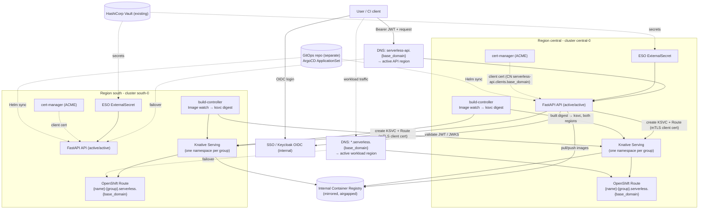
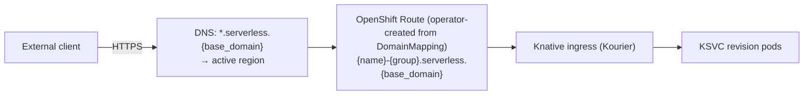
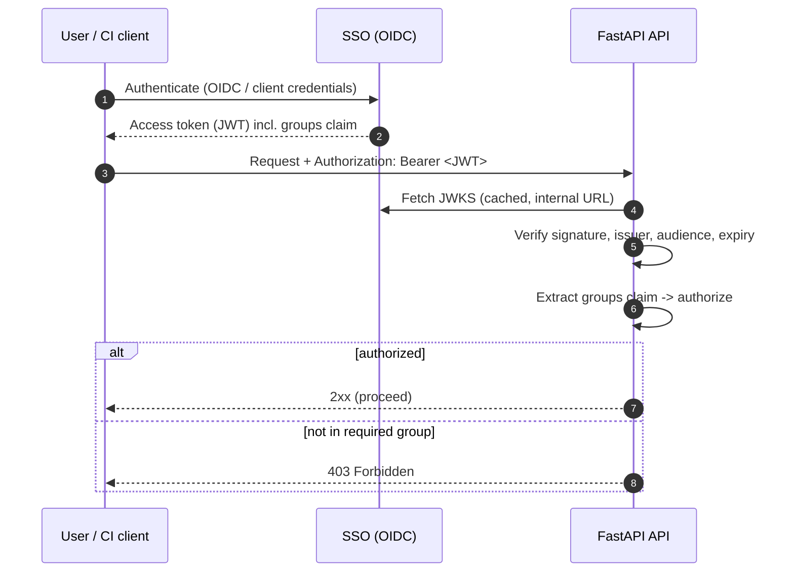
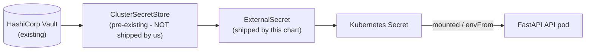

# Architecture & Design

How the platform fits together: goals, the multi-region model, networking,
authentication, secrets, and the REST conventions both offerings share.
Per-offering detail is in CONTAINERS.md and FUNCTIONS.md.

## Contents

- [Design Decisions (locked in)](#design-decisions-locked-in)
- [Overview & Goals](#overview--goals)
- [High-Level Architecture](#high-level-architecture)
- [Multi-Region (Active/Active HA) Design](#multi-region-activeactive-ha-design)
- [Tenant Namespaces](#tenant-namespaces)
- [Networking & Exposure](#networking--exposure)
- [Authentication & Authorization](#authentication--authorization)
- [Secrets Management](#secrets-management)
- [Airgapped Considerations](#airgapped-considerations)
- [REST API Specification](#rest-api-specification)
- [Streaming](#streaming)
- [Repository Layout](#repository-layout)
- [Open Questions / Future Work](#open-questions--future-work)

## Design Decisions (locked in)

| Topic | Decision |
|-------|----------|
| Deliverable | FastAPI app + Helm chart + CI/CD in this repo (GitOps `ApplicationSet` lives elsewhere) |
| FaaS build | **kpack** (Kubernetes-native Cloud Native Buildpacks), mirrored stack/store images for airgap - see BUILDING.md: Design Decisions (locked in) |
| Cluster auth | **cert-manager `Certificate` CR** (shipped in Helm chart) → client TLS cert; **CN is a DNS name** `serverless-api.clients.{base_domain}` (ACME-issued); that name is the Kubernetes user, bound via RBAC |
| Topology | **Two separate OpenShift clusters** ("regions") that **trust the same CA**. The **API runs active/active in both clusters**; a DNS record fronts the active API. **Workloads run on the same two clusters**, in one namespace per group. |
| Region selection | **Deploy to both regions on every deploy.** Each workload's **Route host is identical in both clusters**; a DNS record forwards to the active serverless region (active/passive at the traffic layer, active/active at the deploy layer). |
| Tenancy | **A namespace per group** (`{group}{suffix}`, default suffix `-serverless`), provisioned at runtime by the tenant controller; every resource is **also label-scoped** by SSO group, enforced by the API, as defense in depth |
| API authn | **SSO (Red Hat Build of Keycloak) OIDC** in front of the API |
| API authz | Based on **SSO group membership** |
| Secrets | **External Secrets Operator** - this repo ships **`ExternalSecret` only**, referencing a **pre-existing `ClusterSecretStore`** that points at **HashiCorp Vault** (API stores no secrets) |
| Route domain | Single platform wildcard **`*.serverless.{base_domain}`**; host `{name}-{group}.serverless.{base_domain}` (offering tracked as a label, not in the host) |
| CI/CD | **Helm** (this repo) + **ArgoCD** `ApplicationSet` (lives in a **separate GitOps repo**) |
| Environment | **Airgapped** - all images/deps mirrored to an internal registry; ACME via an internal ACME endpoint |

---

## Overview & Goals

### Problem statement

Customers need to deploy workloads without managing Kubernetes/OpenShift directly. They
want two consumption models:

- **FaaS** - "give us your source code, we build and run it." The client provides a Git
  repository URL, branch, an access token, and the source lives in that repo. Supported
  runtimes are **configurable** (the chart ships **Python, Go, Node**; see FUNCTIONS.md: Overview) and listed on
  `GET /api/serverless/v1/functions/info`.
- **CaaS** - "give us your image, we run it." The client provides a container image
  reference plus registry credentials (username + token).

Both models must run on **Knative Serving** (scale-to-zero, request-driven autoscaling) on
**OpenShift**, be reachable from outside the cluster via an **OpenShift Route**, and be
governed by enterprise SSO. Everything runs in an **airgapped** datacenter across **two
OpenShift clusters** for high availability. The **API itself also runs active/active on
those same two clusters** (fronted by a DNS record pointing at the active region), and the
**customer workloads run on the same two clusters**, each SSO group in its own namespace.

### Goals

- A single FastAPI REST API that abstracts Knative/OpenShift away from the customer.
- One API call deploys the workload to **both clusters**; the API is itself HA across both.
- Each workload exposed at a **single, cluster-independent Route host**, with DNS forwarding
  to the active region.
- Strong authn (SSO OIDC) and group-based authz.
- No secrets stored by the API; all secrets sourced from Vault via ESO.
- GitOps-managed (Helm + ArgoCD), reproducible, airgap-compatible.

### Non-goals (this phase)

- Cross-region traffic steering is handled **outside** the API by a **DNS record that forwards
  to the active serverless region** (the Route host is identical in both clusters). The API is
  not a GSLB.
- Billing/metering, quota enforcement, and a full observability stack (see ARCHITECTURE.md: Open Questions / Future Work).

### Glossary

| Term | Meaning |
|------|---------|
| **Knative Serving** | Knative component that runs request-driven, autoscaling (incl. scale-to-zero) workloads. |
| **KSVC** | A Knative `Service` custom resource (`serving.knative.dev/v1`). The top-level unit we create per workload. |
| **Revision** | An immutable snapshot of a KSVC; created on each spec change. |
| **Route (OpenShift)** | OpenShift `route.openshift.io/v1` object that exposes a service externally over HTTP(S). |
| **Region** | A region the platform deploys to (e.g. `central`, `south`); each runs one OpenShift **cluster** (e.g. `central-0`). |
| **SSO** | Red Hat Build of Keycloak - the OIDC identity provider. |
| **ESO** | External Secrets Operator - syncs secrets from Vault into Kubernetes Secrets. |
| **Tenant / group** | An SSO (Keycloak) group; the unit of ownership and isolation. |
| **kpack** | The Kubernetes-native Cloud Native Buildpacks controller that builds a function's source into an OCI image (BUILDING.md). |
| **`Image` (kpack)** | The kpack CR declaring one function's build. Not to be confused with a container image. |
| **`ClusterBuilder` (kpack)** | A cluster-scoped kpack CR composing a stack and a set of buildpacks into a builder image. One per runtime, referenced by the `Image`s in every group's namespace. |

---

## High-Level Architecture



**Reading the diagram:**

- The user authenticates against **SSO** and calls the API via the **`serverless-api`
  DNS record**, which points at the **active API instance** (the API runs active/active on
  both clusters).
- The serving API validates the token (JWKS from SSO), authorizes on the user's **groups**,
  then **applies the KSVC + Route to both clusters** using each cluster's **client TLS cert**
  (CN `serverless-api.clients.{base_domain}`) for authentication.
- Each workload gets the **same Route host in both clusters**; the
  **`*.serverless.{base_domain}`** DNS record forwards end-user traffic to the active region.
- Images come from the **internal mirrored registry** (airgap). The API's own secrets come
  from **Vault via an ESO `ExternalSecret`** (using a pre-existing `ClusterSecretStore`); its
  client certs come from **cert-manager (ACME)**; the API is deployed by **Helm**, synced by
  an **ArgoCD `ApplicationSet` that lives in a separate GitOps repo**.

---

### Shared capabilities (FaaS and CaaS)

Applied identically to both offerings; modeled on the KSVC pod spec.

#### Environment variables

Each `env` entry is `name` + `value`. A plain entry is set inline on the container;
an entry with `secret: true` has its value moved into an API-created Kubernetes
Secret (`{workload}-env`) and the container reads it via a `secretKeyRef` (the
value is never inline). The API does not expose `valueFrom` - users cannot
reference arbitrary existing cluster Secrets/ConfigMaps.

CA-trust defaults (`SSL_CERT_FILE`, `REQUESTS_CA_BUNDLE`, `CURL_CA_BUNDLE`,
`NODE_EXTRA_CA_CERTS`, `GIT_SSL_CAINFO`) are injected automatically, pointed at
the mounted trusted-CA bundle, so cross-language tooling trusts internal TLS with
no user action. They are transparent: a var the user sets themselves is left
as-is (their value wins), and the injected defaults are recorded in a
`serverless.platform/injected-env` annotation so they're hidden from the
workload's GET - listing them would make a GET body that cannot be sent
back unchanged.

#### Files (config & secret mounts)

Via the `files` field, a user uploads inline file content (`content`, with
`encoding: "base64"` when the string carries base64-encoded binary bytes rather
than the text itself) and its `mountPath`. Mounted files are always read-only -
Kubernetes mounts ConfigMap/Secret volumes read-only regardless of the pod spec,
so the API offers no flag it could not honor.

The API aggregates all non-secret files into one `{workload}-files` ConfigMap and
all secret files (`secret: true`) into one `{workload}-files` Secret - one
ConfigMap and one Secret per workload, a key per file - and mounts each at its
path via `subPath`. (No referencing of pre-existing cluster objects.)

#### Scaling options

Knative autoscaling annotations: `autoscaling.knative.dev/min-scale`, `max-scale`,
`metric`, `target`, and `scale-down-delay`. `metric` selects the scaling signal -
`concurrency` or `rps` (default KPA autoscaler, scale-to-zero capable) or
`cpu`/`memory` (HPA class, no scale-to-zero); `target` is the target value for
the chosen metric. When `target` is omitted the default is metric-aware: `100`
for `concurrency`/`rps`, but `70` for `cpu`/`memory` (these are a utilization
percentage, so we scale before saturation; values >100 are rejected).
Scale-to-zero is the default when `min-scale=0` (KPA metrics only).
`scaleDownDelay` is an optional Go duration (`30s`/`5m`/`1h`, capped by Knative
at 1h) that holds a revision up before scaling it down, smoothing bursty traffic.

These rules are surfaced verbatim on the per-offering
`GET /api/serverless/v1/{containers,functions}/info` (per-metric `minScaleFloor`,
target default/min/max/unit) - derived from the same model that validates a
create, so a client UI can render the form without drift.

#### Resource size

`size: small|medium|large` (default `small`) - a t-shirt size, so clients pick
capacity without Kubernetes units. Maps to container resources: memory is set
`request==limit` (a hard, predictable OOM boundary - exceeding it restarts that
replica), CPU is request-only (no limit, so workloads are never CPU-throttled).
`small`=100m/256Mi, `medium`=250m/512Mi, `large`=500m/1Gi. The CPU/memory request
is also what lets the `cpu`/`memory` autoscaling metrics compute utilization.

A canonical scaling sub-object in the API:

```json
{
  "scaling": {
    "minScale": 0,
    "maxScale": 3,
    "metric": "concurrency",
    "target": 100,
    "scaleDownDelay": "0s"
  }
}
```

### The workload engine and the `Offering` protocol

**One engine, two offerings.** A function and a container are the same
orchestration with a different tail, so the engine
(`api.services.workloads.WorkloadService`) never branches on which offering it
serves. Everything that differs - the response class, which derived Secrets are
pruned, the state an update carries forward (a function's git token), the build
status folded into a read, the cleanup after a delete - is a member of
`api.services.offering.Offering`, implemented once per offering and passed to
the engine per call. Adding an offering is implementing that protocol rather
than finding the branches. The engine is a process-wide singleton shared by
both, which is why the offering travels as an argument rather than being held
as state.

Routers hold one object per offering: a `FunctionService` or a
`ContainerService` (`api.services.offering_service.OfferingService`). The base
class fixes the offering at class level and forwards every read, stream and
delete; a subclass holds only what its offering adds. The forwarding layer is
what lets the routers depend on one object each and the test suite override it
in one place.

**The engine is one class in one file.** The orchestration in
`api.services.workloads.service` reads front to back in one place; only values
that stand on their own (`ApplyRequest`, the stream slot guard) live in sibling
modules, and the package re-exports the public names. What the engine
orchestrates is split so each part is testable without it: `manifests/` (pure
builders), `regions/` (fan-out and per-region I/O), `state/` (pure
interpretation) and the builder. `ApplyRequest` carries the whole apply input
as one value - the union of both offerings' needs, a container leaving the
build metadata `None` and a function the pull-secret manifest - so the
offering-specific tail reads as a group rather than as ever more parameters to
`apply_workload`.

**The pre-flight checks are engine methods.** `assert_*`, `host_for` and
`validate_spec` are thin delegations to `api.services.regions.preflight`, kept
on the engine because that is the object the offering services and the routers
already hold. `provision_namespace` is called from the engine instead of from
`preflight` (ARCHITECTURE.md: Tenant Namespaces), because `preflight` is pure
cluster probes and an HTTP client in it would drag that dependency into every
test that only wants to check a host.

**One namespace resolution point.** `WorkloadService.namespace_for` is the only
place in the API a group becomes a namespace - it defers to the shared
`TenantNamespaceConfig.namespace_for` - and every read and every write goes
through it, so "where does this land" has one answer per request and no caller can bind
a namespace of its own. `Deployer.resolve_targets` then binds that namespace
into every cluster view for the request, so downstream code cannot mix
namespaces. Registries are read off those resolved clusters
(`target_registries`) rather than resolved a second time from settings: one
answer per region instead of two snapshots of the same configuration that can
drift apart.

**Work happens only when something actually changed.** `retag_build` compares
the stored tag before touching anything, so the guard costs one GET per region
per write and a registry delete happens only when a tag really moved.
`DeleteContext` is one value rather than a `(cluster, object name)` pair,
because cleanup after a delete reaches past the cluster: the registry addresses
a function by `{group}/{name}`, not by the object name. A function's runtime is
checked against the kpack `ClusterBuilder` it names rather than merely against the
ConfigMap entry (`FunctionService._assert_runtime`), which turns a
mounted-ConfigMap problem into an immediate, accurate `400`; left to the build
path it would surface minutes later as a failed background deploy, reading like
a broken build rather than broken configuration. That runtime registry is a
constructor argument rather than the process-wide one, because reaching for
module state would make the service depend on state only `api.dependencies`
owns and would create an import cycle with it.

**A group's build states are read in one call.** `FunctionOffering.build_states` reads
every function's build state in a group with one label-selected read, so a listing of
twenty functions does not cost twenty kpack reads per poll.

**A `202` already sent cannot report a failure.** `ContainerService.pull` logs
a pull that failed in every region, because the `202` went out long before the
patch ran: without the log line an all-regions-failed pull completes silently
and the client's `statusUrl` simply never shows a new revision. For the same
reason `accept_pull` derives the host when the stored annotation is missing - a
workload written before that annotation existed still has a host, and it is the
derived one - rather than answering the `202` with an empty `hostname`.

### Names and manifests

The host and object-name conventions themselves are set out under
ARCHITECTURE.md: Networking & Exposure; what follows is where those rules live
and why they live there.

**One place per rule.** The platform-wide rules for a name and a group live in
`cloudlet_apis.names`; `common.names` re-exports them and keeps only what this
platform derives - object names, image and cache repositories, the OCI tag
projected from a branch, and the validators - because that is the half that
changes when the build pipeline changes. `DNS1123` is imported rather than
redeclared so a second copy of the regex cannot drift, and the image-reference
regex is assembled from named parts so each rule of the OCI grammar stays
legible.

**Label values are sanitized with an ASCII test, not `isalnum()`.**
`isalnum()` is Unicode-aware while a label value is restricted to ASCII
`[A-Za-z0-9._-]`, so an SSO username with one accented character would
otherwise fail every apply with a `422` long after the request was accepted
(`common.labels._sanitize`). ConfigMap and Secret keys are sanitized the same
way (`manifests.files._key`), and keys that collide are rejected rather than
merged, because two distinct mount paths can fold onto one key and merging them
silently would mount one file's content at another's path. The offering label
values (`OFFERING_FUNCTION`, `OFFERING_CONTAINER`) sit in `common.labels`
beside the label key, because the same string is the label, the kind in the URL
path and the response `type`, and a service that only reads labels - the build
controller - still has to know them.

**The builder decides what the API server would refuse.** Both a ConfigMap's
text and binary fields mount identically, so callers should not have to care
which one their file lands in; but a non-UTF-8 byte written into `data` is
rejected by the API server or corrupts the file, so `resources.build_configmap`
makes the split itself.

**A read describes the workload, not the manifest.** `summaries.merge` lists
the object name verbatim and does not strip a `-{group}` suffix: `api-team` in
group `team` would list as `api`, and the GET that followed would `404`. A
workload with no stored port reads as `8080` rather than `null`: every workload
this version writes stamps a port, so a missing one means the workload predates
that, and 8080 is genuinely the port it serves on because it is what Knative
injects when none is declared. (`build_ksvc` still honors `None` for a direct
caller, leaving the choice to Knative.) The platform-injected CA-trust
variables are hidden from the same read for the same kind of reason
(ARCHITECTURE.md: Shared capabilities).

**Interpretation is pure.** Everything in `api.services.state` takes objects
the caller already fetched and returns a value, so the rules can be exercised
by handing them a dict - no cluster and no fake client. Ownership is a
predicate rather than a handler, because every read path asks the same question
but does something different when the answer is no, and it lives apart from
`ksvc_state` because weighing an object against a caller is a different kind of
rule from interpreting the object.

### Control loops and their pacing

**One paced loop for both controllers.** `common.loop.run_loop` is shared by
the build controller and the tenant controller, so a hardening fix - jitter, a
backoff cap, shutdown handling - lands once rather than in whichever copy the
incident happened to point at; the pacing contract is stated once in
`LoopSettings`, which both controllers' settings subclass. The floor
(`MIN_PASS_SECONDS`) bounds the whole **pass**, not the sleep, because a pass
that ends instantly - a watch closed at the door, an empty reconcile - would
otherwise degenerate into back-to-back LISTs at full speed against the
apiserver. Backoff is exponential, capped at 60s and reset by a clean pass, so
a transient failure retries promptly while a sustained outage retries at a
doubling interval instead of hammering an apiserver that is already struggling.

**Timeouts are named for what they bound.** `cluster_op_timeout` carries the
`cluster_*` prefix like the socket timeouts because it bounds work against one
cluster, whatever region carries it. The provision-call budget
(`TenantNamespaceConfig.timeout`) is deliberately shorter than it, because a
create waits on that call and its timeout has to be tighter than the general
cluster-operation backstop.

---

## Multi-Region (Active/Active HA) Design

The platform deploys **every** workload to **both** OpenShift clusters (Region A and Region B)
on each create/update, and the **API itself runs active/active on both clusters**. Because
both clusters **trust the same CA** and the workload **Route host is identical in both**,
each region is a full, independent replica; a DNS record forwards end-user traffic to the
active region.

The **client certificate, CA bundle, and tenant-namespace suffix are global** (the same in
every cluster), so a region profile is just its name and its cluster - the API server URL is
**derived**, not configured. A workload's namespace is derived too:
`{group}{tenantNamespaces.suffix}`, identical in both clusters. The `routeDomain`,
`tenantNamespaces.suffix`, client cert directory, and CA bundle are shared config:

```yaml
baseDomain: example.com                   # each region's API server derives from this
routeDomain: serverless.{base_domain}     # shared; same host in both clusters
tenantNamespaces:                         # a group's workloads live in {group}{suffix}
  suffix: -serverless                     # global; read by the API and the tenant controller
clientCertDir: /etc/serverless/client     # tls.crt/tls.key (cert-manager), global
caBundle:                                 # OpenShift-injected, global
  configMap: ca-bundle
  key: ca-bundle.crt
  mountPath: /etc/ssl/certs
regions:
  - name: central                          # region/region
    cluster: central-0                     # cluster instance
  - name: south
    cluster: south-0
```

> **There is no per-region `apiServer`.** Each region's endpoint is composed as
> `https://api.{cluster}.{baseDomain}:6443` (`common.cluster.Cluster`), so the cluster name
> is the only thing that varies and a region cannot be pointed at an endpoint that
> contradicts its name. `local_region` names the region this instance sits in (matched on the
> region name first, then the cluster name).

> The API always authenticates with the **client certificate** (no in-cluster/ServiceAccount
> path) - uniform whether it's talking to its local cluster or the peer over its external API
> endpoint. Because `regions` carries no secrets, it can be sourced from a ConfigMap.

### Fan-out & status aggregation

- The API holds **one Kubernetes client per region** (built from that region's client cert + the
  shared CA).
- On deploy, it applies the KSVC + Route to both regions **concurrently** (async / thread
  pool), then **aggregates** per-region results. The workload `hostname` is the **same host**
  in both regions; only the per-region readiness differs:

```json
{
  "name": "orders-api",
  "group": "team",
  "type": "container",
  "hostname": "orders-api-team.serverless.example.com",
  "regions": [
    { "region": "central", "status": "Ready", "revision": "orders-api-00001" },
    { "region": "south", "status": "Ready", "revision": "orders-api-00001" }
  ],
  "status": "Ready"
}
```

- **Admission is reserved for every target before any region starts**
  (`Deployer.fanout`, `ReadPool.reserve`). Shedding half way through would leave the
  regions already running burning pool slots for a result the `503` discards.
- **Per-region status comes from the apply response, not a re-read.** Server-side
  apply returns the stored object, which is already trusted enough to source the
  `ownerReference` every derived resource hangs off. Knative has not reconciled
  microseconds later, so a second GET would report the same pre-reconciliation state at
  the cost of an extra round trip on every region of every deploy: a workload just
  written reading as `Deploying` is the right answer.
- **Results are returned, not written into shared state.** A per-region fetch returns a
  value (`_RegionRead`) and the fan-out keeps target order, so a region the fan-out gave
  up on is simply absent from the reads with only its timeout row present. Writing into
  dicts shared across worker threads would mean snapshotting them against a late write
  from a region that had already timed out.
- **The per-region write ordering lives in `region_apply`.** Each ordering constraint is
  local to one cluster and prevents a specific failure: a stale Secret outliving the spec
  that dropped it, an orphaned resource whose owner was never applied, a half-built create
  holding a name. A build-object apply that fails raises (`apply_build_objects`), because
  the image would never be built and the function's tag is one nothing pushes;
  `delete_build_objects` runs on every delete even though it is normally a no-op, because
  it collects build objects applied unowned before builds followed the workload into its
  namespace - nothing else collects them, and failing a delete over one would report a
  workload as undeleted when it is gone.
- **Secret reads fail loud; decoration reads are best-effort.** `region_read.secret_data`
  turns a non-404 failure into a `503` rather than `{}`: an empty dict makes a valid
  "keep" look unset and fails the update as a `400`, silently losing a stored secret,
  where a `503` lets the client retry. Values are read as bytes, since a secret file may
  hold a keystore or a DER certificate that cannot survive a round trip through `str`, and
  a stored value that is not valid UTF-8 is skipped rather than guessed at, because it
  could not have been written through this API. The revision, usage and spec reads degrade
  to a null field instead, because a status is still worth returning without them.
- **The usage read reports whether it happened.** `RegionUsage.measured` exists because a
  cross-region total needs it where the other best-effort reads do not: they degrade to a
  visible null on the failing region, while a total summed over a region that did not
  answer is just a smaller number that still looks authoritative. The quantity parse sits
  inside the same guard as the read, so an unrecognized quantity form (Kubernetes may
  render one in decimal-exponent notation) cannot turn a healthy workload into a `Failed`
  region.

### Pre-flight: what is checked before a write

**Host and name are checked in one fan-out.** `preflight.assert_deployable` answers "is
this host free" and "is this name unused" in one visit per region. Two fan-outs would cost
two cross-region round trips per deploy and, worse, describe two different instants; asked
together, a region's two answers cannot disagree about the moment they were taken.

**The check is not atomic with the apply, on purpose.** The apply is a separate operation,
so a peer can claim the host in between. The guard exists to make that window small and the
failure loud, which is why `apply_workload` re-runs it immediately before mutating instead
of trusting the accept-time result.

**A host conflict is reported before a name conflict.** The host conflict is the one an
idempotent apply would otherwise resolve silently, by hijacking another workload's
`DomainMapping`.

**The host owner is found with a field selector, and the conflict names holder and
namespace.** `_host_owner` narrows a cluster-wide question to the single `DomainMapping`
that could answer it, so it stays one small query rather than a page of every mapping on
the platform. The message names the holder and its namespace because the owner can live in
another group's namespace, which the caller cannot see, and a bare "already assigned" would
be a dead end to debug.

**A default host label that does not fit is a `400` that suggests a `hostname`.** A name
and group that do not fit together in `{name}-{group}` are a reason to supply an explicit
`hostname`, not a reason the workload cannot exist. The check lives in
`preflight.resolve_host` and runs on the create path only; `route.host_for` composes the
host without it, because read paths recompute a default host for workloads that already
exist and a read is no place to discover a create-time rule.

### Partial-failure semantics

Create and update are **asynchronous**: the pre-flight runs synchronously and the call
returns `202` with `status: "Pending"`, so the outcome of the fan-out is observed by
polling `GET {statusUrl}` (or `/stats`), not from the status code of the write.

| Scenario | What the poll reports |
|----------|-----------------------|
| Every region succeeds | `status = Ready`. A mixed `Ready` + `Deploying` is a normal rollout with one region ahead, **not** a failure. |
| One region fails | `status = Failed`; that region's entry in `regions[]` carries the `reason`/`message` pair. The succeeded region is **left running** (HA prefers availability), and DNS keeps serving from the healthy region. |
| Every region fails | `status = Failed` with an error on every region. The background deploy raises `REGION_TOTAL_FAILURE` internally; it is logged with the request id rather than returned, because the caller already holds a `202`. |

Re-apply is idempotent (server-side apply), so a retry heals any partial state.

The **synchronous** read paths do surface these as status codes: a listing whose every
region is unreachable is a `502 REGION_TOTAL_FAILURE` with the per-region errors in `details[]`,
and a single `GET`/`DELETE` that cannot confirm a workload's absence because a region was
unreachable is a `503` rather than a misleading `404` (a missing answer is not evidence of
absence).

- **An unavailable region does not freeze the API.** Per-region work runs concurrently in
  threads; every cluster call has a **connect/read timeout** and each region has an overall
  **operation timeout backstop**, so a down/slow region fails fast and is reported as
  `Timeout`/`Failed` (it doesn't block the healthy region or other requests). Health probes
  never touch clusters. (See `cluster_connect_timeout` / `cluster_read_timeout` /
  `cluster_op_timeout` / `cluster_read_op_timeout`.)
- Operations are **idempotent** (Kubernetes **server-side apply** by object name), so a
  client can safely retry to heal a degraded deployment.
- **Every region builds what it runs**, into its own registry, and publishes only to itself
  (see FUNCTIONS.md: FaaS - Function as a Service). The two regions run the same *commit*,
  not the same digest: builds are not bit-reproducible, and the independence is what a
  switchover needs (BUILDING.md: Active/Active Behaviour).

> Cross-region traffic steering is handled by the **`*.serverless.{base_domain}` DNS record
> forwarding to the active region** - not by the API.

### The read pool

**Cluster reads run on a bounded pool of their own.** On the process-wide default
executor - sized by a formula, shared with everything, with an unbounded queue - a burst of
page reads (a console tab polling row stats) makes unrelated requests inherit its latency
invisibly. `api.services.regions.read_pool.ReadPool` is sized from `cluster_read_workers`,
and admission past `cluster_read_workers + cluster_read_max_queued` is refused with a
`503`: shed load is visible, a silently growing queue is not.

**Saturation has its own exception type.** `ReadPoolSaturated` lets the fan-out tell the
API's own saturation (this request's `503`) from a `ServiceUnavailableError` a region
function raised doing its work (that region's failure row). The two must not be conflated.

**A slot is released when the thread finishes, never on cancellation.** The executor cannot
interrupt a thread, so a read the caller's `wait_for` gave up on is still occupying its
worker. Released on cancellation, a stalling region would fill the pool with zombie reads
while the accounting reported it empty, and the `503` shedding would never fire. The
release therefore hangs on the concurrent future's done callback rather than on the asyncio
wrapper: `run_in_executor`'s wrapper acknowledges a cancel immediately even while the
thread runs on, so a callback there - or a `finally` on the await - would free the slot the
moment the caller gave up.

### The per-region cluster client

Fan-out runs on these clients, one per region, and everything below is what keeps a slow or
silently dead cluster from becoming this API's problem.

**A `Cluster` is a cluster, not a namespace.** Every namespaced operation on
`common.cluster.client.Cluster` names its namespace explicitly, so where a write lands is a
deliberate choice at the call site rather than an inherited default. Code working within one
namespace binds it once through `NamespacedCluster`, so downstream code cannot mix
namespaces mid-operation.

**Lazy clients are built under a lock.** A `Cluster` is shared, and its first use routinely
happens on several fan-out threads at once. Unguarded, two threads each build an
`ApiClient` and the loser's connection pool is never closed - a socket leak per race - plus
a discovery-cache race for the dynamic client. Callers may `connect()` eagerly at startup so
the first request does not pay for API discovery.

**The connect timeout is installed by wrapping `pool_manager.request`.** Setting
`connection_pool_kw["timeout"]` would not work: urllib3 consults the pool default only for
its own sentinel, and `kubernetes.client.rest` always passes `timeout=` explicitly - `None`
for a call with no `_request_timeout`, which resolves to no timeout at all. Discovery and
the watch are exactly those calls (`common.cluster.pool._default_connect_timeout`).

**Streams carry no read timeout; keepalive bounds them instead.** A watch and a log follow
are idle between bytes by design, so a read timeout would tear a quiet stream down. That
leaves them with no defense against a connection that dies silently - a NAT or conntrack
entry expiring, a load balancer dropping it without RST - over which no server-side timeout
can arrive. TCP keepalive options on every pool make the kernel probe an idle connection
after 30s and give up within about a minute more, so a wedged watch costs minutes rather
than a reconcile loop stuck until restart. The options are added to urllib3's defaults
rather than substituted for them, because those defaults carry `TCP_NODELAY`.

**Closing a follow closes the socket and releases the connection.** `LogFollow.close` calls
both `close` and `release_conn`, and neither replaces the other: closing the socket is what
interrupts the pending read on the follower thread (ARCHITECTURE.md: A held-open stream
holds a thread), and releasing is what stops the pool holding a connection that will never
be reused. Failures are swallowed, because this only runs while tearing a stream down,
where there is nothing left to report to.

**Field selectors are applied by the apiserver.** `Cluster.get` accepts a `field_selector`,
so a cluster-wide question about one object stays one narrow query instead of a page of
everything filtered client-side - which is what the host pre-flight asks.

---

## Tenant Namespaces

Each SSO group's workloads - and their builds, config Secrets and credentials - live in the
group's own namespace, **`{group}{suffix}`** (default suffix `-serverless`), in both
clusters. The name is resolved in exactly one place (`TenantNamespaceConfig.namespace_for`),
read by both ends. The namespace is the hard tenancy boundary; the API's group checks and
the ownership labels of ARCHITECTURE.md: Group-based authorization (tenancy) stay as defense
in depth - they are what makes each resource attributable inside the namespace it lands in.

Namespaces are created at runtime by the **tenant controller** (`tenant_controller/`, its
own Deployment and image), because the group set is SSO data Helm cannot render. It is a
separate deployment for privilege separation: creating namespaces and writing RBAC is
cluster-scoped power the internet-facing API must not hold - the API cannot create a
namespace, and the tenant controller cannot touch a workload.

**What lands in a tenant namespace** comes from the **tenant template set**: ConfigMaps the
chart renders (final YAML with `{{namespace}}`/`{{group}}` placeholders, plus
`{{region}}`/`{{registry}}` for the two per-region values) and the controller applies per
namespace. The operator's day-2 workflow stays *edit values → Argo sync*: the set's hash is
stamped on each namespace, and a hash mismatch triggers re-apply. Today the set carries the
CA-bundle ConfigMap, the default-deny NetworkPolicies, the API's RoleBinding, and the build
prerequisites (SCC RoleBinding, registry credentials).

The controller has three jobs:

- **Provision** (`PUT /groups/{group}/namespace`, internal-only): called by the API before
  every accepted deploy, it converges the group's namespace in **every** region - a create
  must not land in a region whose namespace does not exist. Fails closed: an unreachable
  controller or an unconverged region refuses the deploy (503). A namespace already stamped
  with the current hash costs one read per region.
- **Reconcile** (level-triggered loop, **local cluster only**): converges every managed
  namespace whose stamp is stale, which is how a `helm upgrade` reaches namespaces Argo
  cannot see. Local-only so the two sites never fight during Argo sync skew.
- **Namespace GC** (periodic sweep, local, off by default): a namespace continuously empty
  of workloads past the grace period is deleted; a workload appearing clears the clock, and
  the `serverless.platform/keep` annotation always wins. See `tenantNamespaces.gc`.

`kubectl get ns -L serverless.platform/group` with the template-hash annotation answers
"has the new policy reached every tenant"; the per-converge log line is the audit trail.

### The loop is local-only; provisioning reaches both clusters

Each tenant controller converges **its own** cluster from its own cluster's ConfigMap, so
the two sites never fight while Argo has one synced ahead of the other - the same rule the
build controller follows (BUILDING.md: Digest propagation). The reconcile loop therefore
takes only the local cluster, because converging a peer from here is exactly what the
local-only rule exists to prevent. The **provision** API exists beside that loop because the
one thing a per-cluster loop cannot fix in time is a create landing in the region whose
namespace does not exist yet.

**Writing a peer's namespace is sound only because the set is region-neutral.** Both regions
render the template set from the same chart and values, so the bytes and the hash are
identical. `region` and `registry` are placeholders rather than chart-rendered values for
that reason: a per-region value baked in at chart render would mean the two sets never share
a hash, and a provision writing a peer's namespace would write the wrong region's value.
During an Argo sync-skew window the peer's own loop pulls its namespace back to the set that
cluster holds - a legitimate convergence that ends when the sync lands, and the reason a
per-region value must never enter the set.

### Converging a namespace

**Every converge step is unconditional.** `converge` has exactly one shape, so a caller
cannot skip the opening apply - which is also the write that creates the namespace - on a
stale read of someone else's stamp. The namespace name is passed in rather than derived
inside `converge`, so a changed suffix setting cannot strand namespaces that already exist,
and the target's name overrides the template's, because a template naming something else
would create a second namespace mid-converge.

**An empty or `Namespace`-only set is refused everywhere it could act.** A set whose files
render to nothing reads as a truncated ConfigMap, and obeying it would prune every tenant
namespace bare. `converge` raises before any write so the stamp stays intact and the next
pass retries; `reconcile_all` refuses an empty set, because mounted-but-empty is
indistinguishable from a broken mount; and readiness re-checks the render gate, because
otherwise a truncated ConfigMap leaves the pod in rotation and turns every provision into a
`502` that blames the regions for this pod's own bad mount. Parse failures name the file,
since an operator reading the loop's backoff log needs the ConfigMap key to fix.

**One namespace's failure does not end the pass.** `reconcile_all` counts and skips a
failing namespace rather than aborting - the same rule as tag GC (BUILDING.md: Registry tag
GC), since an aborting error would deterministically starve every namespace after it. A
managed namespace with no group label counts as a failure rather than being converged
blind, because it is state a human made. An all-failed pass raises: that is one cause rather
than many, and it should take the loop's error backoff instead of a full resync sleep. The
pool is shut down with `cancel_futures`, so a SIGTERM mid-pass drops the queue instead of
working through every namespace already submitted - the pod has a grace period to respect.

### The provision call

**Provisioning is a `PUT`, and it returns the namespace.** The caller states a desired end
state rather than asking for a job: the API calls it before every create and retries on
timeout, so "safe to repeat" belongs in the method itself. Re-applying an already-converged
group is how the caller learns it is converged to *this* template hash rather than last
release's. The response carries the namespace so the suffix rule has exactly one authority;
the controller reads that suffix from settings and never from a module default, because
deriving it two ways would provision `{group}-serverless` while the API deployed into
`{group}{suffix}` - the exact split the shared configuration block (`TenantNamespaceConfig`)
exists to prevent.

**A namespace that cannot be confirmed is a `503`, not a create that proceeds.** The
provision call is a pre-flight, and a check that could not be run has not passed
(`api.services.tenant_namespace.provision_namespace`). Where no controller is configured - a
dev cluster, where the namespace is whatever the operator made by hand - the call is skipped
and the skip is **logged**: skipping is a decision, and a decision should not be silent.

**The shared token is depth, not the primary control.** An empty token setting disables the
check, because the NetworkPolicy is the primary control and a dev cluster has no Vault to
take a token from.

**Converges and provisions run on pools of their own.** Converges are independent per
namespace (the stamp is per namespace), so a template rollout over many tenants is bounded
by `converge_workers` rather than serialized. The provision API has its own
`provision_workers` pool, separate from the loop's and from the server's threads: it bounds
how many converges a burst of creates can have in flight, and it is why a slow region cannot
reach the server's threads and starve the probes.

**The loop and the provision API share one process.** They share the cluster clients and the
mounted template set, which is the whole reason they are not two deployments; the clusters
are passed into `create_app` rather than built there, because two sets would mean two pools
of connections to the same API servers. The API runs on a background thread so SIGTERM
unwinds the loop, and startup is awaited so a server that cannot bind is discovered at boot
rather than by the first provision - the failure crash-loops the pod, which is visible,
instead of leaving the loop running beside a dead API with nothing in the log to say why.
The join budget is deliberately longer than uvicorn's graceful-shutdown budget, or it would
expire just as the server is finishing and the caller would close the cluster clients out
from under an in-flight converge.

**The chart-to-controller seam is checked before a tenant meets it.**
`dev/tenant_templates.py` follows the Deployment's projected volume rather than guessing
ConfigMap names, so a Deployment that projects a ConfigMap the chart does not render fails
there instead of as a pod that will not mount, and it exits on a missing volume or ConfigMap
because silently checking nothing is the one outcome it must not have. Until the chart that
writes the set and the controller that reads it meet, a malformed NetworkPolicy or a
mistyped placeholder would otherwise be discovered by the first tenant onboarding.

---

## Networking & Exposure

- This runs on **OpenShift Serverless** (the Operator-installed Knative). The Serverless
  Operator's ingress controller **automatically creates the OpenShift `Route`** for each
  Knative ingress - so the platform requirement "every workload is exposed via an OpenShift
  Route" is satisfied **by the operator**, not by the API hand-creating Routes.
- A bare KSVC would only get a Route under the **per-cluster** default domain (`apps.<cluster>`),
  which differs between regions. To get **one stable, cluster-independent host**, the API creates
  a **`DomainMapping`** for `{name}-{group}.serverless.{base_domain}` in **each** cluster; the
  operator then provisions the Route for that host. A **`*.serverless.{base_domain}` DNS
  record forwards to the active region**.
- **TLS:** the custom host is covered by a **wildcard cert for `*.serverless.{base_domain}`**
  (provided to the DomainMapping / ingress); the operator-created Route is `edge`-terminated.

#### Route host convention (recommendation)

Use a **single platform wildcard domain** and put the tenant in the subdomain - do **not**
split FaaS/CaaS into separate domains:

```
{name}-{group}.serverless.{base_domain}
e.g. orders-api-team.serverless.example.com
```

Rationale: the host must be **identical in both clusters** (DNS forwards to active), so it
must be a custom platform domain anyway; FaaS-vs-CaaS is a build-time detail the consumer
shouldn't see in the URL; and one wildcard domain means **one wildcard cert + one DNS zone**
to manage. The offering (`function`/`container`) is tracked as a **label**, not in the host. The
`{group}` in the default host keeps hosts unique platform-wide - DNS is global even though
namespaces are not - and makes ownership obvious. The pair `{name}-{group}` must fit one
DNS label (63 chars) **for the default host only**; a caller-supplied `hostname` lifts the
limit (published on `/info` as `naming`).

**Object naming.** The OpenShift name of the workload (KSVC) and all its derived resources
(`{workload}-env` Secret, `{workload}-files` ConfigMap/Secret, pull secret) is plain
**`{name}`** - the group's namespace scopes it, so the platform's primary key is
**(namespace, name)** and the same name can exist in two groups. The **host** carries the
pair: `{name}-{group}` is the default host's first DNS label, because the route domain is
shared by every group. `{group}` in both the namespace and the host is the **normalized**
group (ARCHITECTURE.md: Authentication & Authorization), so a group written `My_Team` in SSO
appears as `my-team` in the namespace and in the host alike.

**Custom hostname.** A client may override the host with a `hostname` field. Because the
`DomainMapping` name *is* the host, the API **validates the hostname is not already assigned**
to another workload before deploying (checked across both regions); a clash returns **409
Conflict**. The chosen host is recorded on the KSVC via the `serverless.platform/host`
annotation so reads can report the URL.



#### Workload network isolation (NetworkPolicies)

Every tenant namespace gets **default-deny** `NetworkPolicies` - the chart renders them
into the tenant controller's template set, which applies them to every group namespace -
then reopens only the paths Knative + OpenShift need. Net effect: a workload pod **can't
talk to another workload pod** - not even in its own namespace, so there is no cross-tenant
lateral movement within a group namespace or across them - or reach other
namespaces, and its egress is constrained:

- **Ingress** - allowed only from the configured system namespaces (Knative activator +
  Kourier ingress, the OpenShift router, monitoring). Same-namespace pods are *not* selected,
  so pod-to-pod ingress stays denied.
- **Egress** - DNS (`openshift-dns`), the platform API namespace ("our side") + the Knative
  control plane, and **off-cluster** destinations (LBs/Routes/external services) with the
  cluster-internal CIDRs excluded, so pods reach platform services via a Route/LB rather than
  directly. All namespaces/CIDRs are values (`networkPolicy.*`), verified per cluster.

#### API Route

The Route that exposes the **API itself** is values-driven: `route.host` (defaults to
`serverless-api.{base_domain}`), plus optional `route.labels` and `route.annotations` (e.g.
HAProxy router timeouts or rate-limit annotations). This is distinct from the per-**workload**
host convention above.

The API need not be at the root of that host: `basePath` is the path the whole of it
is served under, so it can share a host with other platform APIs (REST API
Specification, below).

---

## Authentication & Authorization

Two distinct identities are involved:

1. **End-user → API:** OIDC bearer token from **SSO**.
2. **API → each cluster:** **client TLS certificate** issued by **cert-manager** (ACME),
   whose **CN is the DNS name `serverless-api.clients.{base_domain}`**; that name is the
   Kubernetes user, bound by RBAC.

### End-user authentication (SSO OIDC)



- The API is a **resource server**: it validates JWTs offline using **JWKS** fetched from
  the internal SSO realm (cached, no per-request round trip).
- Validated: signature, `iss`, `aud`, `exp`/`nbf`.
- This covers both **users** (authorization-code flow) and **machines/service accounts**
  (client-credentials grant) - any client with a valid SSO bearer token authenticates the
  same way.

#### The Swagger "Authorize" client (and realms that forbid public clients)

Because the API is a resource server it registers **no OAuth client of its own** to serve
traffic. The one client the platform needs is for the interactive docs: Swagger UI's
"Authorize" button, which logs in with **Authorization Code + PKCE** and therefore needs no
secret - which is precisely what makes it a **public** client.

Where the SSO realm forbids public clients, set `SERVERLESS_SSO__SWAGGER_CLIENT_SECRET`
(Vault -> ESO, `swagger-client-secret`). The browser still runs the authorization leg
against SSO with PKCE, but posts the code to **`POST /api/serverless/auth/token`** on the API, which adds
the secret and completes the exchange **server-side** - so the client can be registered
**confidential** and the secret never reaches a browser. Unset, the public-client flow is
used unchanged.

That endpoint is unauthenticated by necessity, so it only ever completes a login:
`authorization_code` and `refresh_token` are the only grants forwarded, and the client id
and secret come from configuration rather than the request. Register the client with
Standard Flow on, PKCE required (`S256`), and **Service Accounts and Direct Access Grants
off**.

**The redirect URI carries the base path.** Swagger's callback is
`https://{host}{basePath}/docs/oauth2-redirect`, so the Keycloak client's valid redirect
URIs must list that exact path - changing `basePath` moves it. Registering the old one, or
only the host, fails the login with `invalid_redirect_uri` after the user has already
authenticated, which reads as an SSO outage rather than a configuration gap.

Note what this does *not* do: the user's own tokens still reach the browser, since Swagger
UI calls the API with them. It keeps the **client secret** server-side, which is what the
public-client rule is about - it is not a BFF holding tokens in a server-side session.

#### Static API keys (admin/operator automation, non-OIDC)

For **admin** automation that can't do OIDC, the API also accepts a **static admin API key**
in the **same `Authorization: Bearer <key>` header**. The API distinguishes the two by shape:
a structural JWT (`header.payload.signature`) is validated as an OIDC token; an opaque token is
compared against the single configured admin key. The key is the **raw token** (not a hash),
sourced from Vault via ESO into `SERVERLESS_ADMIN_API_KEY` and matched with a **constant-time**
compare (`cloudlet_apis.auth.verify_admin_key`). A match yields an **admin** Principal (the key is admin-only;
regular users go through OIDC). It defaults to empty, which **disables** key auth; set the env
var to enable it.

#### Auth as a shared library (not a separate microservice)

All OIDC interaction is encapsulated in a **self-contained auth component the API imports**
(`cloudlet_apis.auth`, from the shared `cloudlet-apis` package), **not** a separately-deployed
microservice. Because token validation is **stateless** (verify signature against cached JWKS +
read claims), there is no shared state to centralize; a standalone auth service would only add
a network hop, another deployment to secure in both clusters, and a failure point. The
component owns:

- SSO OIDC discovery + **JWKS fetch/cache** and **token validation** (`TokenValidator`),
- **claims → group** mapping and admin/tenant policy (`principal_from_claims`, `Principal`),
- **stream tickets** (`StreamTickets`) - the short-lived signed credential a browser opens an SSE
  endpoint with, since `EventSource` cannot send a header (ARCHITECTURE.md: Streaming),
- the **`SSOAuth.require_auth`** dependency (and the `CurrentUser` annotation) the routers
  use; per-group authorization is asserted in the service layer (`assert_group`).

It is a library rather than a copy in each API for the same reason group names are
normalized in one place: two APIs disagreeing about which groups a token carries is an
authorization bug, not a formatting one. What stays in this repository is `api/auth/deps.py` -
**which of this service's settings** the component is built from - and the SSO defaults in
`api/core/config.py`. The shared package requires an issuer rather than defaulting to one,
so the value deciding whose signatures we trust is always a deliberate choice here.

> If auth-at-the-edge is ever wanted (to keep tokens out of app code / defense-in-depth), the
> OpenShift-native drop-ins are **oauth2-proxy** or **Authorino** as a sidecar/gateway - an
> infra change, not an API rewrite. (See ARCHITECTURE.md: Open Questions / Future Work.)

### Group-based authorization (tenancy)

- Tenancy is **a namespace per group** (ARCHITECTURE.md: Tenant Namespaces), and every
  resource the API creates is labeled as well, so ownership is legible inside a namespace and
  selectable across regions:

  ```yaml
  metadata:
    labels:
      serverless.platform/group: "<keycloak-group>"
      serverless.platform/managed-by: "serverless-api"
      serverless.platform/owner: "<sub or preferred_username>"
      # every resource created for a function/container also carries the workload name:
      serverless.platform/workload: "<function-or-container-name>"
  ```

  Every resource the API creates for a function/container (KSVC, Route,
  DomainMapping, the `{workload}-env` Secret, the `{workload}-files`
  ConfigMap/Secret, and the imagePullSecret) carries **both** the SSO group label
  and the workload-name label, so it is unambiguously attributable and selectable.

- The caller **explicitly chooses the group** to act as on every request - it is a **path
  segment** (`/api/serverless/v1/groups/{group}/...`) on every endpoint, so the same group scopes reads,
  writes, and deletes uniformly and never appears in a request body. The API
  **asserts the caller is a member** of that group (from the **`groups` claim**); otherwise
  `403`. This makes the acting group unambiguous for users in multiple groups. Authorization
  rules:
  - **Create/Update:** the workload is named `{name}` in the group's namespace and stamped
    with that group label.
  - **Read/Delete by name:** the request targets `{name}` in the group's namespace; the API
    verifies both that the caller is a member of `group` and that the resource's group label
    matches; otherwise `403`/`404`.
- Admins (members of a configured **admin group**) may act for any group; **tenant groups**
  are limited to groups the caller belongs to.
- **Group-name normalization.** A group name is canonicalized in **one place**
  (`normalize_group`), applied at both edges - to the `groups` claim from the token and to
  the `{group}` path segment - so the two are always comparable. In order: strip the Keycloak
  path prefix (`/`), **lowercase**, strip a leading `ggd-<1-4 digits>-`, then fold `_` to `-`.
  (Lowercasing precedes the prefix strip so an upper-case `GGD-1234-` is still recognized.)
  The case and `_` rules exist because both are legal in a Keycloak group but **not** in the
  DNS-1123 namespace and host the group is interpolated into (`{group}{suffix}`,
  `{name}-{group}.{base_domain}`); without them a member of `My_Team` authenticates
  successfully and is then rejected at every request that names their own group. The DNS-1123
  check runs on the **normalized** form, so a name normalization can't rescue (a
  leading/trailing `_`, whitespace, non-ASCII) is still a `422`.

  > Consequence: `My_Team`, `my_team` and `my-team` all name the **same** platform group -
  > the API accepts any spelling in the path, and returns and deploys the lowercase
  > hyphenated form. If a realm ever defines two of these as *distinct* groups they would
  > collapse into one tenant, so the realm must not treat `_`/`-` or case variants as
  > separate groups (confirmed with the SSO team). Configured **admin groups** are normalized
  > the same way, so they may be written in any spelling.

> Isolation is enforced by the **namespace boundary** - each group's workloads, builds and
> secrets live in its own namespace - with the API's group checks and ownership labels as
> defense in depth. Admin listings and the host pre-flight still read cluster-wide, by
> label.

### Cluster-side identity (cert-manager client cert + RBAC)

- The Helm chart ships a cert-manager **`Certificate`** per region, issued via **ACME** (an
  internal ACME endpoint in airgap). Because ACME requires the identity to be a DNS name, the
  cert's **CN/SAN is `serverless-api.clients.{base_domain}`** - and that DNS name is the
  **Kubernetes user**. OpenShift authenticates the client by that name. Both clusters
  **trust the same CA**, so the same identity is valid in either cluster.
- The API's rights are one **ClusterRole** of least-privilege CRUD on exactly what it
  manages, bound into **each tenant namespace** by a RoleBinding from the tenant template
  set (writes stay namespace-bound), plus a read-only ClusterRole for the cluster-wide
  reads (host pre-flight, admin listings, the build controller's Image watch):
  Knative `services`/`domainmappings`, `secrets`, `configmaps`, read on `pods`/`events`, and
  read on the **`pods/log`** subresource (for the `/logs` endpoint). The API does **not** need
  `routes` permission - on OpenShift Serverless the operator creates the OpenShift Route
  automatically from the KSVC/DomainMapping.
- The cert is mounted **once** (global, not per-region) at `SERVERLESS_CLIENT_CERT_DIR`
  (`tls.crt`/`tls.key`); the API uses it to authenticate to **every** cluster via mTLS. There
  is no in-cluster/ServiceAccount fallback - always certificate-based.
- The CA used to verify the API servers is the **trusted CA bundle** (ARCHITECTURE.md: Airgapped Considerations), pointed at by
  `SERVERLESS_CA_BUNDLE__*`; it is the same for every cluster.

---

## Secrets Management

**Principle: the API never persists *its own platform* secrets**, and **ESO is used only for
those platform secrets** - never for customer workload data. There are three distinct
categories:

| Category | Owner / mechanism | ESO? |
|----------|-------------------|------|
| **API's own platform secrets** (admin API key, registry credentials) | Vault → ESO `ExternalSecret` → K8s Secret | **Yes** |
| **Customer credentials** (git/registry tokens) | Supplied per-request, stored as scoped, labeled workload Secrets; never returned on read | No |
| **Customer config & secret mounts** (what the user wants inside their workload) | **Created and managed by the API directly**; readable back via the API | **No** |

### The API's own platform secrets - Vault → ESO → Kubernetes Secret

Three, all stored in **Vault** and projected into the cluster by **ESO**: the static
**admin API key** (`SERVERLESS_ADMIN_API_KEY`), the **Quay OAuth token** used to delete a
deleted function's repositories (`SERVERLESS_REGISTRY__API_TOKEN`), and the shared
**registry dockerconfigjson** that kpack pushes with and every function's KSVC pulls with
(one copy per tenant namespace, from the tenant template set - BUILDING.md: Registry & Git
Credentials).

> There is **no SSO client secret**. The API is a resource server: it validates tokens
> offline against cached JWKS and never calls the token endpoint, and the Swagger UI login
> is a public client using Authorization Code + PKCE. The client cert is not here either -
> it comes from cert-manager, not Vault.



- A **`ClusterSecretStore` already exists** in the clusters (it points at Vault via
  Kubernetes auth / AppRole). **This repo does NOT deploy a SecretStore/ClusterSecretStore.**
- This repo ships only **`ExternalSecret`** resources that **reference the existing
  `ClusterSecretStore`** and declare which Vault paths map to which Kubernetes Secret keys.
- ESO reconciles and keeps the Kubernetes Secret in sync; the API consumes it via `envFrom`
  or volume mounts. **No secret values live in Git or in the API's code/config.**

### Customer-provided credentials (git/registry tokens)

- `gitToken` (FaaS) and `registryToken` (CaaS) arrive in the request body **over TLS**.
- Each is stored as a **scoped, labeled Kubernetes Secret** in the group's own namespace
  in both regions, and **garbage-collected with the workload** (via the KSVC
  `ownerReference`):
  - `gitToken` → a `kubernetes.io/basic-auth` **`{workload}-git`** Secret, annotated
    `kpack.io/git` so kpack clones with it, and read back by the API so a later edit can
    rebuild (on a `gitRepo`/`branch`/`runtime` change) **without the client re-supplying
    it**; sending `gitToken` again rotates it. One Secret serves both readers - see
    BUILDING.md: Registry & Git Credentials.
  - `registryToken` → the labeled **`{workload}-pull`** `imagePullSecret` referenced by the
    KSVC. Registry creds mirror a secret env var - the username is the identifier, the token
    the value: **username + token** sets/rotates; **username only** (token null) keeps, but it
    must be the *stored* username - a **different** username without a token is a `400` (there's
    no token to rotate the credential with); **neither** removes the pull secret and treats the
    image as public. Because a pull secret is keyed to a specific registry host, a keep
    re-materializes it against the **current image's registry** (reading the stored token
    internally) so kept creds follow an image moved to a different registry.
- **These tokens are never returned on read.** A GET redacts them (the pull secret's
  `registryUsername` is shown, its token is not; the git token is omitted). To let a client
  edit a workload without re-entering a secret it can't see, `PUT` treats a **redacted/absent
  secret field as "keep the stored value"** (see ARCHITECTURE.md: Shared capabilities and the read-back note below), so the
  redacted GET body can be sent straight back. The API still does **not** write these to its
  own datastore, logs, or Git.

### Customer config & secret mounts (API-managed, **not ESO**)

When a user wants config files or secret values **inside their function/container**, those
are **created and managed by the API itself from the deploy request** - **not** through
ESO/Vault. There are no separate secret/config endpoints; they are derived inline from the
workload spec:

- **`env` with `secret: true`** → values aggregated into a single **`{workload}-env`**
  Kubernetes Secret; the container reads each via a `secretKeyRef` (ARCHITECTURE.md: Shared capabilities).
- **`files`** → non-secret files aggregated into one **`{workload}-files`** ConfigMap and
  secret files into one **`{workload}-files`** Secret, mounted per file via `subPath` (ARCHITECTURE.md: Shared capabilities).

All are created in the **workload namespace of both clusters**, stamped with the ownership
labels (ARCHITECTURE.md: Authentication & Authorization), kept consistent by the API, and cleaned up with the workload. **They never
touch Vault or ESO.**

---

## Airgapped Considerations

Nothing may reach the public internet. Everything is mirrored to internal infrastructure.

| Concern | Approach |
|---------|----------|
| **Platform & app images** | Mirror to the internal registry; use `ImageDigestMirrorSet` / `ImageContentSourcePolicy` so image pulls resolve internally. |
| **Buildpack stack & store images** | Mirror the Cloud Native Buildpacks **build**/**run** stack images and the Paketo buildpackages into the internal registry; the kpack release's `ClusterStack`/`ClusterStore` reference them, and the `ClusterBuilder`s here compose them. **The runtime tarballs themselves are a separate class of artefact** - files on the artifact server, not registry content - and missing them is the most common airgap failure (BUILDING.md: Airgapped Mirror Inventory). |
| **Python dependencies (the API)** | Build the API container against an **internal PyPI mirror** (e.g. Nexus/Artifactory) or vendored wheels; pin all versions. |
| **Function dependencies (per runtime)** | Buildpacks must resolve language deps from internal mirrors (internal PyPI, Go module proxy/`GOPROXY`, npm registry mirror). Documented as a prerequisite for each runtime. |
| **Base images** | Both images build on a mirrored **`python:3.14-slim`** base. The version lives in exactly two places - the Dockerfiles and `pyproject` `requires-python` - and a CI `version` job fails the build if they drift, deriving the value the other jobs use; mirror the workload/builder bases likewise. |
| **CA trust** | A ConfigMap labelled `config.openshift.io/inject-trusted-cabundle: "true"` is created in **both** namespaces; OpenShift auto-populates it with the cluster's trusted CAs. It is **mounted into the API and every FaaS/CaaS workload** and exported via injected CA-trust env vars (`SSL_CERT_FILE`, `REQUESTS_CA_BUNDLE`, `CURL_CA_BUNDLE`, `NODE_EXTRA_CA_CERTS`, `GIT_SSL_CAINFO`) so all internal TLS (Git, registry, Vault, SSO, the cluster API) is trusted across languages. Same bundle for every cluster. |
| **cert-manager** | Issue client certs via **ACME against an internal ACME endpoint** (e.g. step-ca / internal CA exposing ACME) - not a public CA. Both clusters trust this CA, and the cert CN/SAN is the DNS name `serverless-api.clients.{base_domain}`. |
| **Helm charts** | Hosted in an internal chart repo / Git; no public chart pulls. |

---

## REST API Specification

Base path: **`/api/serverless/v1`** - the chart's `basePath` followed by the version.
Naming the base path for the API is what lets it share a host with the platform's
others. Every path below is written in full, because that is the whole of it: there is
one path per endpoint and nothing answers beside it. The docs, the OpenAPI document, the SSO token proxy and the
health probes sit under the same base path; the chart builds the kubelet's probe paths
from the same `basePath` value it hands the code, so the two cannot drift apart.

Two consequences, stated once. **Whatever fronts the API must forward the path whole** -
a plain Route with `spec.path`, no `rewrite-target` - because a router that strips the
leading segments leaves nothing that matches. And a deployment that sets a different
`basePath` moves every path below with it: a local run leaves it empty and calls
`/v1/...`.

All endpoints require a valid SSO bearer token (ARCHITECTURE.md: Authentication & Authorization) **except the public
discovery endpoints `GET /api/serverless/v1/{containers,functions}/info` and the health probes**. All responses are JSON. Times
are RFC 3339 with a timezone offset; workload timestamps (`createdAt`) are rendered in
**Israel local time** (IDT `+03:00` / IST `+02:00`, daylight-saving aware).

### Endpoints

| Method | Path | Purpose |
|--------|------|---------|
| `POST` | `/api/serverless/v1/groups/{group}/functions` | Create a function (build from Git). `202 Accepted`; poll `statusUrl`. |
| `GET` | `/api/serverless/v1/groups/{group}/functions` | List the group's functions: general info per workload, status rolled up across regions. `?sort=name\|createdAt` (default `name`). |
| `GET` | `/api/serverless/v1/groups/{group}/functions/{name}` | One function: spec + per-region status. |
| `PUT` | `/api/serverless/v1/groups/{group}/functions/{name}` | Replace the mutable spec; a build-input change rebuilds from source. `202 Accepted`. |
| `POST` | `/api/serverless/v1/groups/{group}/functions/{name}/build` | Build the current source again, no body (FUNCTIONS.md: Building again without changing anything). `202 Accepted`. |
| `DELETE` | `/api/serverless/v1/groups/{group}/functions/{name}` | Delete the function in every region. |
| `POST` | `/api/serverless/v1/groups/{group}/containers` | Create a container from an image. `202 Accepted`; poll `statusUrl`. |
| `GET` | `/api/serverless/v1/groups/{group}/containers` | List the group's containers; same shape and `?sort` as the function list. |
| `GET` | `/api/serverless/v1/groups/{group}/containers/{name}` | One container: spec + per-region status. |
| `PUT` | `/api/serverless/v1/groups/{group}/containers/{name}` | Replace the mutable spec; registry-cred rotation/keep rules are under FUNCTIONS.md: Editing a workload. `202 Accepted`. |
| `POST` | `/api/serverless/v1/groups/{group}/containers/{name}/pull` | Re-resolve the image tag by cutting a new revision, no body (CONTAINERS.md: Pulling the tag again). A digest-pinned image is a `400`. `202 Accepted`. |
| `DELETE` | `/api/serverless/v1/groups/{group}/containers/{name}` | Delete the container in every region. |
| `GET` | `/api/serverless/v1/groups/{group}/{type}/{name}/stats` | Live state only - the lightweight endpoint to poll (FUNCTIONS.md: Polling live state). |
| `GET` | `/api/serverless/v1/groups/{group}/{type}/{name}/stats/stream` | The same body pushed as Server-Sent Events every `interval` seconds. |
| `GET` | `/api/serverless/v1/groups/{group}/{type}/{name}/pods` | The workload's pods on the current region - the only source of pod names. Streams by default; `?follow=false` returns one roster. |
| `GET` | `/api/serverless/v1/groups/{group}/{type}/{name}/logs/pods/{pod}` | One pod's log from the current region. Follows by default; `?follow=false` returns a snapshot. |
| `POST` | `/api/serverless/v1/stream-tickets` | Mint a short-lived `?ticket=` for one streaming path (browsers; `EventSource` cannot send a header). |
| `GET` | `/api/serverless/v1/{containers,functions}/info` | Public (no auth) capability discovery for dynamic UI rendering; config/code-derived, no cluster calls. |
| `GET` | `/api/serverless/{healthz,readyz}` | Liveness/readiness (no auth), under the base path like everything else - the chart points the kubelet's probes at the same `basePath` it hands the code. Constant responses; they never touch a cluster. |
| `GET` | `/api/serverless/{docs,redoc,openapi.json}` | Swagger UI / ReDoc from vendored assets (no CDN, for airgap). |

Endpoint parameters worth knowing beyond the table:

- The list endpoints fan out to every region and merge by workload; an unreachable
  region is skipped, and only when all of them are down does the call fail (`502`).
- `/stats` sums totals across regions before rounding (they need not equal the sum
  of the printed per-region figures) and reports `null` totals when any region
  could not be measured. Scaled to zero reads `replicas: 0`, `usage: null`.
- The log endpoint takes `container` (default `user-container`), `sinceSeconds`,
  `tailLines` (clamped to `stream.snapshotTailLines`), `ticket`, and - snapshot
  only - `limitBytes` (clamped to `stream.snapshotMaxBytes`). A follow ends with
  an `end` event when the pod goes away, which on Knative is routine, not an error.
  `tailLines` opens on the newest lines however old they are, which is the right
  opening for a pod that has been quiet longer than any `sinceSeconds` window
  would reach back.
- `/stream-tickets` takes `{"path": "..."}`; a non-streaming path is a `400`, and
  a deployment with no signing key answers `503` (streams then accept the header only).
- `/stats/stream` pushes on an `interval` (clamped, ARCHITECTURE.md: Streaming): one
  connection replaces a client's poll loop, so the cross-region fan-out happens once
  per interval however many clients are watching.

`statuses` and `errorCodes` exist so a client never hardcodes a vocabulary. `statuses.workload` is the
`status` set (and is the `Literal` the responses are typed with, so it cannot drift from what is
sent), `statuses.region` the per-region set, `statuses.terminal` the subset a poller stops on - anything
else is still in flight - and `statuses.reasons` the values of the machine-readable `reason` field
(on the workload and on each failing region row, in the full GET and `/stats` alike): the cause behind
a `Failed` status, Kubernetes' reason/message pair one level up. `BuildFailed` is set
authoritatively off the kpack Image; the rest are derived best-effort from the failing
Kubernetes/Knative conditions, so an unrecognized cause is null with the raw text on the region's
`message`. `errorCodes` is walked off the `APIError` subclasses, so an error added in code
is published without a second edit. `naming` carries the one rule no per-field schema can
express: `name` and `group` are each valid at 63 characters, but it is `{name}-{group}` that
becomes the host's first DNS label, and `group` is a path parameter rather than a body field. The per-field rules themselves (pattern, maxLength, description, examples) are on
`/openapi.json`, so a generated client validates them without a second copy.

### Request semantics

Workload secrets and config files are **not** separate endpoints - they are derived
**inline** from the deploy request (`env` with `secret: true`, and `files`) and created by
the API as `{workload}-env` / `{workload}-files` objects (ARCHITECTURE.md: Shared capabilities, ARCHITECTURE.md: Secrets Management).

**Async (submit + poll).** `POST`/`PUT` validate synchronously (so the caller gets
immediate `400`/`404`/`409`), then **return `202 Accepted`** with `status: "Pending"`
and a `statusUrl`; the build/deploy runs in the background. Clients poll
`GET {statusUrl}` (the resource itself, `/api/serverless/v1/groups/{group}/{type}/{name}`) until
`status` is `Ready` (or `Failed`). This suits slow FaaS builds and ServiceNow
workflow patterns (ARCHITECTURE.md: REST API Specification).

**Create is strict.** `POST /functions` and `POST /containers` **fail with 409** if a
workload named `{name}` already exists in the group's namespace in any region (it is not a
silent upsert);
changes go through the `PUT` endpoints.

**`PUT` is a full replace** of the mutable spec and **404s** if the workload doesn't
exist. The body is the complete desired state, so the non-secret fields are **required
on update exactly as on create** - `image` for a container, `gitRepo` and `runtime` for a
function - and an omitted optional field returns to its default rather than keeping what
is deployed (`port` to 8080, `branch` to `main`, `version` to the platform default).
**Only redacted secret material is keep-on-omit**, because only it cannot be read back:
the git/registry token and secret `env`/`files` values.

Function build inputs **are** part of `PUT`: changing `gitRepo`/`branch`/`path`/`runtime`/
`version` rebuilds from source using the stored `gitToken`. To rebuild the *same*
definition, use `POST .../functions/{name}/build`.

**Typed endpoints are offering-scoped:** `/functions/{name}` only acts on a function and
`/containers/{name}` only on a container - a name that is the other offering returns 404.
(The OpenShift object name is `{name}`; the offering is a label, not in the name.)

### Shared sub-schemas

```jsonc
// Workload shared fields (used by both functions and containers)
// The acting group is NOT a body field - it is the {group} path segment on every
// endpoint (/api/serverless/v1/groups/{group}/...). The caller must be a member (else 403).
{
  "name": "orders-api",                 // DNS-1123, required. OpenShift object name is {name}.
  "hostname": "orders",                 // optional custom host; default {name}-{group}.{route_domain}.
                                        // a single label, or one level under {route_domain}
                                        // ({label}.{route_domain}); must not be assigned (else 409).
  "env": [                              // optional; each entry is name + value
    // `name` follows Kubernetes' own env-var rule: letters, digits, '-', '_', '.',
    // not starting with a digit. It doubles as the Secret key for a secret var.
    { "name": "LOG_LEVEL", "value": "info" },                       // inline
    { "name": "DB_PASSWORD", "value": "s3cret", "secret": true }    // -> API-created Secret {workload}-env
  ],
  "files": [                            // optional: inline files to mount
    // non-secret files -> one {workload}-files ConfigMap; secret files -> one {workload}-files Secret
    // `mountPath` must be non-empty and carry no ':' or '..' segment.
    // `encoding` defaults to "text" (the string IS the file); "base64" carries binary bytes.
    { "mountPath": "/etc/app/app.yaml", "content": "log_level: info\n", "secret": false },
    { "mountPath": "/etc/tls/tls.key",  "content": "<base64>", "encoding": "base64", "secret": true }
  ],
  "scaling": {                          // optional, see 3.3
    "minScale": 0, "maxScale": 3,
    "metric": "concurrency",            // concurrency | rps | cpu | memory
    "target": 100
  },
  "size": "small",                      // optional; small | medium | large (default small)
  "regions": ["central", "south"]         // optional; default = all regions (HA)
}
```

### Validation at the edge

**Caller-supplied names are validated where they arrive.** A pod name from the URL path is
constrained to Kubernetes' own rule (`validate_pod_name`) because it is the one
caller-supplied string on the read path that could reach somewhere other than the resource
it names - a `..` or a `/` in a path segment is how a get becomes a get of something else.
This is not an authorization check; that is decided against the pod's labels
(ARCHITECTURE.md: Authorizing a pod). Env var names are validated at the edge for a
different reason: an unchecked name the API server refuses would be accepted with a `202`
and die in the background apply, as a per-region error about a field the caller cannot see.
The 253-character cap on one comes from the `{workload}-env` Secret key, since Kubernetes
puts no length limit on a container env name.

**The JSON schema documents but does not validate.** The `Annotated` types carry
`WithJsonSchema` rather than a `pattern`, because a real pattern runs before the
`AfterValidator`: it would reject `My_Team` before `normalize_group` could canonicalize it,
and `/src` before `validate_source_path` could strip it. The validator stays the only
authority. Those validators live in `common` and are re-exported by `api.models.common` -
they bound what can be written to a cluster and the builder applies them off the HTTP path,
so they cannot belong to the request layer, and the API still imports them from one place.

**Base64 is checked in the model and again in the resolver.** `FileMount` rejects
undecodable content at the HTTP edge, because the accept path echoes the submitted spec back
through `describe.redact_files` before service-layer validation runs, so a check further in
would be reached too late to answer with a `400`. The lenient decode in `resolve_files`
stays as a second line of defense for non-HTTP callers.

**The stream path pattern is compiled per call.** `validate_stream_path`
(`api/models/stream.py`) enumerates the paths a ticket may be minted for, and builds its
pattern from the base path on each call: the base path is configuration, so compiling at
import would freeze the first value ever read and the tests that vary it would match against
the wrong prefix. `re` caches compilations, so the per-call cost is nil.

### ServiceNow integration (frontend)

The API is the backend for a **ServiceNow** frontend; the design accommodates that:

- **Authentication - forward the end-user token.** ServiceNow obtains the user's **SSO
  (OIDC) access token** (OAuth authorization-code / on-behalf-of) and sends it as the
  `Authorization: Bearer` header. The JWT carries the real user and `groups`, so the API's
  group-based authz (ARCHITECTURE.md: Authentication & Authorization) works unchanged - actions are attributed to the actual requester.
  Configure ServiceNow as an OAuth client of the SSO whose tokens carry `aud = serverless-api`.
- **CORS.** When a ServiceNow Service Portal widget calls the API **from the browser**, set
  `SERVERLESS_CORS_ALLOW_ORIGINS` (Helm `corsAllowOrigins`) to the ServiceNow instance
  origin(s); the API enables CORS (preflight + `Authorization` header) only then. Server-side
  ServiceNow calls (IntegrationHub / Scripted REST) need no CORS. CORS is a consequence of
  the API having an origin of its own: serving it from the portal's host under a path
  base path (`basePath`) makes it same-origin and removes the need entirely.
- **Async submit + poll.** `POST`/`PUT` return **202** immediately with a `statusUrl`;
  the ServiceNow workflow polls `GET {statusUrl}` until `Ready`/`Failed`. This avoids
  ServiceNow REST timeouts on slow FaaS builds and matches its long-running-task patterns.

### Error model

Standard envelope for all non-2xx responses:

```json
{
  "error": {
    "status": 502,
    "code": "REGION_TOTAL_FAILURE",
    "message": "Deployment failed in all regions.",
    "details": [
      { "region": "central", "message": "registry auth failed" },
      { "region": "south", "message": "registry auth failed" }
    ],
    "requestId": "b1c2..."
  }
}
```

A **partial** failure is not an error envelope: `207` returns the normal
workload body with `status: Failed` and the failing region's message on
its per-region object (see *Partial-failure semantics* above). A poller therefore
parses one shape for `200`/`202`/`207` and only switches to the envelope on a
genuine non-2xx.

`status` is the numeric HTTP status (also on the response line); `code` is the
machine-readable string. Framework HTTP errors that aren't domain errors (an
unknown route, a method not allowed) derive their `code` from the status name
(e.g. `404` → `NOT_FOUND`, `405` → `METHOD_NOT_ALLOWED`) rather than a generic
placeholder.

`requestId` is a per-request correlation id for support/debugging: the API
**adopts the inbound `X-Request-ID`** (OpenShift's router stamps one, so the id
lines up with the router/ingress logs end to end) and **mints a UUID** when it's
absent or malformed. It is echoed back in the `X-Request-ID` response header on
every response (success and error) and bound into the server logs, so a
`requestId` from an error body greps straight to the request's log lines.

This table is the authoritative prose, but a client should read `errorCodes` off
`/api/serverless/v1/{containers,functions}/info` rather than embed it: that document is walked off the
`APIError` subclasses in code, so it cannot go stale the way this can.

| HTTP | Code | When |
|------|------|------|
| `400` | `VALIDATION_ERROR` | Bad/missing fields, unsupported runtime, a rebuild with no stored token. |
| `401` | `UNAUTHENTICATED` | Missing/invalid JWT, or an unrecognized bearer token. |
| `403` | `FORBIDDEN` | Caller not in a required/owning group, or a valid token carrying no groups. |
| `404` | `NOT_FOUND` | Workload not found in caller's group scope. A workload the caller may not see, or one of the *other* offering, is hidden as a 404 rather than a 403. |
| `405` | `METHOD_NOT_ALLOWED` | Path exists but not for that HTTP method. |
| `409` | `CONFLICT` | Name already exists for the group, or the requested `hostname` is already assigned. |
| `422` | `VALIDATION_ERROR` | Request body/path failed schema validation (FastAPI's own; rendered into the same envelope). |
| `500` | `INTERNAL` | Unexpected error. The message is a fixed string - an exception's own text routinely carries internal hostnames or secret material - so the detail is in the log, under the same `requestId`. |
| `502` | `REGION_TOTAL_FAILURE` | Every region failed (a listing whose regions were all unreachable). |
| `503` | `SERVICE_UNAVAILABLE` | A check could not be *run*, so it has not passed: a region was unreachable during a host/absence pre-flight, a delete could not be confirmed, or a stored secret could not be read back to preserve a "keep". Fail-closed by design - retry. Also: the stream pool is full, or stream tickets are not configured. |

---

## Streaming

Live observability is **per pod and Server-Sent Events**. Not WebSockets: the traffic is
one-directional, SSE is plain HTTP through the existing Route with no upgrade to negotiate, and
browsers reconnect on their own.

### Why per pod, and why streaming is the default

There is no workload-level log follow. It has to reconcile a *set* of pods that changes
underneath it, which means a per-stream pod cap, an arbitrary rule for which pods win when a
workload is wider than the cap, and a client that still cannot say "just the noisy one".

Per pod, each stream is one pod, one thread, no set to reconcile - and the choice of what to
watch moves to the side that knows what the user is looking at. The cost is that the client must
first learn a pod name, which is what `/pods` is for.

`/pods` **defaults** to streaming for the same reason its answer expires: Knative replaces a
workload's pods on every revision and removes them all on scale-to-zero, so a roster fetched once
quietly stops being true, and a client would have to poll it at exactly the cadence this pushes at.

### `follow=false`

Both endpoints take `?follow=false` and answer once, in JSON, instead. This is not a convenience -
it is the only form available to a caller that cannot hold a connection open, and the architecture
has one: a ServiceNow workflow attaching a failing function's logs to a ticket cannot consume an
event stream.

It has to be on **both**. A log snapshot alone would be unreachable, because finding a pod name
would still require opening a stream.

What the snapshot returns is bounded by what the node still holds - Kubernetes keeps no ring
buffer beyond its rotated file - so it is the recent past, never the whole history. That is a
property of the platform, not of this endpoint, and it is the same limit a follow starts from.
The lines are split exactly as the stream splits them, so a client renders one shape either way.

It is also bounded by the API itself, not left to the caller: the newest
`stream.snapshotTailLines` (2000) lines, within `stream.snapshotMaxBytes` (2 MiB - a caller's
`limitBytes` is clamped to it). The node can hold tens of megabytes for one container, and an
unbounded snapshot is read, parsed and serialized into a single response by the same process
that answers the health probes - a client polling it every few seconds is how the API goes
unready while every stream bound above holds. The tail keeps the lines a reader actually wants
(`limitBytes` alone truncates from the *start* of the window); the byte ceiling backstops
pathological line lengths, which a line count alone bounds nothing against.

Two things follow from a snapshot being an ordinary request. It takes **no stream slot** - it
ends, so rationing it against the pool that exists to bound held-open connections would let
streams throttle a caller that is not holding one - and it runs on the default executor like every
other request. What it does *not* get to skip is authorization: both forms go through the same
`_pod_authorizer`, so `follow=false` is not a way around the check that the named pod is this
workload's.

Both are **local region only**. A pod name is only useful where its log can be read, and logs live
on the node that wrote them. (`/stats` remains multi-region: it reports the rollup, which is a
cross-region question.)

```
GET .../{name}/pods                      →  event: pods   {"pods":[{"pod":"…-x2wql", …}]}
                                                   │
                                                   ▼  pick one
GET .../{name}/logs/pods/…-x2wql         →  event: open
                                            event: log    {"time":…, "message":"…"}
                                            event: log    …
                                            event: end    "the pod's log ended…"
```

The `end` event matters: a pod's log ending is not a failure, it is what a scale-down or a new
revision looks like. A client that treats it as an error shows a red banner for a successful
deploy; one that is told goes back to the `pods` stream and picks the replacement.

### A held-open stream holds a thread

The Kubernetes client is synchronous, so following a pod log is a thread **blocked on a socket
for as long as the client stays connected** - not for the length of a request. On the default
executor that `asyncio.to_thread` uses, a handful of idle log tails would occupy the same threads
every create, read and delete needs, and the API would stop answering while looking healthy.

So streaming owns a pool of its own (`api/services/streams/capacity.py`), and admission is capped
**before** that pool can be exhausted:

| Bound | Default | What it stops |
|-------|---------|---------------|
| `stream.maxConcurrent` | 32 | More streams than the pool can serve. Beyond it: `503` with a retry - being told to come back beats being connected and starved. Streams are per pod, so a client watching four pods spends four; that is why this is far higher than a workload-level cap would be. |
| `stream.queueSize` | 1000 | A pod logging faster than its reader growing the process. Past it, lines are dropped and the gap is **reported** as a `warning` carrying `droppedLines`. |
| `stream.maxSeconds` | 3600 | An immortal stream. It ends itself with an `end` event and the client reconnects, which SSE does unprompted. |

The pool size is *derived* (`maxConcurrent × 2`), not configured: a pool smaller than the
admissions it must serve turns a bound into a stall. Two per stream because a log stream holds
one thread for its whole life while a `pods` or `stats` stream holds none between ticks and needs
one briefly on each.

Teardown closes the follow's socket - the only thing that interrupts a blocking read, since a flag
is checked between lines and a quiet pod produces none - then waits, briefly, before handing the
slot back. Guarding the whole generator matters: a client that disconnects immediately closes it
at its **first** suspension point, and those are exactly the streams that would otherwise leak
threads.

**Rendering happens on the follower thread.** A pod can log tens of thousands of lines a
second, and rendering each on the event loop - model dump, frame, one generator hop per
line - starved the loop until the health probes missed and the kubelet restarted the pod,
killing every stream on it; the clients then reconnected onto the surviving replica and took
it down the same way. The follower thread in `api.services.streams.logs` renders the line
path and the loop only forwards bytes, one yield per buffer drain. Adjacent frames are
concatenated per drain for the same reason: one yield and one transport write per drain
instead of per line is the difference between a busy loop and a starved one.

**The hand-off is a hand-rolled bounded buffer, not an `asyncio.Queue`.** Filling a Queue
from a thread means one `call_soon_threadsafe` per line, and scheduling those is itself
unbounded - a pod that outruns its reader would grow the loop's callback queue instead of
the buffer, the same leak one level down. `_Buffer` is bounded in **bytes as well as lines**
(`StreamConfig.queue_max_bytes` beside `stream.queueSize`), because a pod that writes
without newlines makes every "line" a piece of up to `LogFollow.MAX_LINE_BYTES` (1 MiB), and
a thousand of those is a gigabyte, which a line count alone bounds nothing against.
`MAX_LINE_BYTES` exists one level down for the same reason: a container writing megabytes
with no newline - binary spew, a runaway single-line JSON dump - would otherwise grow an
unbounded partial-line buffer inside the API process.

**The follow and its stop handle are one locked object.** `_Tail` is touched from both the
follower thread and the event loop; without the lock, a client that disconnects during the
opening round trip leaves a thread following a pod nobody is reading.

**The deadline rollover flushes and reports drops first.** When a stream reaches
`stream.maxSeconds`, buffered lines are delivered and the drop count reported before the
`end` event, so the rollover does not cost the client lines that had already arrived and a
client reconnecting across it does not read the log as gapless when lines were skipped.

**The request context is copied into the worker.** `capacity.run_on` copies contextvars into
the thread, as `asyncio.to_thread` does and a bare `run_in_executor` does not. Without it
the correlation id the log filter reads is missing from every line a stream's worker
writes - exactly the debugging trail a long-lived stream most needs.

**Slot release is idempotent; shutdown does not wait.** `StreamSlot.release` is safe to call
from whichever owner fires first (the generator's `finally`, the acceptor's error path, the
GC backstop), because a double release must not drive the open count below the true number
of streams. `StreamCapacity.shutdown` does not wait for running threads, because waiting
would hold shutdown open for as long as the slowest peer.

### The Route would cut them

OpenShift's router times a connection out after **30s** by default, which would sever every
stream half a minute in; the client would reconnect forever without surfacing why. The chart sets
`haproxy.router.openshift.io/timeout` from `api.route.timeout` (default `65m`) and **fails to
render** if it does not exceed `stream.maxSeconds` - the two live in different sections of
`values.yaml`, so the relationship is asserted rather than left to whoever edits one. A quiet
stream also sends a `:` comment every `stream.heartbeatSeconds`, so nothing in the path reaps it
between events. The timeout applies to the whole Route (OpenShift has no per-path timeout); the
API bounds its own cluster work with `cluster_op_timeout` (and the shorter
`cluster_read_op_timeout` for reads) regardless.

### Browsers cannot send an `Authorization` header

`EventSource` is the only way a browser consumes SSE and there is no API to give it a header. That
leaves the credential in the URL, and the SSO token is the wrong thing to put there: it is valid
against every endpoint, it outlives the request, and a URL reaches the router's access log, this
API's own log line and the user's history.

So the token buys a **ticket** instead. `POST /api/serverless/v1/stream-tickets` takes the bearer token on a
request that can carry one and returns an opaque credential worth almost nothing: **one** stream
path, for ~60s, carrying an identity the caller already had. It is HMAC-signed rather than stored,
because two replicas serve behind one Route and either may take the stream - a ticket held in the
minting process's memory would fail about half the time.

The mechanism - the signer, the mint endpoint, the stream dependency - is
**`cloudlet_apis.auth`** (`StreamTickets`, `ticket_mint_router`, `stream_auth`), shared with every
API on the platform for the same reason token validation is (ARCHITECTURE.md: Auth as a shared
library) - `EventSource` sends no header anywhere, not just here. What stays in this repository is
the half that is ours: `validate_stream_path` in `api/models/stream.py` enumerates the paths a
ticket may be minted for, because a bearer credential in a URL should open a listed thing rather
than an inferred one, and those paths are this API's to know.

```
POST /api/serverless/v1/stream-tickets            EventSource(url + "?ticket=…")
  Authorization: Bearer <SSO token>  →   GET …/logs/pods/{pod}?ticket=…
  {"path": "/api/serverless/v1/…/logs/pods/…"}      (no header; none is possible)
```

The path is inside the signature, so a ticket for one pod's logs cannot be replayed against
another's. Every refusal - expired, forged, wrong path - returns the same message, which helps
exactly one kind of caller if it does not. Group authorization is **not** done at minting: the
ticket conveys only who you already are, and the stream re-runs the same check the ordinary GET
does, so a ticket for a group you are not in opens a stream that `404`s.

`SERVERLESS_STREAM_TICKET_KEY` (Vault → ESO, the same value in every replica and region) enables
this. Empty **disables minting**, exactly as an empty admin key disables key auth - the streams
still accept the `Authorization` header, so a `curl -N` follow needs no configuration at all and
only the browser path depends on the secret.

### Authorizing a pod

Owning the workload is not owning every pod: the caller names one, and every workload's pods share
a namespace. So the log stream checks twice - the KSVC's ownership labels, **and** that the named
pod carries this workload's `serving.knative.dev/service` label. Without the second check any
authenticated user could read any pod in the namespace by guessing its name. A pod that fails it
is a `404`, identical to one that does not exist, so the response never confirms that a pod by
that name is running.

The pod name is also a path segment that reaches a request to the cluster's API server, so it is
constrained at the edge to what Kubernetes itself accepts as a pod name (`validate_pod_name`).

### SSE framing

`api.services.streams.sse` owns the wire format, so the stream tests assert on typed events
instead of parsing text - matching the rest of the API, where a service returns a model and
the framework renders it. The response headers **disable buffering explicitly** for the
intermediaries in the path, because a buffered event stream is indistinguishable from a hung
one until the buffer happens to flush. The streaming `200` is declared by hand in
`routers.streaming.RESPONSES`, because FastAPI infers a response schema from the return
annotation and a `StreamingResponse` has none to infer.

A log line carries the node's timestamp as a field of its own (`LogLine`) rather than
leaving clients to re-parse the line prefix, in the timezone every other API timestamp
(`createdAt`) uses, so a client formats one timezone rather than two.

### What the pod roster reports

A pod with **no metrics reading is still listed**. metrics-server has not scraped a pod that
started a second ago, and that is precisely the pod a client most wants to follow, so the
roster lists it with `usage: null`. Readiness is reported beside `phase` rather than folded
into it, because conflating the two is how a UI shows a workload as up while its requests
fail. Restarts count the queue-proxy sidecar even though usage does not, because a
queue-proxy that keeps restarting is a pod that keeps dropping traffic.

### A requested interval is clamped, never rejected

The bounds on a stream's `interval` exist to stop one client asking for a re-read every
50 ms or going quiet for an hour, and neither is worth a `400` when "as often as this
deployment allows" is what the caller wanted: the floor protects the cluster, the ceiling
keeps the connection from looking dead. The first reading of a stats stream is emitted
immediately, so the client is not left with an empty panel until the first interval elapses.

### Errors after the first byte

Everything that can fail with a status code is settled **before** the response begins: the slot is
taken, the workload and pod are read and authorized, and the first roster or reading is done. A
missing workload is therefore a `404` **envelope**, not a stream that opens and immediately errors.

Once bytes are flowing the status line is spent, so a later failure - the workload deleted, the
region gone - arrives as an `error` event carrying the same `code` the envelope would have. `/info`
publishes that vocabulary, so a client switches on one set of values however the failure reaches
it.

---

## Repository Layout

The top level, one line per concern - per-file detail lives in the module
docstrings, which do not go stale:

```text
Serverless/
├── docs/                 # this document, FUNCTIONS, CONTAINERS, BUILDING, DEPLOYING
├── api/                  # the control-plane API service (python -m api.main)
│   ├── routers/          # HTTP surface: functions, containers, info, streams
│   ├── models/           # Pydantic schemas
│   └── services/         # orchestration: manifests/ (pure builders), regions/
│                         # (cluster I/O + fan-out), state/ (interpretation), streams/ (SSE)
├── common/               # shared library: config, cluster client, build backend, errors
├── build_controller/     # watches kpack Images, rolls digests onto KSVCs
├── tenant_controller/    # provisions and converges the per-group namespaces
├── charts/serverless-api # the Helm chart (API + both controllers + kpack objects)
├── tests/                # flat pytest modules
├── Dockerfile            # the API image
├── Dockerfile.build-controller # the build controller image
└── Dockerfile.tenant-controller # the tenant controller image
```

The repo is organized as services + a shared library so a builder microservice
could be added as a second package without restructuring: the API talks to the
build system through `common.build.BuildBackend` - today the in-process
`KpackBackend`, later a remote client - with no change to the orchestration.

### Application wiring

**The version comes from package metadata.** `pyproject.toml` is the single source of truth
for the version, and installed package metadata is where that value is readable at runtime.

**The API version segment is applied once.** `V1` (`api/core/paths.py`) is applied where the
routers are included, so a v2 is a second `include_router` call rather than an edit to every
router module. `api_base` takes `settings` as an argument rather than reading the cached
settings, because every service holds its own settings object and a caller must not be
answered from a different configuration than the one it was built with.

**`optional_auth` is a dependency of its own.** FastAPI resolves dependencies by identity,
so keeping the header half of stream authentication as a separate dependency
(`api/auth/deps.py`) lets a test - or any app wiring - override it exactly the way it
overrides `require_auth` everywhere else, which a `try` inside `require_stream_auth` would
not allow.

**The runtime registry is loaded at startup and may kill the pod.** It is local
configuration, not a remote dependency: retrying cannot fix it, and an API without it would
accept functions it can never build. A missing or unusable file therefore surfaces as a
failed pod rather than as a `500` on the first function request.

**Streams shut down before the cluster clients.** A follower reading through a client that
has just been closed under it logs a traceback for what is only an orderly shutdown, so the
lifespan shuts the stream pool down first.

---

## Open Questions / Future Work

- **DNS failover automation** - cross-region steering is the
  `*.serverless.{base_domain}` (and `serverless-api.{base_domain}`) DNS record
  forwarding to the active region. How the record's target is flipped on a region
  outage (health checks, automation, TTLs) is owned by the networking team and out
  of scope here.
- **Peer-cluster reachability** - a down region fails fast (timeouts) and reads
  `Failed`, but blocked worker threads still tie up a slot for up to the timeout;
  under sustained load against a long-down region a circuit breaker (skip a
  known-down region for a cooldown) would be the next hardening step.
- **Quotas & rate limiting** - per-group resource quotas (CPU/mem, max workloads)
  and API rate limiting are not yet specified. The tenant template set is the
  delivery vehicle: a `ResourceQuota`/`LimitRange` added to it reaches every
  tenant namespace on the next converge. One rule from the sizing work: quota
  `requests.cpu`/`requests.memory`/`limits.memory`, never `limits.cpu` -
  workloads deliberately carry no CPU limit and would be rejected at admission.
- **Durable observability** - streaming exists (ARCHITECTURE.md: Streaming), but
  `usage` can be no fresher than the metrics-server scrape and nothing survives
  the pod that produced it. Centralized logging, metrics and tracing for tenant
  workloads - and a cross-region log store (Loki/EFK) - are the only way to get
  history and a cross-region view; until then logs are local-region only and
  bounded by the node's rotation.
- **Audit logging** - who deployed/changed/deleted what; likely required for
  compliance.
- **Git webhook** - not implemented. A per-function webhook would pin the pushed
  commit SHA to the build (`BuildRequest.revision` already carries the field),
  making a push-triggered rebuild idempotent by data. Until then a build follows
  the branch head and `POST .../functions/{name}/build` is the on-demand trigger.
- **Build pipeline hardening** - signed function images (cosign in airgap) and
  per-function build resource tuning.
- **Rollback / versioning** - Knative revisions enable traffic splitting and
  rollback; expose them via the API later.
- **Secret rotation** - cert-manager renewal + ESO refresh cadence and
  zero-downtime reload of the API clients.
