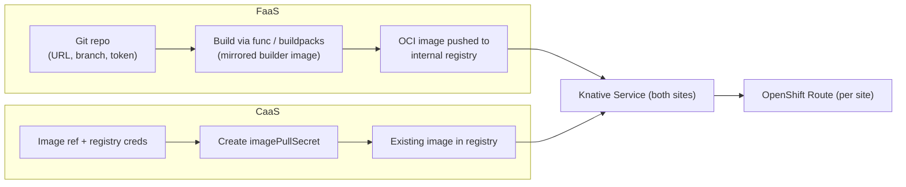
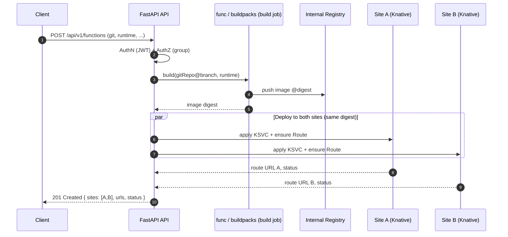
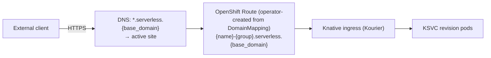
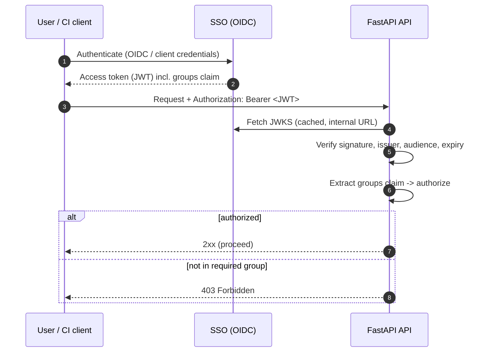
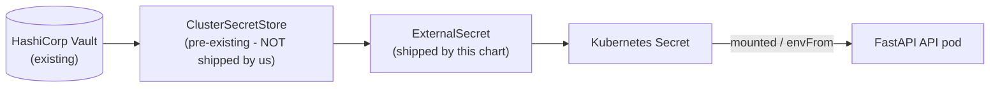
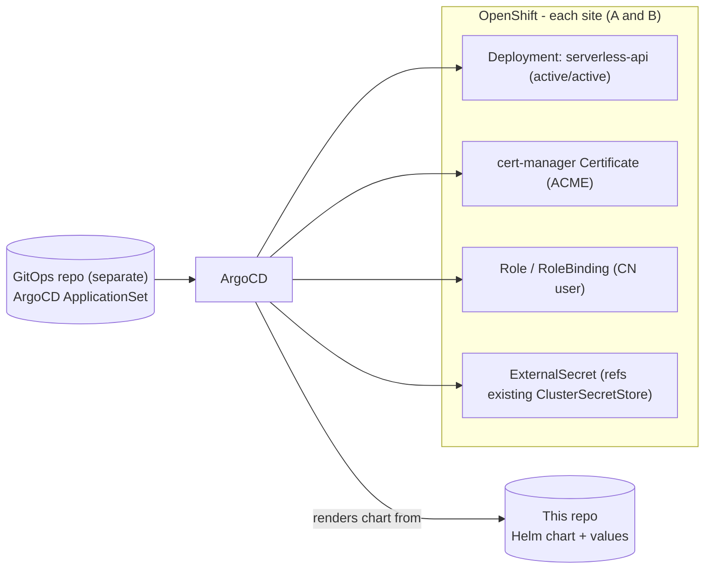

# Serverless Platform - Architecture & Design

A self-service **FaaS (Function as a Service)** and **CaaS (Container as a Service)**
platform that wraps the open-source **Knative** project on **OpenShift**, exposed through a
**Python / FastAPI** REST API.

> **Status:** Implemented. This document is the source of truth for the architecture; the
> FastAPI application (`app/`), the Helm chart (`charts/serverless-api`), and the CI/CD
> workflows (`.github/workflows/{checks,ci,release}.yml`) are in this repo. The GitOps
> manifests (ArgoCD `ApplicationSet`) live in a separate central GitOps repo, targeting an
> **airgapped** OpenShift environment.
>
> **Revision:** `0.1.0` — 2026-07-06.

### Changes in this revision (0.1.0, 2026-07-06)

- **`GET /api/v1/info`** — a public (unauthenticated), static discovery document so a UI can
  render its create form from the server: version, sites, runtimes, sizes, per-metric
  scaling options, base `routeDomain`, and the `defaultHostTemplate`. Derived from config +
  code, no cluster calls (§10).
- **Config-driven runtimes.** The FaaS runtime list is now **data**: a ConfigMap mounted as a
  YAML file (`runtimes.yaml`) and read into a registry. Ops add a runtime by editing the
  ConfigMap — no image rebuild. `runtime` is validated in the service against the live
  registry (§3.1, §9).
- **`GET /api/v1/{type}/{name}/logs`** — implemented: a point-in-time **local-site** snapshot
  of a workload's pod logs (no streaming; needs the `pods/log` RBAC subresource) (§10, §6.3).
- **NetworkPolicies** for the workloads namespace: default-deny plus explicit allows,
  isolating workload pods from each other and other namespaces (§5).
- **Scaling gains `scaleDownDelay`** (a Knative-capped duration) and the per-metric rules are
  now surfaced verbatim on `/info` (§3.3).
- **Configurable API Route** — `route.host` (defaulted), `route.labels`, `route.annotations`.
- **Platform/runtime**: Python **3.13** on a `python:3.13-slim` base image (multi-arch
  amd64/arm64), dependencies consolidated into `pyproject.toml`, `__version__` derived from
  package metadata, and the sites ConfigMap wired into the Deployment.
- **CI/CD** split into `checks` / `ci` / `release` workflows with image scanning (Trivy),
  keyless signing (cosign), SBOM + provenance, a one-click release workflow, pinned action
  SHAs, gitleaks, kubeconform (incl. custom CRD schemas), and a ≥90% coverage gate (§8).

---

## Table of Contents

1. [Overview & Goals](#1-overview--goals)
2. [High-Level Architecture](#2-high-level-architecture)
3. [Core Service Offerings](#3-core-service-offerings)
4. [Multi-Site (Active/Active HA) Design](#4-multi-site-activeactive-ha-design)
5. [Networking & Exposure](#5-networking--exposure)
6. [Authentication & Authorization](#6-authentication--authorization)
7. [Secrets Management](#7-secrets-management)
8. [Deployment & GitOps](#8-deployment--gitops)
9. [Airgapped Considerations](#9-airgapped-considerations)
10. [REST API Specification](#10-rest-api-specification)
11. [Proposed Repository Layout](#11-proposed-repository-layout)
12. [Sample Manifests](#12-sample-manifests)
13. [Open Questions / Future Work](#13-open-questions--future-work)

---

## Design Decisions (locked in)

| Topic | Decision |
|-------|----------|
| Deliverable | FastAPI app + Helm chart + CI/CD in this repo (GitOps `ApplicationSet` lives elsewhere) |
| FaaS build | **Knative Functions** (`func` + Cloud Native Buildpacks), mirrored builder images for airgap |
| Cluster auth | **cert-manager `Certificate` CR** (shipped in Helm chart) → client TLS cert; **CN is a DNS name** `serverless-api.clients.{base_domain}` (ACME-issued); that name is the Kubernetes user, bound via RBAC |
| Topology | **Two separate OpenShift clusters** ("sites") that **trust the same CA**. The **API runs active/active in both clusters**; a DNS record fronts the active API. **Workloads run on the same two clusters** in a **separate namespace** from the API. |
| Site selection | **Deploy to both sites on every deploy.** Each workload's **Route host is identical in both clusters**; a DNS record forwards to the active serverless site (active/passive at the traffic layer, active/active at the deploy layer). |
| Tenancy | **Shared namespace, label-scoped**; SSO group → resource labels enforced by the API |
| API authn | **SSO (Red Hat Build of Keycloak) OIDC** in front of the API |
| API authz | Based on **SSO group membership** |
| Secrets | **External Secrets Operator** - this repo ships **`ExternalSecret` only**, referencing a **pre-existing `ClusterSecretStore`** that points at **HashiCorp Vault** (API stores no secrets) |
| Route domain | Single platform wildcard **`*.serverless.{base_domain}`**; host `{name}-{group}.serverless.{base_domain}` (offering tracked as a label, not in the host) |
| CI/CD | **Helm** (this repo) + **ArgoCD** `ApplicationSet` (lives in a **separate GitOps repo**) |
| Environment | **Airgapped** - all images/deps mirrored to an internal registry; ACME via an internal ACME endpoint |

---

## 1. Overview & Goals

### Problem statement

Customers need to deploy workloads without managing Kubernetes/OpenShift directly. They
want two consumption models:

- **FaaS** - "give us your source code, we build and run it." The client provides a Git
  repository URL, branch, an access token, and the source lives in that repo. Supported
  runtimes are **configurable** (default **Python, Go, JavaScript**; see §3.1) and listed on
  `GET /api/v1/info`.
- **CaaS** - "give us your image, we run it." The client provides a container image
  reference plus registry credentials (username + token).

Both models must run on **Knative Serving** (scale-to-zero, request-driven autoscaling) on
**OpenShift**, be reachable from outside the cluster via an **OpenShift Route**, and be
governed by enterprise SSO. Everything runs in an **airgapped** datacenter across **two
OpenShift clusters** for high availability. The **API itself also runs active/active on
those same two clusters** (fronted by a DNS record pointing at the active site), and the
**customer workloads run on the same two clusters** in a **separate namespace** from the API.

### Goals

- A single FastAPI REST API that abstracts Knative/OpenShift away from the customer.
- One API call deploys the workload to **both clusters**; the API is itself HA across both.
- Each workload exposed at a **single, cluster-independent Route host**, with DNS forwarding
  to the active site.
- Strong authn (SSO OIDC) and group-based authz.
- No secrets stored by the API; all secrets sourced from Vault via ESO.
- GitOps-managed (Helm + ArgoCD), reproducible, airgap-compatible.

### Non-goals (this phase)

- Implementation code (delivered later).
- Cross-site traffic steering is handled **outside** the API by a **DNS record that forwards
  to the active serverless site** (the Route host is identical in both clusters). The API is
  not a GSLB.
- Billing/metering, quota enforcement, and a full observability stack (see §13).

### Glossary

| Term | Meaning |
|------|---------|
| **Knative Serving** | Knative component that runs request-driven, autoscaling (incl. scale-to-zero) workloads. |
| **KSVC** | A Knative `Service` custom resource (`serving.knative.dev/v1`). The top-level unit we create per workload. |
| **Revision** | An immutable snapshot of a KSVC; created on each spec change. |
| **Route (OpenShift)** | OpenShift `route.openshift.io/v1` object that exposes a service externally over HTTP(S). |
| **Site** | A region the platform deploys to (e.g. `central`, `south`); each runs one OpenShift **cluster** (e.g. `central-0`). |
| **SSO** | Red Hat Build of Keycloak - the OIDC identity provider. |
| **ESO** | External Secrets Operator - syncs secrets from Vault into Kubernetes Secrets. |
| **Tenant / group** | An SSO (Keycloak) group; the unit of ownership and isolation. |
| **`func`** | Knative Functions CLI / library used to build source into an OCI image via buildpacks. |

---

## 2. High-Level Architecture


**Reading the diagram:**

- The user authenticates against **SSO** and calls the API via the **`serverless-api`
  DNS record**, which points at the **active API instance** (the API runs active/active on
  both clusters).
- The serving API validates the token (JWKS from SSO), authorizes on the user's **groups**,
  then **applies the KSVC + Route to both clusters** using each cluster's **client TLS cert**
  (CN `serverless-api.clients.{base_domain}`) for authentication.
- Each workload gets the **same Route host in both clusters**; the
  **`*.serverless.{base_domain}`** DNS record forwards end-user traffic to the active site.
- Images come from the **internal mirrored registry** (airgap). The API's own secrets come
  from **Vault via an ESO `ExternalSecret`** (using a pre-existing `ClusterSecretStore`); its
  client certs come from **cert-manager (ACME)**; the API is deployed by **Helm**, synced by
  an **ArgoCD `ApplicationSet` that lives in a separate GitOps repo**.

---

## 3. Core Service Offerings

Both offerings converge on the same primitive: **create/update a Knative `Service` (KSVC)
in both sites**, then ensure an OpenShift Route exists. They differ only in how the runnable
**image** is produced.



### 3.1 FaaS - Function as a Service

**Inputs (request body):**

| Field | Required | Notes |
|-------|----------|-------|
| `gitRepo` | yes | HTTPS Git repository URL (internal Git, airgapped). |
| `branch` | yes | Branch / ref to build. |
| `gitToken` | yes | Repo access token; used only to clone, **never persisted** (see §7). |
| `runtime` | yes | One of the platform's configured runtimes (default `python`, `go`, `javascript`). The set is **data**: a ConfigMap mounted as a YAML file (`services.runtimes`), validated against the live registry in the service layer and advertised on `GET /api/v1/info`. Adding a runtime is a ConfigMap edit, not a code change. |
| `name` | yes | Logical workload name (DNS-1123). |
| `env`, `files`, `scaling` | no | Shared capabilities, see §3.3. |

**Build flow (Knative Functions / buildpacks):**

1. The API launches a **build** (in-cluster) using **Knative Functions** (`func`) with
   **Cloud Native Buildpacks**. The builder/run images are the **mirrored** versions hosted
   in the internal registry (see §9) - buildpack autodetection picks the right
   Python/Go/JS buildpack.
2. Source is cloned from `gitRepo@branch` using `gitToken`.
3. The resulting OCI image is pushed to the **internal container registry** under a
   deterministic tag, e.g. `registry.internal/<group>/<name>:<gitsha>`.
4. The API then creates/updates the **KSVC** referencing that image (§3.3), in **both
   sites**.

> The build runs once and the **same image digest** is deployed to both sites to guarantee
> bit-for-bit parity across the active/active pair.



### 3.2 CaaS - Container as a Service

**Inputs (request body):**

| Field | Required | Notes |
|-------|----------|-------|
| `image` | yes | Fully-qualified image reference in the internal registry (airgap). |
| `registryUsername` | no | Registry username. Optional - omit both creds for a public image; if either is given, **both** are required. Returned on GET (`spec.registryUsername`). |
| `registryToken` | no | Registry access token; used to create an `imagePullSecret`, **not persisted** and **never returned**. |
| `name` | yes | Logical workload name (DNS-1123). |
| `env`, `files`, `scaling` | no | Shared capabilities, see §3.3. |

**Flow:**

1. The API creates a Kubernetes `kubernetes.io/dockerconfigjson` **imagePullSecret** from
   the supplied credentials in each site, **labeled** with the owning group (§6) and linked
   to the KSVC's service account. The secret's `auths` entry is keyed to the **registry host
   parsed from the client's `image`** (the org runs several registries), not the platform's
   own registry.
2. The API creates/updates the **KSVC** referencing `image` in **both sites**.

### 3.3 Shared capabilities (FaaS and CaaS)

Applied identically to both offerings; modeled on the KSVC pod spec.

| Capability | How it maps to Knative |
|------------|------------------------|
| **Environment variables** | Each `env` entry is `name` + `value`. A plain entry is set inline on the container; an entry with **`secret: true`** has its value moved into an API-created Kubernetes **Secret** (`{workload}-env`) and the container reads it via a `secretKeyRef` (the value is never inline). The API does **not** expose `valueFrom` - users cannot reference arbitrary existing cluster Secrets/ConfigMaps. |
| **Files (config & secret mounts)** | Via the `files` field, a user **uploads inline file content** (`content`/`contentBase64`), its `mountPath`, and an optional `readOnly` flag (default true). The API aggregates all non-secret files into **one `{workload}-files` ConfigMap** and all secret files (`secret: true`) into **one `{workload}-files` Secret** - one ConfigMap and one Secret per workload, a key per file - and mounts each at its path via `subPath`. (No referencing of pre-existing cluster objects.) |
| **Scaling options** | Knative autoscaling annotations: `autoscaling.knative.dev/min-scale`, `max-scale`, `metric`, `target`, and `scale-down-delay`. `metric` selects the scaling signal - `concurrency` or `rps` (default **KPA** autoscaler, scale-to-zero capable) or `cpu`/`memory` (**HPA** class, no scale-to-zero); `target` is the target value for the chosen metric. When `target` is **omitted** the default is **metric-aware**: `100` for `concurrency`/`rps`, but `70` for `cpu`/`memory` (these are a utilization **percentage**, so we scale before saturation; values >100 are rejected). Scale-to-zero is the default when `min-scale=0` (KPA metrics only). `scaleDownDelay` is an optional Go duration (`30s`/`5m`/`1h`, capped by Knative at 1h) that holds a revision up before scaling it down, smoothing bursty traffic. **These rules are surfaced verbatim on `GET /api/v1/info`** (per-metric `minScaleFloor`, target default/min/max/unit) — derived from the same model that validates a create, so a client UI can render the form without drift. |
| **Resource size** | `size: small\|medium\|large` (default `small`) - a t-shirt size, so clients pick capacity without Kubernetes units. Maps to container resources: **memory** is set `request==limit` (a hard, predictable OOM boundary - exceeding it restarts that replica), **CPU** is **request-only** (no limit, so workloads are never CPU-throttled). `small`=100m/256Mi, `medium`=250m/512Mi, `large`=500m/1Gi. The CPU/memory request is also what lets the `cpu`/`memory` autoscaling metrics compute utilization. |

A canonical scaling sub-object in the API:

```json
{
  "scaling": {
    "minScale": 0,
    "maxScale": 3,
    "metric": "concurrency",
    "target": 100,
    "scaleDownDelay": "0s"
  }
}
```

---

## 4. Multi-Site (Active/Active HA) Design

The platform deploys **every** workload to **both** OpenShift clusters (Site A and Site B)
on each create/update, and the **API itself runs active/active on both clusters**. Because
both clusters **trust the same CA** and the workload **Route host is identical in both**,
each site is a full, independent replica; a DNS record forwards end-user traffic to the
active site.

The **client certificate, CA bundle, and workloads namespace are global** (the same in every
cluster), so a site profile is just its name, cluster, and endpoint. The `routeDomain`,
`workloadsNamespace`, client cert directory, and CA bundle are shared config:

```yaml
routeDomain: serverless.{base_domain}     # shared; same host in both clusters
workloadsNamespace: serverless-workloads  # where the API creates workloads (global)
clientCertDir: /etc/serverless/client     # tls.crt/tls.key (cert-manager), global
caBundle:                                 # OpenShift-injected, global
  configMap: ca-bundle
  key: ca-bundle.crt
  mountPath: /etc/ssl/certs
sites:
  - name: central                          # site/region
    cluster: central-0                     # cluster instance
    apiServer: https://api.central-0.example.com:6443
  - name: south
    cluster: south-0
    apiServer: https://api.south-0.example.com:6443
```

> The API always authenticates with the **client certificate** (no in-cluster/ServiceAccount
> path) - uniform whether it's talking to its local cluster or the peer over its external API
> endpoint. Because `sites` carries no secrets, it can be sourced from a ConfigMap.

### Fan-out & status aggregation

- The API holds **one Kubernetes client per site** (built from that site's client cert + the
  shared CA).
- On deploy, it applies the KSVC + Route to both sites **concurrently** (async / thread
  pool), then **aggregates** per-site results. The workload `hostname` is the **same host**
  in both sites; only the per-site readiness differs:

```json
{
  "name": "orders-api",
  "group": "team",
  "type": "container",
  "hostname": "orders-api-team.serverless.example.com",
  "sites": [
    { "site": "central", "status": "Ready", "revision": "orders-api-00001" },
    { "site": "south", "status": "Ready", "revision": "orders-api-00001" }
  ],
  "overallStatus": "Ready"
}
```

### Partial-failure semantics

| Scenario | Behavior |
|----------|----------|
| Both sites succeed | `overallStatus = Ready`, `201`/`200`. |
| One site fails | `overallStatus = Degraded`, `207 Multi-Status`; the per-site object carries the error. The succeeded site is **left running** (HA prefers availability), and DNS keeps serving from the healthy site. |
| Both sites fail | `502 SITE_TOTAL_FAILURE` error envelope (no workload body); the per-site errors are in `details[]`. Re-apply is idempotent (server-side apply), so a retry heals any partial state. |

- **An unavailable site does not freeze the API.** Per-site work runs concurrently in
  threads; every cluster call has a **connect/read timeout** and each site has an overall
  **operation timeout backstop**, so a down/slow site fails fast and is reported as
  `Timeout`/`Degraded` (it doesn't block the healthy site or other requests). Health probes
  never touch clusters. (See `cluster_connect_timeout` / `cluster_read_timeout` /
  `site_op_timeout`.)
- Operations are **idempotent** (Kubernetes **server-side apply** by object name), so a
  client can safely retry to heal a degraded deployment.
- **Build once, deploy the same digest to both sites** (see §3.1) so the two sites are
  identical.

> Cross-site traffic steering is handled by the **`*.serverless.{base_domain}` DNS record
> forwarding to the active site** - not by the API.

---

## 5. Networking & Exposure

- This runs on **OpenShift Serverless** (the Operator-installed Knative). The Serverless
  Operator's ingress controller **automatically creates the OpenShift `Route`** for each
  Knative ingress - so the platform requirement "every workload is exposed via an OpenShift
  Route" is satisfied **by the operator**, not by the API hand-creating Routes.
- A bare KSVC would only get a Route under the **per-cluster** default domain (`apps.<cluster>`),
  which differs between sites. To get **one stable, cluster-independent host**, the API creates
  a **`DomainMapping`** for `{name}-{group}.serverless.{base_domain}` in **each** cluster; the
  operator then provisions the Route for that host. A **`*.serverless.{base_domain}` DNS
  record forwards to the active site**.
- **TLS:** the custom host is covered by a **wildcard cert for `*.serverless.{base_domain}`**
  (provided to the DomainMapping / ingress); the operator-created Route is `edge`-terminated.

#### Route host convention (recommendation)

Use a **single platform wildcard domain** and put the tenant in the subdomain - do **not**
split FaaS/CaaS into separate domains:

```
{name}-{group}.serverless.{base_domain}
e.g. orders-api-team.serverless.example.com
```

Rationale: the host must be **identical in both clusters** (DNS forwards to active), so it
must be a custom platform domain anyway; FaaS-vs-CaaS is a build-time detail the consumer
shouldn't see in the URL; and one wildcard domain means **one wildcard cert + one DNS zone**
to manage. The offering (`function`/`container`) is tracked as a **label**, not in the host. The
`{group}` prefix prevents collisions in the shared namespace and makes ownership obvious.

**Object naming.** The OpenShift name of the workload (KSVC) and all its derived resources
(`{workload}-env` Secret, `{workload}-files` ConfigMap/Secret, pull secret) is
**`{name}-{group}`** - unique per tenant in the shared namespace.

**Custom hostname.** A client may override the host with a `hostname` field. Because the
`DomainMapping` name *is* the host, the API **validates the hostname is not already assigned**
to another workload before deploying (checked across both sites); a clash returns **409
Conflict**. The chosen host is recorded on the KSVC via the `serverless.platform/host`
annotation so reads can report the URL.



#### Workload network isolation (NetworkPolicies)

The chart ships **default-deny** `NetworkPolicies` for the workloads namespace, then reopens
only the paths Knative + OpenShift need. Net effect: a workload pod **can't talk to another
workload pod** (no cross-tenant lateral movement in the shared namespace) or reach other
namespaces, and its egress is constrained:

- **Ingress** — allowed only from the configured system namespaces (Knative activator +
  Kourier ingress, the OpenShift router, monitoring). Same-namespace pods are *not* selected,
  so pod-to-pod ingress stays denied.
- **Egress** — DNS (`openshift-dns`), the platform API namespace ("our side") + the Knative
  control plane, and **off-cluster** destinations (LBs/Routes/external services) with the
  cluster-internal CIDRs excluded, so pods reach platform services via a Route/LB rather than
  directly. All namespaces/CIDRs are values (`networkPolicy.*`), verified per cluster.

#### API Route

The Route that exposes the **API itself** is values-driven: `route.host` (defaults to
`serverless-api.{base_domain}`), plus optional `route.labels` and `route.annotations` (e.g.
HAProxy router timeouts or rate-limit annotations). This is distinct from the per-**workload**
host convention above.

---

## 6. Authentication & Authorization

Two distinct identities are involved:

1. **End-user → API:** OIDC bearer token from **SSO**.
2. **API → each cluster:** **client TLS certificate** issued by **cert-manager** (ACME),
   whose **CN is the DNS name `serverless-api.clients.{base_domain}`**; that name is the
   Kubernetes user, bound by RBAC.

### 6.1 End-user authentication (SSO OIDC)



- The API is a **resource server**: it validates JWTs offline using **JWKS** fetched from
  the internal SSO realm (cached, no per-request round trip).
- Validated: signature, `iss`, `aud`, `exp`/`nbf`.
- This covers both **users** (authorization-code flow) and **machines/service accounts**
  (client-credentials grant) - any client with a valid SSO bearer token authenticates the
  same way.

#### Static API keys (admin/operator automation, non-OIDC)

For **admin** automation that can't do OIDC, the API also accepts a **static admin API key**
in the **same `Authorization: Bearer <key>` header**. The API distinguishes the two by shape:
a structural JWT (`header.payload.signature`) is validated as an OIDC token; an opaque token is
compared against the single configured admin key. The key is the **raw token** (not a hash),
sourced from Vault via ESO into `SERVERLESS_ADMIN_API_KEY` and matched with a **constant-time**
compare (`app/auth/apikey.py`). A match yields an **admin** Principal (the key is admin-only;
regular users go through OIDC). It defaults to empty, which **disables** key auth; set the env
var to enable it.

#### Auth as an internal component (not a separate microservice)

All OIDC interaction is encapsulated in a **self-contained auth component inside the API**
(the `app/auth/` package - see §11), **not** a separately-deployed microservice. Because
token validation is **stateless** (verify signature against cached JWKS + read claims),
there is no shared state to centralize; a standalone auth service would only add a network
hop, another deployment to secure in both clusters, and a failure point. The component owns:

- SSO OIDC discovery + **JWKS fetch/cache** and **token validation** (`oidc.py`),
- **claims → group** mapping and admin/tenant policy (`claims.py`),
- the FastAPI **`require_auth`** dependency (and the `CurrentUser` annotation) the routers
  use (`deps.py`); per-group authorization is asserted in the service layer (`assert_group`).

> If auth-at-the-edge is ever wanted (to keep tokens out of app code / defense-in-depth), the
> OpenShift-native drop-ins are **oauth2-proxy** or **Authorino** as a sidecar/gateway - an
> infra change, not an API rewrite. (See §13.)

### 6.2 Group-based authorization (tenancy)

- Tenancy is **shared-namespace, label-scoped**. Every resource the API creates is labeled:

  ```yaml
  metadata:
    labels:
      serverless.platform/group: "<keycloak-group>"
      serverless.platform/managed-by: "serverless-api"
      serverless.platform/owner: "<sub or preferred_username>"
      # every resource created for a function/container also carries the workload name:
      serverless.platform/workload: "<function-or-container-name>"
  ```

  Every resource the API creates for a function/container (KSVC, Route,
  DomainMapping, the `{workload}-env` Secret, the `{workload}-files`
  ConfigMap/Secret, and the imagePullSecret) carries **both** the SSO group label
  and the workload-name label, so it is unambiguously attributable and selectable.

- The caller **explicitly chooses the group** to act as on every request - in the body for
  writes (`group` field) and as a `?group=` query parameter for reads/deletes. The API
  **asserts the caller is a member** of that group (from the **`groups` claim**); otherwise
  `403`. This makes the acting group unambiguous for users in multiple groups. Authorization
  rules:
  - **Create/Update:** the workload is named `{name}-{group}` and stamped with that group label.
  - **Read/Delete by name:** the request targets `{name}-{group}`; the API verifies both that
    the caller is a member of `group` and that the resource's group label matches; otherwise
    `403`/`404`.
- Admins (members of a configured **admin group**) may act for any group; **tenant groups**
  are limited to groups the caller belongs to.

> Isolation is enforced **in the API layer** plus label selectors. Because all tenants share
> a namespace, the cluster RBAC for the API's service identity is namespace-wide (see §6.3);
> per-tenant isolation is therefore the API's responsibility. (A future hardening option is
> namespace-per-group - see §13.)

### 6.3 Cluster-side identity (cert-manager client cert + RBAC)

- The Helm chart ships a cert-manager **`Certificate`** per site, issued via **ACME** (an
  internal ACME endpoint in airgap). Because ACME requires the identity to be a DNS name, the
  cert's **CN/SAN is `serverless-api.clients.{base_domain}`** - and that DNS name is the
  **Kubernetes user**. OpenShift authenticates the client by that name. Both clusters
  **trust the same CA**, so the same identity is valid in either cluster.
- Each site has one `Role`/`RoleBinding` (in the **workload namespace**,
  `serverless-workloads`) granting least-privilege CRUD on exactly what the API manages:
  Knative `services`/`domainmappings`, `secrets`, `configmaps`, read on `pods`/`events`, and
  read on the **`pods/log`** subresource (for the `/logs` endpoint). The API does **not** need
  `routes` permission - on OpenShift Serverless the operator creates the OpenShift Route
  automatically from the KSVC/DomainMapping.
- The cert is mounted **once** (global, not per-site) at `SERVERLESS_CLIENT_CERT_DIR`
  (`tls.crt`/`tls.key`); the API uses it to authenticate to **every** cluster via mTLS. There
  is no in-cluster/ServiceAccount fallback - always certificate-based.
- The CA used to verify the API servers is the **trusted CA bundle** (§9), pointed at by
  `SERVERLESS_CA_BUNDLE__*`; it is the same for every cluster.

---

## 7. Secrets Management

**Principle: the API never persists *its own platform* secrets**, and **ESO is used only for
those platform secrets** - never for customer workload data. There are three distinct
categories:

| Category | Owner / mechanism | ESO? |
|----------|-------------------|------|
| 7.1 **API's own platform secrets** (SSO client secret, client-cert material) | Vault → ESO `ExternalSecret` → K8s Secret | **Yes** |
| 7.2 **Customer credentials** (git/registry tokens) | Supplied per-request, used transiently | No |
| 7.3 **Customer config & secret mounts** (what the user wants inside their workload) | **Created and managed by the API directly**; readable back via the API | **No** |

### 7.1 The API's own platform secrets - Vault → ESO → Kubernetes Secret

The API needs, e.g., the SSO client secret and per-site client-cert material. These are
stored in **Vault** and projected into the cluster by **ESO**.



- A **`ClusterSecretStore` already exists** in the clusters (it points at Vault via
  Kubernetes auth / AppRole). **This repo does NOT deploy a SecretStore/ClusterSecretStore.**
- This repo ships only **`ExternalSecret`** resources that **reference the existing
  `ClusterSecretStore`** and declare which Vault paths map to which Kubernetes Secret keys.
- ESO reconciles and keeps the Kubernetes Secret in sync; the API consumes it via `envFrom`
  or volume mounts. **No secret values live in Git or in the API's code/config.**

### 7.2 Customer-provided credentials (git/registry tokens)

- `gitToken` (FaaS) and `registryToken` (CaaS) arrive in the request body **over TLS**.
- They are used **transiently**:
  - `gitToken` is injected into the build job only for the clone and discarded.
  - `registryToken` becomes a labeled `imagePullSecret` attached to the workload's service
    account in each site.
- The API does **not** write these to its own datastore, logs, or Git. Where a credential
  must persist for the workload to run (the pull secret), it lives as a **scoped, labeled
  Kubernetes Secret** owned by the tenant group and is deleted when the workload is deleted.

### 7.3 Customer config & secret mounts (API-managed, **not ESO**)

When a user wants config files or secret values **inside their function/container**, those
are **created and managed by the API itself from the deploy request** - **not** through
ESO/Vault. There are no separate secret/config endpoints; they are derived inline from the
workload spec:

- **`env` with `secret: true`** → values aggregated into a single **`{workload}-env`**
  Kubernetes Secret; the container reads each via a `secretKeyRef` (§3.3).
- **`files`** → non-secret files aggregated into one **`{workload}-files`** ConfigMap and
  secret files into one **`{workload}-files`** Secret, mounted per file via `subPath` (§3.3).

All are created in the **workload namespace of both clusters**, stamped with the ownership
labels (§6.2), kept consistent by the API, and cleaned up with the workload. **They never
touch Vault or ESO.**

---

## 8. Deployment & GitOps

The FastAPI control-plane app is delivered via a **Helm chart that lives in this repo** and
is reconciled by an **ArgoCD `ApplicationSet` that lives in a separate, central GitOps repo**
(this repo does **not** contain the ArgoCD Application/ApplicationSet).



- **Helm chart (this repo)** templates: two `Namespace`s (`serverless-api` for the API and
  `serverless-workloads` for customer workloads, both annotated
  `argocd.argoproj.io/sync-options: Delete=false,Prune=false` so ArgoCD never prunes/deletes
  them), the trusted-CA-bundle `ConfigMap` (both namespaces), a `serverless-api-sites`
  **`ConfigMap`** holding just the OpenShift **sites data** (per-site API endpoint, name,
  namespace), loaded into the API as the `SERVERLESS_SITES` env var (the rest of the config is
  plain `env` on the Deployment), a `serverless-api-runtimes` **`ConfigMap`** holding the
  available runtimes, mounted as a YAML file, **default-deny `NetworkPolicies`** for the
  workloads namespace (§5), `Deployment`, `Service`, `Route` (for the API itself, with a
  configurable host/labels/annotations), `Role`/`RoleBinding` (bound to the client-cert CN
  user, in the workloads namespace), cert-manager `Certificate`, **one ESO `ExternalSecret`
  per kind of data** (each its own target Secret, referencing the pre-existing
  `ClusterSecretStore`; enabled ones `envFrom`'d into the API), and `values.yaml` describing
  the site profiles. It does **not** ship a
  SecretStore, and the API pod runs as the namespace `default` ServiceAccount (cluster auth is
  the client certificate, not the SA token).
- **ArgoCD (separate GitOps repo)**: an `ApplicationSet` generates one Application **per
  site**, each pointing at this repo's chart with a per-site values file. Sync waves order
  Secrets/RBAC before the Deployment; health checks gate rollout.
- All referenced images are the **internal mirrored** images (airgap, §9).

### Platform prerequisites (installed separately)

This repo's chart **consumes** cluster capabilities that are installed and managed
**elsewhere** (a separate platform/cluster-bootstrap GitOps repo), not by this chart:

| Prerequisite | Provides | Install |
|--------------|----------|---------|
| **OpenShift Serverless Operator** | Knative Serving (`Service`/`DomainMapping` CRDs), kourier ingress in `knative-serving-ingress`, and **automatic OpenShift Route creation** for Knative ingresses | OLM `Subscription` → `KnativeServing` CR (mirrored for airgap via `oc-mirror`) |
| **cert-manager** | issues the API's ACME client certificate (§6.3) | OLM (mirrored) |
| **External Secrets Operator** + `ClusterSecretStore` | projects Vault secrets into the cluster (§7.1) | OLM (mirrored) |
| **RHBK** | OIDC identity provider (§6.1) | platform-managed |

On OpenShift you must use the **OpenShift Serverless Operator** - not an upstream/community
or Helm-based Knative install. The chart assumes the operator's conventions (kourier in
`knative-serving-ingress`, operator-managed Routes, the Knative CRDs).

---

## 9. Airgapped Considerations

Nothing may reach the public internet. Everything is mirrored to internal infrastructure.

| Concern | Approach |
|---------|----------|
| **Platform & app images** | Mirror to the internal registry; use `ImageDigestMirrorSet` / `ImageContentSourcePolicy` so image pulls resolve internally. |
| **Buildpack builder/run images** | Mirror the Cloud Native Buildpacks **builder** and **run** images used by Knative Functions for Python/Go/JS into the internal registry; configure `func` to use them. This is the key airgap dependency for FaaS. |
| **Python dependencies (the API)** | Build the API container against an **internal PyPI mirror** (e.g. Nexus/Artifactory) or vendored wheels; pin all versions. |
| **Function dependencies (per runtime)** | Buildpacks must resolve language deps from internal mirrors (internal PyPI, Go module proxy/`GOPROXY`, npm registry mirror). Documented as a prerequisite for each runtime. |
| **Base images** | The API image builds on a mirrored **`python:3.13-slim`** base (Python 3.13); mirror the workload/builder bases likewise. |
| **CA trust** | A ConfigMap labelled `config.openshift.io/inject-trusted-cabundle: "true"` is created in **both** namespaces; OpenShift auto-populates it with the cluster's trusted CAs. It is **mounted into the API and every FaaS/CaaS workload** (and exported via `SSL_CERT_FILE`/`REQUESTS_CA_BUNDLE`) so all internal TLS (Git, registry, Vault, SSO, the cluster API) is trusted. Same bundle for every cluster. |
| **cert-manager** | Issue client certs via **ACME against an internal ACME endpoint** (e.g. step-ca / internal CA exposing ACME) - not a public CA. Both clusters trust this CA, and the cert CN/SAN is the DNS name `serverless-api.clients.{base_domain}`. |
| **Helm charts** | Hosted in an internal chart repo / Git; no public chart pulls. |

---

## 10. REST API Specification

Base path: `/api/v1`. All endpoints require a valid SSO bearer token (§6) **except the public
discovery endpoint `GET /api/v1/info` and the health probes**. All responses are JSON. Times
are RFC 3339 with a timezone offset; workload timestamps (`createdAt`) are rendered in
**Israel local time** (IDT `+03:00` / IST `+02:00`, daylight-saving aware).

### Endpoints

| Method | Path | Purpose |
|--------|------|---------|
| `POST` | `/api/v1/functions` | Create a FaaS workload (build from Git). **202 Accepted** - deploys in the background; poll `statusUrl`. |
| `GET` | `/api/v1/functions` | List the group's functions - general info per workload (name, hostname, overallStatus, size, createdAt). Fans out to **all sites** and merges by workload (each item lists the sites it's on; status rolled up across them). Requires `?group=`; optional `?sort=name\|createdAt` (default `name`). |
| `GET` | `/api/v1/functions/{name}?group=` | Get one function (spec + per-site status). Requires `?group=`. |
| `PUT` | `/api/v1/functions/{name}` | Replace the function's mutable spec (`group` in body; env/files/scaling/hostname). Supplying `gitToken` (optionally with new `gitRepo`/`branch`/`runtime`) **rebuilds from source**; otherwise config-only and the current image is kept. **202 Accepted**. |
| `DELETE` | `/api/v1/functions/{name}?group=` | Delete the function in both sites. Requires `?group=`. |
| `POST` | `/api/v1/containers` | Create a CaaS workload. **202 Accepted** - deploys in the background; poll `statusUrl`. |
| `GET` | `/api/v1/containers` | List the group's containers - general info per workload (name, hostname, overallStatus, size, createdAt). Fans out to **all sites** and merges by workload (each item lists the sites it's on; status rolled up across them). Requires `?group=`; optional `?sort=name\|createdAt` (default `name`). |
| `GET` | `/api/v1/containers/{name}?group=` | Get one container (spec + per-site status). Requires `?group=`. |
| `PUT` | `/api/v1/containers/{name}` | Replace the container's mutable spec (`group` in body; image/env/files/scaling/hostname). Supplying `registryUsername`+`registryToken` rotates the pull secret; omit both to keep the existing one. **202 Accepted**. |
| `DELETE` | `/api/v1/containers/{name}?group=` | Delete the container in both sites. Requires `?group=`. |
| `GET` | `/api/v1/{type}/{name}/logs?group=` | Snapshot the workload's pod logs from the **current site** (point-in-time, not streamed; Kubernetes keeps no buffer beyond the node). Optional `container` (default `user-container`), `sinceSeconds`, `limitBytes`. Scaled-to-zero → `200` with empty `pods`. Wrong group/offering or not deployed here → `404`. |
| `GET` | `/api/v1/info` | **Public** (no auth), static platform capabilities for dynamic UI rendering: `version`, `sites`, `runtimes`, `sizes`, `scaling` (per-metric options), `routeDomain`, `defaultHostTemplate`. Config/code-derived, no cluster calls. |
| `GET` | `/healthz`, `/readyz` | Liveness/readiness (no auth). |

> Workload secrets and config files are **not** separate endpoints - they are derived
> **inline** from the deploy request (`env` with `secret: true`, and `files`) and created by
> the API as `{workload}-env` / `{workload}-files` objects (§3.3, §7.3).

> **Async (submit + poll).** `POST`/`PUT` validate synchronously (so the caller gets
> immediate `400`/`404`/`409`), then **return `202 Accepted`** with `overallStatus: "Pending"`
> and a `statusUrl`; the build/deploy runs in the background. Clients poll
> `GET {statusUrl}` (the resource itself, `/api/v1/{type}/{name}?group=`) until
> `overallStatus` is `Ready` (or `Degraded`). This suits slow FaaS builds and ServiceNow
> workflow patterns (§10.x).
>
> **Create is strict.** `POST /functions` and `POST /containers` **fail with 409** if a
> workload named `{name}-{group}` already exists in any site (it is not a silent upsert);
> changes go through the `PUT` endpoints.
>
> **`PUT` is a full replace** of the mutable spec (env/files/scaling/hostname; image for
> containers - defaults to the current image if omitted) and **404s** if the workload
> doesn't exist. Function code changes are not done via `PUT` (no git inputs); recreate.
>
> **Typed endpoints are offering-scoped:** `/functions/{name}` only acts on a function and
> `/containers/{name}` only on a container - a name that is the other offering returns 404.
> (The OpenShift object name stays `{name}-{group}`; the offering is a label, not in the name.)

### Shared sub-schemas

```jsonc
// Workload shared fields (used by both functions and containers)
{
  "name": "orders-api",                 // DNS-1123, required. OpenShift object name is {name}-{group}.
  "group": "team-a",                    // required; the SSO group to act as. Caller must be a
                                        // member (else 403). Reads/deletes pass it as ?group=.
  "hostname": "orders",                 // optional custom host; default {name}-{group}.{route_domain}.
                                        // a single label, or one level under {route_domain}
                                        // ({label}.{route_domain}); must not be assigned (else 409).
  "env": [                              // optional; each entry is name + value
    { "name": "LOG_LEVEL", "value": "info" },                       // inline
    { "name": "DB_PASSWORD", "value": "s3cret", "secret": true }    // -> API-created Secret {workload}-env
  ],
  "files": [                            // optional: inline files to mount
    // non-secret files -> one {workload}-files ConfigMap; secret files -> one {workload}-files Secret
    { "mountPath": "/etc/app/app.yaml", "content": "log_level: info\n", "secret": false, "readOnly": true },
    { "mountPath": "/etc/tls/tls.key",  "contentBase64": "<base64>",    "secret": true }
  ],
  "scaling": {                          // optional, see 3.3
    "minScale": 0, "maxScale": 3,
    "metric": "concurrency",            // concurrency | rps | cpu | memory
    "target": 100
  },
  "size": "small",                      // optional; small | medium | large (default small)
  "sites": ["central", "south"]         // optional; default = all sites (HA)
}
```

### FaaS - `POST /api/v1/functions`

Request:

```json
{
  "name": "image-resizer",
  "gitRepo": "https://git.internal/team/image-resizer.git",
  "branch": "main",
  "gitToken": "<repo-access-token>",
  "runtime": "python",
  "env": [ { "name": "MAX_PX", "value": "2048" } ],
  "scaling": { "minScale": 0, "maxScale": 20 }
}
```

Response `202 Accepted` (deploy runs in the background; poll `statusUrl`):

```json
{
  "name": "image-resizer",
  "type": "function",
  "runtime": "python",
  "hostname": "image-resizer-team.serverless.example.com",
  "overallStatus": "Pending",
  "sites": [],
  "statusUrl": "/api/v1/functions/image-resizer?group=team"
}
```

Then `GET /api/v1/functions/image-resizer?group=team` once Ready:

The response is a **`FunctionResponse`** - flat, mirroring the `FunctionCreate`
body (secrets redacted) with the live status alongside:

```json
{
  "name": "image-resizer",
  "group": "team",
  "type": "function",
  "hostname": "image-resizer-team.serverless.example.com",
  "overallStatus": "Ready",
  "size": "small",
  "createdAt": "2026-06-21T15:00:00+03:00",
  "runtime": "python",
  "gitRepo": "https://git.example.com/team/image-resizer.git",
  "branch": "main",
  "scaling": { "minScale": 0, "maxScale": 3, "metric": "concurrency", "target": 100 },
  "env": [
    { "name": "LOG_LEVEL", "value": "debug", "secret": false },
    { "name": "API_KEY", "value": null, "secret": true }
  ],
  "files": [
    { "mountPath": "/etc/app/config.yaml", "readOnly": true, "secret": false,
      "content": "level: debug\n" },
    { "mountPath": "/etc/app/token", "readOnly": true, "secret": true, "content": null }
  ],
  "sites": [
    { "site": "central", "status": "Ready", "revision": "image-resizer-00001",
      "replicas": 2, "usage": { "cpu": "120m", "memory": "180Mi" } },
    { "site": "south", "status": "Ready", "revision": "image-resizer-00001",
      "replicas": 1, "usage": { "cpu": "90m", "memory": "175Mi" } }
  ]
}
```

A **`ContainerResponse`** is the same idea mirroring `ContainerCreate`: instead of
`gitRepo`/`branch`/`runtime` it carries `image` and `registryUsername`. (Functions
expose **no image** - the built image is an internal artifact; the client deals in
source, not images.)

> **Shape.** Each offering has its own response model (`FunctionResponse` /
> `ContainerResponse`) so the response is the same shape as the create body - no
> irrelevant fields (a container never shows `gitRepo`; a function never shows
> `registryUsername`). Both share `WorkloadBase` (name, group, type, hostname,
> overallStatus, size) with the list summary. `hostname` is the bare external host
> (no scheme), mirroring the create body's `hostname`; reach the workload at
> `https://{hostname}`. The desired-state fields (`scaling`, `env`, `files`, plus
> the source fields) are read from the **local site** (uniform across sites); the
> per-site `sites[]` status/`replicas`/`usage` come from fanning out to every site.
>
> **Redaction.** Secret material is never returned: secret-backed env values and
> secret file contents come back `null` with `secret: true`; the **git token** and
> **registry token** are never persisted/returned (`registryUsername` is shown, the
> token is not). Non-secret env values and non-secret file contents (from the
> workload's ConfigMap) are returned in full. `scaling.target` reflects the
> *effective* target deployed (an omitted cpu/memory target shows `70`).
>
> **Live status.** `replicas` is the autoscaler's live scale
> (`Revision.status.actualReplicas`); `usage` is live cpu/memory summed over a
> site's running pods (user container only, not the queue-proxy sidecar),
> best-effort and `null` when scaled to zero or the metrics API is unavailable.

And `GET /api/v1/functions?group=team` to list the group's functions - general
info only (no live usage/replicas; use the single-workload GET for those):

```json
[
  {
    "name": "image-resizer",
    "group": "team",
    "type": "function",
    "hostname": "image-resizer-team.serverless.example.com",
    "overallStatus": "Ready",
    "size": "small",
    "createdAt": "2026-06-21T15:00:00+03:00",
    "sites": ["central", "south"]
  }
]
```

> The list **fans out to all sites** and merges by workload name (best-effort):
> each workload's `sites` lists the sites that returned it and `overallStatus` is
> rolled up across them (`Ready`/`Deploying`/`Degraded`, or `Terminating` while a
> workload is being deleted). A site that is unreachable is skipped; only if
> **every** site is down does the call fail (502). It returns general info only (no
> live replicas/usage) - use the single-workload GET for per-site live health.

### CaaS - `POST /api/v1/containers`

Request:

```json
{
  "name": "orders-api",
  "image": "registry.internal/team/orders-api:1.4.2",
  "registryUsername": "svc-team",
  "registryToken": "<registry-token>",
  // registryUsername/registryToken are optional (omit both for a public image)
  "env": [ { "name": "LOG_LEVEL", "value": "info" } ],
  "files": [ { "mountPath": "/etc/app/app.yaml", "content": "log_level: info\n", "secret": false } ],
  "scaling": { "minScale": 1, "maxScale": 8, "metric": "concurrency", "target": 50 }
}
```

Response `202 Accepted`: same envelope as the FaaS response (`type: "container"`, no
`runtime` build fields; `image` echoed back), then poll `statusUrl`.

### 10.x ServiceNow integration (frontend)

The API is the backend for a **ServiceNow** frontend; the design accommodates that:

- **Authentication - forward the end-user token.** ServiceNow obtains the user's **SSO
  (OIDC) access token** (OAuth authorization-code / on-behalf-of) and sends it as the
  `Authorization: Bearer` header. The JWT carries the real user and `groups`, so the API's
  group-based authz (§6.2) works unchanged - actions are attributed to the actual requester.
  Configure ServiceNow as an OAuth client of the SSO whose tokens carry `aud = serverless-api`.
- **CORS.** When a ServiceNow Service Portal widget calls the API **from the browser**, set
  `SERVERLESS_CORS_ALLOW_ORIGINS` (Helm `corsAllowOrigins`) to the ServiceNow instance
  origin(s); the API enables CORS (preflight + `Authorization` header) only then. Server-side
  ServiceNow calls (IntegrationHub / Scripted REST) need no CORS.
- **Async submit + poll.** `POST`/`PUT` return **202** immediately with a `statusUrl`;
  the ServiceNow workflow polls `GET {statusUrl}` until `Ready`/`Degraded`. This avoids
  ServiceNow REST timeouts on slow FaaS builds and matches its long-running-task patterns.

### Error model

Standard envelope for all non-2xx responses:

```json
{
  "error": {
    "code": "SITE_PARTIAL_FAILURE",
    "message": "Deployment succeeded in central but failed in south.",
    "details": [
      { "site": "south", "message": "registry auth failed" }
    ],
    "requestId": "b1c2..."
  }
}
```

| HTTP | Code | When |
|------|------|------|
| `400` | `VALIDATION_ERROR` | Bad/missing fields, unsupported runtime. |
| `401` | `UNAUTHENTICATED` | Missing/invalid JWT. |
| `403` | `FORBIDDEN` | Caller not in a required/owning group. |
| `404` | `NOT_FOUND` | Workload not found in caller's group scope. |
| `409` | `CONFLICT` | Name already exists for the group, or the requested `hostname` is already assigned. |
| `207` | `SITE_PARTIAL_FAILURE` | One site failed (Degraded). |
| `502` | `SITE_TOTAL_FAILURE` | Both sites failed. |
| `500` | `INTERNAL` | Unexpected error. |

---

## 11. Proposed Repository Layout

```text
Serverless/
├── README.md
├── docs/
│   └── ARCHITECTURE.md              # this document
├── api/                             # the control-plane API service (python -m api.main)
│   ├── main.py                      # app factory, router registration, middleware
│   ├── dependencies.py              # FastAPI DI: cached service singletons
│   ├── static/                      # vendored Swagger UI / ReDoc assets (airgap)
│   ├── core/
│   │   └── config.py                # api settings (site profiles, SSO, registry) via env/Secret
│   ├── auth/                        # self-contained auth component (all OIDC interaction)
│   │   ├── oidc.py                  # SSO discovery + JWKS fetch/cache, token validation
│   │   ├── apikey.py               # static admin API-key auth (opaque Authorization: Bearer)
│   │   ├── claims.py               # claims → group mapping, admin/tenant policy
│   │   └── deps.py                  # FastAPI dependencies: require_auth / require_groups
│   ├── routers/                     # functions, containers, info (public), health
│   ├── models/                      # Pydantic schemas: common, function, container, info
│   ├── services/                    # business logic
│   │   ├── workloads.py             # shared build-once / deploy-both engine
│   │   ├── function.py              # function orchestration (build from Git)
│   │   ├── container.py             # container orchestration (image + pull secret)
│   │   ├── deployer.py              # multi-site fan-out + builds per-site ClusterConnection
│   │   ├── builder.py               # api-side Builder (FuncBuilder; future RemoteBuilder)
│   │   ├── ksvc.py                  # KSVC manifest construction (+ t-shirt sizes)
│   │   ├── runtimes.py              # available-runtimes registry (mounted ConfigMap)
│   │   ├── route.py                 # host + Knative DomainMapping (operator makes the Route)
│   │   ├── env.py / files.py        # env & file resolution (+ their Secret/ConfigMap)
│   │   ├── resources.py / secrets.py# manifest + imagePullSecret builders
│   │   ├── describe.py / metrics.py # read-back spec (redacted) + pod usage
│   └── clients/
│       └── cluster.py               # ResourceKind: the api's GVKs for the shared client
├── common/                          # shared by api + (future) builder service
│   ├── contract.py                  # BuildRequest/BuildResult/Builder — the API↔builder contract
│   ├── cluster.py                   # generic Cluster client + ClusterConnection (mTLS, lazy)
│   ├── labels.py                    # ownership label keys + workload_labels
│   ├── errors.py                    # error envelope, typed errors, exception handlers
│   └── logging.py                   # logging configuration
├── charts/
│   └── serverless-api/
│       ├── Chart.yaml
│       ├── values.yaml              # site profiles, image refs, SSO, registry
│       └── templates/
│           ├── namespaces.yaml      # serverless-api + serverless-workloads (ArgoCD Delete=false,Prune=false)
│           ├── ca-bundle.yaml       # inject-trusted-cabundle ConfigMap in both namespaces
│           ├── configmap.yaml       # sites data (SERVERLESS_SITES) -> loaded as an env var
│           ├── runtimes-configmap.yaml # available runtimes, mounted as a YAML file
│           ├── networkpolicy.yaml   # default-deny + allow-* for the workloads namespace
│           ├── deployment.yaml
│           ├── service.yaml
│           ├── route.yaml           # API Route (host/labels/annotations configurable)
│           ├── rbac.yaml            # Role/RoleBinding for the CN user (per site; incl. pods/log)
│           ├── certificate.yaml     # cert-manager Certificate (ACME, per site)
│           └── externalsecret.yaml  # ESO ExternalSecret (refs pre-existing ClusterSecretStore)
│   # NOTE: no secretstore.yaml - the ClusterSecretStore already exists in the clusters.
│   # NOTE: the ArgoCD ApplicationSet lives in a SEPARATE central GitOps repo, not here.
├── .github/
│   └── workflows/
│       ├── checks.yml               # reusable suite: ruff, pytest+coverage, gitleaks, helm/kubeconform, image scan
│       ├── ci.yml                   # PRs / main: runs the checks suite
│       └── release.yml              # one-click release: bump+tag, build/scan/sign, SBOM, GitHub Release
├── tests/                           # flat pytest modules (test_api.py, test_*.py)
├── Dockerfile                       # multi-stage: install (api+common) then copy the artifact
├── pyproject.toml                   # one dist (packages: api*, common*); deps + ruff/pytest config
└── .env.example                     # sample SERVERLESS_* configuration
```

> **Monorepo, future-ready.** The repo is organized as services + a shared
> library so a **builder** microservice can be added as a second package
> (`builder/`) without restructuring: it would import the build contract and the
> cluster client from `common/`, ship its own Dockerfile + image
> (`…/serverless/builder`), and deploy from the same chart. The API talks to it
> through `common.contract.Builder` — today via the in-process `FuncBuilder`,
> later via a `RemoteBuilder` HTTP client — with no change to the orchestration.
> (Identifier/validation helpers and the shared config sub-models are the next
> candidates to lift into `common/`.)

---

## 12. Sample Manifests

> Illustrative only - final values are templated by Helm and parameterized per site.

### 12.1 Knative Service (KSVC)

```yaml
apiVersion: serving.knative.dev/v1
kind: Service
metadata:
  name: orders-api-team        # {name}-{group}
  namespace: serverless-workloads
  labels:
    serverless.platform/group: team
    serverless.platform/workload: orders-api-team
    serverless.platform/managed-by: serverless-api
  annotations:
    serverless.platform/host: orders-api-team.serverless.example.com
spec:
  template:
    metadata:
      annotations:
        autoscaling.knative.dev/min-scale: "1"
        autoscaling.knative.dev/max-scale: "8"
        autoscaling.knative.dev/metric: "concurrency"
        autoscaling.knative.dev/target: "50"
    spec:
      imagePullSecrets:
        - name: orders-api-pull
      containers:
        - image: registry.internal/team/orders-api:1.4.2
          resources:                     # from size (e.g. medium); mem request==limit, cpu request-only
            requests: { cpu: 250m, memory: 512Mi }
            limits:   { memory: 512Mi }
          env:
            - name: LOG_LEVEL
              value: info
          volumeMounts:
            - name: app-config
              mountPath: /etc/app
            - name: ca-bundle            # injected CA bundle, mounted into every workload
              mountPath: /etc/ssl/certs
              readOnly: true
      volumes:
        - name: app-config
          configMap:
            name: orders-config
        - name: ca-bundle
          configMap:
            name: ca-bundle
```

### 12.1a Trusted CA bundle ConfigMap (both namespaces, OpenShift-injected)

```yaml
apiVersion: v1
kind: ConfigMap
metadata:
  name: ca-bundle
  namespace: serverless-workloads   # also created in serverless-api
  labels:
    config.openshift.io/inject-trusted-cabundle: "true"   # OpenShift fills .data
  annotations:
    argocd.argoproj.io/sync-options: Prune=false
# .data (ca-bundle.crt) is populated by OpenShift; configure ArgoCD to ignore it.
```

### 12.2 Knative DomainMapping (custom host; operator creates the Route)

> On OpenShift Serverless the API does **not** create an OpenShift Route. It creates a
> `DomainMapping` for the custom host in each cluster, and the Serverless Operator
> auto-provisions the corresponding Route. The host is identical in both clusters;
> `*.serverless.{base_domain}` DNS forwards to the active site.

```yaml
apiVersion: serving.knative.dev/v1beta1
kind: DomainMapping
metadata:
  name: orders-api-team.serverless.example.com   # the custom host
  namespace: serverless-workloads
  labels:
    serverless.platform/group: team
    serverless.platform/workload: orders-api-team
    serverless.platform/offering: container
spec:
  ref:
    name: orders-api-team        # the {name}-{group} KSVC
    kind: Service
    apiVersion: serving.knative.dev/v1
```

### 12.3 cert-manager Certificate (cluster client cert, CN = DNS name, ACME)

```yaml
apiVersion: cert-manager.io/v1
kind: Certificate
metadata:
  name: serverless-api-central-client
  namespace: serverless-api
spec:
  secretName: central-client                       # mounted into the API pod
  commonName: serverless-api.clients.example.com  # DNS name => Kubernetes username
  dnsNames:
    - serverless-api.clients.example.com          # required for ACME issuance
  usages:
    - client auth
  issuerRef:
    name: internal-acme                # ACME ClusterIssuer (internal ACME endpoint, airgap)
    kind: ClusterIssuer
```

### 12.4 RBAC for the CN user (per site, shared workload namespace)

```yaml
apiVersion: rbac.authorization.k8s.io/v1
kind: Role
metadata:
  name: serverless-api-workloads
  namespace: serverless-workloads
rules:
  - apiGroups: ["serving.knative.dev"]
    resources: ["services", "domainmappings"]
    verbs: ["get", "list", "watch", "create", "update", "patch", "delete"]
  - apiGroups: [""]
    resources: ["secrets", "configmaps"]
    verbs: ["get", "list", "create", "update", "patch", "delete"]
  - apiGroups: [""]
    resources: ["pods", "events"]
    verbs: ["get", "list", "watch"]
  - apiGroups: [""]
    resources: ["pods/log"]              # for GET /api/v1/{type}/{name}/logs
    verbs: ["get"]
---
apiVersion: rbac.authorization.k8s.io/v1
kind: RoleBinding
metadata:
  name: serverless-api-workloads
  namespace: serverless-workloads
subjects:
  - kind: User
    name: serverless-api.clients.example.com   # matches the Certificate CN (DNS name)
    apiGroup: rbac.authorization.k8s.io
roleRef:
  kind: Role
  name: serverless-api-workloads
  apiGroup: rbac.authorization.k8s.io
```

### 12.5 ESO - ExternalSecret only (references pre-existing ClusterSecretStore)

> The `ClusterSecretStore` already exists in the clusters and is **not** shipped by this
> repo. We deploy only the `ExternalSecret` below, referencing it by name.

Each **kind** of data gets its own `ExternalSecret`/target Secret (separate rotation and
exposure); the chart renders one per enabled entry in `externalSecrets.secrets` and the
Deployment `envFrom`s each enabled Secret (so `secretKey`s must be valid env var names).

```yaml
# e.g. the admin API-keys Secret (separate from the SSO secret)
apiVersion: external-secrets.io/v1beta1
kind: ExternalSecret
metadata:
  name: serverless-api-keys
  namespace: serverless-api
spec:
  refreshInterval: 1h
  secretStoreRef:
    name: vault-backend            # <-- name of the PRE-EXISTING ClusterSecretStore
    kind: ClusterSecretStore
  target:
    name: serverless-api-keys      # consumed by the API via envFrom
  data:
    - secretKey: SERVERLESS_ADMIN_API_KEY
      remoteRef:
        key: cloudlet/platforms/serverless-api
        property: admin-api-key
```

### 12.6 ArgoCD ApplicationSet - *reference only (lives in the separate GitOps repo)*

> This manifest is **not** part of this repository. It is shown so the platform team can wire
> this chart into the central GitOps repo's `ApplicationSet`, generating one Application per
> site that renders `charts/serverless-api` with a per-site values file.

```yaml
apiVersion: argoproj.io/v1alpha1
kind: ApplicationSet
metadata:
  name: serverless-api
  namespace: argocd
spec:
  generators:
    - list:
        elements:
          - site: central
            cluster: https://api.central-0.example.com:6443
            valuesFile: values-central.yaml
          - site: south
            cluster: https://api.south-0.example.com:6443
            valuesFile: values-south.yaml
  template:
    metadata:
      name: "serverless-api-{{site}}"
    spec:
      project: serverless
      source:
        repoURL: https://git.internal/team/serverless.git   # THIS repo (the chart)
        targetRevision: main
        path: charts/serverless-api
        helm:
          valueFiles:
            - "{{valuesFile}}"
      destination:
        server: "{{cluster}}"        # deploy the API into each cluster (active/active)
        namespace: serverless-api
      syncPolicy:
        automated: { prune: true, selfHeal: true }
        syncOptions: [ "CreateNamespace=false" ]
```

---

## 13. Open Questions / Future Work

| Item | Notes |
|------|-------|
| **DNS failover automation** | Cross-site steering is the `*.serverless.{base_domain}` (and `serverless-api.{base_domain}`) DNS record forwarding to the active site. How the record's active target is flipped on a site outage (health checks, automation, TTLs) is owned by the networking team and out of scope here. |
| **Peer-cluster reachability** | The API talks to its peer cluster over that cluster's external API endpoint. A down site fails fast (timeouts) → Degraded, but blocked worker threads still tie up a slot for up to the timeout; under sustained load against a long-down site a **circuit breaker** (skip a known-down site for a cooldown) would be the next hardening step. |
| **Quotas & rate limiting** | Per-group resource quotas (CPU/mem, max workloads) and API rate limiting are not yet specified. |
| **Observability** | The `/logs` endpoint returns a **local-site, point-in-time** snapshot (node-local, ephemeral). Centralized/durable logging, metrics, and tracing for tenant workloads — and a cross-site log backing store (Loki/EFK) behind `/logs` — remain to be designed. |
| **Audit logging** | Who deployed/changed/deleted what - likely required for enterprise/compliance. |
| **Stronger isolation** | Optional move from shared-namespace to **namespace-per-group** for hard multi-tenancy. |
| **Build pipeline hardening** | Where `func` builds run (Tekton task vs. in-API job), build caching, and signed images (cosign in airgap). |
| **Rollback / versioning** | Knative revisions enable traffic splitting/rollback; expose this via the API later. |
| **Secret rotation** | cert-manager cert renewal + ESO refresh cadence and zero-downtime reload of the API clients. |
