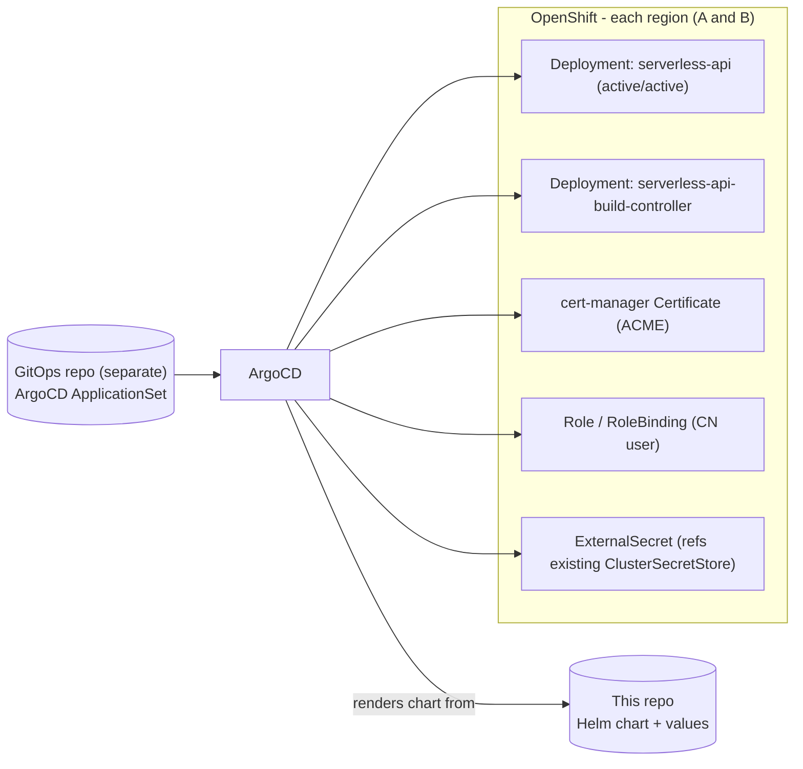

# Deploying & Operating

Installing and running the platform: the Helm charts, GitOps, RBAC, and
sample manifests.

## Contents

- [Deployment & GitOps](#deployment--gitops)
- [Chart Topology](#chart-topology)
- [RBAC](#rbac)
- [Sample Manifests](#sample-manifests)

## Deployment & GitOps

The FastAPI control-plane app is delivered via a **Helm chart that lives in this repo** and
is reconciled by an **ArgoCD `ApplicationSet` that lives in a separate, central GitOps repo**
(this repo does **not** contain the ArgoCD Application/ApplicationSet).



- **Helm chart (this repo)** templates: the API's `Namespace` (annotated
  `argocd.argoproj.io/sync-options: Delete=false,Prune=false` so ArgoCD never
  prunes/deletes it; workload namespaces are per group, `{group}{suffix}`, provisioned at
  runtime by the tenant controller - TENANT-CONTROLLER.md: Tenant Namespaces), the
  trusted-CA-bundle `ConfigMap`, a `serverless-api-regions`
  **`ConfigMap`** holding just the **regions list** - each region's name and its cluster, which
  is the whole profile, since the API server URL is derived from the cluster name and the
  base domain - loaded into both Deployments as the `SERVERLESS_REGIONS` env var (the rest of
  the config is plain `env` on each), a `serverless-api-runtimes` **`ConfigMap`** holding the
  available runtimes, mounted as a YAML file, the **tenant template set** (the per-namespace
  ConfigMaps the tenant controller applies into every `{group}{suffix}` namespace:
  default-deny NetworkPolicies - ARCHITECTURE.md: Networking & Exposure - CA bundle, RBAC,
  build prerequisites - TENANT-CONTROLLER.md: Tenant Namespaces), **three `Deployment`s** - the
  API, the build controller (watches and writes this region only, BUILD-CONTROLLER.md: Digest
  propagation) and the tenant controller - configured under `api`, `buildController` and
  `tenantNamespaces.controller` respectively, sharing the root `image` section for registry
  and pull policy - a `Service` and `Route` for the API alone, with a configurable
  host/labels/annotations (the build controller serves nothing; the tenant controller takes
  a ClusterIP `Service` and no Route, its only caller being the API one namespace away),
  ClusterRoles for the client-cert CN users, bound where each may write (DEPLOYING.md:
  RBAC), cert-manager `Certificate`s, **one ESO `ExternalSecret`
  per kind of data** (each its own target Secret, referencing the pre-existing
  `ClusterSecretStore`; enabled ones `envFrom`'d into the API), and `values.yaml` describing
  the region profiles. It does **not** ship a
  SecretStore, and the API pod runs as the namespace `default` ServiceAccount (cluster auth is
  the client certificate, not the SA token).
- **ArgoCD (separate GitOps repo)**: an `ApplicationSet` generates one Application **per
  region**, each pointing at this repo's chart with a per-region values file. Sync waves order
  Secrets/RBAC before the Deployment; health checks gate rollout.
- All referenced images are the **internal mirrored** images (airgap, ARCHITECTURE.md: Airgapped Considerations).

### Platform prerequisites (installed separately)

This repo's chart **consumes** cluster capabilities that are installed and managed
**elsewhere** (a separate platform/cluster-bootstrap GitOps repo), not by this chart:

| Prerequisite | Provides | Install |
|--------------|----------|---------|
| **OpenShift Serverless Operator** | Knative Serving (`Service`/`DomainMapping` CRDs), kourier ingress in `knative-serving-ingress`, and **automatic OpenShift Route creation** for Knative ingresses | OLM `Subscription` → `KnativeServing` CR (mirrored for airgap via `oc-mirror`) |
| **cert-manager** | issues the API's ACME client certificate (API.md: Authentication & Authorization) | OLM (mirrored) |
| **External Secrets Operator** + `ClusterSecretStore` | projects Vault secrets into the cluster (ARCHITECTURE.md: Secrets Management) | OLM (mirrored) |
| **RHBK** | OIDC identity provider (API.md: Authentication & Authorization) | platform-managed |
| **kpack** + its cluster build content | the build engine, plus the `ClusterStack` and `ClusterStore` the `ClusterBuilder`s here reference by name | the kpack chart (`clusterBuild.stacks` / `clusterBuild.stores`), in the platform chart |
| **Trident Protect** + an `AppVault` | backs up each tenant namespace, when `backup.enabled` (TENANT-CONTROLLER.md: Backups). The chart writes the `Application` and its `Schedule`s; the CRDs and the `AppVault` holding the object store's credentials are the storage administrator's | NetApp Trident Protect, plus one `AppVault` per cluster |

On OpenShift you must use the **OpenShift Serverless Operator** - not an upstream/community
or Helm-based Knative install. The chart assumes the operator's conventions (kourier in
`knative-serving-ingress`, operator-managed Routes, the Knative CRDs).

---

## Chart Topology

Three tiers, split by **cardinality** and **rate of change**:

```
Platform chart                                          once per cluster
└── kpack chart (subchart)  ...... CRDs, controller, webhook, ClusterLifecycle
    ├── ClusterStack        ...... jammy build + run base images   [cluster-scoped]
    ├── ClusterStore        ...... the 21 buildpackages the orders use  [cluster-scoped]
    └── build SA + ExternalSecret  the credential those two pull with

serverless-api chart                            one release per cluster/region
├── ClusterBuilder x3       ...... go | python | node  [cluster-scoped]
├── runtimes ConfigMap      ...... runtime -> builder + version + build env
├── kpack-builder SA        ...... registry push/pull (ClusterBuilders only, no git; API namespace)
├── ExternalSecret          ...... this region's registry dockerconfigjson, API namespace (BUILDING.md: Registry & Git Credentials)
├── ExternalSecret          ...... the kpack registry's, pull-only, API namespace (omitted when it is the region registry)
├── ExternalSecret          ...... every region's Quay OAuth token for registry cleanup (BUILDING.md: Registry cleanup on delete)
├── NetworkPolicy           ...... egress/ingress for build pods only (DEPLOYING.md: Network policy for build pods)
├── Kyverno ClusterPolicy   ...... CA bundle -> build pods (BUILDING.md: Trust: CA Injection)  [cluster-scoped]
├── SCC + ClusterRole       ...... build pods' CNB uid/gid, off by default (DEPLOYING.md: OpenShift SCC for builds)  [cluster-scoped]
├── build-controller Deploy ...... Image watch -> ksvc digest (BUILD-CONTROLLER.md: Digest propagation)
├── tenant-controller       ...... Deploy + the template set for each {group}{suffix} namespace (TENANT-CONTROLLER.md: Tenant Namespaces)
│   └── Trident Protect     ...... Application + hourly/daily/weekly Schedules per namespace, off by default (TENANT-CONTROLLER.md: Backups)
└── (existing: API Deployment + Service + Route, namespaces, CA bundle,
    regions/runtimes ConfigMaps, Certificate, RBAC, tenant NetworkPolicies)
```

The kpack release's buildpack content is described by its own `clusterBuild` values, not
by the kpack chart's defaults, which create no stacks or stores. Seed them from the kpack
repo's `examples/clusterbuild-values.yaml`, keeping the stack and store **names** in step
with `build.stack.name` / `build.store.name` here, and every buildpack id the orders below
name present as a store source. Nothing checks either link at install time - kpack reports
a broken one on the ClusterBuilder's status.

### Builds run beside the workloads

A function's build objects - its `Image`, its build `ServiceAccount` and its git
`Secret` - live in the workload's own namespace, `{group}{suffix}`, beside the KSVC they
belong to (the `ClusterBuilder`s are cluster-scoped, shared by every namespace). Three
things follow, and each removes a moving part rather than adding one:

| | |
|---|---|
| **Ownership** | A function's `Image` and build `ServiceAccount` are ordinary owned resources of its KSVC, carrying the same `ownerReference` as its env Secret and DomainMapping. Deleting the function garbage-collects them - no explicit cleanup path, and no way to orphan an `Image` that would rebuild a deleted function forever (BUILDING.md: Lifecycle & Cleanup). ownerReferences cannot cross namespaces, so this only works co-located. |
| **One git credential** | The workload's `{workload}-git` Secret is the *only* copy of the token. It is `kubernetes.io/basic-auth` carrying `kpack.io/git`, which is the shape kpack clones with, and the API reads the password back to rebuild on a later edit. Split across namespaces this had to be two Secrets holding the same token. |
| **One registry credential per region, per namespace** | `serverless-registry-creds` is pushed with, pulled with by the build pod, and pulled with by the function's KSVC - all in the workload's own namespace, materialized there by the tenant template set's `ExternalSecret` rather than one on each side of a build/run split. The **name** is identical in every namespace and every region because every region's KSVC references it; the contents are that region's, from a per-region Vault path (BUILDING.md: Registry & Git Credentials). |

The cost is that build pods - which execute tenant source and resolve tenant dependency
trees - are scheduled beside the running functions and share their namespace boundary.
That boundary is `networkPolicy` and quota, so the two are worth stating plainly:

- **Network.** Every tenant namespace is default-deny with a narrow allowlist, which a
  build pod would fail under: it must reach git, the registry and the artifact mirror.
  Rather than widen the tenant allowlist, the template set's build policy selects **only**
  pods labelled `kpack.io/build`. NetworkPolicies are additive, so tenant pods keep exactly
  the egress they had.
- **Quota.** A build is far heavier than the function it produces, and it now draws on the
  same namespace quota. `build.resources` bounds it (BUILDING.md: Build pod resources); size the namespace quota for
  concurrent builds plus the running functions, not just the latter.

**Why the split.** `ClusterStack` and `ClusterStore` are **cluster-scoped singletons**:
one object per name per cluster, shared by every consumer. They belong to the build engine
rather than to this application, so they sit in the kpack chart
(`clusterBuild.stacks` / `clusterBuild.stores`) alongside the controller that reconciles
them and the ServiceAccount they pull with. The kpack chart stays generic: it creates
whatever stacks and stores its values describe and knows nothing about Paketo or this
platform.

The builders are per-region content - each region's release composes and pushes its own
builder images to its own registry - so they stay here, referencing the stack and store by
name (`build.stack.name` / `build.store.name`). They are `ClusterBuilder`s all the same: an
`Image` resolves a namespaced `Builder` in the `Image`'s own namespace, and every function's
`Image` lives in its group's `{group}{suffix}` namespace, so a namespaced builder would need
a copy in every one of them; one cluster-scoped builder per runtime serves them all. Having
no namespace of its own, a `ClusterBuilder` names its account through
`spec.serviceAccountRef` - the `kpack-builder` ServiceAccount and the registry credentials it
reads sit in the API's namespace. Cluster-scoped names in a per-region release do assume the
one-release-per-cluster topology the chart is installed with; two releases in one cluster
would fight over them.

The cost of the split is that the `ClusterBuilder` -> `ClusterStore` id contract spans two
releases: a buildpack id in an order with no matching source in the store shows up as a
permanently not-Ready `ClusterBuilder`, not as a chart error. Check
`kubectl get clusterstore <name> -o yaml` first when a builder will not become Ready.

**Ordering.** kpack's CRDs are templated (not in a `crds/` directory) so the conversion
webhook can target the release namespace. A `ClusterStack`/`ClusterStore` therefore cannot
be applied until the CRDs are Established *and* the kpack webhook is admitting. A single
`helm install` of the kpack chart handles that itself (Helm applies CRDs first); with
ArgoCD, keep the engine in an earlier sync wave than serverless-api.

---

## RBAC

The API and build controller share one identity (per API.md: Authentication & Authorization, the cert CN
user) and one set of rules. Those rules live in a **ClusterRole**, bound by a RoleBinding in
each namespace the identity may write - which keeps the writes namespace-scoped while
letting a namespace created at runtime carry the binding without carrying a copy of the
rules. In every such namespace, in every cluster, they need:

| Resource | Verbs | Used by |
|----------|-------|---------|
| `services.knative.dev` | get, list, watch, create, update, patch, delete | API (the workload), build controller (the built digest - BUILD-CONTROLLER.md: Digest propagation) |
| `images.kpack.io` | get, list, watch, create, update, patch, delete | API (write), build controller (watch) |
| `builds.kpack.io` | get, list, watch, patch | status resolution (FUNCTIONS.md: Function Status Resolution), log lookup, and the rebuild trigger - an annotation on the latest Build (BUILDING.md: What causes a new Build). Never create or delete: kpack owns their lifecycle |
| `pods`, `pods/log` | get, list | per-phase build logs (BUILDING.md: Build Flow) |
| `serviceaccounts` | get, list, create, update, patch, delete | the per-function build account (BUILDING.md: Registry & Git Credentials) |

No second Role and no extra Secret rights: the git Secret is one of the workload's own
derived Secrets, which this identity already manages. The build controller reuses the same
client certificate rather than minting its own - it is a subset of the API's verbs, on the
same two resources.

Two things are cluster-scoped, and only these two. A **read-only** ClusterRole
(`{name}-read`) covers Knative Services, DomainMappings, Revisions, namespaces and the
kpack objects: host uniqueness has to be checked across every tenant namespace, and the
build controller follows Images wherever they are built. It holds no verb that changes
anything. And the **tenant_controller** has an identity of its own - a second certificate, a
second CN - because it creates namespaces and writes their policies, which is exactly what
the API must not be able to do. Neither can do the other's damage:

| Identity | May | May not |
|----------|-----|---------|
| `serverless-api.clients.{domain}` | write workloads inside a tenant namespace; read Knative and kpack objects cluster-wide | create, change or delete a namespace; write a NetworkPolicy |
| `serverless-tenant-controller.clients.{domain}` | create tenant namespaces and write the resources the template set renders - including the namespace's Trident Protect `Application` and `Schedule`s; read Knative Services (for the GC) | touch a workload |

### Network policy for build pods

Every tenant namespace is default-deny with a narrow allowlist, and a build pod needs
more than a function does - git, the registry, the artifact mirror. The template set's
build policy (`networkPolicy.build`) selects **only** pods labelled `kpack.io/build`.
NetworkPolicies are additive, so tenant pods keep exactly the egress they had; nothing is
widened for them. Both sets of policies are part of the tenant template set, so every
`{group}{suffix}` namespace carries them.

An off-cluster git/registry/mirror is already covered by the namespace's external-egress
rule. `egressNamespaces` / `egressCIDRs` are for in-cluster ones, which that rule excludes
along with the rest of the pod and service networks.

`ClusterBuilder` (this chart) and `ClusterStack`/`ClusterStore` (the kpack chart) are
managed by Helm/ArgoCD, not by the services - no runtime write permission on them.

### OpenShift SCC for builds

kpack sets a build pod's `runAsUser` from the builder image's CNB user and an `fsGroup`
from its CNB group. On the Paketo jammy images those are **not the same number** - uid
1001, gid 1000. OpenShift's default `restricted-v2` SCC allocates uids from the namespace's
own range and rejects an explicit one outside it. With no other SCC available to the pod's
ServiceAccount, admission finds nothing that admits it and the build never starts:

```
pods "hello-build-1-build-pod" is forbidden: unable to validate against any
security context constraint: ... .spec.securityContext.fsGroup: Invalid value:
[]int64{1000}: 1000 is not an allowed group, provider restricted-v2:
.initContainers[0].runAsUser: Invalid value: 1001: must be in the ranges:
[1001290000, 1001299999]
```

The tail of that message is the useful part: it names the exact ids the pod asked for, which
is what `build.scc.runAsUser` and `.fsGroup` have to match.

**This fails per function, not per install.** A `ClusterBuilder` is composed by the kpack
controller itself (no build pod), but a function build runs as the `{workload}-build`
account the API creates at request time in the group's own namespace - so the symptom
appears on the first function build, after everything else looked healthy.

`build.scc.enabled` ships a `SecurityContextConstraints` granting exactly those ids and
nothing more: no host namespaces, no added capabilities, no privilege escalation, all
capabilities dropped, `runtime/default` seccomp. It carries no `priority`, so it is used
only for pods `restricted-v2` cannot admit and everything else in the namespace keeps its
usual constraint. Reach for the shipped `anyuid` instead and you also permit uid 0.

Because the per-function accounts cannot be named ahead of time, the template set's
RoleBinding grants it to each tenant namespace's whole ServiceAccount group, with subject
`system:serviceaccounts:{group}{suffix}`. That is a real widening - a tenant KSVC pod in
that namespace could also request uid 1000 - and it is why the SCC is written this
narrowly.

| Setting | Default | Notes |
|---------|---------|-------|
| `build.scc.enabled` | `false` | SCCs do not exist outside OpenShift. |
| `build.scc.runAsUser` | `1001` | The builder image's `CNB_USER_ID` (Paketo jammy). |
| `build.scc.fsGroup` | `1000` | Its `CNB_GROUP_ID` - a *different* number on jammy. Confirm both with `skopeo inspect --config docker://<build image> \| jq '.config.Env'` before changing base images. |
| `build.scc.volumes` | see values | `persistentVolumeClaim` is needed only for kpack's volume build cache. |

If a build still fails admission after this, the controller log names the offending field -
each SCC it tried and why that one rejected the pod:

```bash
oc -n kpack logs deploy/kpack-controller | grep -o 'unable to validate.*'
```

---

## Sample Manifests

The platform-side objects; the build objects (kpack Image, ClusterBuilder, ClusterStack,
build ServiceAccount, Kyverno CA policy) are under BUILDING.md: Sample Manifests.

> Illustrative only - final values are templated by Helm and parameterized per region.

### Knative Service (KSVC)

```yaml
apiVersion: serving.knative.dev/v1
kind: Service
metadata:
  name: orders-api             # the plain workload name; the namespace scopes it
  namespace: team-serverless   # {group}{tenantNamespaces.suffix}
  labels:
    serverless.platform/group: team
    serverless.platform/workload: orders-api
    serverless.platform/managed-by: serverless-api
  annotations:
    serverless.platform/host: orders-api-team.serverless.example.com   # {name}-{group}.{route_domain}
spec:
  template:
    metadata:
      annotations:
        autoscaling.knative.dev/min-scale: "1"
        autoscaling.knative.dev/max-scale: "8"
        autoscaling.knative.dev/metric: "concurrency"
        autoscaling.knative.dev/target: "50"
    spec:
      imagePullSecrets:
        - name: orders-api-pull
      containers:
        - image: registry.internal/team/orders-api:1.4.2
          resources:                     # from size (e.g. medium); mem request==limit, cpu request-only
            requests: { cpu: 250m, memory: 512Mi }
            limits:   { memory: 512Mi }
          env:
            - name: LOG_LEVEL
              value: info
          volumeMounts:
            - name: app-config
              mountPath: /etc/app
            - name: ca-bundle            # injected CA bundle, mounted into every workload
              mountPath: /etc/ssl/certs
              readOnly: true
      volumes:
        - name: app-config
          configMap:
            name: orders-config
        - name: ca-bundle
          configMap:
            name: ca-bundle
```

### Trusted CA bundle ConfigMap (every namespace, OpenShift-injected)

```yaml
apiVersion: v1
kind: ConfigMap
metadata:
  name: ca-bundle
  namespace: team-serverless        # from the template set; also in serverless-api
  labels:
    config.openshift.io/inject-trusted-cabundle: "true"   # OpenShift fills .data
  annotations:
    argocd.argoproj.io/sync-options: Prune=false
# .data (ca-bundle.crt) is populated by OpenShift; configure ArgoCD to ignore it.
```

### Knative DomainMapping (custom host; operator creates the Route)

> On OpenShift Serverless the API does **not** create an OpenShift Route. It creates a
> `DomainMapping` for the custom host in each cluster, and the Serverless Operator
> auto-provisions the corresponding Route. The host is identical in both clusters;
> `*.serverless.{base_domain}` DNS forwards to the active region.

```yaml
apiVersion: serving.knative.dev/v1beta1
kind: DomainMapping
metadata:
  name: orders-api-team.serverless.example.com   # the custom host, {name}-{group}.{route_domain}
  namespace: team-serverless                     # the KSVC's namespace
  labels:
    serverless.platform/group: team
    serverless.platform/workload: orders-api
    serverless.platform/offering: container
spec:
  ref:
    name: orders-api             # the workload's KSVC, named {name}
    kind: Service
    apiVersion: serving.knative.dev/v1
```

### cert-manager Certificate (cluster client cert, CN = DNS name, ACME)

```yaml
apiVersion: cert-manager.io/v1
kind: Certificate
metadata:
  name: serverless-api-central-client
  namespace: serverless-api
spec:
  secretName: central-client                       # mounted into the API pod
  commonName: serverless-api.clients.example.com  # DNS name => Kubernetes username
  dnsNames:
    - serverless-api.clients.example.com          # required for ACME issuance
  usages:
    - client auth
  issuerRef:
    name: internal-acme                # ACME ClusterIssuer (internal ACME endpoint, airgap)
    kind: ClusterIssuer
```

### RBAC for the CN user (per region; the rules cluster-scoped, the grant per namespace)

```yaml
apiVersion: rbac.authorization.k8s.io/v1
kind: ClusterRole
metadata:
  name: serverless-api-workloads
rules:
  - apiGroups: ["serving.knative.dev"]
    resources: ["services", "domainmappings"]
    verbs: ["get", "list", "watch", "create", "update", "patch", "delete"]
  - apiGroups: ["serving.knative.dev"]  # read-only: actualReplicas + the failure detail
    resources: ["revisions"]
    verbs: ["get", "list"]
  - apiGroups: [""]
    resources: ["secrets", "configmaps"]
    verbs: ["get", "list", "create", "update", "patch", "delete"]
  - apiGroups: [""]
    resources: ["pods", "events"]
    verbs: ["get", "list", "watch"]
  - apiGroups: [""]
    resources: ["pods/log"]              # for GET /api/serverless/v1/groups/{group}/{type}/{name}/logs
    verbs: ["get"]
  - apiGroups: ["metrics.k8s.io"]        # live per-region usage on /stats
    resources: ["pods"]
    verbs: ["get", "list"]
  # The rest is gated on build.enabled (see templates/rbac.yaml):
  - apiGroups: ["kpack.io"]
    resources: ["images"]
    verbs: ["get", "list", "watch", "create", "update", "patch", "delete"]
  - apiGroups: ["kpack.io"]              # patch only, for the rebuild trigger annotation
    resources: ["builds"]
    verbs: ["get", "list", "watch", "patch"]
  - apiGroups: [""]                      # the per-function build ServiceAccount
    resources: ["serviceaccounts"]
    verbs: ["get", "list", "create", "update", "patch", "delete"]
---
# One per tenant namespace, written by the tenant controller from the template set.
apiVersion: rbac.authorization.k8s.io/v1
kind: RoleBinding
metadata:
  name: serverless-api-workloads
  namespace: team-serverless
subjects:
  - kind: User
    name: serverless-api.clients.example.com   # matches the Certificate CN (DNS name)
    apiGroup: rbac.authorization.k8s.io
roleRef:
  kind: ClusterRole            # the rules; this binding grants them in THIS namespace only
  name: serverless-api-workloads
  apiGroup: rbac.authorization.k8s.io
```

### ESO - ExternalSecret only (references pre-existing ClusterSecretStore)

> The `ClusterSecretStore` already exists in the clusters and is **not** shipped by this
> repo. We deploy only the `ExternalSecret` below, referencing it by name.

Each **kind** of data gets its own `ExternalSecret`/target Secret (separate rotation and
exposure); the chart renders one per enabled entry in `externalSecrets.secrets` and the
Deployment `envFrom`s each enabled Secret (so `secretKey`s must be valid env var names).

```yaml
# e.g. the admin API-keys Secret (separate from the SSO secret)
apiVersion: external-secrets.io/v1beta1
kind: ExternalSecret
metadata:
  name: serverless-api-keys
  namespace: serverless-api
spec:
  refreshInterval: 1h
  secretStoreRef:
    name: vault-backend            # <-- name of the PRE-EXISTING ClusterSecretStore
    kind: ClusterSecretStore
  target:
    name: serverless-api-keys      # consumed by the API via envFrom
  data:
    - secretKey: SERVERLESS_ADMIN_API_KEY
      remoteRef:
        key: cloudlet/platforms/serverless-api
        property: admin-api-key
    # Only where the SSO realm forbids PUBLIC clients: with this set the API
    # proxies Swagger's token exchange and adds the secret server-side, so the
    # client can be confidential (docs/API.md - The Swagger "Authorize"
    # client). Otherwise OMIT the entry entirely - an empty Vault property fails
    # the whole ExternalSecret, taking the other keys in it down too.
    - secretKey: SERVERLESS_SSO__SWAGGER_CLIENT_SECRET
      remoteRef:
        key: cloudlet/platforms/serverless-api
        property: swagger-client-secret
```

### ArgoCD ApplicationSet - *reference only (lives in the separate GitOps repo)*

> This manifest is **not** part of this repository. It is shown so the platform team can wire
> this chart into the central GitOps repo's `ApplicationSet`, generating one Application per
> region that renders `charts/serverless-api` with a per-region values file.

```yaml
apiVersion: argoproj.io/v1alpha1
kind: ApplicationSet
metadata:
  name: serverless-api
  namespace: argocd
spec:
  generators:
    - list:
        elements:
          - region: central
            cluster: https://api.central-0.example.com:6443
            valuesFile: values-central.yaml
          - region: south
            cluster: https://api.south-0.example.com:6443
            valuesFile: values-south.yaml
  template:
    metadata:
      name: "serverless-api-{{region}}"
    spec:
      project: serverless
      source:
        repoURL: https://git.internal/team/serverless.git   # THIS repo (the chart)
        targetRevision: main
        path: charts/serverless-api
        helm:
          valueFiles:
            - "{{valuesFile}}"
      destination:
        server: "{{cluster}}"        # deploy the API into each cluster (active/active)
        namespace: serverless-api
      syncPolicy:
        automated: { prune: true, selfHeal: true }
        syncOptions: [ "CreateNamespace=false" ]
```

---
