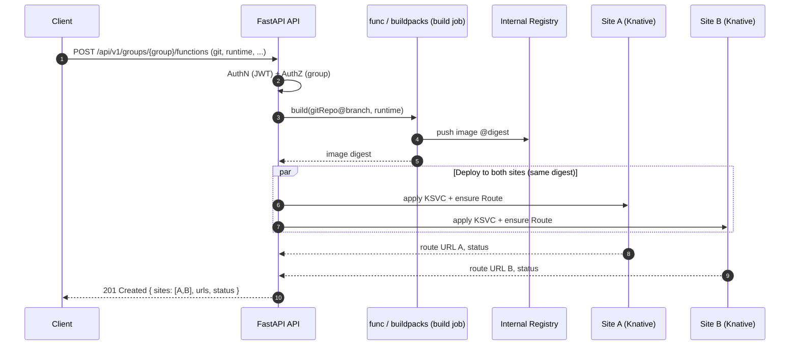

# Functions (FaaS)

Running a function built from source. How the image is built is BUILDING.md;
what functions share with containers is ARCHITECTURE.md.

## Contents

- [Overview](#overview)
- [API - create & update](#api---create--update)
- [Rebuilding without changing anything](#rebuilding-without-changing-anything)
- [Function Status Resolution](#function-status-resolution)

## Overview

**Inputs (request body):**

| Field | Required | Notes |
|-------|----------|-------|
| `gitRepo` | yes | HTTPS Git repository URL (internal Git, airgapped). `http://` is accepted for an internal host, but sends the token in the clear. SSH/scp-style refs (`git@host:org/repo.git`) are rejected: the clone authenticates with a basic-auth Secret, which only applies over http(s). Credentials embedded in the URL are rejected rather than stripped - it is written verbatim to the kpack `Image`, which is readable far more widely than the Secret; send the token as `gitToken`. |
| `branch` | yes | Branch / ref to build. |
| `path` | no | Directory inside the repository holding the application, for a monorepo (e.g. `services/api`). Defaults to the repository root. Surrounding `/` are stripped; `..` is rejected. Changing it rebuilds. |
| `gitToken` | yes | Repo access token; used to clone and **stored** in the `{workload}-git` Secret so a later edit can rebuild without re-sending it. Never returned on read (see ARCHITECTURE.md: Secrets Management). |
| `runtime` | yes | One of the platform's configured runtimes (default `python`, `go`, `node`). The set is **data**: a ConfigMap mounted as a YAML file (`services.runtimes`), validated against the live registry in the service layer and advertised on `GET /api/v1/functions/info`. Adding a runtime is a ConfigMap edit, not a code change. |
| `name` | yes | Logical workload name (DNS-1123). |
| `port` | no | Container port the workload listens on. Defaults to **8080** - what Knative injects as `$PORT`, and what most images serve on - and is stamped explicitly on the KSVC so a read reports it rather than leaving it to convention. Send it only when the image serves elsewhere: nothing can detect that, so a mismatch shows up as a revision that never becomes ready (the cause lands on the per-site `error`), not as a rejected request. Replaced on `PUT`, so omitting it returns the workload to 8080. Bounds and the default are advertised on `GET /api/v1/functions/info`. | Identical to a container's: an app either serves on 8080 or it does not, and which offering built it changes nothing. It is **not** a build input, so changing it costs a revision, not a rebuild.
| `env`, `files`, `scaling` | no | Shared capabilities, see ARCHITECTURE.md: Shared capabilities. |

**Build flow (Knative Functions / buildpacks):**

1. The API launches a **build** (in-cluster) using **Knative Functions** (`func`) with
   **Cloud Native Buildpacks**. The builder/run images are the **mirrored** versions hosted
   in the internal registry (see ARCHITECTURE.md: Airgapped Considerations) - buildpack autodetection picks the right
   Python/Go/JS buildpack.
2. Source is cloned from `gitRepo@branch` using `gitToken`.
3. The resulting OCI image is pushed to the **internal container registry** under a
   deterministic tag, e.g. `registry.internal/<group>/<name>:<gitsha>`.
4. The API then creates/updates the **KSVC** referencing that image (ARCHITECTURE.md: Shared capabilities), in **both
   sites**.

> The build runs once and the **same image digest** is deployed to both sites to guarantee
> bit-for-bit parity across the active/active pair.



## API - create & update

Request:

```json
{
  "name": "image-resizer",
  "gitRepo": "https://git.internal/team/image-resizer.git",
  "branch": "main",
  "gitToken": "<repo-access-token>",
  "runtime": "python",
  "env": [ { "name": "MAX_PX", "value": "2048" } ],
  "scaling": { "minScale": 0, "maxScale": 20 }
}
```

Response `202 Accepted` (deploy runs in the background; poll `statusUrl`):

```json
{
  "name": "image-resizer",
  "type": "function",
  "runtime": "python",
  "hostname": "image-resizer-team.serverless.example.com",
  "overallStatus": "Pending",
  "sites": [],
  "statusUrl": "/api/v1/groups/team/functions/image-resizer"
}
```

Then `GET /api/v1/groups/team/functions/image-resizer` once Ready:

The response is a **`FunctionResponse`** - flat, mirroring the `FunctionCreate`
body (secrets redacted) with the live status alongside:

```json
{
  "name": "image-resizer",
  "group": "team",
  "type": "function",
  "hostname": "image-resizer-team.serverless.example.com",
  "overallStatus": "Ready",
  "size": "small",
  "createdAt": "2026-06-21T15:00:00+03:00",
  "runtime": "python",
  "gitRepo": "https://git.example.com/team/image-resizer.git",
  "branch": "main",
  "scaling": { "minScale": 0, "maxScale": 3, "metric": "concurrency", "target": 100 },
  "env": [
    { "name": "LOG_LEVEL", "value": "debug", "secret": false },
    { "name": "API_KEY", "value": null, "secret": true }
  ],
  "files": [
    { "mountPath": "/etc/app/config.yaml", "readOnly": true, "secret": false,
      "content": "level: debug\n" },
    { "mountPath": "/etc/app/token", "readOnly": true, "secret": true, "content": null }
  ],
  "sites": [
    { "site": "central", "status": "Ready", "revision": "image-resizer-00001", "replicas": 2 },
    { "site": "south", "status": "Ready", "revision": "image-resizer-00001", "replicas": 1 }
  ]
}
```

A **`ContainerResponse`** is the same idea mirroring `ContainerCreate`: instead of
`gitRepo`/`branch`/`runtime` it carries `image` and `registryUsername`. (Functions
expose **no image** - the built image is an internal artifact; the client deals in
source, not images.)

> **Shape.** Each offering has its own response model (`FunctionResponse` /
> `ContainerResponse`) so the response is the same shape as the create body - no
> irrelevant fields (a container never shows `gitRepo`; a function never shows
> `registryUsername`). Both share `WorkloadBase` (name, group, type, hostname,
> overallStatus, size) with the list summary. `hostname` is the bare external host
> (no scheme), mirroring the create body's `hostname`; reach the workload at
> `https://{hostname}`. The desired-state fields (`scaling`, `env`, `files`, plus
> the source fields) are read from the **local site** (uniform across sites); the
> per-site `sites[]` status/`replicas` come from fanning out to every site. Live
> **usage** is not here - see the `/stats` endpoint below.
>
> **Redaction & keep-on-write.** Secret material is never returned: secret-backed env
> values and secret file contents come back `null` with `secret: true`; the **git token**
> is omitted and the **registry token** is not shown (`registryUsername` is). Non-secret env
> values and non-secret file contents (from the workload's ConfigMap) are returned in full.
> Because the read is redacted, `PUT` treats a **redacted/absent secret field as "keep the
> stored value"**: a `secret: true` env var or file sent without a value/content keeps what's
> stored; echoing the stored `registryUsername` back without a token keeps the credential -
> re-keyed to the current image's registry if the image moved (sending a *different* username
> without a token is a `400`, since there's no token to rotate with); omitting `gitToken` keeps
> the stored git token. So the redacted GET body can be sent straight back on `PUT` without wiping a secret.
> To change a secret, send its new value; to remove an env var or file, drop it from the list;
> to make a private image public, send **neither** registry cred (dropping the username, like
> dropping an env var, removes the pull secret). `scaling.target` reflects the *effective*
> target deployed (an omitted cpu/memory target shows `70`).
>
> **Keep is `null`, not `""`.** Only an omitted/`null` value is a keep; an empty string is a
> real value that **sets** the secret to empty. So a secret var/file must be sent with its
> `value`/`content` omitted (`null`) to keep it - never `""`. A **new** secret (one not
> already stored) sent with a `null` value is a synchronous `400` (`"…has no value and none is
> stored to keep"`): keep only applies to something already stored, so a new secret must carry
> its value. A non-secret var/file always requires a value. These checks run in the update
> pre-flight, so they surface as an immediate `400`, not a background deploy failure.
>
> **Live status.** `replicas` is the autoscaler's live scale
> (`Revision.status.actualReplicas`), best-effort and `null` when it cannot be read.
> It rides along on a read the per-site error detail needs anyway, which is why it
> is on this response and live **usage** is not: measuring usage is a PodMetrics
> call per site, and the full GET is not the endpoint to poll.
>
> **Polling live state: `GET .../{name}/stats`.** A lightweight view of what
> changes on its own - the rollup, replica count and resource usage, nothing else:
>
> ```json
> {
>   "overallStatus": "Ready",
>   "replicas": 3,
>   "usage": { "cpu": "210m", "memory": "355Mi" },
>   "sites": [
>     { "site": "central", "status": "Ready", "replicas": 2,
>       "usage": { "cpu": "120m", "memory": "180Mi" } },
>     { "site": "south", "status": "Ready", "replicas": 1,
>       "usage": { "cpu": "90m", "memory": "175Mi" } }
>   ]
> }
> ```
>
> `overallStatus` matches the full GET's, `Building` included - the build is still
> read, it is just not a field here. Usage covers each pod's user container only,
> never the queue-proxy sidecar, and is `null` when scaled to zero or the metrics
> API could not be read. The top-level totals are summed across sites **before**
> rounding, so they need not equal the sum of the printed per-site figures; and a
> total is `null` if any site could not be measured, rather than one quietly
> missing a site. Usage is never fresher than the cluster's metrics-server scrape.

### Editing a workload: `PUT` request recipes

All `PUT`s are a **full replace** of the mutable spec: whatever you send is the new
desired state, with the keep-on-write rules above for secrets. The list of `env`/`files`
entries you send is the complete set (drop one to remove it). Each example is a body for
`PUT /api/v1/groups/{group}/{containers|functions}/{name}`.

**Config-only edit - keep every secret (echo the redacted GET straight back).** The
secret env value and the registry token were `null` in the GET; sending them back unchanged
keeps them:

```json
{
  "image": "reg.example.com/team/orders:1",
  "registryUsername": "svc-team",
  "scaling": { "minScale": 1, "maxScale": 5 },
  "env": [
    { "name": "LOG_LEVEL", "value": "debug", "secret": false },
    { "name": "API_KEY", "secret": true }
  ]
}
```

**Rotate one secret, keep another, remove a third.** `API_KEY` gets a new value; `DB_URL`
is kept (no value); the previously-present `OLD_FLAG` is simply absent, so it's removed:

```json
{
  "image": "reg.example.com/team/orders:1",
  "registryUsername": "svc-team",
  "env": [
    { "name": "API_KEY", "value": "sk-new-value", "secret": true },
    { "name": "DB_URL", "secret": true }
  ]
}
```

**Add a new secret - must carry a value** (a new `secret: true` with no value is a `400`):

```json
{ "image": "reg.example.com/team/orders:1", "registryUsername": "svc-team",
  "env": [ { "name": "NEW_TOKEN", "value": "s3cret", "secret": true } ] }
```

**Rotate registry credentials** (username + token together):

```json
{ "registryUsername": "svc-team", "registryToken": "new-registry-pat" }
```

**Move to a different registry, keep the same creds** (username only → kept creds are
re-keyed to the new image's registry):

```json
{ "image": "reg-b.example.com/team/orders:2", "registryUsername": "svc-team" }
```

**Make a private image public** (drop both registry creds → the pull secret is removed):

```json
{ "image": "docker.io/library/nginx:1.27" }
```

**Rebuild a function from a new branch - no token needed** (the stored git token is reused):

```json
{ "branch": "release", "runtime": "python", "scaling": { "minScale": 0, "maxScale": 3 } }
```

**Rotate the git token** (sending it also triggers a rebuild):

```json
{ "gitToken": "ghp_new-token" }
```

## Rebuilding without changing anything

A `PUT` rebuilds only when a build **input** changes (or the token rotates), because
re-applying an unchanged spec is a no-op kpack does not build from. That leaves the
opposite need unserved: build the *same* definition again, against today's base image and
dependencies. That is a `POST`, and it takes **no body**:

```
POST /api/v1/groups/{group}/functions/{name}/rebuild   ->   202 Accepted
```

Every input comes back off the workload itself - `gitRepo`, `branch`, `path`, `runtime`
and `version` from the KSVC's annotations, the token from the `{workload}-git` Secret -
which is the same reconstruction a site that has never built the function does after a
switchover (BUILDING.md: Reconstruction after switchover). Nothing is accepted from the
request: a rebuild that took inputs would be a `PUT` in disguise.

Use it to:

- pick up a **base-image or buildpack** change on a function nobody is editing (kpack does
  this on its own for `STACK`/`BUILDPACK` updates; this is the on-demand version);
- **retry a failed build** without inventing a spec change to force one;
- build a **pushed commit now** rather than when kpack next re-resolves the branch.

The response is the same `Pending` 202 as create and update, with the same `statusUrl`, so
a client polls one place: `GET .../functions/{name}` reports `build.state` as `Building`
and then `Ready` or `Failed`.

What it deliberately does **not** do:

| | |
|---|---|
| Touch the workload | Nothing about the desired state changes, so no KSVC is applied and no revision is spawned. The running revision keeps serving its current digest until the new one is rolled out (BUILDING.md: Ownership: API vs Build Service) - as for any build kpack starts on its own. |
| Take a commit SHA | Pinning the exact commit that was pushed is the webhook's job (`BuildRequest.revision`); a rebuild builds the branch head, which is what create and update do. |
| Change the spec | Send a `PUT` for that. A rebuild is the one function write that carries no desired state at all. |

**Errors.** `404` if there is no such function (including a *container* of the same name -
`{name}-{group}` is shared by both offerings). `400` if there is nothing to build with: no
stored git token (send one with a `PUT`), or a `runtime` that has since been removed from
the runtimes ConfigMap. Both are decided synchronously, before the `202`.

And `GET /api/v1/groups/team/functions` to list the group's functions - general
info only (no live usage/replicas; use the single-workload GET for those):

```json
[
  {
    "name": "image-resizer",
    "group": "team",
    "type": "function",
    "hostname": "image-resizer-team.serverless.example.com",
    "overallStatus": "Ready",
    "size": "small",
    "createdAt": "2026-06-21T15:00:00+03:00",
    "sites": ["central", "south"]
  }
]
```

> The list **fans out to all sites** and merges by workload name (best-effort):
> each workload's `sites` lists the sites that returned it and `overallStatus` is
> rolled up across them (`Ready`/`Deploying`/`Degraded`, or `Terminating` while a
> workload is being deleted). A site that is unreachable is skipped; only if
> **every** site is down does the call fail (502). It returns general info only (no
> live replicas/usage) - use the single-workload GET for per-site live health.

## Function Status Resolution

`GET` on a function resolves status **build-first, deployment-second**:

```
GET /functions/{name}
  1. look up the Image / latest Build in the LOCAL cluster
       building  -> return "building"  (+ build reason, phase, started-at)
       failed    -> return "build failed" (+ failure detail, log pointer)
  2. no Image found, or the build succeeded
       -> fall through to the Knative Service status (existing behaviour)
```

Two properties this gives us:

- A function whose first build is still running reports **building** rather than a
  confusing "not ready" ksvc state.
- After a switchover the local cluster has **no** `Image`, so step 1 finds nothing and the
  handler falls through to the ksvc - correctly reporting the function as **serving**, since
  it is still running the previously-built digest. The absence of a build is not an error.

Build detail is read from the local cluster only; there is no cross-site aggregation on this
path (the ksvc fan-out in ARCHITECTURE.md: Multi-Site (Active/Active HA) Design is unchanged). That read is complete precisely
because the build site is always local: if an `Image` exists at all, it exists here.

**As implemented.** `KpackBackend.status` returns `None` when the local site has no `Image`
- the switchover case above - and `with_build_status` folds the rest into the rollup:
`Building` wins over whatever the ksvc says, `Failed` reports `Degraded`, and anything else
hands the verdict back to the ksvc. The response carries a `build` object
(`state`/`image`/`message`), so a failed build explains itself instead of surfacing as a
bare image-pull error. `Building` maps to HTTP `202`, like `Deploying`.

The first build is the case that motivates the ordering: the ksvc is already applied and is
failing to pull an image kpack has not pushed yet. Read deployment-first, every new function
would report `Degraded` for the whole of its first build.

**The rule applies to every surface that reports status, not just the rollup.** Two of them
used to escape it, and both showed a red failure for a perfectly normal build:

- The **per-site rows**. `sites[]` is read straight off each ksvc, so a response could say
  `Building` in `overallStatus` and `Failed` - `Unable to fetch image "..."` in the `sites`
  table directly below it. While a build is in flight a failing site now reports `Building`
  with `error: null` (`ksvc_state.sites_with_build_status`): that pull failure *is* the
  running build, not an independent one. Only a **running** build masks anything - a failed
  build leaves the rows untouched, because then the image genuinely never arrives.
- The **listing**. `GET .../functions` had no build read at all, so every new function
  was `Degraded` on the list while being `Building` on its own GET. It now folds the same
  way, using `BuildBackend.statuses` - one label-selected read of the local site's `Image`s
  for the whole group, keyed by object name (`{name}-{group}`), overlapped with the ksvc
  fan-out rather than chained onto it. A listing that cannot read kpack falls back to the
  ksvc statuses, exactly as a single GET does.

`Building` is therefore a *site* status as well as a workload one, and `GET /info` publishes
it in both vocabularies so a client hardcodes neither.

---