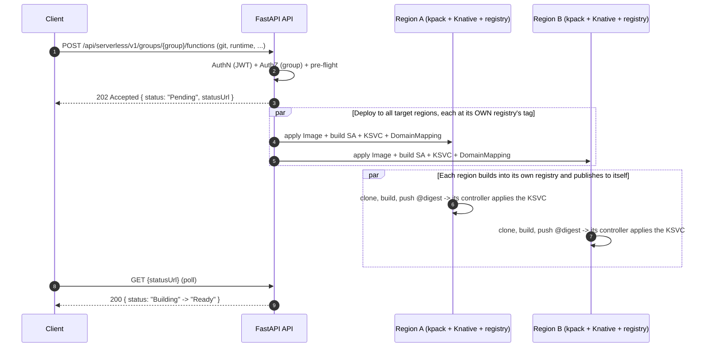
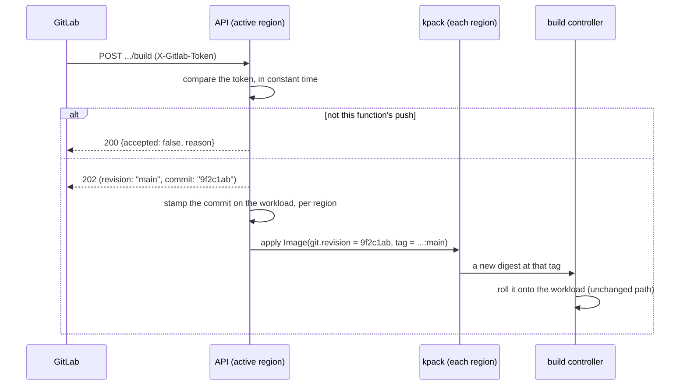

# Functions (FaaS)

Running a function built from source. How the image is built is BUILDING.md;
what functions share with containers is ARCHITECTURE.md.

## Contents

- [Overview](#overview)
- [API - create & update](#api---create--update)
- [Building again without changing anything](#building-again-without-changing-anything)
- [Git webhook](#git-webhook)
- [Function Status Resolution](#function-status-resolution)

## Overview

**Inputs (request body):**

| Field | Required | Notes |
|-------|----------|-------|
| `gitRepo` | yes | HTTPS Git repository URL (internal Git, airgapped). `http://` is accepted for an internal host, but sends the token in the clear. SSH/scp-style refs (`git@host:org/repo.git`) are rejected: the clone authenticates with a basic-auth Secret, which only applies over http(s). Credentials embedded in the URL are rejected rather than stripped - it is written verbatim to the kpack `Image`, which is readable far more widely than the Secret; send the token as `gitToken`. |
| `revision` | no | What to build: a **branch**, a **tag**, or a **commit SHA** - git resolves all three the same way and the platform does not distinguish them. Defaults to **`main`**, and is *replaced* on `PUT` - omitting it returns the function to `main` and rebuilds. A revision naming a branch follows that branch's head; a tag or a commit is fixed, and no push moves it (Git webhook, below). |
| `path` | no | Directory inside the repository holding the application, for a monorepo (e.g. `services/api`). Defaults to the repository root. Surrounding `/` are stripped; `..` is rejected. Changing it rebuilds. |
| `gitToken` | yes on create | Repo access token; used to clone and **stored** in the `{workload}-git` Secret so a later edit can rebuild without re-sending it. Never returned on read (see ARCHITECTURE.md: Secrets Management). The one keep-on-omit field on `PUT`: omitting it reuses the stored token, sending it rotates it (and rebuilds). |
| `runtime` | yes | One of the platform's configured runtimes (the chart ships `python`, `go`, `node`). The set is **data**: a ConfigMap mounted as a YAML file (`api/services/builder/runtimes.py`), validated against the live registry in the service layer and advertised on `GET /api/serverless/v1/functions/info`. Adding a runtime is a ConfigMap edit, not a code change. |
| `version` | no | Language version, which must be one of that runtime's advertised `versions`. Omitted takes the platform `defaultVersion` for the runtime - never the buildpack's own default, which drifts with the buildpackage. A runtime offering no choice (empty `versions`, or no `versionEnv`) **rejects** a supplied version rather than ignoring it. Replaced on `PUT` like `revision`, and changing it rebuilds. |
| `name` | yes | Logical workload name (DNS-1123). `{name}-{group}` must fit in 63 characters together - see `naming` on `GET /api/serverless/v1/functions/info`. |
| `port` | no | Container port the workload listens on. Defaults to **8080** - what Knative injects as `$PORT`, and what most images serve on - and is stamped explicitly on the KSVC so a read reports it rather than leaving it to convention. Send it only when the image serves elsewhere: nothing can detect that, so a mismatch shows up as a revision that never becomes ready (the cause lands on the per-region `message`), not as a rejected request. Replaced on `PUT`, so omitting it returns the workload to 8080. Bounds and the default are advertised on `GET /api/serverless/v1/functions/info`. | Identical to a container's: an app either serves on 8080 or it does not, and which offering built it changes nothing. It is **not** a build input, so changing it costs a revision, not a rebuild.
| `env`, `files`, `scaling` | no | Shared capabilities, see API.md: Shared sub-schemas. |

There is no `regions` field. A workload is deployed to **every** configured region, on
create and on `PUT` alike - placement is not a client choice (ARCHITECTURE.md: Region
selection). Each region **builds its own copy**, into its own registry: a region builds
what it runs (BUILDING.md: Ownership: API vs Build Service).

**Build flow (kpack / Cloud Native Buildpacks):**

The API does not *run* builds; it **declares** them. Full detail is in BUILDING.md - this
is the shape:

1. The API validates the request and returns **`202 Accepted`**. Nothing is built yet.
2. In the background it applies, to the **local** region only, the function's kpack `Image`
   plus the per-function build `ServiceAccount`; the `{workload}-git` Secret holding
   `gitToken` goes to **every target region**, so each can build and rebuild on its own.
3. **kpack** does the rest on its own: clone `gitRepo@revision`, run the runtime's `Builder`
   (the mirrored Paketo stack and buildpackages - ARCHITECTURE.md: Airgapped Considerations),
   and push to **that region's** registry at
   `{region registry base}/{group}/{name}:{revision}` (RUNTIMES.md: Registry layout).
4. In the same pass as step 2, the API applies the **KSVC** to every target region, pointing
   at that **tag**. Until a build lands there is no image to pull, which is why a new
   function reads `Building` rather than `Failed` (see *Function Status Resolution*).
5. When a build finishes, **that region's** build controller - a separate Deployment watching
   `Image.status.latestImage` - rolls the resulting **digest** onto the function's KSVC
   **there** (BUILD-CONTROLLER.md: Digest propagation). After the create, it is the only thing that
   writes that field.

> The tag is a projection of the revision, not the commit: an OCI tag may not contain `/`,
> so `feature/login` pushes to `feature-login` while the build still compiles that exact
> ref. Each region builds and pulls within itself, so nothing crosses a region boundary to run
> a function - at the cost of the two regions holding different digests of the same commit.



## API - create & update

Request:

```json
{
  "name": "image-resizer",
  "gitRepo": "https://git.internal/team/image-resizer.git",
  "revision": "main",
  "gitToken": "<repo-access-token>",
  "runtime": "python",
  "env": [ { "name": "MAX_PX", "value": "2048" } ],
  "scaling": { "minScale": 0, "maxScale": 20 }
}
```

Response `202 Accepted` (deploy runs in the background; poll `statusUrl`):

```json
{
  "name": "image-resizer",
  "type": "function",
  "runtime": "python",
  "hostname": "image-resizer-team.serverless.example.com",
  "status": "Pending",
  "regions": [],
  "statusUrl": "/api/serverless/v1/groups/team/functions/image-resizer"
}
```

Then `GET /api/serverless/v1/groups/team/functions/image-resizer` once Ready:

The response is a **`FunctionResponse`** - flat, mirroring the `FunctionCreate`
body (secrets redacted) with the live status alongside:

```json
{
  "name": "image-resizer",
  "group": "team",
  "type": "function",
  "hostname": "image-resizer-team.serverless.example.com",
  "status": "Ready",
  "size": "small",
  "createdAt": "2026-06-21T15:00:00+03:00",
  "runtime": "python",
  "gitRepo": "https://git.example.com/team/image-resizer.git",
  "revision": "main",
  "scaling": { "minScale": 0, "maxScale": 3, "metric": "concurrency", "target": 100 },
  "env": [
    { "name": "LOG_LEVEL", "value": "debug", "secret": false },
    { "name": "API_KEY", "value": null, "secret": true }
  ],
  "files": [
    { "mountPath": "/etc/app/config.yaml", "secret": false,
      "content": "level: debug\n" },
    { "mountPath": "/etc/app/token", "secret": true, "content": null }
  ],
  "regions": [
    { "region": "central", "status": "Ready", "revision": "image-resizer-00001", "replicas": 2 },
    { "region": "south", "status": "Ready", "revision": "image-resizer-00001", "replicas": 1 }
  ]
}
```

A **`ContainerResponse`** is the same idea mirroring `ContainerCreate`: instead of
`gitRepo`/`revision`/`runtime` it carries `image` and `registryUsername`. (Functions
expose **no image** - the built image is an internal artifact; the client deals in
source, not images.)

### Response shape

Each offering has its own response model (`FunctionResponse` /
`ContainerResponse`) so the response is the same shape as the create body - no
irrelevant fields (a container never shows `gitRepo`; a function never shows
`registryUsername`). Both share `WorkloadBase` (name, group, type, hostname,
status, size) with the list summary. `hostname` is the bare external host
(no scheme), mirroring the create body's `hostname`; reach the workload at
`https://{hostname}`. The desired-state fields (`scaling`, `env`, `files`, plus
the source fields) are read from the **local region** (uniform across regions); the
per-region `regions[]` status/`replicas` come from fanning out to every region. Live
**usage** is not here - see the `/stats` endpoint below.

### Redaction & keep-on-write

Secret material is never returned: secret-backed env
values and secret file contents come back `null` with `secret: true`; the **git token**
is omitted and the **registry token** is not shown (`registryUsername` is). Non-secret env
values and non-secret file contents (from the workload's ConfigMap) are returned in full -
a binary file's content comes back base64-encoded with `encoding: "base64"`, exactly the
form it is submitted in, so it round-trips too.
Because the read is redacted, `PUT` treats a **redacted/absent secret field as "keep the
stored value"**: a `secret: true` env var or file sent without a value/content keeps what's
stored; echoing the stored `registryUsername` back without a token keeps the credential -
re-keyed to the current image's registry if the image moved (sending a *different* username
without a token is a `400`, since there's no token to rotate with); omitting `gitToken` keeps
the stored git token. So the redacted GET body can be sent straight back on `PUT` without wiping a secret.
To change a secret, send its new value; to remove an env var or file, drop it from the list;
to make a private image public, send **neither** registry cred (dropping the username, like
dropping an env var, removes the pull secret). `scaling.target` reflects the *effective*
target deployed (an omitted cpu/memory target shows `70`).

#### Keep is `null`, not `""`

Only an omitted/`null` value is a keep; an empty string is a
real value that **sets** the secret to empty. So a secret var/file must be sent with its
`value`/`content` omitted (`null`) to keep it - never `""`. A **new** secret (one not
already stored) sent with a `null` value is a synchronous `400` (`"…has no value and none is
stored to keep"`): keep only applies to something already stored, so a new secret must carry
its value. A non-secret var/file always requires a value. These checks run in the update
pre-flight, so they surface as an immediate `400`, not a background deploy failure.

### Live status on the GET

`replicas` is the autoscaler's live scale
(`Revision.status.actualReplicas`), best-effort and `null` when it cannot be read.
It rides along on a read the per-region error detail needs anyway, which is why it
is on this response and live **usage** is not: measuring usage is a PodMetrics
call per region, and the full GET is not the endpoint to poll.

### Polling live state: `GET .../{name}/stats`

A lightweight view of what
changes on its own - the rollup, replica count and resource usage, nothing else:

```json
{
  "status": "Ready",
  "reason": null,
  "replicas": 3,
  "usage": { "cpu": "210m", "memory": "355Mi" },
  "regions": [
    { "region": "central", "status": "Ready", "reason": null, "replicas": 2,
      "usage": { "cpu": "120m", "memory": "180Mi" } },
    { "region": "south", "status": "Ready", "reason": null, "replicas": 1,
      "usage": { "cpu": "90m", "memory": "175Mi" } }
  ]
}
```

And when a region is failing, the same shape carries the cause:

```json
{
  "status": "Failed",
  "reason": "ImagePullFailed",
  "replicas": 2,
  "usage": null,
  "regions": [
    { "region": "central", "status": "Ready", "reason": null, "replicas": 2,
      "usage": { "cpu": "120m", "memory": "180Mi" } },
    { "region": "south", "status": "Failed", "reason": "ImagePullFailed",
      "replicas": 0, "usage": null }
  ]
}
```

`status` matches the full GET's, `Building` included - the build is still
read, it is just not a field here. `reason` is the machine-readable cause
behind a failure (one of `/info`'s `statuses.reasons`, `BuildFailed`
included), null when nothing failed or the cause was not recognized; the raw
condition text stays on the full GET's per-region `message`, which `/stats`
deliberately does not carry. Usage covers each pod's user container only,
never the queue-proxy sidecar, and is `null` when scaled to zero or the metrics
API could not be read. The top-level totals are summed across regions **before**
rounding, so they need not equal the sum of the printed per-region figures; and a
total is `null` if any region could not be measured, rather than one quietly
missing a region. Usage is never fresher than the cluster's metrics-server scrape.

### Or don't poll at all: `GET .../{name}/stats/stream`

The same body, pushed as
Server-Sent Events every few seconds instead of returned on request, so one
connection replaces the poll loop.

### Logs: per pod, streaming by default

Two steps - find a pod, then follow it:

```bash
# 1. the roster (also a stream; pods come and go on every revision)
curl -N -H "Authorization: Bearer $TOKEN" \
  "$API/api/serverless/v1/groups/$GROUP/functions/$NAME/pods"
#   event: pods
#   data: {"name":"orders","region":"central","pods":[
#           {"pod":"orders-team-00003-deployment-6b9f4c5d7-x2wql","revision":"orders-team-00003",
#            "phase":"Running","ready":true,"restarts":0,
#            "usage":{"cpu":"120m","memory":"180Mi"}}]}

# 2. follow one of them
curl -N -H "Authorization: Bearer $TOKEN" \
  "$API/api/serverless/v1/groups/$GROUP/functions/$NAME/logs/pods/orders-team-00003-deployment-6b9f4c5d7-x2wql?sinceSeconds=60"
```

#### `?follow=false` answers once

`?follow=false` on either endpoint answers once, in JSON, and ends - for a caller that
cannot hold a connection open (a ServiceNow workflow attaching logs to a ticket,
a script, a CI step). It is on both endpoints deliberately: a log snapshot alone
would be unreachable, since finding a pod name would still need a stream.

```bash
curl -H "Authorization: Bearer $TOKEN" \
  "$API/api/serverless/v1/groups/$GROUP/functions/$NAME/pods?follow=false"
curl -H "Authorization: Bearer $TOKEN" \
  "$API/api/serverless/v1/groups/$GROUP/functions/$NAME/logs/pods/$POD?follow=false&limitBytes=65536"
```

The snapshot returns the same `lines` a follow would have delivered, so a client
renders one shape either way - bounded by what the node still holds, which is the
recent past and never the whole history.

#### Browser clients: stream tickets

A browser cannot send that header (`EventSource` has no API for it), so it mints a
short-lived ticket first and puts that in the URL:

```js
const open = async (path) => {
  const { ticket } = await (await fetch("/api/serverless/v1/stream-tickets", {
    method: "POST",
    headers: { Authorization: `Bearer ${token}`, "Content-Type": "application/json" },
    body: JSON.stringify({ path }),
  })).json();
  return new EventSource(`${path}?ticket=${ticket}`);
};

const base = `/api/serverless/v1/groups/${group}/functions/${name}`;
const pods = await open(`${base}/pods`);
pods.addEventListener("pods", (e) => renderPodPicker(JSON.parse(e.data).pods));

const logs = await open(`${base}/logs/pods/${chosenPod}`);
logs.addEventListener("log", (e) => append(JSON.parse(e.data)));
logs.addEventListener("end", (e) => {
  // Not an error: the pod was scaled down or replaced by a new revision.
  notice(JSON.parse(e.data).reason);   // pick the replacement off the pods stream
});
logs.addEventListener("warning", (e) => notice(JSON.parse(e.data).message));
```

Listen for `end` and `warning`, not just `log`. `end` is a pod going away, which on
Knative is routine rather than a failure; `warning` is the stream saying it is
showing you an incomplete picture (lines skipped because the client fell behind).
Each open stream costs a slot against the per-replica limit, so close the ones the
user is not looking at. See STREAMING.md: The streams.

### Editing a workload: `PUT` request recipes

All `PUT`s are a **full replace** of the mutable spec: whatever you send is the new
desired state, with the keep-on-write rules above for secrets. The list of `env`/`files`
entries you send is the complete set (drop one to remove it). Each example is a body for
`PUT /api/serverless/v1/groups/{group}/{containers|functions}/{name}`.

**Config-only edit - keep every secret (echo the redacted GET straight back).** The
secret env value and the registry token were `null` in the GET; sending them back unchanged
keeps them:

```json
{
  "image": "reg.example.com/team/orders:1",
  "registryUsername": "svc-team",
  "scaling": { "minScale": 1, "maxScale": 5 },
  "env": [
    { "name": "LOG_LEVEL", "value": "debug", "secret": false },
    { "name": "API_KEY", "secret": true }
  ]
}
```

**Rotate one secret, keep another, remove a third.** `API_KEY` gets a new value; `DB_URL`
is kept (no value); the previously-present `OLD_FLAG` is simply absent, so it's removed:

```json
{
  "image": "reg.example.com/team/orders:1",
  "registryUsername": "svc-team",
  "env": [
    { "name": "API_KEY", "value": "sk-new-value", "secret": true },
    { "name": "DB_URL", "secret": true }
  ]
}
```

**Add a new secret - must carry a value** (a new `secret: true` with no value is a `400`):

```json
{ "image": "reg.example.com/team/orders:1", "registryUsername": "svc-team",
  "env": [ { "name": "NEW_TOKEN", "value": "s3cret", "secret": true } ] }
```

**Rotate registry credentials** (username + token together):

```json
{ "registryUsername": "svc-team", "registryToken": "new-registry-pat" }
```

**Move to a different registry, keep the same creds** (username only → kept creds are
re-keyed to the new image's registry):

```json
{ "image": "reg-b.example.com/team/orders:2", "registryUsername": "svc-team" }
```

**Make a private image public** (drop both registry creds → the pull secret is removed):

```json
{ "image": "docker.io/library/nginx:1.27" }
```

**Rebuild a function from a new revision - no token needed** (the stored git token is reused).
`gitRepo` and `runtime` are required on every function `PUT`, as on create - the body is
the full desired state, so they are re-sent unchanged rather than carried forward:

```json
{
  "gitRepo": "https://git.internal/team/image-resizer.git",
  "runtime": "python",
  "revision": "release",
  "scaling": { "minScale": 0, "maxScale": 3 }
}
```

**Rotate the git token** (sending it also triggers a rebuild). Note that omitting `revision`
here would reset it to `main`, so send the revision you are on:

```json
{
  "gitRepo": "https://git.internal/team/image-resizer.git",
  "runtime": "python",
  "revision": "release",
  "gitToken": "ghp_new-token"
}
```

### Listing the group's functions

`GET /api/serverless/v1/groups/team/functions` to list the group's functions - general
info only (no live usage/replicas; use the single-workload GET for those):

```json
[
  {
    "name": "image-resizer",
    "group": "team",
    "type": "function",
    "hostname": "image-resizer-team.serverless.example.com",
    "status": "Ready",
    "size": "small",
    "createdAt": "2026-06-21T15:00:00+03:00",
    "regions": ["central", "south"]
  }
]
```

The list **fans out to all regions** and merges by workload name (best-effort):
each workload's `regions` lists the regions that returned it and `status` is
rolled up across them (`Ready`/`Deploying`/`Failed`, or `Terminating` while a
workload is being deleted). A region that is unreachable is skipped; only if
**every** region is down does the call fail (502). It returns general info only (no
live replicas/usage) - use the single-workload GET for per-region live health.


## Building again without changing anything

A `PUT` rebuilds only when a build **input** changes (or the token rotates), because
re-applying an unchanged spec is a no-op kpack does not build from. That leaves the
opposite need unserved: build the *same* definition again, against today's base image and
dependencies. That is a `POST`, and it takes **no body**:

```
POST /api/serverless/v1/groups/{group}/functions/{name}/build   ->   202 Accepted
```

Every input comes back off the workload itself - `gitRepo`, `revision`, `path`, `runtime`
and `version` from the KSVC's annotations, the token from the `{workload}-git` Secret -
which is the same reconstruction a region that has never built the function does after a
switchover (BUILDING.md: Reconstruction after a gap). Nothing is accepted from the
request: a rebuild that took inputs would be a `PUT` in disguise.

Use it to:

- pick up a **base-image or buildpack** change on a function nobody is editing (kpack does
  this on its own for `STACK`/`BUILDPACK` updates; this is the on-demand version);
- **retry a failed build** without inventing a spec change to force one;
- build a **pushed commit now** rather than when kpack next re-resolves the revision;
- **return a function to its revision's head** after a push pinned a commit to it
  (Git webhook, below).

The response is the same `Pending` 202 as create and update, with the same `statusUrl`, so
a client polls one place: `GET .../functions/{name}` reports `build.state` as `Building`
and then `Ready` or `Failed`.

What it deliberately does **not** do:

| | |
|---|---|
| Touch the workload | Nothing about the desired state changes, so no KSVC is applied and no revision is spawned. The running revision keeps serving its current digest until the new one is rolled out (BUILDING.md: Ownership: API vs Build Service) - as for any build kpack starts on its own. |
| Take a commit SHA | A rebuild builds the function's `revision` - its head, where that names a branch. Pinning an exact commit is the git webhook's job, and a rebuild is what *un*pins: it is how a function comes back to its revision after a push, and how it keeps working when the hook is removed. To build one commit deliberately, send it as `revision` on a `PUT`. |
| Change the spec | Send a `PUT` for that. A rebuild is the one function write that carries no desired state at all. |

**Errors.** `404` if there is no such function (including a *container* of the same name -
`{name}-{group}` is shared by both offerings). `400` if there is nothing to build with: no
stored git token (send one with a `PUT`), or a `runtime` that has since been removed from
the runtimes ConfigMap. Both are decided synchronously, before the `202`.

## Git webhook

A push can build the function itself. It is the **same endpoint** as the rebuild above -
a push and a rebuild are both "build this function", and differ only in how the caller
proves they may ask:

```
POST /api/serverless/v1/groups/{group}/functions/{name}/build
X-Gitlab-Token: <the function's webhook token>
X-Gitlab-Event: Push Hook
```

### The token

Every function is given one at create, and it comes back on the create's own `202` and on
every full `GET`:

```json
"webhook": {
  "url": "https://serverless.example.com/api/serverless/v1/groups/payments/functions/hello/build",
  "token": "k3Xz...",
  "provider": "gitlab",
  "events": ["push"]
}
```

Unlike `gitToken`, it is **shown**. It is not the caller's credential but the platform's,
minted here, and its only use is being pasted into the provider - and anyone who can read
the function can already start a build with their own bearer, so showing it grants them
nothing they did not have. It is stored in a `{workload}-webhook` Secret replicated to
every region, so a push still authenticates after a switchover, and it never appears on
the *list* endpoint.

In GitLab: **Settings → Webhooks**, URL and *Secret token* from the two fields above,
**Push events** only, SSL verification on.

To replace a token - a leak, or a routine rotation:

```
POST /api/serverless/v1/groups/{group}/functions/{name}/webhook/rotate   ->   200
```

Every region is written before it answers, so the old token stops working at once; there
is no overlap window, because a hook is reconfigured in seconds. A rotation that reached
**no** region is a `502`, never a `200` with a token nothing would accept.

This is the token's **only writer**. A `PUT` does not touch it - it could only re-apply
what it read, or mint a replacement it has no field to return, silently breaking a hook
that was already configured. Nothing else needs to: a workload is created in every
configured region (ARCHITECTURE.md: Region selection), so the token is written everywhere
at create and no later write can reach a region that lacks it.

There is **no endpoint to delete a hook**: a token nothing calls starts no build, so
disabling one is done in GitLab.

### What a push does

Exactly one thing: **build the commit that was pushed**.



The push must have updated the branch this function's **`revision`** names, in the
repository it builds from. Everything else is answered `200` with `accepted: false` and a
reason - **not** an error, because GitLab disables a hook that keeps returning `4xx`, and
"this push is not mine" is the ordinary case in a repository several functions build from:

| Delivery | Answer |
|---|---|
| Push to the function's `revision` | `202`, and the commit is built |
| Push to another branch | `200`, ignored |
| Tag push, or a deleted branch | `200`, ignored |
| A push from a different repository | `200`, ignored |
| Any event other than a push | `200`, ignored - configure the hook for push events |
| The function is temporarily unbuildable (no stored git token, a runtime retired from the ConfigMap) | `200`, ignored, with the reason |
| A wrong or missing token, or no such function | `401` |

Only an unusable **token** is ever a `4xx`. Everything else - including a function that
cannot currently be built - is acknowledged, because a `4xx` would make GitLab disable the
hook for every later push as well.

A function whose `revision` is a **tag or a commit** therefore ignores every push. That is
not a special case: the match is "pushed branch equals `revision`", and neither is a
branch name. Pinning to a tag or a SHA means *stay here*, and no push moves it.

### What a push cannot change

The token is held by a git provider, so a push is an unauthenticated caller. It may move
the **commit** and nothing else:

| | |
|---|---|
| The `revision` | Untouched. A read reports what you asked for, whatever has been pushed since. Changing what a function tracks is a `PUT`, with a bearer. |
| The image tag | Untouched - it is projected from `revision`, so a push moves the *digest* that tag points at, not the tag. That is also why the kpack `Image` is never recreated for a push (its `spec.tag` is immutable). |
| The spec | Untouched. No env, no scaling, no hostname, no KSVC written at all; the running revision keeps serving until the build controller rolls the new digest out. |
| The repository | Checked against the stored one, so a token cannot be pointed at other source. |

A redelivery, or two API replicas taking one push, apply the same commit and kpack builds
once: the pin is idempotent **by data**, which is why no trigger annotation is sent with
it (BUILDING.md: Convergence rules).

### The commit, and getting back to the head

The pushed commit is stored on the function and reported read-only:

```json
"revision": "main",
"commit": "9f2c1ab2b3c4d5e6f708192a3b4c5d6e7f809012"
```

`commit` is `null` while the function follows its revision. It is stored so that later
builds - a rebuild in a region that has never built this function, a reconstruction after
a switchover - compile the commit the function is actually on, rather than silently
jumping to whatever the branch has reached since.

**Both human writes clear it**, returning the function to its revision's head:

| Write | Effect on `commit` |
|---|---|
| `POST .../build` | Cleared; the revision's head is built, and a build is always asked for |
| `PUT` | Cleared; a full replace of the spec carries no pin, whether or not the source changed |
| A push | Set to the pushed commit |

The rebuild always asks kpack for a build, even though clearing the pin usually changes the
`Image` spec on its own. kpack decides from the **resolved** source, so clearing a pin that
still names the revision's head resolves to the commit already built and would produce
nothing - and a rebuild that silently does nothing (exactly the "retry a failed
push-build" case) is worse than the extra build this can cost when the head has moved on.

So a push is the only thing that ever pins one, and one call returns a function to the
head - which is also what keeps it working when a hook is deleted in GitLab.

## Function Status Resolution

`GET` on a function resolves status **build-first, deployment-second**:

```
GET /functions/{name}
  1. look up each region's Image (in the same per-region pass as its KSVC)
       Building -> status "Building"
       Failed   -> status "Failed", reason "BuildFailed" (+ the build's text on message)
  2. no Image found, or the build succeeded
       -> fall through to the Knative Service status
```

The status model is Kubernetes' shape, one level up: `status` is a closed phase set
that causes are never promoted into, and every failure names its cause on the
machine-readable `reason` - one of `/info`'s `statuses.reasons` - with the human text on
the region's `message`. `BuildFailed` is the one authoritative reason (read off the kpack
`Image`; the image will not arrive until a build input changes); `ImagePullFailed`,
`CrashLooping`, `ConfigError` and `ProgressDeadlineExceeded` are derived best-effort from
the failing Revision/KSVC conditions, so an unrecognized cause carries `reason: null`
and only the raw `message`. A poller stops on `Failed` whatever the cause - the reason
is for the UI, not the loop.

The `build` object on the response carries `state` and `message` only. Per-phase build
logs are not on this endpoint - they live in the `Build`'s pod, one container per
lifecycle phase (BUILDING.md: Inside the build pod).

Two properties this gives us:

- A function whose first build is still running reports **building** rather than a
  confusing "not ready" ksvc state.
- A region with **no** `Image` - one the function was never deployed to, or whose build
  objects have not landed yet - contributes nothing, and the handler falls through to its
  ksvc. The absence of a build is not an error.

**Build state is per region.** Every region builds its own copy, so it is read in the same
per-region thread that already fetches that region's KSVC - no extra round trip, and no way to
attribute one region's build to another. Each `regions[]` row folds against **its own** build:
a build running in one region says nothing about whether another region's image exists, and a
shared verdict would mask a real failure next to a healthy neighbour.

The workload-level `build` is then rolled up (`ksvc_state.roll_up_builds`): a **failure
anywhere wins**, carrying its own message, then `Building`, then whatever is left.
Reporting `Ready` because the other region managed it would hide the region that did not.

**As implemented.** `KpackBackend.status` returns `None` for a region with no `Image`, and
`with_build_status` folds the rollup: `Building` wins over whatever the ksvc says, a
failed build keeps the rollup `Failed` while the caller stamps `reason: "BuildFailed"`,
and anything else hands the verdict back to the ksvc. A failing region whose own build
failed likewise carries `reason: "BuildFailed"` with the build's text as its `message` -
the pull error alone points at the registry when the cause is the build. The response
still carries the `build` object (`state`/`message`). `Building` maps to HTTP `202`,
like `Deploying`.

The first build is the case that motivates the ordering: the ksvc is already applied and is
failing to pull an image kpack has not pushed yet. Read deployment-first, every new function
would report `Failed` for the whole of its first build.

**The rule applies to every surface that reports status, not just the rollup.** Two of them
used to escape it, and both showed a red failure for a perfectly normal build:

- The **per-region rows**. `regions[]` is read straight off each ksvc, so a response could say
  `Building` in `status` and `Failed` - `Unable to fetch image "..."` in the `regions`
  table directly below it. While a build is in flight a failing region now reports `Building`
  with `error: null` (`ksvc_state.regions_with_build_status`): that pull failure *is* the
  running build, not an independent one. Only a **running** build masks anything - a failed
  build leaves the rows untouched, because then the image genuinely never arrives.
- The **listing**. `GET .../functions` had no build read at all, so every new function
  was `Failed` on the list while being `Building` on its own GET. It now folds the same
  way, using `BuildBackend.statuses` - one label-selected read per region for the whole
  group, keyed by object name (`{name}-{group}`), paired with that region's ksvc read rather
  than chained onto it, and rolled up across the regions that answered. A listing that cannot
  read kpack falls back to the ksvc statuses, exactly as a single GET does.

`Building` is therefore a *region* status as well as a workload one, and
`GET /api/serverless/v1/functions/info` publishes it in both vocabularies (`statuses.workload` and
`statuses.region`) so a client hardcodes neither.

---