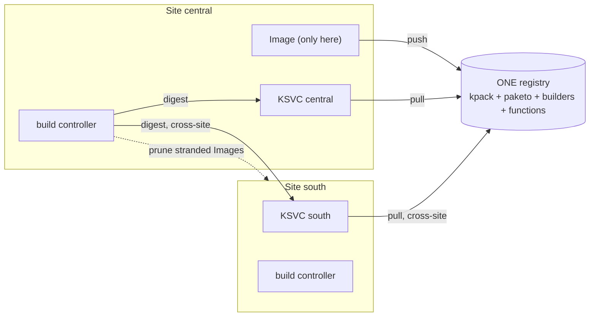
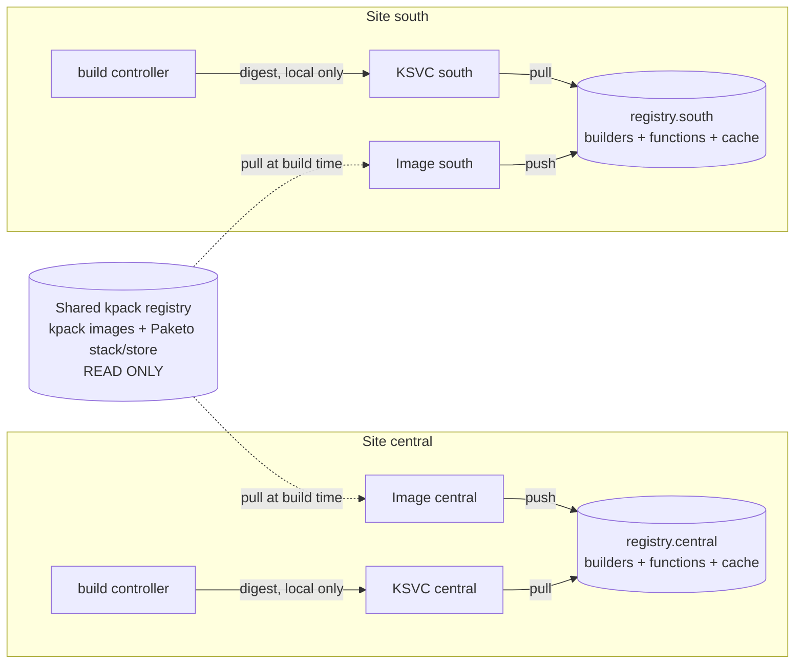

# A registry per site

**Status:** implemented. **docs/BUILDING.md is how the build path works**; this is
the record of why it changed - the reasoning, the alternatives rejected, and the
migration. Kept separate because that genre does not age the way a description of
the system does, and because a second description of the same mechanism would
drift from the first.

Before this, one registry served every site, exactly one site built each function,
and the build controller reached into the other sites to publish the digest and to
prune the `Image` objects a switchover stranded there. It is now symmetric: **every
site builds every function it runs, pushes to its own registry, and publishes only
to itself**. The mirrored content that builds *consume* - kpack's own images and the
Paketo stack and buildpackages - stays on a single shared **kpack registry**,
because nothing writes to it.

## Contents

- [Why](#why)
- [What changes, in one picture](#what-changes-in-one-picture)
- [The registry split](#the-registry-split)
- [Design decisions](#design-decisions)
- [Configuration model](#configuration-model)
- [Where the credentials come from](#where-the-credentials-come-from)
- [Helm](#helm)
- [Code](#code)
- [What gets deleted](#what-gets-deleted)
- [Accepted consequences](#accepted-consequences)
- [Migration](#migration)
- [What changed on the way](#what-changed-on-the-way)
- [Open questions](#open-questions)

---

## Why

The current model (docs/BUILDING.md - Active/Active Behaviour) is active/active
at the *deploy* layer and single-writer at the *build* layer, and the seam
between the two costs three mechanisms:

| Mechanism | Exists because |
|---|---|
| Cross-site digest write | The building site must publish to sites that did not build |
| `pruneOrphans` | A switchover leaves `Image` objects behind that keep rebuilding and fighting the new site's digests |
| Unowned build objects (`build_only`, `delete_build_objects`) | The build lands on the local site even when the function does not run there, so there is no KSVC to own it |

All three disappear if a site builds what it runs. The registry is the only
reason they exist: one registry means one `spec.tag`, one tag means two sites
racing to push it, and that race is what forces a single writer.

Three things get better and one gets worse. Better: a site is self-sufficient
(switchover needs nothing replicated but the git token, which is already
replicated to every site); the build controller stops writing to peer clusters
entirely; and the mirror inventory stays a single copy. Worse: the two sites run
different bytes for the same source (see
[Accepted consequences](#accepted-consequences)).

---

## What changes, in one picture

**Before**



**Now**



No arrow crosses a site boundary at runtime. The only cross-site arrow left is
the API's own fan-out, which applies the KSVC and the build objects to each
site - and which already exists.

---

## The registry split

The question "can kpack and Paketo live on one registry" resolves cleanly, and
the rule that answers it is **who writes**:

| Content | Registry | Written by |
|---|---|---|
| kpack `controller`, `webhook`, `build-init`, `build-waiter`, `rebase`, `completion`, `lifecycle` | **kpack registry** | the mirror scripts, once |
| `paketobuildpacks/build-jammy-base`, `run-jammy-base`, the buildpackages | **kpack registry** | the mirror scripts, once |
| Composed `Builder` images (`{base}/{builderRepository}/python`) | **per site** | that site's kpack |
| Function images (`{base}/{group}/{name}:{branch}`) | **per site** | that site's kpack |
| Build layer cache (`{base}/{group}/{name}_cache:latest`) | **per site** | that site's kpack |

Everything read-only is shared; everything written is local. That keeps the
airgap mirror inventory (docs/BUILDING.md - Airgapped Mirror Inventory) a
**single copy** - `pull-images.sh` and `pull-runtimes.sh` still run once, against
the one registry the kpack release points at - and it keeps two clusters from
racing to push one tag, which is the failure the current single-writer design
exists to prevent.

The composed `Builder` deliberately sits on the *local* side even though it is
made of mirrored content: it is a push, and two clusters composing the same
builder name into one repository is the same race as two clusters building one
function.

> **Export copies base layers.** With the run image on a different registry from
> the target, the CNB exporter copies the run image's layers into the function's
> repository rather than mounting them cross-repo. Builds still work; the first
> push per repository is heavier. If that cost matters, mirror the stack images
> into each site registry as well and point `clusterBuild.registry` at the local
> one - at which point the kpack registry holds only kpack's own images. That is
> a values change, not a code change.

---

## Design decisions

| Topic | Decision | Note |
|---|---|---|
| Build locality | **Build where you run.** The build objects go to the workload's *target* sites, not to the local site | Reverses "Build locality: local cluster" |
| `Image` scope | One per function **per site**, each with its own `spec.tag` and `spec.cache` | Was: one, on the local site |
| Digest propagation | Each site's controller writes **only its own** KSVC | Was: writes every site |
| Pruning | **Removed.** A peer's `Image` is not stranded, it is that site's build | `pruneOrphans` deleted |
| KSVC image field | Resolved **per site** at apply time | Was: one value composed once |
| Git credential | Replicated to every site the workload runs in | Already was; the set is now the targets |
| Registry credential | One Secret **name**, per-site **contents** | The name is written into every site's KSVC, so it must not vary |
| kpack registry credential | A second Secret on the build ServiceAccounts, pull-only | The export step pulls the run image |
| Registry cleanup | Delete the repositories in **every** site's registry on function delete | Best-effort, as today |
| Single-registry installs | Still supported, and still the default - sites inherit the global `registry` | See [Helm](#helm) |

### Why the KSVC image has to be resolved per site

This is the change everything else hangs off. `apply_workload` composes one
`ksvc` dict and applies it to every target:

```python
ksvc = ksvc_svc.build_ksvc(..., image=req.image, ...)   # api/services/workloads.py
def apply(cluster): return site_apply.apply_to_site(cluster, ksvc=ksvc, ...)
```

With per-site registries, `image` is `{site registry}/{group}/{name}:{branch}` -
a different string per site. The composition moves inside the per-cluster
closure. A container is unaffected: its image is the caller's, one value
everywhere.

Note that this is only the *create* path. After the create the image field
belongs to the build controller (docs/BUILDING.md - Who writes the ksvc image),
and each controller now writes a digest from its own registry - so per-site
divergence is carried by the mechanism that already owned that field.

### Why a site's registry lives in the shared `sites` list

The API instance handling a write composes the manifests for *every* site, so it
must know every site's registry - not just its own. That puts the per-site
registry in `sites[]`, which is identical in every cluster (it is the same
ConfigMap), and **not** in the per-site release values next to `global.site`.

This is also what keeps the convergence rules (docs/BUILDING.md - Convergence
rules) intact: two API instances in two clusters compose the same `Image` for
site X because they read site X's registry from the same list.

---

## Configuration model

`values.yaml`, and through it `SERVERLESS_SITES` and `RegistryConfig`:

```yaml
# Defaults every site inherits. A single-registry install sets only this.
registry:
  url: registry.internal
  organization: ""
  deleteOnFunctionDelete: true
  # ── NEW: one Quay OAuth token per site, in its own ExternalSecret ──────────
  apiTokens:
    create: true
    secretName: serverless-api-registry-tokens
    key: "cloudlet/platforms/serverless/{site}"
    property: registry-api-token

sites:
  - name: central
    cluster: central-0
    registry:
      url: registry.central.internal      # overrides registry.url for this site
  - name: south
    cluster: south-0
    registry:
      url: registry.south.internal

# Read-only content every site's builds pull. One copy, one mirror run.
build:
  kpackRegistry:
    url: registry.kpack.internal
    pullSecret:
      name: kpack-registry-creds
      create: true
```

Resolution is `site.registry` merged over the global `registry`, so an install
with one registry sets nothing new and behaves exactly as today. The full set of
changed values is in [The values file, in full](#the-values-file-in-full).

**Secrets stay out of the list.** `sites[]` is serialized into a ConfigMap, so a
site override carries `url` / `organization` / `repository` only. Every
credential is covered in the next section.

---

## Where the credentials come from

Three distinct credentials, and they replicate differently. Getting this wrong
is the failure mode that shows up as an unauthenticated pull minutes after a
deploy, so it is worth being explicit about each one.

| Credential | Lives in | Content | Same in every site? |
|---|---|---|---|
| `serverless-registry-creds` | `namespaces.workloads`, per cluster | dockerconfigjson for **that site's** registry | **Name yes, content no** |
| `kpack-registry-creds` | `namespaces.workloads`, per cluster | dockerconfigjson for the shared kpack registry, pull-only | Yes, both |
| `SERVERLESS_REGISTRY_API_TOKENS` | `namespaces.api`, per cluster | Quay OAuth token **per site**, keyed by site name | Yes - every pod holds every site's |

### The local site's push/pull Secret

It already exists and is already local: `templates/kpack/externalsecret.yaml`
creates `serverless-registry-creds` in the workloads namespace of **each**
cluster, from Vault through the pre-existing `ClusterSecretStore`. Each site's
release creates its own copy. What changes is only what goes *into* it:

- **The host** it is keyed by comes from the local site's entry in `sites[]`,
  resolved through `global.site`, instead of the global `registry.url`. Docker
  auth is keyed by host, so this must be the site's own registry and nothing
  else.
- **The username and password** come from a per-site Vault path, because the
  credential for `registry.central.internal` is not the credential for
  `registry.south.internal`:

  ```yaml
  build:
    serviceAccount:
      registrySecret:
        name: serverless-registry-creds              # identical in every site
        key: cloudlet/platforms/serverless/{{ .Values.global.site }}
        usernameProperty: registry-username
        passwordProperty: registry-password
  ```

  (`key` runs through `tpl`, as `routeDomain` already does.)

**The Secret name must stay identical in every site.** It is written into every
site's KSVC `imagePullSecrets` and onto every per-function build
`ServiceAccount`, and the API emits those for all sites from one place
(`SERVERLESS_BUILD__REGISTRY_SECRET` is a name, not a reference it resolves).
Contents vary by site; the name does not. A per-site *name* would push the same
per-site composition problem into the pull secret that the KSVC image already
has, for no benefit.

Nothing here is cross-site: a site's registry credential exists only in the
cluster that pushes to and pulls from that registry.

### The kpack registry's pull Secret

One kpack registry, one credential, so this one is genuinely uniform - one Vault
entry, the same Secret in every cluster. It is added alongside the local
credential on both kinds of build `ServiceAccount`:

| Account | Needs |
|---|---|
| `kpack-builder` (chart) | kpack registry **pull** (stack + store) + local registry **push** (the composed builder image) |
| `fn-{name}-{group}` (API, per function) | kpack registry **pull** (the run image, at `export`) + local registry **push/pull** + the function's git token |

The per-function account is the one that is easy to miss: the `export` phase
pulls the run image, which lives on the kpack registry, so a build account holding
only the local credential fails at the last phase of the first build.

### The Quay API tokens

Unlike the two above, this one **is** needed for every site in every pod. A
delete lands on whichever API instance the DNS record points at, and that
instance is responsible for reclaiming the function's repositories in *all*
sites (docs/BUILDING.md - Registry cleanup on delete), so it needs each site's
token. The tokens differ per site, so this is one Vault entry per site,
assembled by the chart into a single env var:

```yaml
registry:
  apiTokens:
    create: true
    secretName: serverless-api-registry-tokens
    key: "cloudlet/platforms/serverless/{site}"     # {site} substituted per entry
    property: registry-api-token
```

rendering an ExternalSecret - **its own template**, `registry-tokens.yaml` - whose
`target.template` builds the JSON from one entry per site:

```yaml
  target:
    name: serverless-api-registry-tokens
    template:
      data:
        SERVERLESS_SITE_REGISTRY_TOKENS: '{"central":"{{ index . "central" }}","south":"{{ index . "south" }}"}'
  data:
    - secretKey: central
      remoteRef: { key: cloudlet/platforms/serverless/central, property: registry-api-token }
    - secretKey: south
      remoteRef: { key: cloudlet/platforms/serverless/south, property: registry-api-token }
```

It is deliberately **not** an entry in `externalSecrets.secrets`. That list is a
fixed name -> Vault-property projection; this is keyed by `sites`, needs a
`target.template` to assemble one value out of many, and fails in a way none of
the others can. Forcing it in meant special-casing the generic loop twice - once
for the per-site entries and once for an `optional` flag that exists for this
object alone. In its own file the gate is local and the `optional: true` below is
unconditional.

**That `secretRef` is `optional: true` on the Deployment.** ESO fails the *whole*
ExternalSecret if any one site's path is missing, and `sites` is shared across
clusters - so adding a site before its Vault entry exists would otherwise stop the
API pod starting in every cluster, a spectacular blast radius for a config change
aimed at one new site. Absent, registry cleanup is skipped, which is exactly what
it already does untokenised. The other entries stay required: the admin API key
going quietly missing is not a degradation anyone wants to discover later.

Two notes on shape. A site-keyed **JSON object** is used rather than one env var
per site (`SERVERLESS_REGISTRY_API_TOKENS__CENTRAL`) because a site name is a
DNS-1123 label and may contain `-`, which is not portable in an environment
variable name. And `SERVERLESS_REGISTRY__API_TOKEN` stays as the fallback for any
site the map does not name, which is what a single-registry install keeps using
unchanged.

This is the only credential that crosses a site boundary, and it is strictly
less power than the API already holds: the same pod carries a client certificate
that can write Knative Services in every cluster.

---

## Helm

### serverless-api chart

| File | Change |
|---|---|
| `values.yaml` | `sites[].registry`; `build.kpackRegistry`; a per-site `registrySecret.key`; `registry.apiTokens`; **remove** `buildController.pruneOrphans`. In full [below](#the-values-file-in-full) |
| `templates/configmap.yaml` | Serialize each site's `registry` into `SERVERLESS_SITES` alongside `name`/`cluster` |
| `templates/_helpers.tpl` | `serverless-api.siteRegistry` resolves **this release's** site (`global.site`) against `sites[]`; `registryBase` and `builderImage` hang off it, so a Builder pushes locally. `validateBuild` gains the checks below |
| `templates/kpack/externalsecret.yaml` | Key the dockerconfigjson by the **local** site's registry host, and read its credentials from a per-site Vault path; add the kpack registry pull Secret |
| `templates/kpack/serviceaccount.yaml` | `kpack-builder` lists both Secrets - local registry (push + pull) and kpack registry (pull) |
| `templates/registry-tokens.yaml` | **New.** One Vault entry per site, assembled by an ESO `target.template` into one `SERVERLESS_SITE_REGISTRY_TOKENS` variable |
| `templates/deployment.yaml` | Add `SERVERLESS_BUILD__KPACK_REGISTRY_SECRET`; the existing `SERVERLESS_REGISTRY__*` stay as the inherited default |
| `templates/build-controller.yaml` | Drop the prune env var |
| `templates/networkpolicy.yaml` | **Nothing** - see below |

### NetworkPolicy: nothing to do

The registry is never a Service or a Route - it is always off-cluster - so the
existing `allow-egress-external` policy already covers it, and covers each new
one for free:

```yaml
podSelector: {}                       # every pod in the namespace, build pods included
egress:
  - to:
      - ipBlock:
          cidr: 0.0.0.0/0
          except: [10.128.0.0/14, 172.30.0.0/16]   # pod + service networks
```

Off-cluster is allowed by default and only *in-cluster* destinations are carved
out, so a second registry host, a third, and the shared kpack registry all need no
rule. The same applies to an OpenShift Route, which resolves to a router address
outside those CIDRs.

That also means `networkPolicy.build.egressNamespaces` / `egressCIDRs` stay
empty here: they exist for an in-cluster registry or git server, which this
platform will not have. Leave them in the chart for installs that do, but this
design adds nothing to them.

One new render-time failure in `validateBuild`: **a site names a registry but
`global.site` is not one of `sites`**, so the release cannot tell which registry
it builds into. It silently keys this site's push credential to the platform
default host, which surfaces as an unauthenticated push at the end of the first
build. Guarded only when a site actually overrides its registry - without one
everything resolves to the default anyway, so an unmatched `global.site` changes
nothing.

> **A second check was designed, dropped, and has since been reinstated.** Two
> sites resolving to the *same* registry was going to be a render failure,
> overridable with `build.allowSharedRegistry`. It was dropped because a shared
> registry still *worked* - each site's KSVC runs the digest its own controller
> pinned, not the tag, so sharing merely flapped one tag and thrashed one
> `_cache:latest` - and it was the configuration every existing install
> upgraded from. **The tag GC changed the calculus** (docs/BUILDING.md -
> Registry tag GC): a controller pruning a shared repository protects only its
> *own* site's serving digest and deletes the tags the peer site still serves -
> broken, not degraded. So the chart now requires `registry.url` on **every**
> site and refuses two sites on one registry, with no override; the controller
> independently refuses to sweep when it detects sharing, as the backstop for a
> hand-rolled config. An upgrading single-registry install must give each site
> its own registry before this chart renders.

### The values file, in full

Every block that changes in `charts/serverless-api/values.yaml`. Anything not
listed here is untouched - `api`, `namespaces`, `routeDomain`, `sso`, `runtimes`,
`certificate`, `caBundle`, `networkPolicy`, and all of `build` beyond the four
keys below.

```yaml
# ── CHANGED: now the DEFAULT every site inherits, not the one registry ────────
# A site may override `url` (and, rarely, `organization`) in `sites[]` below.
# What stays global: the layout rules. `organization` and `build.builderRepository`
# describe how repositories are NAMED, and naming them differently per site would
# buy nothing and break `RegistryConfig.path` being one derivation.
registry:
  url: registry.internal
  organization: ""
  deleteOnFunctionDelete: true

# ── CHANGED: a site now carries the registry it builds into and pulls from ────
# This list is IDENTICAL in every cluster - it is how an API instance composes
# the peer's manifests. Per-release values go in `global.site`, never here.
# Omit `registry` on a site to inherit the block above (single-registry install).
sites:
  - name: central
    cluster: central-0
    registry:
      url: registry.central.internal
  - name: south
    cluster: south-0
    registry:
      url: registry.south.internal

buildController:
  enabled: true
  repository: build-controller
  tag: ""
  replicaCount: 1
  labels: {}
  annotations: {}
  podLabels: {}
  podAnnotations: {}
  resources:
    requests: { cpu: 50m, memory: 128Mi }
    limits: { cpu: 500m, memory: 256Mi }
  resyncSeconds: 300
  # ── REMOVED: pruneOrphans ──────────────────────────────────────────────────
  # A peer's Image is no longer stranded - it is that site's own build. There is
  # nothing to prune, and the controller no longer reads a peer cluster at all.

build:
  enabled: true

  # ── NEW: the shared, read-only kpack registry ──────────────────────────────
  # kpack's own images and the ClusterStack/ClusterStore content: pulled by every
  # site, written by none, mirrored once. Empty `url` means the kpack registry IS
  # the site registry (today's behaviour) - no second Secret is created and
  # nothing is added to the build accounts.
  kpackRegistry:
    # The same host the kpack release uses for `images.registry` and
    # `clusterBuild.registry`. Used only to key the pull Secret - docker auth is
    # per host, never per path.
    url: ""                 # e.g. registry.kpack.internal
    pullSecret:
      name: kpack-registry-creds
      # False when the Secret is provided out-of-band.
      create: true
      key: cloudlet/platforms/serverless
      usernameProperty: kpack-registry-username
      passwordProperty: kpack-registry-password

  # ── UNCHANGED, but now relative to the SITE's registry base ────────────────
  # `{site registry base}/{builderRepository}/{name}` for a Builder,
  # `{site registry base}/{builderRepository}/{group}/{name}` for a function.
  builderRepository: serverless/builders

  serviceAccount:
    name: kpack-builder
    registrySecret:
      # ── UNCHANGED: the name is identical in every site, deliberately ───────
      # It is written into every site's KSVC imagePullSecrets and onto every
      # per-function build ServiceAccount, and the API emits those for all sites
      # from one place. Contents vary by site; the name must not.
      name: serverless-registry-creds
      create: true
      # ── CHANGED: a per-site path - central's credential is not south's ─────
      # Rendered through `tpl`, as `routeDomain` already is.
      key: "cloudlet/platforms/serverless/{{ .Values.global.site }}"
      usernameProperty: registry-username
      passwordProperty: registry-password

externalSecrets:
  clusterSecretStore: cloudlet-cloudlet
  refreshInterval: 1h
  secrets:
    - name: serverless-api-keys
      data:
        - secretKey: SERVERLESS_ADMIN_API_KEY
          key: cloudlet/platforms/serverless
          property: admin-api-key
    # ── The registry token entry MOVED OUT of this list, to `registry.apiTokens`
    # and its own template. It is keyed by `sites` rather than by a fixed name,
    # so it does not fit this list's shape (see above).
```

**Not changed, and worth saying so:** `networkPolicy`. A registry is always
off-cluster, so `allow-egress-external` already reaches every one of these -
including the kpack registry - and `networkPolicy.build.egressNamespaces` /
`egressCIDRs` stay empty.

### What an existing install has to set

The delta for someone upgrading, rather than the full file:

```yaml
sites:
  - { name: central, cluster: central-0, registry: { url: registry.central.internal } }
  - { name: south,   cluster: south-0,   registry: { url: registry.south.internal } }

build:
  kpackRegistry:
    url: registry.kpack.internal
  serviceAccount:
    registrySecret:
      key: "cloudlet/platforms/serverless/{{ .Values.global.site }}"

registry:
  apiTokens:
    key: "cloudlet/platforms/serverless/{site}"
    property: registry-api-token
```

plus, in Vault: a `registry-username` / `registry-password` / `registry-api-token`
per site path, and a `kpack-registry-username` / `kpack-registry-password` at
the shared path.
The top-level `registry.url` stays as the inherited default and can be left
pointing at the old registry - nothing resolves through it once every site
overrides it, and leaving it is what makes the [migration](#migration) reversible
by removing two lines.

### kpack chart

**No functional change.** `images.registry` (kpack platform images) and
`clusterBuild.registry` (Paketo stack and store) are already independent values;
this design points both at the shared kpack registry, which is what they were
built for.
What changes there is documentation:

- README "Cluster build content": state that the stack/store registry is
  read-only and may be shared by every site, while whatever composes `Builder`s
  pushes elsewhere.
- `examples/clusterbuild-values.yaml`: a comment marking `clusterBuild.registry`
  as the shared kpack registry.
- `scripts/mirror/README.md`: the kpack registry is a single copy for the whole
  platform, not one mirror run per site.

---

## Code

### `common/cluster.py`

`Cluster` gains its site's registry, resolved once at construction beside the
namespace and timeouts it already extracts:

```python
self.site = site_config.name
self.registry = settings.registry_for(site_config.name)
```

A cluster is the handle callers pass around to mean "this site", so anything
holding one has that site's registry rather than looking it up by the name of an
object it is already holding. It also removes the opportunity for the mistake
this design is most exposed to: the platform-default `settings.registry` stays a
valid attribute that silently means the *wrong* registry on any per-site path.
`DeleteContext` drops its `registry` field for the same reason - it already
carried a cluster, and the two could disagree.

The planner keeps taking site *names*: `BuildBackend.plan` and `image_ref` are
pure, and handing them clusters would drag the Kubernetes client into unit tests
of manifest composition.

### `common/config.py`

```python
class SiteRegistry(BaseModel):
    """Per-site registry override. No credentials - this is ConfigMap data."""

    url: str
    organization: str | None = None
    repository: str | None = None


class SiteConfig(BaseModel):
    name: str
    cluster: str
    registry: SiteRegistry | None = None


class CommonSettings(BaseSettings):
    ...
    registry_api_tokens: dict[str, str] = Field(default_factory=dict)

    def registry_for(self, site: str) -> RegistryConfig:
        """The registry a given site pushes to and pulls from."""
```

`registry_for` merges the site override over the global default and attaches
that site's token. `RegistryConfig` itself - `path`, `base`, `api_url`,
`can_delete` - is unchanged, which keeps the "the chart and the API implement
this rule twice" pact (docs/BUILDING.md - Registry layout) intact per site.

### `common/build.py`

`BuildPlan` currently splits manifests by how far they travel. That split
survives; what changes is that the non-replicated half is now a map:

```python
@dataclass
class SiteBuild:
    tag: str  # what THIS site pushes to
    manifests: list[dict]  # its Image + build ServiceAccount


@dataclass
class BuildPlan:
    replicated: list[dict]  # the git Secret - every site, unchanged
    per_site: dict[str, SiteBuild]  # was: `tag: str` + `local: list[dict]`
```

`BuildBackend.plan` takes `{site: registry}` - its keys are the sites that
build - and `image_ref` takes the registry it pushes to. `image_reference()` and
`cache_reference()` already take a registry base and need no change.

### `common/kpack.py`

`build_service_account(..., registry_secret: str)` becomes
`registry_secrets: Sequence[str]`, so the per-function account carries both the
local push credential and the kpack registry pull credential.

### `api/services/builder/kpack_backend.py`

Emits one `(Image, ServiceAccount)` pair per target site, each tagged for that
site's registry. The registries are **passed in**, not resolved here:

```python
def __init__(self, build: BuildConfig, runtimes: RuntimeRegistry)
def plan(self, req, labels, registries: Mapping[str, RegistryConfig]) -> BuildPlan
```

The backend takes the one config slice it uses rather than the whole settings
object, and the caller - which already holds the clusters, each carrying its own
registry - supplies the rest. That keeps one resolution path in production
(settings -> `Cluster.registry` -> plan) instead of a second snapshot of the
same derivation, and `plan` stays pure enough to unit-test with a plain dict.

### `api/services/workloads.py`

The engine change, in four parts:

1. **`ApplyRequest`** carries `images: dict[str, str]` (site → image) with
   `image: str` as the single-value case a container uses, and
   `per_site_resources: dict[str, list[dict]]` replacing `local_resources`.
2. **`apply_workload`** composes the KSVC inside the per-cluster closure so the
   image and the site's build manifests resolve together. `build_site` /
   `build_only` and the whole unowned-apply branch go away: the build objects
   only ever land on a site that also gets the KSVC, so they are always owned.
3. **`retag_build`** runs per site, against that site's cluster and that site's
   registry. It is the same mechanism, and it is what makes the migration below
   free (a moved tag is deleted and recreated rather than rejected at
   admission).
4. **`apply_build`** (the `POST .../build` path) fans out over the workload's
   sites instead of writing only the local one.

### `api/services/offering.py`

- `DeleteContext` carries the per-site clusters and their registries;
  `FunctionOffering.after_delete` reclaims repositories in each.
- `build_status` / `build_states` are called with **the site's own cluster**,
  from inside the existing per-site fan-out in `get`/`stats`/`list`, rather than
  once against the local one. This is strictly better reporting than today: a
  build failing in one site currently cannot be seen at all unless it is the
  local one.

### `controller/`

- `reconciler.reconcile` writes `self._local` only; the loop over
  `self._clusters` goes.
- `Reconciler.prune`, `_by_name`, `_created`, `_supersedes` are deleted, along
  with `prune_orphans` in `controller/config.py` and `main.py`.
- The controller no longer touches a peer cluster at all. Its RBAC does not have
  to change (the client certificate is shared with the API, which still needs
  cross-site write), but the blast radius shrinks to one cluster.

### Tests

| File | Change |
|---|---|
| `test_build_controller.py` | Delete the prune cases; assert the reconciler writes the local site only |
| `test_kpack_build.py` | One `Image` per site, each with its own tag and cache tag; the SA carries both registry Secrets |
| `test_registry_cleanup.py` | Cleanup addresses every site's registry; a per-site token is used |
| `test_manifests.py` | KSVC image differs per site for a function, is identical for a container |
| new | `registry_for` merge/fallback rules; `plan()` over a subset of sites |

---

## What gets deleted

Worth stating plainly, because it is the bulk of the win:

- `Reconciler.prune` and its three helpers, plus `buildController.pruneOrphans`
  and the docs section explaining a race it can lose.
- The `build_only` branch in `apply_workload`, `apply_build_objects`'s unowned
  path, and `delete_build_objects` - every build object now has a KSVC in the
  same cluster to own it.
- The cross-site write in the controller.
- The "one site builds, every site pulls" caveat that runs through
  BUILDING.md, FUNCTIONS.md and ARCHITECTURE.md.

---

## Accepted consequences

- **The two sites run different bytes.** Builds are not bit-reproducible, so the
  same commit produces different digests per site. This reverses
  ARCHITECTURE.md's "Build once, deploy the same digest to both sites". Both
  sites still run *that commit*; what is no longer guaranteed is that they run
  the same layer digests. Anything that compares images across sites has to
  compare source instead.
- **A rollout is no longer atomic across sites.** One site can finish building
  minutes before the other, so a source change lands staggered. The DNS record
  points at one site at a time, so the user-visible effect is bounded, but a
  build that succeeds in one site and fails in the other is now possible and
  reads as `Failed` with one site `Building`.
- **Build load and registry storage double** (multiply by the number of sites).
  Build pods are already the heaviest thing in the workloads namespace
  (docs/BUILDING.md - Build pod resources), so the namespace quota has to be
  sized for concurrent builds in every site, not one.
- **Cleanup reaches across sites.** Deleting a function calls each site's
  registry API from wherever the API instance runs, which is the one remaining
  cross-site registry dependency - and the only reason the API pod holds every
  site's Quay token rather than just its own. It is control-plane only and
  already best-effort: an unreachable peer registry logs and leaks a repository,
  exactly as a failed delete does today. Doing it from each site's controller
  instead was rejected for the reason the existing docs give - it would have to derive
  "unowned" from a cluster read, and a read that wrongly returns empty deletes
  everything.
- **Builds depend on the shared kpack registry.** If it is down, no site can
  build; every site can still run and serve. That is a strictly smaller blast
  radius than today, where the single registry is also the runtime pull path.

---

## Migration

The existing re-tag machinery does the work; no data migration and no outage.

1. **Stand up the per-site registries.** The kpack registry is unchanged - it is
   the one the kpack release already points at.
2. **Roll the chart** with `sites[].registry` and the kpack registry block. Existing
   functions keep running: their KSVCs still hold digests from the old registry,
   and nothing rewrites an image field on upgrade.
3. **Touch each function once** - `POST /api/v1/groups/{group}/functions/{name}/build`
   is enough and changes no spec. It applies the per-site `Image`s, each site
   builds into its own registry, and each site's controller rolls its own digest
   onto its own KSVC. The old revision serves throughout; a KSVC whose new
   revision is not ready keeps routing to the last ready one.
4. **Decommission** the function repositories on the old shared registry once
   every function has rebuilt.

Two properties make step 3 safe rather than delicate:

- `retag_build` already handles a moved `spec.tag` by deleting the `Image` and
  letting the apply recreate it, because kpack rejects the change at admission.
  A registry move is exactly that case.
- `reclaim_moved_repositories` skips a previous tag whose **host** differs from
  the site's configured registry. During the migration the previous tag is on
  the old shared host, so nothing is reclaimed automatically - the peer keeps
  pulling from it until it has rebuilt. Cleaning it up is step 4, deliberately
  manual.

---

## What changed on the way

Four things the implementation settled that the design above did not, or got
wrong. They are here rather than folded silently into the design, because each
one is a place the reasoning above was incomplete.

- **The git Secret follows the workload's sites**, not every configured site.
  It was replicated so any site could rebuild after a switchover; now that a
  site builds what it runs, "any site that runs it" is the same set. A site the
  function was never deployed to has nothing to rebuild.
- **An update carries each site's own image forward.** `load_existing` collects
  the deployed image per site and `ApplyRequest.images` applies them, because
  one representative image fanned out would point a peer at this site's
  registry - which it has no credential for and, airgapped, may not reach.
  `test_an_update_keeps_each_sites_own_image_rather_than_one_sites` guards it.
- **The shared-registry render check was dropped**, not shipped - see the note
  under [Helm](#helm). It would have had to default to permissive to avoid
  failing every install that upgrades into this, which earns nothing.
- **The build backend does not resolve registries.** It was briefly handed the
  whole settings object so it could; it now takes `{site: registry}` from the
  caller, which already holds the clusters that carry them. One resolution path
  (settings -> `Cluster.registry` -> plan) rather than a second snapshot of it.

Two things also worth knowing about the ESO template that assembles the per-site
tokens. Site names are interpolated with `index . "name"`, because a site name may
contain `-` and that is not a legal Go template field reference. And the values are
manually quoted rather than passed through `toJson`: `toJson` is better *if* ESO
hands the template strings rather than `[]byte`, and the manual form is the idiom
this chart already proves works. A Quay OAuth token is alphanumeric, so the
narrowing is theoretical - but it is a real difference from the design above.

**Every chart change here is reviewed, not render-tested.** `helm` could not be
installed in the environment this was written in, so `helm template` has never run
against these values. CI's lint/kubeconform job is the first real check.

---

## Open questions

1. **Is a shared kpack registry acceptable as a build-time dependency?** It is the
   only thing left that crosses a site boundary during a build. The alternative -
   one per site - costs a second mirror run and a second copy of every
   Paketo image, and it is a values change (`clusterBuild.registry`), not a code
   change. This proposal assumes shared, because the ask was explicitly to keep
   kpack and Paketo on one registry.
2. **Can the API reach every site's registry over HTTP?** Only the delete path
   needs it, and only for the Quay management API. Since a registry is always
   off-cluster - never a Service, never a Route - there is no NetworkPolicy or
   cluster-boundary obstacle; what remains to confirm is simply that the internal
   network routes `registry.south.internal` from the central cluster. If it does
   not, function deletes leak repositories in the peer site and we need a
   different reclamation story.
3. **Is per-site digest divergence acceptable to the operators?** It is the one
   irreversible property of this design.
4. ~~How does the Quay OAuth token per site reach Vault?~~ **Settled:** the
   tokens differ per site, so it is one Vault entry per site, assembled by an ESO
   `target.template` into one site-keyed env var (see
   [Where the credentials come from](#where-the-credentials-come-from)). What is
   still open is only the Vault path convention - `…/serverless/{site}` with a
   `registry-api-token` property is assumed here.
5. **Does a function pinned to `sites: [south]` build on south only?** This
   proposal says yes - build where you run - which is what deletes the unowned
   build-object path. The alternative (always also build locally) keeps a
   mechanism alive for a case nothing needs.
6. **Should the composed `Builder` images be per site or on the kpack registry?**
   Per site here, because composing is a push and two clusters pushing one builder
   tag is the race this whole design removes. Mirroring pre-composed builders
   instead would be a different (and larger) change.
