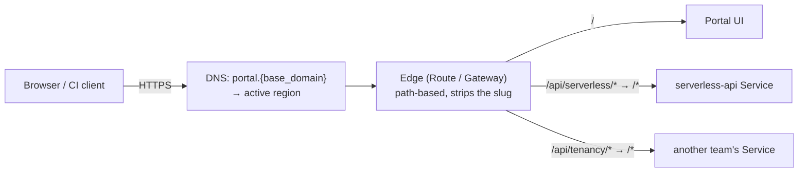

# Portal Integration & the Multi-API Edge

Today the portal and this API are two addresses. This document is the design for
making them one: the portal serves the UI, and every platform API - this one and the
other teams' - hangs off the **same host** under its **own path prefix**, so a caller
(and a browser) sees one product rather than a directory of hostnames.

Nothing here is implemented yet. It is written as a decision record so the path
scheme, the app-side changes and the onboarding contract are agreed **before** the
first API is mounted - once a path is published it is a contract, and moving it later
costs every client.

## Contents

- [Where we are now](#where-we-are-now)
- [The edge is ours](#the-edge-is-ours)
- [The scheme: one host, one prefix per API](#the-scheme-one-host-one-prefix-per-api)
  - [Where the tenant goes, and a terminology trap](#where-the-tenant-goes-and-a-terminology-trap)
  - [The prefix is per API, never per workload](#the-prefix-is-per-api-never-per-workload)
- [Why prefix-and-strip](#why-prefix-and-strip)
- [What the edge is](#what-the-edge-is)
- [What this API has to change](#what-this-api-has-to-change)
- [The contract every API on the edge honors](#the-contract-every-api-on-the-edge-honors)
- [Authentication under one host](#authentication-under-one-host)
- [Streaming through the edge](#streaming-through-the-edge)
- [Multi-region](#multi-region)
- [Rollout order](#rollout-order)
- [Open questions](#open-questions)

---

## Where we are now

| Thing | Address | How the portal reaches it |
|-------|---------|---------------------------|
| Portal | `portal.{base_domain}` - ours, on an edge we control | - |
| This API | `serverless.{base_domain}` (chart `api.route.host`) | Cross-origin XHR + `Authorization: Bearer` |
| Other teams' APIs | a host each | the same, one CORS entry each |
| Tenant workloads | `{name}-{group}.serverless.{base_domain}` | not the portal's concern |

The cost of a host per API is paid in four places, and it is the same cost every time
a team ships an API: a DNS record and a certificate, a `corsAllowOrigins` entry on
that API plus a preflight on every browser call, an SSO client whose redirect URIs
name yet another origin, and a portal that has to carry a base-URL-per-API map it
learns out of band. None of that is hard. All of it is per API, forever, and it is
what makes the platform feel like a set of separate systems the portal happens to
link to.

## The edge is ours

The portal is served from **our own edge** - `portal.{base_domain}`, fronted by an
OpenShift Route or a gateway in front of it - not from a SaaS domain we do not
control. That settles the question the rest of this design would otherwise have to
hedge against, and it settles it the good way:

- The shared host **is** the portal's host. `/` serves the UI, `/api/{slug}/...` serve
  the APIs, and there is no separate API hostname to name, certify or explain.
- Every API on it is therefore **same-origin with the portal**. No CORS, no preflight
  on any browser call, one SSO origin for the whole platform.

Had the portal been SaaS (`{instance}.service-now.com`), none of that would have been
available - paths cannot be mounted under someone else's domain - and the fallback
would have been a dedicated `api.{base_domain}` carrying the same prefixes
cross-origin. Worth recording only because it is the one change that would invalidate
the same-origin half of this document; the prefixes, the stripping, the app changes and
the onboarding contract would all survive it unchanged.

## The scheme: one host, one prefix per API

```
https://{edge-host}/api/{slug}/v{n}/{the API's own path}
                   ^^^^^^^^^^^ stripped by the edge; the app serves /v{n}/... and
                               never sees the two segments in front of it

https://portal.example.com/api/serverless/v1/groups/team-a/functions
https://portal.example.com/api/tenancy/v1/namespaces
https://portal.example.com/                       -> the portal UI
```

**`api` comes first, then the API, then its version** - the same grammar Kubernetes
uses for `/apis/{group}/{version}/{resource}`. The obvious-looking alternative,
`/{slug}/api/v1/...`, reads badly for exactly two reasons and both get worse with
scale: it buries `api` in the middle where it looks like a folder rather than a
marker, and it stutters the moment an API is named after its own subject -
`/namespaces/api/v1/namespaces`. Putting `/api` at the front also means the portal's
UI routes and the APIs occupy **separate namespaces** rather than competing for the
same one, so a new page can never collide with a registered slug.

### Where the tenant goes, and a terminology trap

Kubernetes puts tenancy **after** the version, as a `namespaces/{name}` segment pair,
and everything specific to the resource follows it. Our paths already have that exact
shape - `groups/{group}` is our `namespaces/{namespace}` - so adopting the grammar
above is not a redesign, it is finishing one we had two thirds of:

```
k8s     /apis/{group}/{version}/namespaces/{namespace}/{resource}/{name}
        /apis/apps/v1/namespaces/payments/deployments/orders

ours    /api/{slug}/{version}/groups/{group}/{resource}/{name}
        /api/serverless/v1/groups/payments/functions/orders
```

**The trap is that "group" means the opposite thing in each.** Kubernetes' *group* is
the API group - the thing our **slug** is. Our *group* is the tenant - the thing
Kubernetes calls a **namespace**. Anyone reading the two grammars side by side will
misread this at least once, so it is worth stating rather than leaving to be
discovered in a design review.

One consequence worth knowing about, since the grammar reserves it: Kubernetes also
serves a collection **across** namespaces at `/apis/apps/v1/deployments`, which for us
would be `/api/serverless/v1/functions` - every function the caller can see, in any
group. That is precisely what a portal landing page wants and the API does not offer
today (listing is per group). The shape is free whenever we want it, with one snag to
resolve first: `/v1/functions/info` already exists, so a function named `info` would
be ambiguous with it under that collection.

### The prefix is per API, never per workload

The first thing to be clear about, because the scheme above invites the question:
**tenant workloads keep their hostnames** - `{name}-{group}.serverless.{base_domain}`,
exactly as ARCHITECTURE.md (Networking & Exposure) already has them. Only the
control-plane APIs move onto paths. That asymmetry is deliberate:

- **The count is unbounded and self-service.** Platform APIs are a handful, claimed in
  a registry by a human. Workloads are created by tenants at will, so a path scheme
  means a central mutable routing table that grows per tenant and has to be written at
  deploy time. A DNS wildcard needs no allocation step at all: one record covers every
  workload that will ever exist.
- **It would put tenant traffic through the portal's edge.** That edge would become the
  capacity constraint and the failure domain for every workload's data plane. Today a
  portal outage does not touch a running function, and that is worth keeping.
- **Knative is host-based.** A `DomainMapping` maps a *host*, and the ingress dispatches
  on the `Host` header. Prefixing a KSVC means rewriting, which breaks any workload that
  builds absolute URLs - the same class of bug as the four this API has to fix below,
  except in tenant code we neither own nor can patch.

The rule: **paths for what the portal consumes** - control plane, small N, our code,
one edge - and **hosts for what the world consumes** - data plane, unbounded N,
tenants' code, called by clients that have never heard of the portal.

### Rules for a slug

- **The slug is the API, not the team and not the version.** `serverless`, not
  `platform-serverless-v1`. Teams reorganize and versions move; the offering doesn't.
  The version sits *after* the slug and is owned entirely by the API - the edge matches
  on `/api/{slug}` and passes everything behind it through untouched, so shipping a v2
  (or serving v1 and v2 at once) needs no edge change at all.
- **Name the slug for the service, not for its main resource.** A namespace-management
  API called `namespaces` produces `/api/namespaces/v1/namespaces`; called `tenancy` it
  produces `/api/tenancy/v1/namespaces`, which is the one that reads. A slug that
  equals its own primary noun is the sign that the service was named after one of its
  resources rather than after what it does.
- **One slug per API, registered centrally, immutable once published.** Lowercase
  DNS-label shape (`[a-z0-9-]`). The registry (below) is the only place a slug is
  claimed, so two teams cannot both take `/api/build`.
- **The edge strips exactly `/api/{slug}` and nothing else.** No segment reordering, no
  regex rewrites. A rewrite you cannot state in one sentence is one nobody will be
  able to debug at 3am, and `URLRewrite` in Gateway API only does prefix replacement
  anyway. This is also what keeps `root_path` usable (below): strip a prefix and the
  external path is still the internal one with something in front, which is the only
  shape a framework can reason about.
- **`/api` is the reserved top-level.** Everything machine-facing lives under it and
  nothing else does; the portal serves the UI from every other path, and neither side
  has to consult the other before adding a route.



## Why prefix-and-strip

| Option | What it means | Verdict |
|--------|---------------|---------|
| **A. Host per API** (today) | `serverless.{base_domain}`, `inventory.{base_domain}`, ... | The status quo. Per-API DNS record, cert, CORS entry, SSO origin. Rejected |
| **A′. Host per API under one wildcard** | `serverless.api.{base_domain}`, ... behind a `*.api.{base_domain}` cert | The cheap answer. Host routing, so **zero** app changes and no DNS or cert cost per API. Cross-origin forever, which is the one thing it cannot fix |
| **B. Path per API, edge strips `/api/{slug}`** | Edge maps `/api/serverless/*` → the Service's `/*`; the app serves `/v1/...` | **Recommended.** One host, one cert, same-origin. Costs: the app must learn its external prefix, and its own base path moves from `/api/v1` to `/v1` (below) |
| **B′. Path per API, edge *replaces* the prefix** | Edge maps `/api/serverless/*` → `/api/*`, so the app keeps serving `/api/v1/...` unchanged | Routes correctly and costs no rename - and is still the wrong trade. The external path stops being the internal one with something in front, so `root_path` cannot express it and all four fixes below become hand-written two-way path translations instead of one setting. Rejected: a mechanical rename is cheaper than permanent translation |
| **C. Path per API, no strip** | Each app natively serves `/api/serverless/v1/...` | Technically the cleanest - nothing anywhere has to know about a prefix it cannot see - but it bakes the edge's layout into the app, so the API can no longer be served anywhere else. Worth it for an API that will only ever live here; not for this one |
| **D. Subdomain per API + iframe** | The portal frames each API's UI | Not same-origin, not one address, and it solves nothing the others don't |

B is the recommendation. B′ is the tempting one and worth naming explicitly, because
"leave the app alone" sounds like the cheap option right up until the first person has
to explain why the OpenAPI document, the `statusUrl` and the stream tickets each
translate paths a slightly different way.

C stays viable for a greenfield API, and the onboarding contract below is written so
one can choose it - declare `/api/{slug}/v1` as its own base path and the edge match
becomes a no-op strip - without any change to how it is mounted.

**The honest case against B**, because it should be argued before it is adopted rather
than after. Path routing is normally sold on DNS and certificate economics, and here
that argument is weak: we already run a wildcard cert and a wildcard DNS zone, so
option A′ adds an API for close to nothing while B costs four fixes in this repo (and
the same four in every repo that follows). Path routing also takes the app's address
away from the app - host routing has none of that class of bug - and it turns the path
namespace into something that needs central governance, where DNS already governs
hostnames for free.

What survives all of that is the requirement itself: the API should feel like part of
the portal. **Only same-origin delivers that**, and same-origin means paths - no CORS,
no preflight on every call, one SSO origin, one base URL the portal never configures
per API. That is a product decision, and it is the whole reason to prefer B over A′.
If it ever stops being the requirement, A′ is the cheaper platform and this design
should be dropped rather than half-built.

## What the edge is

Three implementations, in increasing order of what they cost to run:

**1. OpenShift Routes, path-based.** Multiple `Route` objects on the same host, each
with its own `spec.path`, plus
`haproxy.router.openshift.io/rewrite-target: /` to strip. Zero new components - this
chart already ships a Route - and it fits the existing GitOps rendering exactly.
Caveats: every Route on the host must agree on TLS termination; `spec.path` is
ignored for passthrough routes (irrelevant here, the edge terminates); and path
matching is prefix-on-segment-boundary, which is what we want.

**2. Gateway API (the OpenShift Gateway / Istio implementation).** One shared
`Gateway` owning the host and the certificate, and **one `HTTPRoute` per API, living
in that team's own namespace**, attached to the Gateway via `allowedRoutes`. This is
the answer to "how do we let other teams on without the platform team merging a PR
for every route": the Gateway owns the host, each team owns its own path, and RBAC
already separates them. It also gives per-route timeouts, retries and header policy
as first-class fields instead of annotations.

**3. A real API gateway** (3scale/APIcast, Kong, APISIX). Adds central authentication,
rate limiting, quotas and per-consumer analytics - which would also close the
**Quotas & rate limiting** open question in ARCHITECTURE.md. The cost is a component
to run, mirror and upgrade in an airgapped environment, in two clusters.

**Recommendation:** start at 1, design for 2. The path scheme and the app-side changes
are identical for all three, so the edge can be swapped later as configuration rather
than as a migration. Go to 3 when the driver is policy (quotas, rate limits,
monetization), not routing - a gateway bought for routing alone is a component you
maintain for something HAProxy already does.

## What this API has to change

The edge is the easy half. Two things change here: the app's own base path moves, and
then everything that assumed the path the app sees is the path the client sent has to
be told otherwise.

### The base path moves from `/api/v1` to `/v1`

This is what buys the readable URL, and there is no way around it. `root_path` works
only when the external path is the internal one **with a prefix in front**; the app
serves `/api/v1/...`, so as long as that is true every external scheme has to end in
`/api/v1/...` and `api` is stuck in the middle. Serve `/v1/...` internally and the
external path becomes `/api/{slug}` + `/v1/...`, which is both additive and the URL we
actually want.

The change itself is mechanical - four router prefixes
(`api/routers/{functions,containers,info,streams}.py`), the `statusUrl` literal, and
the ticket-path regex in `api/models/stream.py` - plus docstrings and tests. It is
still a **breaking change for anything calling the API directly today**, which is why
it rides the old host's deprecation (Rollout order) rather than travelling alone:

> While the old host is still serving, run its deployment with
> `external_base_path=/api`. Its clients keep seeing `/api/v1/...` exactly as before,
> because `/api` + `/v1/...` is additive too - the same mechanism as the new edge, a
> different value. One migration for two path shapes, and the old shape retires when
> the host does.

Note that `common/registry.py`'s `/api/v1/repository/...` is **Quay's** API, not ours.
It does not move.

### And the four things that assume the client's path

Introduce one setting - `external_base_path` (`SERVERLESS_EXTERNAL_BASE_PATH`, e.g.
`/api/serverless`, default `""` so a bare deployment is unchanged) - and drive all four
from it. One setting, because the failure mode of two is that they disagree.

| # | What breaks | Where | Fix |
|---|-------------|-------|-----|
| 1 | **`statusUrl` points at the wrong path.** Every 202 returns a root-relative path; behind the edge the client must call `/api/serverless/v1/...`. A portal that joins its own base URL onto this works by accident and breaks the moment the prefix changes | `api/services/workloads.py:379` | Prefix it with `external_base_path`. The server is the one that knows where it is mounted; a client should not have to reconstruct it |
| 2 | **Swagger's "Try it out" calls the wrong URL**, and `/docs` collides with every other API on the host | `api/main.py` (`mount_offline_docs`) | Pass `root_path=external_base_path` to `FastAPI(...)`. OpenAPI then advertises `servers: [{"url": "/api/serverless"}]` and the docs move to `/api/serverless/docs`, which is what a shared host needs anyway |
| 3 | **SSO redirect URIs move** under the prefix - the login route and the token proxy added for the confidential Swagger client | `api/main.py` (`wire_sso_login`) | Same `root_path`, plus registering `https://{edge-host}/api/serverless/*` as a valid redirect URI and web origin on the SSO client. This is a Keycloak change, not a code change, and it is the one that has to land *with* the deploy |
| 4 | **Every browser stream 401s.** A ticket is signed over the path the portal asks for and verified against `request.url.path`. The portal mints for `/api/serverless/v1/.../pods`; the app, behind a stripping edge, sees `/v1/.../pods`. The signature is over a different string, so it never matches | mint: `api/routers/streams.py`; verify: `api/auth/deps.py:139`; the path regex: `api/models/stream.py:16` | Normalize **both** sides to the app-internal path: strip `external_base_path` before signing and before verifying. Cover it with a test that runs the app with a non-empty `root_path` - this is invisible in every test that does not |

Two things that are **not** affected, worth stating so nobody "fixes" them:

- **`/healthz` and `/readyz`** are kubelet probes against the pod. They do not go
  through the edge and should not be published on it.
- **Tenant workload hosts** (`{name}-{group}.serverless.{base_domain}`) are untouched.
  This is about the control-plane API's address, not the workloads' - those stay on
  the wildcard domain, and folding them into a path would break the one property they
  need, which is being an ordinary host a workload's own clients can call.

And one that gets simpler: **CORS**. Same-origin means `corsAllowOrigins` is empty in
production. Keep the setting - a portal running on a developer's laptop is still
cross-origin - but the production value drops to `[]`, and with it every preflight.

## The contract every API on the edge honors

"Multi-API" is not a routing problem; routing is ten lines of YAML. It is a problem
of **N teams doing the same five things consistently**, which is exactly what
[`cloudlet-apis`](https://github.com/black-cloudlet/cloudlet-apis) already exists for.
The work belongs there, once, not in each repo:

- **`mount_at_prefix(app, prefix)`** - sets `root_path`, mounts the offline docs and
  the health router under it, and exposes the prefix so self-referential URLs can use
  it. Every API then gets items 1-3 above for free, and item 4 becomes a helper on
  `StreamTickets` rather than four repos each discovering the bug.
- **The error envelope, `X-Request-ID` correlation, and the SSO validator** - already
  shared, already uniform. Under one host these stop being a nicety and become the
  reason a portal can render any API's failure without a per-API special case.
- **`/api/{slug}/openapi.json` served under the prefix** - so the portal can build one API
  catalog by reading each registered slug's document, instead of a hand-maintained
  page of links.

Alongside it, a **registry** in the central GitOps repo - one entry per API, and the
edge config renders from it:

```yaml
- slug: serverless           # mounts at /api/serverless; immutable once published
  service: serverless-api    # Service + namespace to route to
  namespace: serverless-api
  team: platform
  audience: serverless-api   # the `aud` its tokens must carry
  streaming: true            # needs the long edge timeout (see below)
  timeout: 65m
```

Onboarding an API becomes one PR against that file. That is the deliverable that makes
this "multi-API" rather than "two APIs behind one host".

## Authentication under one host

The token flow does not change: the portal obtains the user's SSO access token and
forwards it as `Authorization: Bearer`, and each API validates it and reads `groups`
(ARCHITECTURE.md: Authentication & Authorization). One host does not merge the
identities; it merges the addresses.

Two things do need deciding:

- **Audience.** Each API validates its own `aud` (`serverless-api` here). One portal
  token cannot satisfy every API's audience at once, so pick one: a **shared portal
  audience** every platform API accepts (simple, and weakens the audience check to
  "issued for the platform"), or **token exchange per API** (the portal exchanges its
  token for one scoped to the API it is calling - stronger, and the SSO already does
  exchange for the Swagger client, so the machinery exists). Recommend exchange, with
  the shared audience as the fallback if the SSO's exchange grant is not enabled for
  the portal's client.
- **Cookies.** Same-origin means the portal's session cookies will now be sent to
  every API on the host. This API is bearer-only and ignores them, and that must stay
  a rule rather than an accident: an API on this edge **must not** authenticate from a
  cookie, because the moment one does, every portal page becomes a CSRF vector against
  it.

## Streaming through the edge

The SSE endpoints (`/pods`, `/logs/pods/{pod}`, `/stats/stream`) constrain the edge:
it must not buffer responses, and it must hold a connection longer than
`stream.maxSeconds` or it cuts every stream mid-event (ARCHITECTURE.md: Streaming).
That is what the Route's `haproxy.router.openshift.io/timeout: 65m` is for today, and
the same annotation has to land on whichever Route or `HTTPRoute` carries the stream
paths.

Path-based routing turns out to **fix** a caveat the current chart documents rather
than adding one. `values.yaml` notes that the 65m timeout "applies to the whole Route,
not just the streams: OpenShift has no per-path timeout". Under this scheme the SSE
paths are matched separately anyway, so they can be a Route of their own with the long
timeout while the rest of the API keeps a sane one - the per-path timeout the current
single-Route layout could not express.

## Multi-region

The edge is not exempt from active/active: it exists in both clusters, and the
portal host's DNS record forwards to the active region exactly as
`serverless.{base_domain}` does today (ARCHITECTURE.md: Networking & Exposure). The
ArgoCD `ApplicationSet` already renders per region, so the registry renders per region
with it.

The consequence to be explicit about: **a shared host is a shared failure domain for
routing.** If one team's API has a route in the central cluster and not in the south,
a DNS flip turns their absence into a 404 for a caller who did nothing wrong - and,
worse, the portal looks broken rather than that API. So the registry is rendered
identically in both regions, and "present in both regions" is an onboarding
requirement, not a per-team choice.

## Rollout order

The old host keeps serving throughout; nothing is cut over by a deploy.

1. **Claim the slug `serverless`** in the registry, on `portal.{base_domain}`.
2. **Land `external_base_path` and the four fixes** with the default `""`, so a bare
   deployment is byte-identical. Add the test that runs the app under a non-empty
   prefix - it is the only thing that catches the ticket bug.
3. **Move the base path to `/v1`** and set the existing host's deployment to
   `external_base_path=/api`. Nothing observable changes: its clients still see
   `/api/v1/...`. This is the step that would break them if it travelled alone, and
   the setting from step 2 is exactly what stops it.
4. **Add the path Route** to the chart, alongside the existing host Route. Both serve,
   the new one with `external_base_path=/api/serverless`.
5. **Register the SSO redirect URIs** for the new prefix (additive; the old ones stay).
6. **Point the portal** at `/api/serverless` and verify the four: a 202's `statusUrl`,
   Swagger, the SSO login, and a browser SSE stream through a ticket.
7. **Drop `corsAllowOrigins`** once nothing browser-side calls the old host.
8. **Deprecate the old host** - keep it answering, announce a date, then remove it, and
   the `/api/v1` shape retires with it. Anything with a token and a script is still
   calling it; a removal without a window is an outage for a client that never heard
   about the change.

## Open questions

| Item | Notes |
|------|-------|
| **Version skew across APIs** | `/api/{slug}/v{n}` makes each API's version its own business, which is right, but it also means the portal holds a different version per API and nothing forces them to move together. Fine at three APIs, worth a convention at ten |
| **Audience strategy** | Token exchange per API vs. one shared platform audience. Needs the SSO team: whether the exchange grant can be enabled for the portal's client |
| **Who owns the edge config** | The platform team merging every registry PR is a bottleneck by design at first, and a bottleneck by accident at ten APIs. Gateway API's per-namespace `HTTPRoute` delegation is the exit; worth choosing before the count grows |
| **Rate limiting & quotas** | A shared edge is the natural place for both, and they are already open in ARCHITECTURE.md. Whether that justifies option 3 (a real gateway) is a separate decision from this one |
| **Portal API catalog** | Aggregating each slug's `/openapi.json` into one browsable catalog is a small portal feature that pays for the whole scheme in discoverability. Not specified here |
