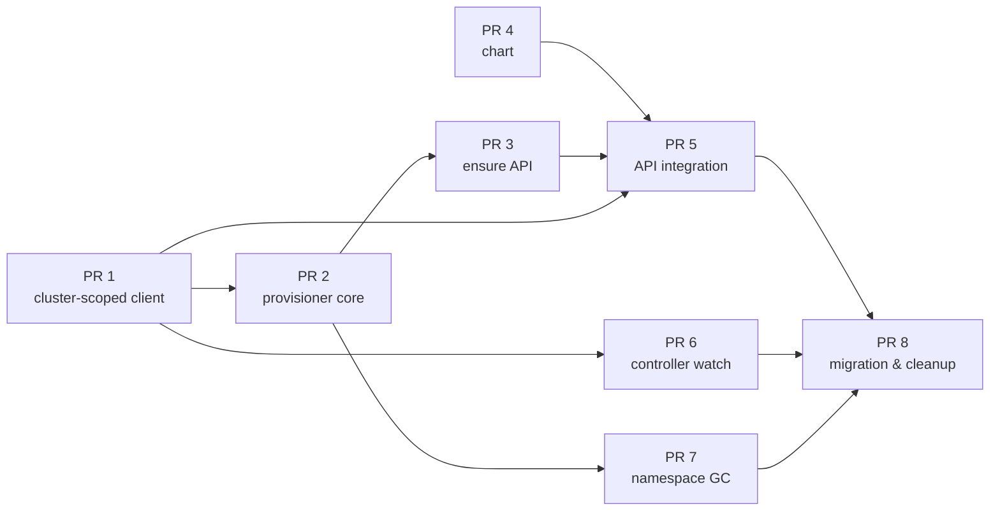

# Namespace-per-Group: Step-by-Step Implementation

The execution companion to [namespace-per-group.md](./namespace-per-group.md).
That document says *what* and *why*; this one says *in which order, in which
PR, touching which files, verified how*. Each PR is small enough to review in
one sitting, lands green on `main`, and changes no behavior until PR 5 flips
resolution behind the flag.

Every PR runs the same local gate before push: `ruff check`, `pytest`
(coverage per `checks.yml`), and - where the chart changed -
`helm template | kubeconform`. These are the fast checks CI runs; nothing
merges red.

## Order & dependencies

PR 4 (chart) has no code dependency and can proceed in parallel from day one.
PR 6 can land any time after PR 1. Everything before PR 8 is inert in
production: the flag is off, the provisioner manages nothing, the legacy
namespace serves as today.

---

## PR 1 - the cluster client goes cluster-scoped

**Goal:** `Cluster` = one region's connection; namespace is per-operation.
Zero behavior change: every caller binds the legacy namespace.

1. `common/cluster/client.py`
   - Remove `self._namespace` (`__init__` keeps `region_config`/`settings`
     for connection, identity, timeouts).
   - Every namespaced method (`apply`, `get`, `list_resources`, `watch`,
     `delete`, `patch`, `pod_log`, the follow entry point) takes an explicit
     `namespace`; `namespace=None` on the read paths means all-namespaces
     (the dynamic client's native behavior).
   - `apply` gains `field_manager: str | None = None` (passed through to
     server-side apply; None keeps today's manager, so API/controller
     writes are untouched).
   - New `Cluster.in_namespace(ns) -> NamespacedCluster`: a thin view
     currying `namespace` over the same method surface, no connection of
     its own. `clusters_for` / `select_local` unchanged - they deal in
     connections.
2. Mechanical caller updates, all binding `settings.workloads_namespace` at
   the boundary where a cluster enters use:
   - `api/services/regions/deployer.py` - `resolve_targets` /
     `local_cluster` return bound views (`Deployer` binds once, from
     settings for now).
   - `api/services/regions/region_apply.py`, `region_read.py`,
     `preflight.py`, `api/services/streams/*` - signatures switch from
     `Cluster` to the view; bodies unchanged.
   - `controller/reconciler.py`, `controller/digest.py` - bind the legacy
     namespace explicitly for now (PR 6 removes this).
3. `common/names.py`: `namespace_for_group(group, prefix="serverless-t-")`
   - prefix + normalized group, **reject > 63 chars as `422`** at the same
   edge the DNS-1123 check runs (per the plan's risk decision); surfaced on
   `/info` `naming`.
4. `common/labels.py`: `LABEL_PROVISIONER_MANAGED`,
   `ANNOTATION_TEMPLATE_HASH`, `ANNOTATION_EMPTY_SINCE`, `ANNOTATION_KEEP`.
5. `common/cluster/kinds.py`: add `NAMESPACE`, `NETWORK_POLICY`,
   `ROLE_BINDING` to `ResourceKind`.
6. `tests/factories.py`: the fake cluster records the namespace per call
   and answers namespaced/all-namespaces lists; existing tests pass with
   the legacy binding.

**Tests:** new `test_names.py` cases (prefix, length rejection, collision
with normalization rules); every existing suite green unmodified in intent.
**Done when:** full pytest green; `git grep "_namespace"` in
`common/cluster/` returns nothing.

## PR 2 - provisioner core (config, templates, reconcile, loop)

**Goal:** the package exists, converges its local cluster from a template
directory, and does nothing in a deployment where no managed namespaces
exist.

1. `provisioner/config.py`: `ProvisionerSettings(CommonSettings)` -
   `resync_seconds`, `error_backoff_seconds` (defaults per
   `ControllerSettings`), `templates_dir`, `namespace_prefix`.
2. `provisioner/templates.py`: read the mounted directory (whole-ConfigMap
   mount), parse manifests, substitute `{{namespace}}`/`{{group}}`, compute
   the set hash (sorted, content-addressed). Mirrors the mounted-file
   pattern of `api/services/builder/runtimes.py`.
3. `provisioner/reconcile.py`:
   - `converge(cluster, group, templates) -> RegionStatus-like result`:
     SSA-apply namespace first then contents (own `field_manager`), prune
     labeled leftovers absent from the set, stamp the hash **last**.
   - `reconcile_local(cluster, templates)`: list managed namespaces
     (label), converge those whose stamp differs from the current hash.
4. `provisioner/main.py`: copy of `controller/main.py`'s shape - signal
   handling, `_MIN_PASS_SECONDS`, raise-backs-off loop - driving
   `reconcile_local`.
5. `Dockerfile.provisioner`: copy of `Dockerfile.controller`
   (`COPY common provisioner`, `python -m provisioner.main`).
6. `pyproject.toml`: `include = ["api*", "common*", "controller*",
   "provisioner*"]`; `checks.yml` builds/scans the new image alongside the
   controller's.

**Tests:** `test_provisioner_reconcile.py` - create-from-nothing, converged
hash is a no-op, hash change re-applies, prune removes a dropped template's
object and only labeled objects, label rename converges via SSA (fake
cluster asserts the applied set), crash between apply and stamp re-converges
next pass.
**Done when:** the image builds; a loop against the fake cluster with zero
managed namespaces makes zero writes.

## PR 3 - the ensure API and the two-region fan-out

**Goal:** `POST /ensure/{group}` converges the group in **both** clusters
and reports per-region results.

1. `provisioner/ensure.py`: `ensure(clusters, group, templates)` - run
   `converge` per region concurrently (thread fan-out shaped like
   `Deployer.fanout`, but small and local to the provisioner), return
   per-region status rows; idempotent by construction.
2. `provisioner/api.py`: minimal FastAPI - `POST /ensure/{group}`
   (validates the group with the shared rules from `common/names`, returns
   per-region results and the hash converged to), `/healthz`, `/readyz`
   (readiness = templates loaded; never touches a cluster, per the API's
   probe rule). Optional shared-token check
   (`SERVERLESS_PROVISIONER_TOKEN`, Vault→ESO), constant-time compare like
   `verify_admin_key`.
3. `provisioner/main.py`: uvicorn on a thread beside the loop.

**Tests:** `test_provisioner_ensure.py` - both regions converged; one
region down → its row fails, the other succeeds, call reports both; group
name validation at the edge.
**Done when:** ensure of a new group creates the namespace + set in both
fake clusters and a second call is a no-op.

## PR 4 - chart (parallel track)

**Goal:** everything the provisioner needs exists at render; nothing changes
for the running system (all new objects inert until the flag).

1. `templates/tenant-templates-configmap.yaml`: the per-namespace set,
   rendered via **existing helpers** - extract the bodies of
   `networkpolicy.yaml` and `ca-bundle.yaml` into named partials in
   `_helpers.tpl`, included from both the legacy render and the template
   set (one source, two targets, drift impossible); labels via
   `serverless-api.namespaceLabels`; per-tenant RoleBinding; kpack build
   SA/SCC RoleBinding + registry-cred `ExternalSecret` entries gated on
   `build.enabled`.
2. `rbac.yaml`: Role → **ClusterRole** (same rules); keep the legacy
   RoleBinding. Add the read-only ClusterRole + ClusterRoleBinding for the
   cert user (KSVC/DomainMapping/Image/Build reads - the preflight,
   listings, and PR 6's watch).
3. `provisioner-rbac.yaml`: the provisioner's ClusterRole (namespaces,
   networkpolicies, rolebindings, configmaps, serviceaccounts,
   externalsecrets, quotas, limitranges; read on KSVCs) bound to its CN.
4. `certificate.yaml`: second `Certificate`, CN
   `serverless-provisioner.clients.{base_domain}`, same ACME issuer.
5. `provisioner.yaml`: Deployment (2 replicas) + Service, modeled on
   `build-controller.yaml`; mounts templates ConfigMap + client cert; a
   NetworkPolicy admitting ingress only from the API pods.
6. `kpack/ca-policy.yaml`: match tenant namespaces **by label selector**,
   keeping the name match for the legacy namespace until PR 8.
7. `values.yaml`: `tenantNamespaces:` block - `enabled: false`,
   `prefix`, `provisioner.*` (image, resources), `gc.enabled: false`,
   `gc.graceSeconds`.
8. `checks.yml`: render the embedded template set (helm template with a
   test values file, extract the ConfigMap data) through kubeconform.

**Done when:** `helm template` output is identical to before with the
default values except the new inert objects; kubeconform passes on both the
chart and the extracted template set.

## PR 5 - API integration behind the flag

**Goal:** with `tenantNamespaces.enabled=true`, workloads deploy into
per-group namespaces; with it false, byte-for-byte today's behavior.

1. `common/config.py` / `api/core/config.py`: the `tenant_namespaces`
   settings block (enabled, prefix, provisioner URL).
2. One resolution point: `resolve_namespace(group, settings)` → group
   namespace when enabled, else `workloads_namespace`. `WorkloadService`
   calls it once per request and binds `cluster.in_namespace(...)` there -
   the *only* line that changes where writes land.
3. Ensure-on-create: an async client (httpx, CA bundle trusted) called from
   `assert_deployable` in `preflight.py` beside the host/name checks;
   failure → the fail-closed `503` posture ("a check could not be run").
   Skipped entirely when the flag is off.
4. Host-uniqueness preflight: the DomainMapping conflict probe lists
   cluster-scoped (`namespace=None`, label-selected) so hosts stay unique
   across all tenant namespaces.
5. Migration fallback read: named GET/DELETE resolve the group namespace
   first and fall back to one label-selected read in the legacy namespace
   on miss; listings merge both. Behind the flag; removed in PR 8.
6. `/info` `naming` publishes the namespace rule from PR 1.

**Tests:** `test_workload_namespaces.py` - resolution on/off; ensure called
in preflight and its `503` on failure; fallback read finds a legacy
workload; host conflict detected across two namespaces; flag-off suite is
the existing `test_workload_service.py` unchanged.
**Done when:** the full existing suite passes with the flag off, and the
new suite passes with it on.

## PR 6 - build controller across namespaces

**Goal:** the digest loop serves Images wherever they live.

1. `controller/reconciler.py`: resync + watch with `namespace=None` and the
   managed-by label selector - one stream, not N.
2. `controller/digest.py`: take the KSVC's namespace from each Image's own
   metadata (co-located by design) when re-applying the digest.
3. `TagGC` needs nothing: it consumes the listing it is handed.

**Tests:** extend `test_kpack_build.py` - Images in two namespaces each
roll their digest onto the right KSVC; legacy-namespace Images still work.
**Done when:** a mixed listing (legacy + tenant namespaces) reconciles both.

## PR 7 - namespace GC

**Goal:** empty tenant namespaces are collected, slowly and loudly.

1. `provisioner/gc.py`: `NamespaceGC`, modeled on `controller/gc.py
   TagGC` - own daemon thread, deadline set at sweep start, loud
   off-reasons, one failure never ends the sweep. Per managed namespace in
   the **local** cluster: KSVCs present → clear `empty-since`; absent →
   stamp it if missing; `now - empty_since > gc_grace_seconds` and no
   `keep` annotation and `gc.enabled` → delete (cascades the contents).
2. Wire into the provisioner loop via the same `maybe_sweep` hook shape the
   reconciler gives `TagGC`.

**Tests:** `test_provisioner_gc.py` - grace period honored across sweeps,
`keep` respected, a workload appearing clears the stamp, disabled-is-loud,
never touches an unlabeled namespace, subset-regions case (empty here,
populated in the peer → collected here only).
**Done when:** GC deletes exactly the fixture it should and logs the
verdict line per sweep.

## PR 8 - migration, then cleanup

**Migration is operations, not code** - the machinery shipped in PRs 1-7.
Runbook, per environment:

1. Enable `tenantNamespaces.enabled` (GC still off). Verify: a canary
   create lands in `serverless-t-{group}` in both regions, Ready, host
   serving; legacy workloads read/serve untouched via fallback.
2. Per group, per workload: re-apply into the group namespace (idempotent
   SSA; hostname unchanged, so the DomainMapping cutover is atomic),
   verify Ready in both regions, delete from the legacy namespace.
   Functions rebuild in place (each region builds what it runs; the git
   Secret re-applies beside the new KSVC). Order: containers first
   (no build), then functions.
3. Legacy namespace empty in both clusters → enable `gc.enabled`.
4. Cleanup PR: remove the fallback read path, the legacy namespace's
   NetworkPolicy/CA/RoleBinding renders and the Kyverno name-match, flip
   the flag's default, fold both proposal docs into
   ARCHITECTURE.md/DEPLOYING.md (per docs/README.md, the code is now the
   source of truth).

**Done when:** the legacy namespace is gone from both clusters and from the
chart, and ARCHITECTURE.md: Design Decisions reads "namespace-per-group".
