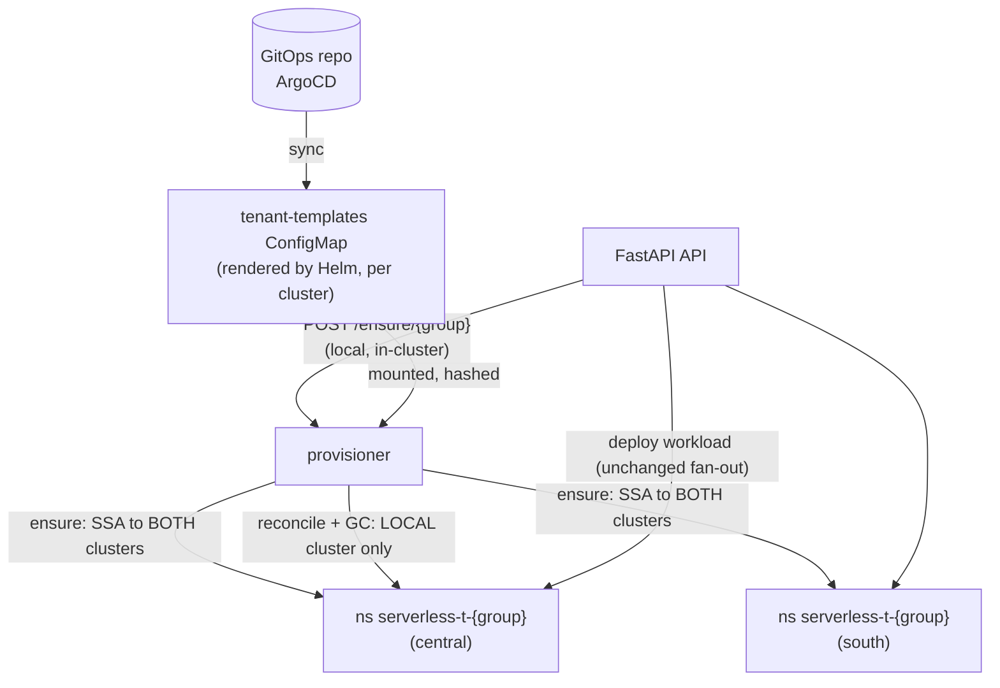

# Namespace-per-Group: Design & Implementation Plan

Move tenancy from the shared `serverless-workloads` namespace to one namespace
per SSO group, provisioned and reconciled by a new internal **provisioner**
service. This is the "Stronger isolation" item from ARCHITECTURE.md: Open
Questions / Future Work, worked out against the code as it stands today.

The guiding constraint throughout: **reuse what exists**. Every new piece below
is named next to the existing code it is built from, and the phases are ordered
so each lands green on its own. The PR-by-PR execution breakdown - files,
tests, and acceptance per step - is in
[namespace-per-group-steps.md](./namespace-per-group-steps.md).

## Contents

- [Decisions (proposed)](#decisions-proposed)
- [What stays exactly as it is](#what-stays-exactly-as-it-is)
- [Architecture](#architecture)
- [Implementation Phases](#implementation-phases)
- [Reuse Map](#reuse-map)
- [Cutover (no migration - pre-GA)](#cutover-no-migration---pre-ga)
- [Rollout & Switches](#rollout--switches)
- [Testing](#testing)
- [Risks & Open Items](#risks--open-items)

## Decisions (proposed)

| Topic | Decision | Why |
|-------|----------|-----|
| Granularity | **One namespace per group** (`serverless-t-{group}`), never per workload | The group is already the unit of ownership everywhere: the `{group}` path segment, the ownership labels, `normalize_group`. Per-group is what makes future per-tenant `ResourceQuota` expressible. |
| Builds | **Co-located with the workload, in the group namespace** | ownerReferences cannot cross namespaces (DEPLOYING.md: Chart Topology). Co-location keeps the KSVC-owns-everything cascade, so apply, rollback, and delete are unchanged. A central build namespace would force explicit cross-namespace cleanup plus an orphan-Image sweep - an orphaned kpack Image *rebuilds a deleted function forever*, so that sweep would be correctness-critical. Build quota fairness is handled inside the namespace (see Phase 5). |
| New component | **`provisioner/` package in this monorepo**, own Deployment + image, internal-only (Service, no Route) | Same shape as the build controller. A separate deployment (not a library in the API) exists for exactly one reason: **privilege separation** - creating/deleting Namespaces and RoleBindings is cluster-scoped power the internet-facing API must not hold. |
| Provisioner identity | **Its own cert-manager `Certificate`**, CN `serverless-provisioner.clients.{base_domain}` | Reusing the API's cert would make the privilege separation fiction. Same CA trust means the one identity is valid in both clusters, like the API's. |
| Template delivery | **Helm renders a `tenant-templates` ConfigMap of final YAML** (placeholders: `{{namespace}}`, `{{group}}` only); the provisioner applies it per namespace | Helm cannot render per-group resources (the group set is runtime data from SSO). Baking templates into the image couples policy tweaks to releases. The operator workflow stays *edit values → merge → Argo sync*, unchanged. |
| Convergence | **Level-triggered reconcile is the mechanism; the API's ensure call is a kick** | A `helm upgrade` must reach *existing* namespaces, not only new groups. The template-set hash stamped on each namespace is what triggers re-apply. |
| Multi-region | **Ensure fans out to both regions; reconcile and GC are local-only** | Ensure must complete in both clusters before a deploy fans out (same partial-failure semantics as deploys). Reconcile/GC stay local so the two sites never fight during Argo sync skew - each converges its own cluster to its own Git-derived ConfigMap. Same split as the API (fan-out writes) and the build controller (local loops). |
| Namespace GC | **Periodic sweep with an empty-since grace period**, per cluster, modeled on `TagGC` - not a watch | Immediacy is an anti-feature for namespace deletion. With a grace period a watch buys nothing. Per-cluster is *required*: `"regions": ["central"]` makes cluster-local emptiness legitimate, and idempotent ensure-on-create re-provisions the swept side. |
| Object naming | **The object name becomes plain `{name}`** - the namespace scopes it, as Kubernetes intends; the platform's primary key becomes **(namespace, name)**. The group stays in exactly three places: the **default hostname** `{name}-{group}.{routeDomain}` (DNS is global; and a two-level host would escape the single-label wildcard cert), the **registry repository paths** (already group-parameterized: `image_repository(group, name)`), and the **ownership labels** (defense-in-depth, unchanged). The kpack Image stays the object name verbatim, so the Image-name-fits-a-label-value rule binds plain `{name}` with more headroom. | The suffix existed to disambiguate the shared namespace; that job is gone. The combined ≤ 63 pair rule *moves* rather than disappears: from `validate_object_name` to the default-host check, where a custom `hostname` is an escape hatch instead of the create being impossible. Pre-GA there is nothing deployed to rename. |
| Prune semantics | The provisioner deletes objects carrying its managed-by label that are absent from the current template set | This is the one Argo behavior (prune) being reimplemented; label-scoped keeps it safe. |

## What stays exactly as it is

Stating the non-changes first, because they are the point of the design:

- **`region_apply.apply_to_region`** - ordering, ownerReference stamping,
  create-rollback, old-host retirement. Untouched; only the namespace it
  writes into varies.
- **The KSVC-owns-everything delete.** One delete call, Kubernetes cascades.
  `delete_build_objects` stays the vestigial sweep it is documented as.
- **Server-side apply everywhere** (`Cluster.apply`, `force_conflicts=True`).
  The provisioner uses the same call; SSA field ownership is what makes label
  add/change/*remove* on tenant namespaces converge with no diff logic (a
  merge-patch cannot remove a key it doesn't know existed).
- **Auth, group normalization, the default-host
  convention, DomainMapping/Route flow, ESO/Vault categories, the async
  202+poll model, partial-failure semantics.** All unchanged.
- **The operator's day-2 workflow**: one values edit, one Argo sync. The new
  hop behind it (ConfigMap → provisioner reconcile) is observable, not manual.

## Architecture

Per tenant namespace, the template set stamps out what the chart creates once
for `serverless-workloads` today: the `inject-trusted-cabundle` ConfigMap
(`ca-bundle.yaml`), the default-deny + allow-* NetworkPolicies
(`networkpolicy.yaml`), a RoleBinding for the API's cert user (the Role
becomes a chart-shipped ClusterRole), and - once builds follow - the kpack
build prerequisites (SCC RoleBinding, registry-cred ExternalSecret). Each
namespace carries `serverless.platform/managed-by: serverless-provisioner`
and a `serverless.platform/template-hash` annotation; hash mismatch is what
triggers re-apply, and the stamp is the *last* write so a crashed converge
redoes itself.

The Kyverno CA-injection ClusterPolicy switches from matching the workloads
namespace **by name** to matching **by namespace label** - one policy covers
every tenant namespace, no per-namespace copies.

## Implementation Phases

Each phase is independently shippable and lands behind the
inert until Phase 3 switches resolution, so `main` stays releasable. There
is deliberately **no runtime flag and no dual mode**: pre-GA, git is the
rollback lever, and a hard cutover buys a permanently single code path
(see Cutover below).

### Phase 0 - groundwork in `common/` (no behavior change)

1. **`common/cluster/client.py`**: `Cluster` becomes what its name says -
   a connection to one region (endpoint, mTLS identity, timeouts) with **no
   baked-in namespace**. Namespaced operations take a required `namespace`;
   `namespace=None` on `list_resources`/`watch`/`get` means *all
   namespaces* (needed by the host preflight, admin listings, and the build
   controller's Image watch). A deliberate choice over an optional-with-
   default parameter: in the end-state there is no single workloads
   namespace, so a default is a silent-wrong-namespace footgun during
   migration - the value deciding where a write lands is always explicit,
   for the same reason the auth library refuses a default issuer.
   Ergonomics come back through a tiny bound view, `cluster.in_namespace
   (ns)`: same method surface, namespace curried, no connection of its own
   (one `ApiClient`/pool per region as today). `WorkloadService` resolves
   `group → namespace` once per request and hands the view down, so
   `region_apply`/`region_read`/streams keep their signatures and cannot
   mix namespaces mid-operation. In this phase every caller still binds
   `settings.workloads_namespace` - behavior identical, signatures final;
   Phase 3 only changes *which* namespace gets bound. `apply` also gains a
   `field_manager=` parameter so the provisioner writes under its own SSA
   manager.
2. **`common/names.py`**: `namespace_for_group(group)` - prefix
   `serverless-t-` + normalized group; explicit length rule (prefix + group
   ≤ 63 or reject at the same edge `normalize_group` errors surface today),
   published on `/info` `naming` like the `{name}-{group}` rule.
3. **`common/labels.py`**: `LABEL_PROVISIONER_MANAGED`,
   `ANNOTATION_TEMPLATE_HASH`, `ANNOTATION_EMPTY_SINCE`, `ANNOTATION_KEEP`.
4. **`common/cluster/kinds.py`**: add `NAMESPACE`, `NETWORK_POLICY`,
   `ROLE_BINDING` (and later `RESOURCE_QUOTA`, `LIMIT_RANGE`) to
   `ResourceKind`.

### Phase 1 - the `provisioner/` package

Mirrors `controller/` file-for-file where a counterpart exists:

| File | Built from |
|------|-----------|
| `provisioner/main.py` | `controller/main.py` - same signal handling, same `_MIN_PASS_SECONDS` pacing, same raise-backs-off loop; plus a uvicorn thread for the internal API. |
| `provisioner/config.py` | `ProvisionerSettings(CommonSettings)` like `ControllerSettings` - inherits regions, CA bundle, cert dir, timeouts. Adds `resync_seconds`, `gc_interval_seconds`, `gc_grace_seconds`, `templates_dir`. |
| `provisioner/templates.py` | New, small: read the mounted ConfigMap directory (whole-ConfigMap mount, **never `subPath`** - subPath mounts don't refresh), substitute the two placeholders, compute the set hash. Same mounted-file pattern as `api/services/builder/runtimes.py`. |
| `provisioner/reconcile.py` | The local-cluster converge: list managed namespaces, compare hash, SSA-apply the set (namespace first, then contents), prune labeled leftovers, stamp. Idempotency and force-conflicts come from `Cluster.apply`. |
| `provisioner/ensure.py` | The fan-out half: converge one group in **both** regions concurrently, per-region results. Reuses `common.cluster.Cluster` selection and the thread fan-out shape of `api/services/regions/deployer.py`. |
| `provisioner/gc.py` | `NamespaceGC`, modeled line-for-line on `controller/gc.py TagGC`: own daemon thread, deadline set at sweep *start*, loud logging of why GC is off, one failure never ends the sweep. Logic: no KSVCs in the namespace (label-listed) → stamp `empty-since` if absent → delete only when `now - empty_since > gc_grace_seconds`, the managed-by label is present, no `keep` annotation, and the chart-level enable switch is on. |
| `provisioner/api.py` | Minimal FastAPI app: `POST /ensure/{group}` (ensure + converge to current hash, per-region results), `/healthz`, `/readyz`. Reuses `cloudlet_apis.logging`; no SSO - it is internal-only, network-policy-scoped to the API namespace, plus an optional shared token from Vault→ESO. |
| `Dockerfile.provisioner` | Copy of `Dockerfile.controller` (`COPY common provisioner`, `python -m provisioner.main`). |
| `pyproject.toml` | `include = ["api*", "common*", "controller*", "provisioner*"]`. |

### Phase 2 - chart changes

1. **`templates/tenant-templates-configmap.yaml`** (new): the per-namespace
   resource set, rendered with the **existing helpers** - the label block via
   `serverless-api.namespaceLabels`, the NetworkPolicies by moving the bodies
   of `networkpolicy.yaml` into a shared partial included from both the
   legacy path and the template set, the CA ConfigMap from `ca-bundle.yaml`'s
   body. One source for each, two render targets during the transition.
2. **RBAC split**: `rbac.yaml`'s Role becomes a **ClusterRole** (same rules);
   the chart keeps a RoleBinding in the legacy namespace; the template set
   carries the per-tenant RoleBinding. **Writes stay namespace-bound** - a
   cluster-scoped client does not mean cluster-scoped write RBAC. What does
   go cluster-wide is a small **read-only ClusterRole + ClusterRoleBinding**
   for the cert user: KSVCs/DomainMappings (host preflight, admin listings)
   and kpack Images/Builds (the controller's all-namespaces watch). The
   provisioner gets its own ClusterRole (namespaces, networkpolicies,
   rolebindings, configmaps, quotas, limitranges, + read on KSVCs for GC)
   bound to its cert CN.
3. **`certificate.yaml`**: second `Certificate` for the provisioner CN,
   same ACME issuer.
4. **`provisioner.yaml`** (new Deployment + Service): modeled on
   `build-controller.yaml`; mounts the templates ConfigMap and the client
   cert; no Route.
5. **`kpack/ca-policy.yaml`**: match on the tenant namespace *label
   selector* instead of the namespace name (keep the name match too while
   the legacy namespace lives).
6. **CI**: extend the existing helm/kubeconform job to also render the
   embedded template set and validate it - a malformed NetworkPolicy fails
   CI, not the first tenant onboarding.

### Phase 3 - API integration

1. **`api/core/config.py` / `common/config.py`**: `tenant_namespaces`
   settings block - `provisioner_url`, prefix (no enable flag - see
   Cutover).
2. **Namespace resolution in one place**: the workload service resolves
   `group → namespace` once per request (via `common.names
   .namespace_for_group`) and
   threads it through `ApplyRequest` → deployer → `region_apply` →
   `Cluster` calls. The Phase 0 parameter is what makes this mechanical.
3. **Ensure-on-create**: in the synchronous pre-flight (beside the existing
   host/name checks in `preflight.py`), call the local provisioner's
   `/ensure/{group}`. "Ensured" means *exists and converged to the current
   hash*, so a workload never deploys into a namespace carrying last
   release's policies. Idempotent; a per-region ensure failure reports in
   the same per-region shape deploys already use.
4. **Host-uniqueness preflight**: the DomainMapping conflict check becomes a
   cluster-scoped, label-selected list (needs the ClusterRole read from
   Phase 2), because hosts must stay unique across *all* tenant namespaces.
5. **Reads/streams**: list, get, stats, pods, and logs resolve the same
   group namespace; `ownership.py` rules unchanged (labels still checked -
   defense in depth, and admin listings still label-select).
6. Builds need **no API change**: the kpack Image, build SA, and git Secret
   are applied beside the KSVC and follow its namespace automatically; the
   per-namespace build prerequisites come from the template set.
7. **Build controller**: the resync/watch in `controller/reconciler.py`
   becomes one all-namespaces, label-selected stream (`namespace=None` -
   one watch, not N per-tenant watches), and `controller/digest.py` takes
   the target namespace from each Image's own metadata when re-applying
   the KSVC - Image and KSVC are co-located, so it is right there. `TagGC`
   is unaffected (it reads the listing it is handed).

### Phase 4 - GC live

Wire `NamespaceGC` into the provisioner loop (it ships in Phase 1 but stays
off), gated on a chart switch following the `registry.deleteOnFunctionDelete`
precedent for "may the platform delete things". Namespace deletion cascades
everything inside; the existing registry-side cleanup (function delete +
`TagGC`) is already reconciled and needs nothing new.

### Phase 5 - quota readiness (deferred, but shaped now)

The template set is the delivery vehicle for the Future-Work quota item, so
reserve its shape: a `serverless-build` PriorityClass (chart-shipped,
cluster-scoped; injected into build pods by a second mutate rule in the
existing Kyverno policy if the kpack version cannot set it), **two**
`ResourceQuota`s per namespace split by `scopeSelector` on PriorityClass -
so builds can never eat workload scale-up headroom or vice versa - and a
`LimitRange` defaulting build-pod requests. One hard rule learned from the
t-shirt sizing: quota `requests.cpu`/`requests.memory`/`limits.memory`,
**never `limits.cpu`** - workloads deliberately carry no CPU limit and would
be rejected at admission.

## Reuse Map

| New thing | Reused from | What is actually new |
|-----------|-------------|----------------------|
| Provisioner loop | `controller/main.py` loop, pacing, signals | ~nothing |
| Provisioner settings | `CommonSettings` (regions, certs, CA, timeouts) | 5 fields |
| Cluster writes | `common.cluster.Cluster` (SSA, force-conflicts, timeouts, mTLS) | cluster-scoped refactor + `in_namespace` view, `field_manager=` |
| Region fan-out (ensure) | deployer fan-out shape + per-region status model | thin wrapper |
| Namespace GC | `TagGC` structure and philosophy | the emptiness + grace rule |
| Template loading | runtimes-ConfigMap mounted-file pattern | placeholder substitution + hash |
| Per-namespace resources | existing chart templates (`networkpolicy.yaml`, `ca-bundle.yaml`, `namespaceLabels` helper, kpack partials) | re-parented into the template set |
| Internal API | FastAPI + `cloudlet_apis.logging` | 3 routes |
| Naming/labels | `normalize_group`, `common.names`, `common.labels` | one function, four constants |
| CI | checks.yml helm/kubeconform job | render-the-template-set step |

## Cutover (no migration - pre-GA)

There are no customers yet, so there is nothing to migrate: **namespace-per-
group becomes the only mode** the moment the API integration lands, and no
dual-mode code ships at all - no master flag, no fallback read path, no
per-workload move. The cost of a hard cutover is one wipe of test data; the
saving is a permanently single code path and test matrix. Rollback pre-GA
is git: redeploy the previous chart version.

1. Land the client refactor, provisioner, and chart first (the system keeps
   using the legacy namespace until the API integration lands, so the
   legacy renders stay in the chart for that window).
2. The API integration PR switches resolution outright. Deploy order per
   environment: delete the old workloads (`kubectl delete ns
   serverless-workloads` after sync, or just delete the workloads), sync
   the chart, redeploy test workloads - they land in `serverless-t-{group}`.
3. The cleanup PR drops the legacy namespace renders, the Kyverno
   name-match, and the `workloads_namespace` setting, and folds these
   proposal documents into ARCHITECTURE.md/DEPLOYING.md.

## Rollout & Switches

- No `tenantNamespaces.enabled` master flag - dual-mode existed only to
  protect live customers through a gradual migration, and there are none.
- `tenantNamespaces.gc.enabled` + `gc.graceSeconds` - the one switch kept:
  "may the platform delete things" is operational policy (the
  `registry.deleteOnFunctionDelete` precedent), not migration scaffolding.
  Off by default until the cutover settles.
- Observability from day one: the template hash + applied-at stamped on each
  namespace (`kubectl get ns -L` answers "has the new policy reached every
  tenant"), a per-converge log line in the `TagGC` style, and
  count-of-unconverged-namespaces as the provisioner's readiness signal -
  this replaces the per-resource drift view Argo gives the shared namespace
  today.

## Testing

The fake-cluster factories in `tests/` already simulate applies with
server-assigned UIDs (`tests/factories.py`); extend them with namespace
awareness once (Phase 0) and every existing test keeps passing with the
default namespace. New suites: `test_provisioner_reconcile.py` (hash
convergence, prune, SSA label removal on rename, crash-mid-converge
re-stamp), `test_provisioner_gc.py` (grace period, keep annotation, subset-
regions emptiness, disabled-is-loud - mirroring `test_kpack_build.py`'s GC
tests), `test_workload_namespaces.py` (resolution, ensure-in-preflight,
cluster-scoped host preflight).

## Risks & Open Items

| Item | Notes |
|------|-------|
| Argo sync skew between sites | Ensure writes the peer cluster with the local hash; the peer's local reconciler re-converges when its ConfigMap lands. Transient and self-healing - document it so it is not debugged as a bug. |
| Namespace-name length | `serverless-t-` + 63-char group can exceed 63. Decide reject-at-422 (recommended - consistent with the DNS-1123 stance) vs truncate+hash before Phase 0. |
| Group named like a system namespace | The prefix removes the collision class; keep a small denylist anyway. |
| Provisioner down | Every create's pre-flight fails closed with a clear, retryable error (the `503` posture the API already takes when a check cannot be *run*). Deliberately no caching or degraded mode in the API - ensure always round-trips; availability comes from running the provisioner as two replicas behind a Service, the same posture as the API itself. |
| Knative `ClusterDomainClaim` | With `autocreate-cluster-domain-claims` the operator enforces cross-namespace host uniqueness anyway; the preflight remains for the clean 409. Verify the operator setting during Phase 3. |
| kpack `priorityClassName` support | Determines whether Phase 5 needs the Kyverno mutate rule. Check the mirrored kpack version when quota work starts. |
